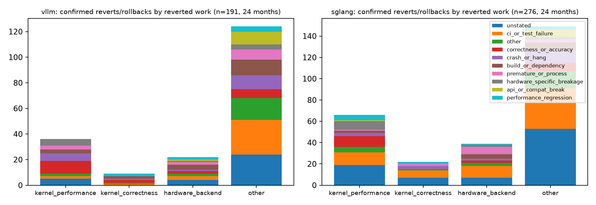
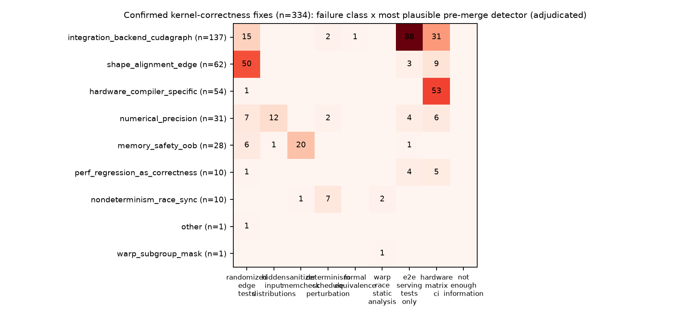

# How optimized kernels fail in vLLM and SGLang

**Deep follow-up, WP-B. Cutoff 2026-09-28; window 2024-09-29 → 2026-09-28 (24 months).** All counts are generated from `data/confirmed-reverts.csv`, `data/kernel-correctness-cases.csv` and the summaries `data/b1-revert-summary.csv`, `data/b2-failure-summary.csv`. Coding was done by LLM subagents with a written codebook, an independent second pass and adjudication; agreement is model–model consistency, not human inter-rater reliability. See [`METHODS.md`](METHODS.md).

## Executive summary

1. **Reverts are a complete census.** Of 516<!-- claim:data/b1-revert-summary.csv::repo=both&measure=candidates&category=all::n::int --> first-parent commits with revert/rollback language, 467<!-- claim:data/b1-revert-summary.csv::repo=both&measure=confirmed_reverts_or_rollbacks&category=all::n::int --> were confirmed reverts, partial reverts or explicit rollbacks (191<!-- claim:data/b1-revert-summary.csv::repo=vllm&measure=confirmed_reverts_or_rollbacks&category=all::n::int --> vLLM, 276<!-- claim:data/b1-revert-summary.csv::repo=sglang&measure=confirmed_reverts_or_rollbacks&category=all::n::int --> SGLang).
2. **Performance work is reverted about twice as often.** Among merged PRs created in the 12-month window, 1.8<!-- claim:data/a2-revert-rates.csv::repo=vllm&group=performance::revert_rate::pct1 -->% of vLLM performance PRs were later reverted versus 0.9<!-- claim:data/a2-revert-rates.csv::repo=vllm&group=non_performance::revert_rate::pct1 -->% of other PRs; SGLang: 2.4<!-- claim:data/a2-revert-rates.csv::repo=sglang&group=performance::revert_rate::pct1 -->% versus 1.1<!-- claim:data/a2-revert-rates.csv::repo=sglang&group=non_performance::revert_rate::pct1 -->% (Wilson intervals in `data/a2-revert-rates.csv`).
3. **Kernel-correctness fixes are common.** 334<!-- claim:data/b2-failure-summary.csv::repo=both&measure=confirmed_rate_in_sample&category=confirmed::n::int --> of 440<!-- claim:data/b2-failure-summary.csv::repo=both&measure=screened&category=all::n::int --> randomly sampled kernel-path fix commits were confirmed kernel-correctness fixes (75.9<!-- claim:data/b2-failure-summary.csv::repo=both&measure=confirmed_rate_in_sample&category=confirmed::share::pct1 -->%), implying about 1,787<!-- claim:data/b2-failure-summary.csv::repo=both&measure=estimated_confirmed_in_frame&category=confirmed::n::int --> such fixes among the 2,354<!-- claim:data/b2-failure-summary.csv::repo=both&measure=screened&category=all::denominator::int -->-commit frame in 24 months.
4. **Most escaped bugs are integration or portability failures, not arithmetic.** Integration/backend-selection/CUDA-graph failures are 41.0<!-- claim:data/b2-failure-summary.csv::repo=both&measure=failure_class&category=integration_backend_cudagraph::share::pct1 -->% of confirmed cases, hardware/compiler-specific 16.2<!-- claim:data/b2-failure-summary.csv::repo=both&measure=failure_class&category=hardware_compiler_specific::share::pct1 -->%, shape/alignment edge cases 18.6<!-- claim:data/b2-failure-summary.csv::repo=both&measure=failure_class&category=shape_alignment_edge::share::pct1 -->%, numerical precision 9.3<!-- claim:data/b2-failure-summary.csv::repo=both&measure=failure_class&category=numerical_precision::share::pct1 -->%, and races/synchronization only 3.0<!-- claim:data/b2-failure-summary.csv::repo=both&measure=failure_class&category=nondeterminism_race_sync::share::pct1 -->%; 55.1<!-- claim:data/b2-failure-summary.csv::repo=both&measure=hardware_specific&category=yes::share::pct1 -->% were hardware-specific.
5. **The most plausible missing check is usually system-level.** The adjudicated most-plausible pre-merge detector was hardware-matrix CI for 31.1<!-- claim:data/b2-failure-summary.csv::repo=both&measure=counterfactual_primary&category=hardware_matrix_ci::share::pct1 -->%, end-to-end serving tests for 29.9<!-- claim:data/b2-failure-summary.csv::repo=both&measure=counterfactual_primary&category=e2e_serving_tests_only::share::pct1 -->% and randomized/edge-case unit tests for 24.2<!-- claim:data/b2-failure-summary.csv::repo=both&measure=counterfactual_primary&category=randomized_edge_tests::share::pct1 -->%; determinism/schedule perturbation (3.3<!-- claim:data/b2-failure-summary.csv::repo=both&measure=counterfactual_primary&category=determinism_schedule_perturbation::share::pct1 -->%), static warp-race analysis (0.9<!-- claim:data/b2-failure-summary.csv::repo=both&measure=counterfactual_primary&category=warp_race_static_analysis::share::pct1 -->%) and formal equivalence (0.3<!-- claim:data/b2-failure-summary.csv::repo=both&measure=counterfactual_primary&category=formal_equivalence::share::pct1 -->%) were rarely the best fit. This is a counterfactual judgement (κ = 0.76<!-- claim:data/failure-coding-agreement.csv::field=counterfactual_primary::cohen_kappa::dec2 --> between independent passes).

## B1 — 24-month revert census

Every candidate was adjudicated in context (commit body, revert-PR body and discussion, and up to four resolved target PRs). The census is complete for first-parent history; reverts performed inside unmerged branches or force-pushes are invisible.

| Reverted work | n | share of confirmed reverts | 95% bootstrap CI |
|---|---:|---:|---|
| other | 273<!-- claim:data/b1-revert-summary.csv::repo=both&measure=reverted_class&category=other::n::int --> | 58.5<!-- claim:data/b1-revert-summary.csv::repo=both&measure=reverted_class&category=other::share::pct1 -->% | [54.2–63.0%] |
| kernel_performance | 102<!-- claim:data/b1-revert-summary.csv::repo=both&measure=reverted_class&category=kernel_performance::n::int --> | 21.8<!-- claim:data/b1-revert-summary.csv::repo=both&measure=reverted_class&category=kernel_performance::share::pct1 -->% | [18.2–25.7%] |
| hardware_backend | 61<!-- claim:data/b1-revert-summary.csv::repo=both&measure=reverted_class&category=hardware_backend::n::int --> | 13.1<!-- claim:data/b1-revert-summary.csv::repo=both&measure=reverted_class&category=hardware_backend::share::pct1 -->% | [10.1–16.1%] |
| kernel_correctness | 31<!-- claim:data/b1-revert-summary.csv::repo=both&measure=reverted_class&category=kernel_correctness::n::int --> | 6.6<!-- claim:data/b1-revert-summary.csv::repo=both&measure=reverted_class&category=kernel_correctness::share::pct1 -->% | [4.3–9.0%] |

| Stated revert reason (all confirmed) | n | share |
|---|---:|---:|
| unstated | 119<!-- claim:data/b1-revert-summary.csv::repo=both&measure=revert_reason&category=unstated::n::int --> | 25.5<!-- claim:data/b1-revert-summary.csv::repo=both&measure=revert_reason&category=unstated::share::pct1 -->% |
| ci_or_test_failure | 101<!-- claim:data/b1-revert-summary.csv::repo=both&measure=revert_reason&category=ci_or_test_failure::n::int --> | 21.6<!-- claim:data/b1-revert-summary.csv::repo=both&measure=revert_reason&category=ci_or_test_failure::share::pct1 -->% |
| other | 47<!-- claim:data/b1-revert-summary.csv::repo=both&measure=revert_reason&category=other::n::int --> | 10.1<!-- claim:data/b1-revert-summary.csv::repo=both&measure=revert_reason&category=other::share::pct1 -->% |
| correctness_or_accuracy | 41<!-- claim:data/b1-revert-summary.csv::repo=both&measure=revert_reason&category=correctness_or_accuracy::n::int --> | 8.8<!-- claim:data/b1-revert-summary.csv::repo=both&measure=revert_reason&category=correctness_or_accuracy::share::pct1 -->% |
| crash_or_hang | 38<!-- claim:data/b1-revert-summary.csv::repo=both&measure=revert_reason&category=crash_or_hang::n::int --> | 8.1<!-- claim:data/b1-revert-summary.csv::repo=both&measure=revert_reason&category=crash_or_hang::share::pct1 -->% |
| build_or_dependency | 35<!-- claim:data/b1-revert-summary.csv::repo=both&measure=revert_reason&category=build_or_dependency::n::int --> | 7.5<!-- claim:data/b1-revert-summary.csv::repo=both&measure=revert_reason&category=build_or_dependency::share::pct1 -->% |
| premature_or_process | 26<!-- claim:data/b1-revert-summary.csv::repo=both&measure=revert_reason&category=premature_or_process::n::int --> | 5.6<!-- claim:data/b1-revert-summary.csv::repo=both&measure=revert_reason&category=premature_or_process::share::pct1 -->% |
| hardware_specific_breakage | 22<!-- claim:data/b1-revert-summary.csv::repo=both&measure=revert_reason&category=hardware_specific_breakage::n::int --> | 4.7<!-- claim:data/b1-revert-summary.csv::repo=both&measure=revert_reason&category=hardware_specific_breakage::share::pct1 -->% |
| api_or_compat_break | 19<!-- claim:data/b1-revert-summary.csv::repo=both&measure=revert_reason&category=api_or_compat_break::n::int --> | 4.1<!-- claim:data/b1-revert-summary.csv::repo=both&measure=revert_reason&category=api_or_compat_break::share::pct1 -->% |
| performance_regression | 19<!-- claim:data/b1-revert-summary.csv::repo=both&measure=revert_reason&category=performance_regression::n::int --> | 4.1<!-- claim:data/b1-revert-summary.csv::repo=both&measure=revert_reason&category=performance_regression::share::pct1 -->% |

For the 102<!-- claim:data/b1-revert-summary.csv::repo=both&measure=reverted_class&category=kernel_performance::n::int --> reverts of kernel/performance work, the stated reasons were: unstated 24<!-- claim:data/b1-revert-summary.csv::repo=both&measure=kernel_performance_revert_reason&category=unstated::n::int -->; correctness_or_accuracy 20<!-- claim:data/b1-revert-summary.csv::repo=both&measure=kernel_performance_revert_reason&category=correctness_or_accuracy::n::int -->; ci_or_test_failure 14<!-- claim:data/b1-revert-summary.csv::repo=both&measure=kernel_performance_revert_reason&category=ci_or_test_failure::n::int -->; hardware_specific_breakage 13<!-- claim:data/b1-revert-summary.csv::repo=both&measure=kernel_performance_revert_reason&category=hardware_specific_breakage::n::int -->; crash_or_hang 9<!-- claim:data/b1-revert-summary.csv::repo=both&measure=kernel_performance_revert_reason&category=crash_or_hang::n::int -->; other 7<!-- claim:data/b1-revert-summary.csv::repo=both&measure=kernel_performance_revert_reason&category=other::n::int -->; performance_regression 5<!-- claim:data/b1-revert-summary.csv::repo=both&measure=kernel_performance_revert_reason&category=performance_regression::n::int -->; build_or_dependency 5<!-- claim:data/b1-revert-summary.csv::repo=both&measure=kernel_performance_revert_reason&category=build_or_dependency::n::int -->; premature_or_process 4<!-- claim:data/b1-revert-summary.csv::repo=both&measure=kernel_performance_revert_reason&category=premature_or_process::n::int -->; api_or_compat_break 1<!-- claim:data/b1-revert-summary.csv::repo=both&measure=kernel_performance_revert_reason&category=api_or_compat_break::n::int -->.
Median time from the reverted change's merge to the revert was 0.7<!-- claim:data/b1-revert-summary.csv::repo=both&measure=median_days_to_revert&category=all::share::dec1 --> days overall and 0.9<!-- claim:data/b1-revert-summary.csv::repo=both&measure=median_days_to_revert&category=kernel_performance::share::dec1 --> days for kernel/performance work — most reverts are fast rollbacks after CI or user breakage, not slow retirements.

*Observation:* confirmed reverts/rollbacks per repository by reverted work class, stacked by stated reason. *Interpretation:* "unstated" and CI failures dominate; public revert text often omits the user-visible symptom.

## B2 — confirmed kernel-correctness corpus

Frame: all 2,354<!-- claim:data/b2-failure-summary.csv::repo=both&measure=screened&category=all::denominator::int --> first-parent commits (24 months) that touch production kernel paths and use fix/failure language. A seeded random 440<!-- claim:data/b2-failure-summary.csv::repo=both&measure=screened&category=all::n::int --> (220 per repository) were screened in context; 334<!-- claim:data/b2-failure-summary.csv::repo=both&measure=confirmed_rate_in_sample&category=confirmed::n::int --> were confirmed (173<!-- claim:data/b2-failure-summary.csv::repo=vllm&measure=confirmed_rate_in_sample&category=confirmed::n::int --> vLLM, 161<!-- claim:data/b2-failure-summary.csv::repo=sglang&measure=confirmed_rate_in_sample&category=confirmed::n::int --> SGLang). Confirmation requires a fixing PR/commit that establishes the incorrect behaviour.

| Failure class (primary) | n | share | 95% CI |
|---|---:|---:|---|
| integration_backend_cudagraph | 137<!-- claim:data/b2-failure-summary.csv::repo=both&measure=failure_class&category=integration_backend_cudagraph::n::int --> | 41.0<!-- claim:data/b2-failure-summary.csv::repo=both&measure=failure_class&category=integration_backend_cudagraph::share::pct1 -->% | [35.6–46.4%] |
| shape_alignment_edge | 62<!-- claim:data/b2-failure-summary.csv::repo=both&measure=failure_class&category=shape_alignment_edge::n::int --> | 18.6<!-- claim:data/b2-failure-summary.csv::repo=both&measure=failure_class&category=shape_alignment_edge::share::pct1 -->% | [14.4–22.8%] |
| hardware_compiler_specific | 54<!-- claim:data/b2-failure-summary.csv::repo=both&measure=failure_class&category=hardware_compiler_specific::n::int --> | 16.2<!-- claim:data/b2-failure-summary.csv::repo=both&measure=failure_class&category=hardware_compiler_specific::share::pct1 -->% | [12.3–20.4%] |
| numerical_precision | 31<!-- claim:data/b2-failure-summary.csv::repo=both&measure=failure_class&category=numerical_precision::n::int --> | 9.3<!-- claim:data/b2-failure-summary.csv::repo=both&measure=failure_class&category=numerical_precision::share::pct1 -->% | [6.3–12.3%] |
| memory_safety_oob | 28<!-- claim:data/b2-failure-summary.csv::repo=both&measure=failure_class&category=memory_safety_oob::n::int --> | 8.4<!-- claim:data/b2-failure-summary.csv::repo=both&measure=failure_class&category=memory_safety_oob::share::pct1 -->% | [5.7–11.4%] |
| perf_regression_as_correctness | 10<!-- claim:data/b2-failure-summary.csv::repo=both&measure=failure_class&category=perf_regression_as_correctness::n::int --> | 3.0<!-- claim:data/b2-failure-summary.csv::repo=both&measure=failure_class&category=perf_regression_as_correctness::share::pct1 -->% | [1.5–5.1%] |
| nondeterminism_race_sync | 10<!-- claim:data/b2-failure-summary.csv::repo=both&measure=failure_class&category=nondeterminism_race_sync::n::int --> | 3.0<!-- claim:data/b2-failure-summary.csv::repo=both&measure=failure_class&category=nondeterminism_race_sync::share::pct1 -->% | [1.2–4.8%] |
| other | 1<!-- claim:data/b2-failure-summary.csv::repo=both&measure=failure_class&category=other::n::int --> | 0.3<!-- claim:data/b2-failure-summary.csv::repo=both&measure=failure_class&category=other::share::pct1 -->% | [0.0–0.9%] |
| warp_subgroup_mask | 1<!-- claim:data/b2-failure-summary.csv::repo=both&measure=failure_class&category=warp_subgroup_mask::n::int --> | 0.3<!-- claim:data/b2-failure-summary.csv::repo=both&measure=failure_class&category=warp_subgroup_mask::share::pct1 -->% | [0.0–0.9%] |

- **Detection:** developer/reviewer 62.3<!-- claim:data/b2-failure-summary.csv::repo=both&measure=detected_by&category=developer_or_reviewer::share::pct1 -->%, user issue 19.5<!-- claim:data/b2-failure-summary.csv::repo=both&measure=detected_by&category=user_issue::share::pct1 -->%, post-merge CI/nightly 14.4<!-- claim:data/b2-failure-summary.csv::repo=both&measure=detected_by&category=ci_or_nightly::share::pct1 -->%.
- **Escaped pre-merge CI:** 80.2<!-- claim:data/b2-failure-summary.csv::repo=both&measure=escaped_ci&category=yes::share::pct1 -->% (the remainder are `unknown`; none was shown to have been caught before merge).
- **Regression test added with the fix:** 28.4<!-- claim:data/b2-failure-summary.csv::repo=both&measure=regression_test_added&category=yes::share::pct1 -->%.
- **Consequence:** fix-forward 88.0<!-- claim:data/b2-failure-summary.csv::repo=both&measure=consequence&category=fix_forward::share::pct1 -->%, fallback 7.8<!-- claim:data/b2-failure-summary.csv::repo=both&measure=consequence&category=fallback::share::pct1 -->%, disablement 2.7<!-- claim:data/b2-failure-summary.csv::repo=both&measure=consequence&category=disablement::share::pct1 -->%, revert 1.5<!-- claim:data/b2-failure-summary.csv::repo=both&measure=consequence&category=revert::share::pct1 -->%.
- **Traceable introductions:** 83<!-- claim:data/b2-failure-summary.csv::repo=both&measure=median_days_intro_to_fix&category=traceable::n::int --> cases name the introducing PR; median 4.9<!-- claim:data/b2-failure-summary.csv::repo=both&measure=median_days_intro_to_fix&category=traceable::share::dec1 --> days from its merge to the fix. Of the introducing PRs, 57.8<!-- claim:data/b2-failure-summary.csv::repo=both&measure=introducing_pr_is_performance&category=yes::share::pct1 -->% were themselves performance PRs and 49.4<!-- claim:data/b2-failure-summary.csv::repo=both&measure=introducing_pr_reported_correctness_tests&category=yes::share::pct1 -->% had reported correctness tests before merge — tests existed and the bug still escaped.

## B3 — which validation would plausibly have caught it

Every confirmed case was coded twice independently and every disagreement adjudicated. Agreement between the two passes (model–model): confirmation 93.5<!-- claim:data/failure-coding-agreement.csv::field=case_status::percent_agreement::pct1 -->% agreement; failure class κ = 0.83<!-- claim:data/failure-coding-agreement.csv::field=failure_class::cohen_kappa::dec2 -->; hardware specificity κ = 0.60<!-- claim:data/failure-coding-agreement.csv::field=hardware_specific::cohen_kappa::dec2 -->; most-plausible technique κ = 0.76<!-- claim:data/failure-coding-agreement.csv::field=counterfactual_primary::cohen_kappa::dec2 -->; the two plausible-technique sets overlapped in 97.0<!-- claim:data/failure-coding-agreement.csv::field=counterfactual_all_overlap::percent_agreement::pct1 -->% of cases.

| Technique | most plausible (primary) | any plausible |
|---|---:|---:|
| hardware_matrix_ci | 31.1<!-- claim:data/b2-failure-summary.csv::repo=both&measure=counterfactual_primary&category=hardware_matrix_ci::share::pct1 -->% | 44.9<!-- claim:data/b2-failure-summary.csv::repo=both&measure=counterfactual_any&category=hardware_matrix_ci::share::pct1 -->% |
| e2e_serving_tests_only | 29.9<!-- claim:data/b2-failure-summary.csv::repo=both&measure=counterfactual_primary&category=e2e_serving_tests_only::share::pct1 -->% | 54.8<!-- claim:data/b2-failure-summary.csv::repo=both&measure=counterfactual_any&category=e2e_serving_tests_only::share::pct1 -->% |
| randomized_edge_tests | 24.2<!-- claim:data/b2-failure-summary.csv::repo=both&measure=counterfactual_primary&category=randomized_edge_tests::share::pct1 -->% | 38.9<!-- claim:data/b2-failure-summary.csv::repo=both&measure=counterfactual_any&category=randomized_edge_tests::share::pct1 -->% |
| sanitizer_memcheck | 6.3<!-- claim:data/b2-failure-summary.csv::repo=both&measure=counterfactual_primary&category=sanitizer_memcheck::share::pct1 -->% | 11.7<!-- claim:data/b2-failure-summary.csv::repo=both&measure=counterfactual_any&category=sanitizer_memcheck::share::pct1 -->% |
| hidden_input_distributions | 3.9<!-- claim:data/b2-failure-summary.csv::repo=both&measure=counterfactual_primary&category=hidden_input_distributions::share::pct1 -->% | 11.1<!-- claim:data/b2-failure-summary.csv::repo=both&measure=counterfactual_any&category=hidden_input_distributions::share::pct1 -->% |
| determinism_schedule_perturbation | 3.3<!-- claim:data/b2-failure-summary.csv::repo=both&measure=counterfactual_primary&category=determinism_schedule_perturbation::share::pct1 -->% | 4.8<!-- claim:data/b2-failure-summary.csv::repo=both&measure=counterfactual_any&category=determinism_schedule_perturbation::share::pct1 -->% |
| warp_race_static_analysis | 0.9<!-- claim:data/b2-failure-summary.csv::repo=both&measure=counterfactual_primary&category=warp_race_static_analysis::share::pct1 -->% | 2.1<!-- claim:data/b2-failure-summary.csv::repo=both&measure=counterfactual_any&category=warp_race_static_analysis::share::pct1 -->% |
| formal_equivalence | 0.3<!-- claim:data/b2-failure-summary.csv::repo=both&measure=counterfactual_primary&category=formal_equivalence::share::pct1 -->% | 2.1<!-- claim:data/b2-failure-summary.csv::repo=both&measure=counterfactual_any&category=formal_equivalence::share::pct1 -->% |

*Observation:* adjudicated primary technique per failure class. *Interpretation:* integration failures cluster on E2E serving tests, hardware-specific failures on hardware-matrix CI, and shape/memory failures on randomized edge tests and sanitizers. Deep techniques (determinism perturbation, formal equivalence, warp-race analysis) are the best fit for a small, distinctive tail — races, batch-invariance and reduction-order bugs — that ordinary tests handle poorly.

## B4 — failure case studies

Twelve cases were reconstructed from PR timelines, diffs, linked issues and GitHub release-containment checks. Contributor handles are removed. Each case states which technique would *plausibly* have caught it and why others would not.

| Case | Class | Hardware | Intro→fix (days) | First release with fix | Talk link |
|---|---|---|---:|---|---|
| [vllm #11493](https://github.com/vllm-project/vllm/pull/11493) GPTQ Marlin shared-memory races | nondeterminism_race_sync | NVIDIA CUDA GPUs; reported on A10G, disc | n/a | v0.7.0 | WarpDRF |
| [sglang #9392](https://github.com/sgl-project/sglang/pull/9392) W4AFP8 MoE TMA descriptor synchronization | nondeterminism_race_sync | NVIDIA Hopper/SM90 | 47.29 | v0.5.1 | RESOLVE |
| [vllm #48391](https://github.com/vllm-project/vllm/pull/48391) RMSNorm batch-invariance block-size threshold | batch_invariance_numerical_precision | CUDA GPUs; repro on L40S, tested on H100 | 97.77 | v0.27.0 | RESOLVE |
| [vllm #42379](https://github.com/vllm-project/vllm/pull/42379) RMSNorm weight-dtype multiplication regression | numerical_precision | CUDA GPUs; reproduced on A100, lm_eval o | 33.2 | v0.23.0 | RESOLVE |
| [vllm #24833](https://github.com/vllm-project/vllm/pull/24833) SiLU-mul NVFP4 fusion used approximate sigmoid | numerical_precision | NVIDIA NVFP4-capable GPUs (compute capab | 20.17 | v0.11.0 | SWE-Serve-E2E |
| [sglang #37132](https://github.com/sgl-project/sglang/pull/37132) QuickReduce BF16 cast named unsupported CDNA instruction | hardware_compiler_specific | AMD CDNA gfx942/gfx950/gfx90a | 0.95 | v0.5.19 | other |
| [vllm #31931](https://github.com/vllm-project/vllm/pull/31931) ROCm LoRA MoE router-weight precision regression | numerical_precision; hardware_backend_ac | ROCm (MI325/MI355 discussed) | 0.86 | v0.14.0 | RESOLVE |
| [sglang #17518](https://github.com/sgl-project/sglang/pull/17518) AMD NSA indexer dtype mismatch | hardware_compiler_specific; dtype_mismat | AMD device | 1.55 | v0.5.9 | other |
| [sglang #27343](https://github.com/sgl-project/sglang/pull/27343) FA3 piecewise CUDA-graph NaN embeddings | integration_backend_cudagraph; nan_inf | NVIDIA H100 / FA3 | 62.89 | v0.5.14 | SWE-Serve-E2E |
| [sglang #11871](https://github.com/sgl-project/sglang/pull/11871) EAGLE RoPE cache OOB under long sequences | integration_backend_cudagraph; position_ | not stated for regression; related #1071 | 36.57 | v0.5.6 | SWE-Serve-E2E |
| [vllm #40772](https://github.com/vllm-project/vllm/pull/40772) DSA + MTP cache-kernel illegal memory access | memory_safety_oob; illegal_memory_access | not stated; GPU DSA + MTP path | 0.34 | v0.20.0 | other |
| [sglang #30645](https://github.com/sgl-project/sglang/pull/30645) DSA top-k v2 invalid sparse-decode indices | memory_safety_oob; invalid_index | NVIDIA H200/Hopper FA3 sparse decode | n/a | v0.5.16 | RESOLVE |

### GPTQ Marlin shared-memory races (vllm-project/vllm #11493)

- **Repo:** vllm-project/vllm
- **Failure class:** nondeterminism / read-write race causing wrong output or NaNs
- **Symptom:** GPTQ Marlin inference could produce corrupted output or rare NaNs; linked issue #11205 reported corrupted GPTQ Marlin output, while #10656 was also linked but later clarified by the PR author as concerning the older GPTQ path.
- **Hardware:** NVIDIA CUDA GPUs; #11205 was reported on A10G, and the fix discussion mentions A100 and L4 behavior.
- **Kernel:** `csrc/quantization/gptq_marlin/gptq_marlin.cu` (GPTQ Marlin CUDA kernel)
- **Fix PR URL:** https://github.com/vllm-project/vllm/pull/11493
- **Introducing PR URL:** not stated
- **First release with fix:** v0.7.0 (verified by GitHub compare `v0.7.0...5dba2575065f5e27d468f2776e3d460a21d916e6` returning `behind`)

| Date (UTC) | Event | Source |
|---|---|---|
| not determinable | Introducing change | No introducing PR was stated in the fix PR or linked issues. |
| 2024-12-14 | Marlin-specific report: corrupted output with GPTQ Marlin kernel; reporter later said it was first discovered on Gemma-2B via perplexity increase. | vLLM issue #11205 |
| 2024-12-25 | Fix PR opened and diagnosis posted: compute-sanitizer racecheck found Marlin read-write races in scale pipeline, reduction shared memory, and write-back reordering. | vLLM PR #11493 comment |
| 2025-01-02 | Author diagnosed an initial fix failure on L4 as underestimated extra shared memory; adjusted cache-size accounting. | vLLM PR #11493 comment |
| 2025-01-02 | Fix merged as `5dba2575065f5e27d468f2776e3d460a21d916e6`. | vLLM PR #11493 |
| 2025-01-27 | v0.7.0 release contains the fix (`compare` status `behind`). | GitHub compare API |

**Root cause**

The PR author reported compute-sanitizer racecheck found Marlin read-write races where shared memory was reused across pipeline scales, block/global reduction, and output reordering. The diff allocates a separate reduction/output shared-memory region, e.g. `int4* sh_red = sh_s + (stages * s_sh_stage);`, and changes reduction/write-back accesses from `sh[...]` to `sh_red[...]`. The final diff also adds a `reduce_size` term to `is_valid_cache_size`, preventing configurations that fit the old pipe/scales estimate but not the new independent reduction space.

**What evidence existed before merge**

No introducing PR was stated. Before the fix merged, public evidence consisted of user reports (#11205, and linked #10656 with later caveat), the PR author's compute-sanitizer racecheck diagnosis, and maintainer-run kernel/eval checks; the fix discussion explicitly covered A100 and L4 shared-memory differences.

**Detection and cost**

Detected by a contributor using compute-sanitizer `racecheck`, after user-visible corrupted output reports. Days from introduction to fix are **not determinable** because the introducing change was not stated. Consequence was fix-forward in the Marlin kernel; no new regression test file was added in the PR.

**Which validation would plausibly have caught it**

- **WarpDRF:** a warp/shared-memory data-race-freedom contract could plausibly flag the same read/write reuse pattern before merge if the Marlin reduction and write-back protocol were modeled.
- **Sanitizers:** compute-sanitizer racecheck did catch the race in the fix discussion, so running it on Marlin kernels in CI would plausibly have surfaced it earlier; cost is GPU time and sanitizer overhead.
- **RESOLVE-style determinism testing:** repeated binary-level runs might expose rare NaNs/corruption, but the PR comment says the NaN probability was very low, so ordinary single-run tests could miss it.
- **Not enough:** normal fastcheck/unit tests alone did not identify the race before users saw corrupted outputs.

**Sources**

- https://github.com/vllm-project/vllm/pull/11493
- https://github.com/vllm-project/vllm/issues/11205
- https://github.com/vllm-project/vllm/issues/10656
- https://api.github.com/repos/vllm-project/vllm/compare/v0.7.0...5dba2575065f5e27d468f2776e3d460a21d916e6

### W4AFP8 MoE TMA descriptor synchronization (sgl-project/sglang #9392)

- **Repo:** sgl-project/sglang
- **Failure class:** nondeterminism / synchronization bug causing rare wrong output
- **Symptom:** `test_int4_fp8_grouped_gemm_multi_experts` could occasionally produce incorrect results; the fix PR says DeepSeek-R1 W4AFP8 TP mode could produce inconsistent outputs with the same seed and prompt.
- **Hardware:** NVIDIA Hopper / SM90 path (CUTLASS W4A8 MoE kernel)
- **Kernel:** CUTLASS-derived W4A8/W4AFP8 MoE grouped GEMM, `sm90_mma_array_tma_gmma_rs_warpspecialized_mixed_input_.hpp`
- **Fix PR URL:** https://github.com/sgl-project/sglang/pull/9392
- **Introducing PR URL:** https://github.com/sgl-project/sglang/pull/7772
- **First release with fix:** v0.5.1 (verified by GitHub compare `v0.5.1...de4990a5b2d1db1ba6a13c222538e00443d58abd` returning `behind`)

| Date (UTC) | Event | Source |
|---|---|---|
| 2025-07-05 | Introducing PR #7772 merged, adding the Hopper CUTLASS W4A8 MoE kernel and tests. | SGLang PR #7772 |
| 2025-08-20 | Public report and fix PR opened; PR body says the multi-expert test could rarely fail and is easier to reproduce with `batch_size = 512`, `num_experts = 256`. | SGLang PR #9392 |
| 2025-08-20 | Automated review summarized the change as adding TMA descriptor commit/wait operations. | SGLang PR #9392 review |
| 2025-08-21 | Fix merged as `de4990a5b2d1db1ba6a13c222538e00443d58abd`. | SGLang PR #9392 |
| 2025-08-23 | v0.5.1 release contains the fix (`compare` status `behind`). | GitHub compare API |

**Root cause**

The original W4A8 MoE kernel copied TMA descriptors to shared storage without the extra descriptor commit/wait sequence later added from upstream CUTLASS/TensorRT-LLM. The fix adds `cute::tma_desc_commit_group();` and `cute::tma_desc_wait_group();` before the descriptor copy fence. That is consistent with the reported symptom: rare wrong results under larger batch/expert stress and same-seed E2E inconsistency.

**What evidence existed before merge**

The introducing PR reported the kernel's purpose and listed W4A8 MoE files; it added `test_cutlass_w4a8_moe_mm.py` with multi-expert coverage, but its checked parameter space was small (`batch_size` 2/4/8/16 and `num_experts` 2/4/6/8). The introducing PR body did not report accuracy or speed benchmark results, and the checklist items for unit tests/accuracy/benchmark were not checked.

**Detection and cost**

Detected by developers through rare unit-test failures and DeepSeek-R1 W4AFP8 TP same-seed inconsistency described in the fix PR. Days from introduction to fix: **47.29**. Consequence was fix-forward with a four-line synchronization change; no new regression test file was added in the fix PR.

**Which validation would plausibly have caught it**

- **RESOLVE:** repeated binary-level determinism runs plus optimized-kernel/reference comparison at larger `batch_size` and `num_experts` would plausibly expose the rare incorrect outputs before merge; the limit is that the small original test grid may not trigger the race.
- **Randomized/edge-case unit tests:** stressing `batch_size = 512`, `num_experts = 256` as stated in the fix PR would plausibly catch it more often.
- **SWE-Serve-style E2E:** same-seed DeepSeek-R1 W4AFP8 TP serving tests could plausibly catch the observed inconsistent outputs.
- **WarpDRF:** a contract covering TMA descriptor participation/ordering might flag the missing commit/wait, but that depends on modeling this CUTLASS primitive.
- **Not enough:** ordinary small-shape unit tests and non-repeated E2E runs would not be reliable for a rare nondeterministic failure.

**Sources**

- https://github.com/sgl-project/sglang/pull/9392
- https://github.com/sgl-project/sglang/pull/7772
- https://api.github.com/repos/sgl-project/sglang/compare/v0.5.1...de4990a5b2d1db1ba6a13c222538e00443d58abd

### RMSNorm batch-invariance block-size threshold (vllm-project/vllm #48391)

- **Repo:** vllm-project/vllm
- **Failure class:** batch-invariance / numerical reduction-order nondeterminism
- **Symptom:** the same token could produce different bitwise RMSNorm outputs when processed alone versus in a batch crossing the 256-token threshold.
- **Hardware:** CUDA GPUs; reproduced on NVIDIA L40S in PR comments and tested on H100 with the old main test.
- **Kernel:** C++ RMSNorm / fused-add RMSNorm and quantized RMSNorm kernels in `csrc/libtorch_stable/*layernorm*`
- **Fix PR URL:** https://github.com/vllm-project/vllm/pull/48391
- **Introducing PR URL:** https://github.com/vllm-project/vllm/pull/40413
- **First release with fix:** v0.27.0 (verified by GitHub compare `v0.27.0...b6cbba8bc893c61e412a205533aafbee1ae6be31` returning `behind`)

| Date (UTC) | Event | Source |
|---|---|---|
| 2026-04-21 | Introducing PR #40413 merged, routing the residual batch-invariant path to `fused_add_rms_norm` on the premise that it was already batch-invariant. | vLLM PR #40413 |
| 2026-07-12 | Fix PR opened; body explains the token-count-dependent `max_block_size` threshold and includes main-versus-branch repro logs. | vLLM PR #48391 |
| 2026-07-13 | Author clarified that the old main test used only 1 vs 4 rows, both below the 256-token threshold, so it could not reproduce the bug. | vLLM PR #48391 comment |
| 2026-07-16 | PR expanded the fix to five RMSNorm-related kernels. | vLLM PR #48391 comment and diff |
| 2026-07-28 | Fix merged as `b6cbba8bc893c61e412a205533aafbee1ae6be31`. | vLLM PR #48391 |
| 2026-08-10 | v0.27.0 release contains the fix (`compare` status `behind`). | GitHub compare API |

**Root cause**

The C++ RMSNorm launch selected `max_block_size = (num_tokens < 256) ? 1024 : 256`, so the same row used a different `cub::BlockReduce` partition when a batch crossed 256 tokens. The fix pins the batch-invariant path, e.g. `batch_invariant_launch ? 1024 : ((num_tokens < 256) ? 1024 : 256)`, so batch size no longer changes the reduction width. The added tests compare shared rows in 255-row and 300-row launches bit-for-bit.

**What evidence existed before merge**

The introducing PR #40413 reported a 2.1% E2E latency improvement and said accuracy was covered by a unit test. Its test compared a single row against a 4-row batch at a fixed seed, so it never crossed the 256-token block-size threshold later identified by #48391.

**Detection and cost**

Detected by the fix author with a targeted batch-invariance repro and seed sweep. Days from introduction to fix: **97.77**. Consequence was fix-forward: pin block sizes in batch-invariant mode and broaden CI tests; regression tests were added/expanded in `tests/v1/determinism/test_rms_norm_batch_invariant.py` and the E2E batch-invariance test gained a `vllm_c` RMSNorm path.

**Which validation would plausibly have caught it**

- **RESOLVE:** binary-level determinism across batch perturbations would plausibly catch the same-token bitwise mismatch before merge, especially with threshold-crossing batch sizes.
- **Randomized/edge-case unit tests:** adding `num_tokens >= 256`, larger hidden sizes, and seed sweeps would plausibly expose the reduction-order dependence; #48391 did exactly this.
- **SWE-Serve-style E2E:** could catch it only if the serving path forces the C++ RMSNorm kernels and crosses the threshold; the PR explains default compiled paths could bypass the buggy C++ code.
- **Not enough:** race sanitizers or WarpDRF are not a good fit because the bug is deterministic floating-point reduction order, not a memory race.

**Sources**

- https://github.com/vllm-project/vllm/pull/48391
- https://github.com/vllm-project/vllm/pull/40413
- https://github.com/vllm-project/vllm/issues/27433
- https://api.github.com/repos/vllm-project/vllm/compare/v0.27.0...b6cbba8bc893c61e412a205533aafbee1ae6be31

### RMSNorm weight-dtype multiplication regression (vllm-project/vllm #42379)

- **Repo:** vllm-project/vllm
- **Failure class:** numerical precision / dtype semantics mismatch
- **Symptom:** BF16/FP16 RMSNorm kernels multiplied weights in FP32 instead of the weight dtype, producing per-layer differences (~3.125e-02 in the PR repro) that could compound across Q/K RMSNorm layers.
- **Hardware:** CUDA GPUs; issue and PR reproduced on A100-SXM4-40GB, and PR comments added H100 TinyLlama lm_eval results.
- **Kernel:** RMSNorm and RMSNorm-FP8 quant CUDA kernels in `csrc/layernorm_kernels.cu`, later `csrc/libtorch_stable/layernorm_kernels.cu` and `layernorm_quant_kernels.cu`
- **Fix PR URL:** https://github.com/vllm-project/vllm/pull/42379
- **Introducing PR URL:** https://github.com/vllm-project/vllm/pull/40860
- **First release with fix:** v0.23.0 (v0.22.1 compare was `diverged`; v0.23.0 compare `v0.23.0...124fac10cb0ea83aee2ffeabac0b413d6b759b26` returned `behind`)

| Date (UTC) | Event | Source |
|---|---|---|
| 2026-04-27 | Introducing PR #40860 merged DeepSeek V4 support; body had empty Test Plan/Test Result fields. | vLLM PR #40860 |
| 2026-05-11 | User issue #42325 filed, identifying the RMSNorm weight dtype regression and linking it to #40860 / commit `4d51588e23`. | vLLM issue #42325 |
| 2026-05-12 | Fix PR opened and reproduced the A100 max-diff issue before applying the fix. | vLLM PR #42379 |
| 2026-05-22 | Author posted H100 TinyLlama lm_eval comparison showing no metric regression on the fix branch. | vLLM PR #42379 comment |
| 2026-05-30 | Fix merged as `124fac10cb0ea83aee2ffeabac0b413d6b759b26`. | vLLM PR #42379 |
| 2026-06-15 | v0.23.0 release contains the fix (`compare` status `behind`). | GitHub compare API |

**Root cause**

PR #40860 changed six RMSNorm/quantized RMSNorm sites to cast the weight to FP32 before multiplying, for example changing `((scalar_t)(x * s_variance)) * src2.val[j]` into `static_cast<scalar_t>(x * s_variance * w)`. PR #42379 restores the prior order: cast the normalized value to `scalar_t` first, then multiply by the weight element in its native dtype. The issue and PR both ground this in the Python IR behavior `x = x.to(weight.dtype) * weight`.

**What evidence existed before merge**

The introducing PR #40860 body did not report a test command or results; its checklist Test Plan/Test Result sections were empty. It was a broad DeepSeek V4 PR with many files and tests in the diff, and an automated review summarized that it included unit tests, but the specific RMSNorm dtype semantic was not called out in the PR body.

**Detection and cost**

Detected by a user issue and then reproduced by the fix author on A100. Days from introduction to fix: **33.20**. Consequence was fix-forward in CUDA kernels; the PR ran existing layernorm tests (`865 passed` and `1442 passed, 361 skipped`) but did not add a new regression test file.

**Which validation would plausibly have caught it**

- **RESOLVE:** optimized-kernel equivalence against the Python/reference RMSNorm over BF16/FP16 weights would plausibly catch the dtype/order mismatch before merge; a proof or reduction would make the semantic gap explicit.
- **Randomized/edge-case unit tests:** reference comparisons over BF16 weights and sensitive multi-layer compositions would plausibly expose the ~3e-02 per-layer diff.
- **SWE-Serve-style E2E:** might catch compounded accuracy drift on models with many Q/K RMSNorm layers, but the PR discussion shows simple TinyLlama lm_eval did not distinguish the branches.
- **Not enough:** compute-sanitizer, WarpDRF, and hardware-matrix CI would not target this numeric dtype semantic.

**Sources**

- https://github.com/vllm-project/vllm/pull/42379
- https://github.com/vllm-project/vllm/issues/42325
- https://github.com/vllm-project/vllm/pull/40860
- https://api.github.com/repos/vllm-project/vllm/compare/v0.23.0...124fac10cb0ea83aee2ffeabac0b413d6b759b26

### SiLU-mul NVFP4 fusion used approximate sigmoid (vllm-project/vllm #24833)

- **Repo:** vllm-project/vllm
- **Failure class:** numerical accuracy regression in activation + quantization fusion
- **Symptom:** online lm_eval showed a slight accuracy drop for the fused SiLU-mul + NVFP4 quant path; offline lm_eval in the introducing PR did not reveal it.
- **Hardware:** NVIDIA NVFP4-capable GPUs; tests skip unless compute capability is at least 10.0.
- **Kernel:** `csrc/quantization/fp4/activation_nvfp4_quant_fusion_kernels.cu`
- **Fix PR URL:** https://github.com/vllm-project/vllm/pull/24833
- **Introducing PR URL:** https://github.com/vllm-project/vllm/pull/23671
- **First release with fix:** v0.11.0 (verified by GitHub compare `v0.11.0...e6585ddb451ba6056e044184f7fc88dcc13f8cfe` returning `behind`)

| Date (UTC) | Event | Source |
|---|---|---|
| 2025-08-28 | Introducing PR #23671 merged support for SiLU-mul + NVFP4 quant fusion. | vLLM PR #23671 |
| 2025-09-14 | Fix PR opened; body states online lm_eval found a slight accuracy drop and identifies the approximate SiLU implementation. | vLLM PR #24833 |
| 2025-09-17 | Fix merged as `e6585ddb451ba6056e044184f7fc88dcc13f8cfe`. | vLLM PR #24833 |
| 2025-10-02 | v0.11.0 release contains the fix (`compare` status `behind`). | GitHub compare API |

**Root cause**

The introducing kernel computed sigmoid through a tanh identity/approximation, with the diff showing `__hfma2(h2tanh(t0), val, val)` inside `compute_silu`. PR #24833 replaces that path with float32 standard SiLU, `return __fdividef(x, (1.f + __expf(-x)));`, and then reuses the standard NVFP4 conversion helper. The old unit test tolerated packed-output mismatch ratios and did not dequantize the fused output against the reference activation.

**What evidence existed before merge**

The introducing PR #23671 reported `tests/kernels/quantization/test_silu_nvfp4_quant_fusion.py` with 8 passing tests, `tests/compile/test_silu_mul_quant_fusion.py` with 3 passed / 1 skipped, serving benchmarks, and offline gsm8k lm_eval for main, PR without fusion, and PR with fusion. The fix PR explicitly says offline lm_eval did not show the issue, while online lm_eval later did.

**Detection and cost**

Detected by developers through online lm_eval accuracy comparison. Days from introduction to fix: **20.17**. Consequence was fix-forward; the fix added/reworked regression coverage, including a dequantized-output kernel test in `tests/kernels/quantization/test_silu_mul_nvfp4_quant.py` and broader compile-test dtype/shape coverage.

**Which validation would plausibly have caught it**

- **SWE-Serve-style E2E:** online serving evaluation is the technique that surfaced the accuracy drop, so a pre-merge serving-style accuracy gate on the fused path would plausibly catch it.
- **RESOLVE:** equivalence testing of the fused optimized kernel against a reference SiLU-mul + NVFP4 quant/dequant pipeline would plausibly flag the approximate sigmoid.
- **Randomized/hidden input distributions:** broader dtype/shape and dequantized-output tests could catch value differences hidden by packed-output mismatch thresholds.
- **Not enough:** compute-sanitizer, WarpDRF, and hardware-matrix compilation would not detect a numerically valid but semantically approximate sigmoid.

**Sources**

- https://github.com/vllm-project/vllm/pull/24833
- https://github.com/vllm-project/vllm/pull/23671
- https://github.com/vllm-project/vllm/pull/22448
- https://api.github.com/repos/vllm-project/vllm/compare/v0.11.0...e6585ddb451ba6056e044184f7fc88dcc13f8cfe

### QuickReduce BF16 cast named unsupported CDNA instruction (sgl-project/sglang #37132)

- **Repo:** sgl-project/sglang
- **Failure class:** hardware/compiler-specific build failure
- **Symptom:** AMD CI/builds for gfx942 failed to assemble because the inline `v_cvt_pk_f16_f32` instruction named by the previous fix is not part of the CDNA ISA.
- **Hardware:** AMD CDNA targets; fix body verifies gfx942, gfx950, and gfx90a. The preceding data-corruption issue was reported on MI350X/gfx950.
- **Kernel:** QuickReduce all-reduce BF16 fast path, `python/sglang/kernels/aot/csrc/allreduce/quick_all_reduce.cuh`
- **Fix PR URL:** https://github.com/sgl-project/sglang/pull/37132
- **Introducing PR URL:** https://github.com/sgl-project/sglang/pull/34484
- **First release with fix:** v0.5.19 (verified by GitHub compare `v0.5.19...59722119776bc38a5127bc17f314611a42e90cbb` returning `behind`)

| Date (UTC) | Event | Source |
|---|---|---|
| 2026-08-11 | Original QuickReduce BF16 overflow issue filed: GPT-OSS-120B TP4 produced non-finite residuals on MI350X/gfx950. | SGLang issue #34473 |
| 2026-08-30 | Introducing PR #34484 merged, adding an explicit `v_cvt_pk_f16_f32` inline asm conversion to block compiler reassociation. | SGLang PR #34484 |
| 2026-08-30 | Fix PR #37132 opened, stating gfx942 builds now fail with `error: instruction not supported on this GPU`. | SGLang PR #37132 |
| 2026-08-30 | Comment on #34484 reported AMD CI red on main and linked #37132. | SGLang PR #34484 comment |
| 2026-08-31 | Fix merged as `59722119776bc38a5127bc17f314611a42e90cbb`. | SGLang PR #37132 |
| 2026-09-05 | v0.5.19 release contains the fix (`compare` status `behind`). | GitHub compare API |

**Root cause**

PR #34484 intentionally made scaled BF16-to-FP16 conversion opaque to LLVM by naming `v_cvt_pk_f16_f32`, but #37132 states that instruction is not available on CDNA targets such as gfx942. The fix replaces the named instruction with an empty asm barrier, `asm volatile("" : "+v"(scaled.x), "+v"(scaled.y));`, and lets `__float22half2_rn(scaled)` perform the portable narrowing. The same diff also corrects the FP16 overflow register immediate from `0xdc1` to `0x5c1`.

**What evidence existed before merge**

The introducing PR #34484 reported extensive ROCm validation: MI350X and MI355X builds, four-GPU BF16 range regression, zero non-finite GPT-OSS reductions after the fix, and latency comparisons. It did not report a gfx942 build in the body, and the post-merge comment says every gfx942 build failed to assemble.

**Detection and cost**

Detected by AMD CI / developer observation shortly after #34484 merged. Days from introduction to fix: **0.95**. Consequence was fix-forward to a portable barrier; no new regression test file was added in #37132.

**Which validation would plausibly have caught it**

- **Hardware-matrix CI:** building the AOT kernels on gfx942/gfx90a in addition to gfx950 before merge would plausibly catch the unsupported-instruction assembler error.
- **SIMT-Step:** a portability model that includes vendor/target primitive availability could flag nonportable warp/subgroup assumptions, but pure operational semantics alone would not prove an assembler instruction exists.
- **Not enough:** RESOLVE-style output equivalence and sanitizers cannot run if the target does not build; MI350X-only testing missed the gfx942-specific failure.

**Sources**

- https://github.com/sgl-project/sglang/pull/37132
- https://github.com/sgl-project/sglang/pull/34484
- https://github.com/sgl-project/sglang/issues/34473
- https://api.github.com/repos/sgl-project/sglang/compare/v0.5.19...59722119776bc38a5127bc17f314611a42e90cbb

### ROCm LoRA MoE router-weight precision regression (vllm-project/vllm #31931)

- **Repo:** vllm-project/vllm
- **Failure class:** numerical precision / hardware-backend accuracy regression
- **Symptom:** ROCm LoRA MoE accuracy failure in `lora/test_olmoe_tp.py::test_olmoe_lora_mixed`; the fix PR body says the issue manifested as non-deterministic expert routing.
- **Hardware:** ROCm; MI325 and MI355 were discussed in PR comments.
- **Kernel:** Triton fused MoE `fused_moe_kernel` router-weight scaling.
- **Fix PR URL:** https://github.com/vllm-project/vllm/pull/31931
- **Introducing PR URL:** https://github.com/vllm-project/vllm/pull/31676

| Date (UTC) | Event | Source |
|---|---|---|
| 2026-01-07 07:36:14 | Introducing PR #31676 merged. | https://github.com/vllm-project/vllm/pull/31676 |
| 2026-01-07 23:30:05 | First verified report: a comment on #31676 said it broke the ROCm LoRA TP distributed test, specifically `test_olmoe_lora_mixed`. | https://github.com/vllm-project/vllm/pull/31676 |
| 2026-01-07 23:33:48 | Fix PR #31931 opened with the diagnosis that router-weight multiplication moved after precision conversion. | https://github.com/vllm-project/vllm/pull/31931 |
| 2026-01-08 04:17:56 | Fix PR #31931 merged as c4041f37a4a4b70c8821c35df9c79298ee5fcb7b. | https://github.com/vllm-project/vllm/pull/31931 |
| 2026-01-20 09:20:31 | First release verified to contain the fix: v0.14.0; compare status was `behind` for v0.14.0...c4041f37a4 and `diverged` for v0.13.0...c4041f37a4. | https://github.com/vllm-project/vllm/compare/v0.14.0...c4041f37a4a4b70c8821c35df9c79298ee5fcb7b |

**Root cause**

PR #31676 moved both bias addition and routed-weight multiplication after the accumulator was converted to the compute dtype. The fix restores `accumulator * moe_weight[:, None]` before `accumulator.to(compute_type)`, keeping router-weight scaling in float32 while still adding bias after dequantization. The fix PR body ties that precision loss to ROCm mixed-precision handling and non-deterministic expert routing.

**What evidence existed before merge**

The introducing PR reported an end-to-end accuracy run for `amd/gpt-oss-20b-WFP8-AFP8-KVFP8` and included result screenshots; it also left a TODO asking whether a unit test was needed for the Triton fused MoE kernel. I did not find pre-merge evidence in #31676 that the ROCm LoRA TP mixed-adapter test was run on MI325/MI355 before merge.

**Detection and cost**

The regression was reported by AndreasKaratzas in a post-merge comment on #31676 after the ROCm LoRA TP distributed test failed. Time from introducing merge to fix merge was about 0.86 days. The consequence was fix-forward; no regression test file was added in #31931, although comments asked future related work to run the LoRA test on MI325 as well.

**Which validation would plausibly have caught it**

RESOLVE-style optimized-kernel equivalence testing against a reference on ROCm mixed LoRA/MoE inputs would plausibly have exposed the precision/order change as an output mismatch, provided the ROCm backend and LoRA adapter case were in scope. Hardware-matrix CI with ROCm LoRA/MoE accuracy tests also would plausibly have caught it earlier. WarpDRF and SIMT-Step would not be the primary fit because the verified failure was numerical precision/order, not a warp participation or portability-semantics issue.

**Sources**

- https://github.com/vllm-project/vllm/pull/31931
- https://github.com/vllm-project/vllm/pull/31931.diff
- https://github.com/vllm-project/vllm/pull/31676
- https://github.com/vllm-project/vllm/pull/31676.diff
- https://github.com/vllm-project/vllm/compare/v0.13.0...c4041f37a4a4b70c8821c35df9c79298ee5fcb7b
- https://github.com/vllm-project/vllm/compare/v0.14.0...c4041f37a4a4b70c8821c35df9c79298ee5fcb7b

### AMD NSA indexer dtype mismatch (sgl-project/sglang #17518)

- **Repo:** sgl-project/sglang
- **Failure class:** hardware/compiler-specific dtype mismatch / crash-or-exception
- **Symptom:** CI failure on AMD device in the NSA indexer after `weights_proj` was forced to bf16.
- **Hardware:** AMD device; follow-up comment said CUDA/AMD DeepSeek V3.2 tests passed after the fix.
- **Kernel:** NSA indexer `weights_proj` projection in `python/sglang/srt/layers/attention/nsa/nsa_indexer.py`.
- **Fix PR URL:** https://github.com/sgl-project/sglang/pull/17518
- **Introducing PR URL:** https://github.com/sgl-project/sglang/pull/17205

| Date (UTC) | Event | Source |
|---|---|---|
| 2026-01-20 15:09:44 | Introducing PR #17205 merged. | https://github.com/sgl-project/sglang/pull/17205 |
| 2026-01-21 18:05:14 | Fix PR #17518 opened, citing a CI failure and #17205 as the introduction. | https://github.com/sgl-project/sglang/pull/17518 |
| 2026-01-21 18:05:14 | Diagnosis in the fix diff: use bf16 only for CUDA and float32 otherwise. | https://github.com/sgl-project/sglang/pull/17518.diff |
| 2026-01-22 04:16:49 | Author comment: all CUDA/AMD DeepSeek V3.2 tests passed. | https://github.com/sgl-project/sglang/pull/17518 |
| 2026-01-22 04:17:03 | Fix PR #17518 merged as 3373545b9fba8f578efa5eb68c3212538ecb1e2b. | https://github.com/sgl-project/sglang/pull/17518 |
| 2026-02-24 01:14:21 | First release verified to contain the fix: v0.5.9; v0.5.8 compare was `diverged`, v0.5.9 compare was `behind`. | https://github.com/sgl-project/sglang/compare/v0.5.9...3373545b9fba8f578efa5eb68c3212538ecb1e2b |

**Root cause**

PR #17205 changed the NSA weights projection parameters from float32 to `torch.bfloat16` and then upcast the projection output, optimizing the CUDA path. The hotfix changed that initialization to `torch.bfloat16 if _is_cuda else torch.float32`, preserving fp32 parameters on AMD/non-CUDA devices where the hardcoded bf16 path produced the CI dtype mismatch.

**What evidence existed before merge**

The introducing PR reported DeepSeek V3.2 AIME25 accuracy results, profiling screenshots, and a comment that all DeepSeek V3.2 tests passed. I did not find evidence in the introducing PR body/comments that an AMD-specific NSA indexer lane was run before merge.

**Detection and cost**

The bug was detected by CI on an AMD device and fixed forward. Time from introducing merge to fix merge was about 1.55 days. No regression test file was added in the fix diff; the PR comment recorded a rerun with CUDA/AMD DeepSeek V3.2 tests passing.

**Which validation would plausibly have caught it**

Hardware-matrix CI that exercised the NSA indexer on AMD would plausibly have caught the dtype mismatch before merge. RESOLVE-style equivalence on CUDA alone would not be enough, because the verified failure depends on the AMD/non-CUDA dtype path. WarpDRF and SIMT-Step are not a close match: the diff shows a framework dtype selection problem, not a warp-level race or reconvergence/portability contract issue.

**Sources**

- https://github.com/sgl-project/sglang/pull/17518
- https://github.com/sgl-project/sglang/pull/17518.diff
- https://github.com/sgl-project/sglang/pull/17205
- https://github.com/sgl-project/sglang/pull/17205.diff
- https://github.com/sgl-project/sglang/compare/v0.5.8...3373545b9fba8f578efa5eb68c3212538ecb1e2b
- https://github.com/sgl-project/sglang/compare/v0.5.9...3373545b9fba8f578efa5eb68c3212538ecb1e2b

### FA3 piecewise CUDA-graph NaN embeddings (sgl-project/sglang #27343)

- **Repo:** sgl-project/sglang
- **Failure class:** integration/backend CUDA-graph shape-contract bug causing NaN/Inf outputs
- **Symptom:** with FA3 + `fa_skip_kv_cache` + piecewise CUDA graph, about 40% of short embedding inputs returned fully-NaN embeddings; long inputs were reported unaffected.
- **Hardware:** H100 in the fix validation and regression-test runner.
- **Kernel:** FA3 `flash_attn_varlen_func` raw-K/V fast path for embeddings.
- **Fix PR URL:** https://github.com/sgl-project/sglang/pull/27343
- **Introducing PR URL:** https://github.com/sgl-project/sglang/pull/21971

| Date (UTC) | Event | Source |
|---|---|---|
| 2026-04-13 23:27:52 | Introducing PR #21971 merged, adding the `fa_skip_kv_cache` embedding fast path. | https://github.com/sgl-project/sglang/pull/21971 |
| 2026-06-05 06:10:39 | Fix PR #27343 opened with the first verified report and diagnosis of NaN embeddings under piecewise CUDA graph. | https://github.com/sgl-project/sglang/pull/27343 |
| 2026-06-11 23:12:20 | Author comment said extensive production benchmarking on very short prompts and 30k production prompts no longer saw NaNs. | https://github.com/sgl-project/sglang/pull/27343 |
| 2026-06-15 20:17:48 | Regression test rerun on 1-gpu-H100 passed. | https://github.com/sgl-project/sglang/pull/27343 |
| 2026-06-15 20:46:23 | Fix PR #27343 merged as 4ed698a491122859f86775bfd3ab6b90da587b9b. | https://github.com/sgl-project/sglang/pull/27343 |
| 2026-06-26 22:57:30 | First release verified to contain the fix: v0.5.14; v0.5.13 compare was `diverged`, v0.5.14 compare was `behind`. | https://github.com/sgl-project/sglang/compare/v0.5.14...4ed698a491122859f86775bfd3ab6b90da587b9b |

**Root cause**

PR #21971 made embedding mode call FA3 on raw K/V tensors with the same cumulative sequence lengths for K and Q. Under piecewise CUDA graph, the query tensor was padded, violating the `q.shape[0] == cu_seqlens_q[-1]` contract and corrupting the last real token used by LAST-token pooling. The fix appends a dummy tail segment via `torch.cat([cu_seqlens_q, ...])`, so padded rows have valid isolated attention metadata while real-token segments stay unchanged.

**What evidence existed before merge**

The introducing PR reported embedding correctness with cosine similarity greater than 0.99 versus baseline and a cross-encoder test to show non-FA backends were unaffected. I did not find evidence in #21971 that FA3 embedding mode was tested with piecewise CUDA graph padding, short one-request batches, and LAST-token pooling before merge.

**Detection and cost**

The first verified report is the fix PR itself, by jasperjiaguo, with additional production-prompt validation reported before merge. Time from introducing merge to fix merge was about 62.89 days. The consequence was fix-forward, and #27343 added `test/registered/prefill_only/test_fa_skip_kv_cache_piecewise_nan.py` with no-NaN and cosine-match checks.

**Which validation would plausibly have caught it**

SWE-Serve-style end-to-end serving tests are the strongest fit because the bug required the FA3 backend, embedding mode, production piecewise CUDA-graph padding, short prompts, and batch size 1. Randomized/edge-case unit tests over short prompt lengths and bucket boundaries also would plausibly have found it. RESOLVE-style optimized/reference comparison might help only if the padded piecewise execution contract were included; compute-sanitizer is not a reliable primary detector for a NaN-output symptom, and WarpDRF/SIMT-Step do not target this integration shape-contract failure.

**Sources**

- https://github.com/sgl-project/sglang/pull/27343
- https://github.com/sgl-project/sglang/pull/27343.diff
- https://github.com/sgl-project/sglang/pull/21971
- https://github.com/sgl-project/sglang/pull/21971.diff
- https://github.com/sgl-project/sglang/compare/v0.5.13...4ed698a491122859f86775bfd3ab6b90da587b9b
- https://github.com/sgl-project/sglang/compare/v0.5.14...4ed698a491122859f86775bfd3ab6b90da587b9b

### EAGLE RoPE cache OOB under long sequences (sgl-project/sglang #11871)

- **Repo:** sgl-project/sglang
- **Failure class:** integration/backend CUDA-graph position-cache sizing bug; wrong-output/accuracy path with out-of-bounds risk
- **Symptom:** EAGLE verification path produced repeated invalid eagle tree warnings and a failing `test_gsm8k` after RoPE cache sizing became runner-dependent.
- **Hardware:** not stated for the regression in #11871; related issue #10713 reproduced an earlier RoPE illegal-memory failure on H100.
- **Kernel:** RoPE `cos_sin_cache` expansion for EAGLE long-sequence / CUDA graph workloads.
- **Fix PR URL:** https://github.com/sgl-project/sglang/pull/11871
- **Introducing PR URL:** https://github.com/sgl-project/sglang/pull/10788

| Date (UTC) | Event | Source |
|---|---|---|
| 2025-10-19 03:37:43 | Introducing PR #10788 merged. | https://github.com/sgl-project/sglang/pull/10788 |
| 2025-10-20 17:36:51 | Fix PR #11871 opened; body states the regression was introduced in #10788 and describes the failing EAGLE/GSM8K path. | https://github.com/sgl-project/sglang/pull/11871 |
| 2025-10-20 17:36:51 | Diagnosis: replace runtime-dependent `max_context_len` reserve sizing with the model static base context. | https://github.com/sgl-project/sglang/pull/11871 |
| 2025-11-24 17:19:07 | Fix PR #11871 merged as 98b38de3f2848531c396ade23cca9039c922bfbc. | https://github.com/sgl-project/sglang/pull/11871 |
| 2025-12-03 05:11:51 | First release verified to contain the fix: v0.5.6; v0.5.5 compare was `ahead`, v0.5.6 compare was `behind`. | https://github.com/sgl-project/sglang/compare/v0.5.6...98b38de3f2848531c396ade23cca9039c922bfbc |

**Root cause**

PR #10788 pre-expanded RoPE caches before CUDA graph capture and based the reserve on `req_to_token_pool.max_context_len` when available. #11871 states that this runtime-dependent value could differ across runners and sometimes exceed the model's true base context, making RoPE cache sizes inconsistent before graph capture. The fix removes the request-pool input and computes `reserve = base_ctx + steps * draft * SAFETY_FACTOR + MARGIN` from static model/server settings.

**What evidence existed before merge**

The introducing PR was itself a fix for issue #10713, whose issue body supplied an H100 EAGLE speculative-decoding repro with long inputs and an illegal-memory error. #10788 reported stress testing with 1,200+ input tokens, `speculative_num_steps=5`, high concurrency, no illegal memory access, and no runtime reallocations. I did not find evidence in #10788 that multiple CUDA-graph runners with different runtime `max_context_len` values or GSM8K/EAGLE verification were tested before merge.

**Detection and cost**

The fix PR body reports repeated invalid eagle tree warnings and a failing `test_gsm8k`; who first found that failure is not stated in the verified sources. Time from introducing merge to fix merge was about 36.57 days. The consequence was fix-forward; the diff did not add a direct regression test for this RoPE/EAGLE path.

**Which validation would plausibly have caught it**

SWE-Serve-style end-to-end serving/evaluation tests with EAGLE, long sequences, CUDA graph capture, and GSM8K-style verification would plausibly have caught the runner-dependent cache mismatch. Randomized edge tests varying context lengths and speculative-draft settings could also help. RESOLVE is less direct because the failure sits in serving/capture state rather than a standalone optimized kernel equivalence check; WarpDRF and SIMT-Step would not be expected to catch a RoPE cache sizing policy bug.

**Sources**

- https://github.com/sgl-project/sglang/pull/11871
- https://github.com/sgl-project/sglang/pull/11871.diff
- https://github.com/sgl-project/sglang/pull/10788
- https://github.com/sgl-project/sglang/pull/10788.diff
- https://github.com/sgl-project/sglang/issues/10713
- https://github.com/sgl-project/sglang/compare/v0.5.5...98b38de3f2848531c396ade23cca9039c922bfbc
- https://github.com/sgl-project/sglang/compare/v0.5.6...98b38de3f2848531c396ade23cca9039c922bfbc

### DSA + MTP cache-kernel illegal memory access (vllm-project/vllm #40772)

- **Repo:** vllm-project/vllm
- **Failure class:** memory-safety out-of-bounds / illegal memory access
- **Symptom:** illegal memory access when using DSA with MTP after avoiding a sequence-length GPU-to-CPU sync.
- **Hardware:** not stated in the fix PR; GPU DSA + MTP path.
- **Kernel:** `cp_gather_indexer_k_quant_cache_kernel` in `csrc/cache_kernels.cu`.
- **Fix PR URL:** https://github.com/vllm-project/vllm/pull/40772
- **Introducing PR URL:** https://github.com/vllm-project/vllm/pull/40654

| Date (UTC) | Event | Source |
|---|---|---|
| 2026-04-24 00:35:56 | Introducing PR #40654 merged. | https://github.com/vllm-project/vllm/pull/40654 |
| 2026-04-24 05:48:53 | Fix PR #40772 opened; body states it fixes the DSA+MTP IMA introduced in #40654. | https://github.com/vllm-project/vllm/pull/40772 |
| 2026-04-24 05:48:53 | Diagnosis in diff: `num_tokens` may be only an allocation upper bound, so uncovered token rows need to be skipped. | https://github.com/vllm-project/vllm/pull/40772.diff |
| 2026-04-24 08:40:21 | Fix PR #40772 merged as 7d3195ea9fc88e31131099d2d2122fe38558a87a. | https://github.com/vllm-project/vllm/pull/40772 |
| 2026-04-27 21:20:28 | First release verified to contain the fix: v0.20.0; v0.19.1 compare was `diverged`, v0.20.0 compare was `behind`. | https://github.com/vllm-project/vllm/compare/v0.20.0...7d3195ea9fc88e31131099d2d2122fe38558a87a |

**Root cause**

PR #40654 introduced CPU-side upper bounds for sequence lengths to avoid GPU-to-CPU synchronization. The cache gather kernel still treated the token count as if every row mapped to an exact batch interval, leaving the shared batch index undefined for padded/upper-bound rows. #40772 initializes `batch_idx[threadIdx.y] = -1` and returns when `batch < 0`, so only rows covered by exact device-side sequence lengths gather from the block table.

**What evidence existed before merge**

The introducing PR body was minimal, and comments described the goal as eliminating a prefill CPU sync for DS3.2 and generalizing `optimistic_seq_lens_cpu`. The diff modified attention/spec-decode tests and many metadata paths, but I did not find pre-merge evidence in #40654 that the DSA+MTP cache gather kernel was tested with upper-bound token counts.

**Detection and cost**

The fix was opened by WoosukKwon about five hours after #40654 merged, and the body says the IMA was introduced by #40654. Time from introducing merge to fix merge was about 0.34 days. The consequence was fix-forward; the #40772 diff did not add a regression test file.

**Which validation would plausibly have caught it**

compute-sanitizer memcheck on a DSA+MTP scenario with optimistic/upper-bound sequence lengths would plausibly have caught the invalid memory access before merge. Randomized edge-case tests that deliberately over-allocate token rows relative to exact `cu_seq_lens` would also help. WarpDRF/race checking is not the primary issue shown in the diff, and SIMT-Step would not normally catch an application-level stale/uninitialized index unless encoded as a kernel contract.

**Sources**

- https://github.com/vllm-project/vllm/pull/40772
- https://github.com/vllm-project/vllm/pull/40772.diff
- https://github.com/vllm-project/vllm/pull/40654
- https://github.com/vllm-project/vllm/pull/40654.diff
- https://github.com/vllm-project/vllm/compare/v0.19.1...7d3195ea9fc88e31131099d2d2122fe38558a87a
- https://github.com/vllm-project/vllm/compare/v0.20.0...7d3195ea9fc88e31131099d2d2122fe38558a87a

### DSA top-k v2 invalid sparse-decode indices (sgl-project/sglang #30645)

- **Repo:** sgl-project/sglang
- **Failure class:** memory-safety out-of-bounds / invalid index feeding FA3 sparse decode
- **Symptom:** nightly `test_glm52_fp8.py` perf test crashed with illegal memory access; PR body says FA3 dereferenced KV slot index -1.
- **Hardware:** H200/Hopper FA3 sparse decode; follow-up reruns also covered B200/H100 lanes.
- **Kernel:** DSA fused top-k v2 in `topk_impl.cuh`, feeding FA3 sparse decode.
- **Fix PR URL:** https://github.com/sgl-project/sglang/pull/30645
- **Introducing PR URL:** not stated

| Date (UTC) | Event | Source |
|---|---|---|
| not determinable | Introducing merge not stated in the fix PR, comments, or case row. | https://github.com/sgl-project/sglang/pull/30645 |
| 2026-07-09 10:34:28 | Fix PR #30645 opened; body cites the nightly `test_glm52_fp8.py` perf crash and diagnoses `-1` top-k indices. | https://github.com/sgl-project/sglang/pull/30645 |
| 2026-07-09 10:34:28 | Diagnosis: tie overflow and fp16 inf-bin boundaries allowed invalid or missing top-k slots inside the valid sparse-decode prefix. | https://github.com/sgl-project/sglang/pull/30645 |
| 2026-07-09 20:44:00 | Broader rerun covering DSA GLM5.2, piecewise CUDA graph, DSA indexer, and top-k v2 tests passed on H200/B200/H100 runners. | https://github.com/sgl-project/sglang/pull/30645 |
| 2026-07-09 21:28:22 | Fix PR #30645 merged as bda1dc0d95feb1dfd756173ac42ef68eefb44c2b. | https://github.com/sgl-project/sglang/pull/30645 |
| 2026-07-25 00:13:18 | First release verified to contain the fix: v0.5.16; v0.5.15 and v0.5.15.post1 compares were `diverged`, v0.5.16 compare was `behind`. | https://github.com/sgl-project/sglang/compare/v0.5.16...bda1dc0d95feb1dfd756173ac42ef68eefb44c2b |

**Root cause**

FA3 sparse decode reads a valid prefix of top-k entries, so every entry in that prefix must be a valid KV index. In v2 top-k, the tie collector capped threshold-bin candidates at 1024 while top-k could require 2048 entries, and inf/large-finite scores could produce NaN bin boundaries that matched nothing. #30645 raises the tie capacity to `kMaxNumTie = 2048`, makes inf boundaries finite/monotone, and changes the backstop padding from invalid -1s to valid duplicate indices via `problem.emit(base + t, base + t)`.

**What evidence existed before merge**

The introducing PR is not determinable from the verified sources. For the fix PR itself, the body reported an H200 nightly crash, a coredump address one DSA KV row before the pool base, exact `torch.topk` multiset checks over random/fat-tie/all-equal/inf-heavy/huge-finite distributions, clean compute-sanitizer memcheck and racecheck, and benchmark overhead measurements.

**Detection and cost**

The bug was detected by nightly `test_glm52_fp8.py` perf testing. Days from introduction to fix are not determinable because the introducing PR is not stated. The consequence was fix-forward; the diff changed only `topk_impl.cuh`, so no new regression test file was added, although existing H200/B200/H100 tests were rerun and passed before merge.

**Which validation would plausibly have caught it**

RESOLVE-style optimized-kernel checking against a reference such as `torch.topk` on adversarial score distributions would plausibly have exposed missing/invalid indices before merge, especially for fat ties, infinities, and huge finite values. Hidden input distributions with massive ties and inf-bin cases are also a strong fit, and compute-sanitizer memcheck would plausibly catch the downstream illegal access once FA3 consumed a -1 index. WarpDRF/SIMT-Step are less direct because the verified fault is an algorithmic top-k contract violation, not a warp-level participation or vendor subgroup-semantics bug.

**Sources**

- https://github.com/sgl-project/sglang/pull/30645
- https://github.com/sgl-project/sglang/pull/30645.diff
- https://github.com/sgl-project/sglang/compare/v0.5.15...bda1dc0d95feb1dfd756173ac42ef68eefb44c2b
- https://github.com/sgl-project/sglang/compare/v0.5.15.post1...bda1dc0d95feb1dfd756173ac42ef68eefb44c2b
- https://github.com/sgl-project/sglang/compare/v0.5.16...bda1dc0d95feb1dfd756173ac42ef68eefb44c2b

## Limitations

- The B2 frame requires fix/failure language and production kernel paths; silent fixes, fixes in vendored libraries (FlashInfer, AITER, CUTLASS) and fixes outside kernel paths are excluded. Estimates extrapolate a 440-commit random sample to the frame.
- "Escaped CI" is `yes` whenever a bug in merged code was found after merge; private or external CI results are not observable.
- Counterfactual techniques are plausibility judgements, not experiments; no technique was run on these bugs.
- Revert reasons are as stated publicly; `unstated` is common.
- Coding is model-based with a second pass and adjudication; agreement is not human inter-rater reliability.

