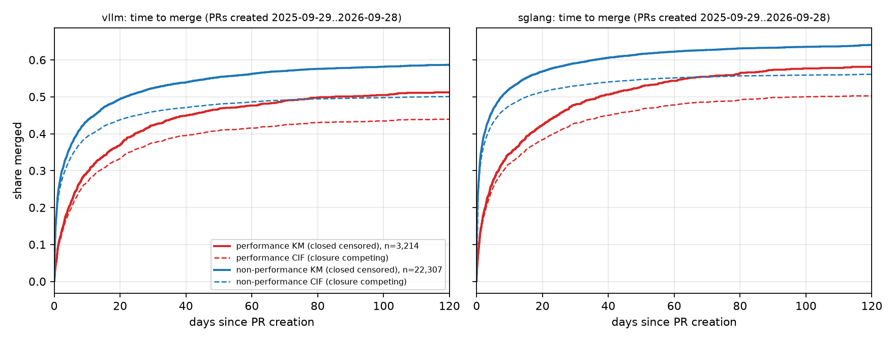
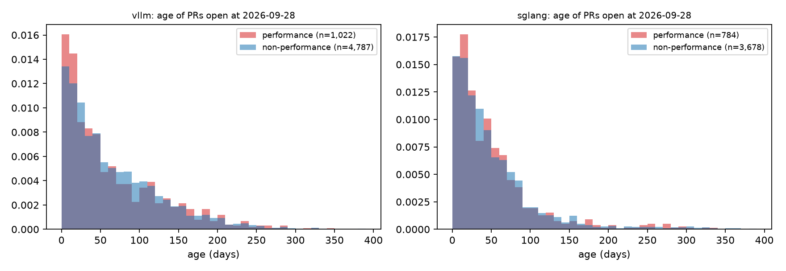
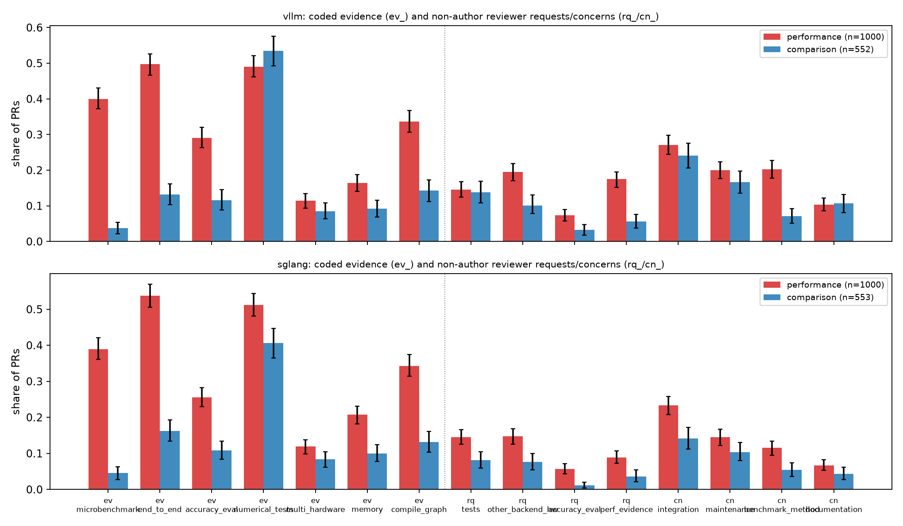
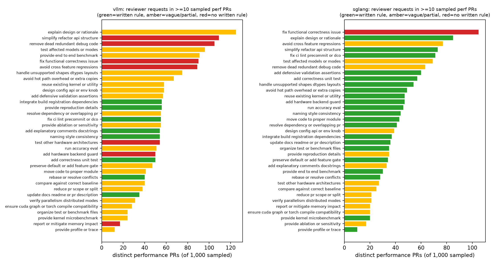

# What happens to performance and kernel PRs in vLLM and SGLang

**Deep follow-up, WP-A. Cutoff 2026-09-28; PRs created 2025-09-29 → 2026-09-28.** Complete-population results (A1–A2) use every PR in the window; content results (A3–A5) use a seeded, stratified detailed corpus. Denominators are stated with every figure. Coding was performed by LLM subagents with explicit codebooks, fresh second passes and adjudication — agreement statistics are model–model consistency, not human inter-rater reliability. Nothing here is causal. See [`METHODS.md`](METHODS.md).

## Executive summary

1. **Performance PRs are a large, well-defined population.** Contextual adjudication of every ambiguous candidate yields 3,214<!-- claim:data/a1-population-summary.csv::repo=vllm::confirmed_performance::int --> confirmed performance PRs of 25,573<!-- claim:data/a1-population-summary.csv::repo=vllm::window_prs::int --> in vLLM and 3,094<!-- claim:data/a1-population-summary.csv::repo=sglang::confirmed_performance::int --> of 26,004<!-- claim:data/a1-population-summary.csv::repo=sglang::window_prs::int --> in SGLang. The first study's open queue was re-adjudicated: 565<!-- claim:data/a1-population-summary.csv::repo=vllm::queue_confirmed::int --> of 589<!-- claim:data/a1-population-summary.csv::repo=vllm::first_study_queue_candidates::int --> (vLLM) and 324<!-- claim:data/a1-population-summary.csv::repo=sglang::queue_confirmed::int --> of 345<!-- claim:data/a1-population-summary.csv::repo=sglang::first_study_queue_candidates::int --> (SGLang) title candidates are confirmed; the full adjudicated open performance queue at the cutoff is 1,022<!-- claim:data/a1-population-summary.csv::repo=vllm::open_confirmed_performance::int --> and 784<!-- claim:data/a1-population-summary.csv::repo=sglang::open_confirmed_performance::int --> PRs.
2. **They merge later and less often.** Accounting for closure as a competing outcome, 37.5<!-- claim:data/a2-survival.csv::repo=vllm&group=performance&horizon_days=30::cif_merged::pct1 -->% of vLLM performance PRs had merged within 30 days versus 46.0<!-- claim:data/a2-survival.csv::repo=vllm&group=non_performance&horizon_days=30::cif_merged::pct1 -->% of other PRs (SGLang 42.9<!-- claim:data/a2-survival.csv::repo=sglang&group=performance&horizon_days=30::cif_merged::pct1 -->% vs 53.0<!-- claim:data/a2-survival.csv::repo=sglang&group=non_performance&horizon_days=30::cif_merged::pct1 -->%); the 30-day difference is -8.5<!-- claim:data/a2-effects.csv::repo=vllm&effect=cif_merged_30d_diff&stratum=all::estimate::pct1 --> points [-10.4, -6.6] in vLLM and -10.1<!-- claim:data/a2-effects.csv::repo=sglang&effect=cif_merged_30d_diff&stratum=all::estimate::pct1 --> points in SGLang (bootstrap 95% CIs).
3. **They carry far more evidence than comparable PRs.** In the matched detailed corpus, microbenchmarks appear in 40.0<!-- claim:data/a3-evidence-summary.csv::repo=vllm&group=performance&measure=ev_microbenchmark::share::pct1 -->% of vLLM performance PRs versus 3.8<!-- claim:data/a3-evidence-summary.csv::repo=vllm&group=comparison&measure=ev_microbenchmark::share::pct1 -->% of matched comparisons, and end-to-end numbers in 49.7<!-- claim:data/a3-evidence-summary.csv::repo=vllm&group=performance&measure=ev_end_to_end::share::pct1 -->% vs 13.2<!-- claim:data/a3-evidence-summary.csv::repo=vllm&group=comparison&measure=ev_end_to_end::share::pct1 -->%; accuracy evaluation in 29.1<!-- claim:data/a3-evidence-summary.csv::repo=vllm&group=performance&measure=ev_accuracy_eval::share::pct1 -->% (SGLang: 38.9<!-- claim:data/a3-evidence-summary.csv::repo=sglang&group=performance&measure=ev_microbenchmark::share::pct1 -->%, 53.8<!-- claim:data/a3-evidence-summary.csv::repo=sglang&group=performance&measure=ev_end_to_end::share::pct1 -->%, 25.6<!-- claim:data/a3-evidence-summary.csv::repo=sglang&group=performance&measure=ev_accuracy_eval::share::pct1 -->%).
4. **Review asks for the downstream pipeline.** Among the same performance PRs, reviewers raised integration concerns in 27.1<!-- claim:data/a3-evidence-summary.csv::repo=vllm&group=performance&measure=cn_integration::share::pct1 -->% (vLLM) and 23.3<!-- claim:data/a3-evidence-summary.csv::repo=sglang&group=performance&measure=cn_integration::share::pct1 -->% (SGLang), asked about other hardware/backends in 19.5<!-- claim:data/a3-evidence-summary.csv::repo=vllm&group=performance&measure=rq_other_backend_hw::share::pct1 -->% and 14.7<!-- claim:data/a3-evidence-summary.csv::repo=sglang&group=performance&measure=rq_other_backend_hw::share::pct1 -->%, and challenged benchmark methodology in 20.2<!-- claim:data/a3-evidence-summary.csv::repo=vllm&group=performance&measure=cn_benchmark_method::share::pct1 -->% and 11.5<!-- claim:data/a3-evidence-summary.csv::repo=sglang&group=performance&measure=cn_benchmark_method::share::pct1 -->% — each well above matched comparisons.
5. **Much of what reviewers require is not written down.** In vLLM, 44.6<!-- claim:data/a4-summary.csv::repo=vllm::share_merged_with_ge1_undocumented::pct1 -->% of merged sampled performance PRs (178<!-- claim:data/a4-summary.csv::repo=vllm::merged_with_ge1_undocumented_request_before_merge::int --> of 399<!-- claim:data/a4-summary.csv::repo=vllm::merged_perf_prs::int -->) received at least one pre-merge request of a type that neither of two independent document audits found in the contribution rules; 7<!-- claim:data/a4-summary.csv::repo=vllm::undocumented_recurring_types::int --> such request types recur in ≥10 PRs. SGLang's much larger written guidance (contribution guide, template and agent-skill guides) leaves 14.6<!-- claim:data/a4-summary.csv::repo=sglang::share_merged_with_ge1_undocumented::pct1 -->%.
6. **Performance PRs are reverted about twice as often:** 1.8<!-- claim:data/a2-revert-rates.csv::repo=vllm&group=performance::revert_rate::pct1 -->% vs 0.9<!-- claim:data/a2-revert-rates.csv::repo=vllm&group=non_performance::revert_rate::pct1 -->% of merged PRs in vLLM, 2.4<!-- claim:data/a2-revert-rates.csv::repo=sglang&group=performance::revert_rate::pct1 -->% vs 1.1<!-- claim:data/a2-revert-rates.csv::repo=sglang&group=non_performance::revert_rate::pct1 -->% in SGLang.

## A1 — the performance-PR population

| | vLLM | SGLang |
|---|---:|---:|
| PRs created in window | 25,573<!-- claim:data/a1-population-summary.csv::repo=vllm::window_prs::int --> | 26,004<!-- claim:data/a1-population-summary.csv::repo=sglang::window_prs::int --> |
| confirmed performance | 3,214<!-- claim:data/a1-population-summary.csv::repo=vllm::confirmed_performance::int --> | 3,094<!-- claim:data/a1-population-summary.csv::repo=sglang::confirmed_performance::int --> |
| not performance | 22,307<!-- claim:data/a1-population-summary.csv::repo=vllm::not_performance::int --> | 22,892<!-- claim:data/a1-population-summary.csv::repo=sglang::not_performance::int --> |
| uncertain | 52<!-- claim:data/a1-population-summary.csv::repo=vllm::uncertain::int --> | 18<!-- claim:data/a1-population-summary.csv::repo=sglang::uncertain::int --> |
| records adjudicated in context | 4,683<!-- claim:data/a1-population-summary.csv::repo=vllm::adjudicated_records::int --> | 4,797<!-- claim:data/a1-population-summary.csv::repo=sglang::adjudicated_records::int --> |
| first-study open-queue candidates | 589<!-- claim:data/a1-population-summary.csv::repo=vllm::first_study_queue_candidates::int --> | 345<!-- claim:data/a1-population-summary.csv::repo=sglang::first_study_queue_candidates::int --> |
| … confirmed on adjudication | 565<!-- claim:data/a1-population-summary.csv::repo=vllm::queue_confirmed::int --> | 324<!-- claim:data/a1-population-summary.csv::repo=sglang::queue_confirmed::int --> |
| … not performance | 24<!-- claim:data/a1-population-summary.csv::repo=vllm::queue_not_performance::int --> | 20<!-- claim:data/a1-population-summary.csv::repo=sglang::queue_not_performance::int --> |
| open PRs at cutoff (population scope) | 5,821<!-- claim:data/a1-population-summary.csv::repo=vllm::open_at_cutoff_all::int --> | 4,470<!-- claim:data/a1-population-summary.csv::repo=sglang::open_at_cutoff_all::int --> |
| open confirmed performance PRs | 1,022<!-- claim:data/a1-population-summary.csv::repo=vllm::open_confirmed_performance::int --> | 784<!-- claim:data/a1-population-summary.csv::repo=sglang::open_confirmed_performance::int --> |

Tiering and validation. PRs with an explicit performance title tag and no fix/CI/doc/revert tag were accepted by rule; every other PR with any performance or kernel signal (title claim, kernel tag, `performance` label, or kernel paths plus a body performance claim) was adjudicated in context. Seeded random validation samples measure both rule tiers:

| Repo | Sample | n | confirmed performance | share | Wilson 95% |
|---|---|---:|---:|---:|---|
| vllm | validation_rule_confirmed | 150<!-- claim:data/a1-tier-validation.csv::repo=vllm&validation_sample=validation_rule_confirmed::n::int --> | 149<!-- claim:data/a1-tier-validation.csv::repo=vllm&validation_sample=validation_rule_confirmed::confirmed_performance::int --> | 99.3<!-- claim:data/a1-tier-validation.csv::repo=vllm&validation_sample=validation_rule_confirmed::share_confirmed::pct1 -->% | [96.3–99.9%] |
| vllm | validation_rule_excluded | 200<!-- claim:data/a1-tier-validation.csv::repo=vllm&validation_sample=validation_rule_excluded::n::int --> | 16<!-- claim:data/a1-tier-validation.csv::repo=vllm&validation_sample=validation_rule_excluded::confirmed_performance::int --> | 8.0<!-- claim:data/a1-tier-validation.csv::repo=vllm&validation_sample=validation_rule_excluded::share_confirmed::pct1 -->% | [5.0–12.6%] |
| sglang | validation_rule_confirmed | 150<!-- claim:data/a1-tier-validation.csv::repo=sglang&validation_sample=validation_rule_confirmed::n::int --> | 147<!-- claim:data/a1-tier-validation.csv::repo=sglang&validation_sample=validation_rule_confirmed::confirmed_performance::int --> | 98.0<!-- claim:data/a1-tier-validation.csv::repo=sglang&validation_sample=validation_rule_confirmed::share_confirmed::pct1 -->% | [94.3–99.3%] |
| sglang | validation_rule_excluded | 200<!-- claim:data/a1-tier-validation.csv::repo=sglang&validation_sample=validation_rule_excluded::n::int --> | 19<!-- claim:data/a1-tier-validation.csv::repo=sglang&validation_sample=validation_rule_excluded::confirmed_performance::int --> | 9.5<!-- claim:data/a1-tier-validation.csv::repo=sglang&validation_sample=validation_rule_excluded::share_confirmed::pct1 -->% | [6.2–14.4%] |

The rule-confirmed tier is high precision. The rule-excluded tier still hides performance PRs at a rate of 8.0<!-- claim:data/a1-tier-validation.csv::repo=vllm&validation_sample=validation_rule_excluded::share_confirmed::pct1 -->% (vLLM) and 9.5<!-- claim:data/a1-tier-validation.csv::repo=sglang&validation_sample=validation_rule_excluded::share_confirmed::pct1 -->% (SGLang) — mostly borderline system-level efficiency features without performance vocabulary. The confirmed population is therefore a high-precision **lower bound**; misclassified PRs sit in the comparison group and bias contrasts toward zero. Extrapolating the miss rate to the whole excluded tier implies about 1,631<!-- claim:data/a1-recall-estimate.csv::repo=vllm::est_missed::int --> (vLLM) and 2,020<!-- claim:data/a1-recall-estimate.csv::repo=sglang::est_missed::int --> (SGLang) further performance PRs, i.e. estimated recall of 66.3<!-- claim:data/a1-recall-estimate.csv::repo=vllm::est_recall::pct1 -->% and 60.5<!-- claim:data/a1-recall-estimate.csv::repo=sglang::est_recall::pct1 -->% (`data/a1-recall-estimate.csv`, with Wilson-based ranges). An independent second adjudication of 300 random records agreed 97.0<!-- claim:data/a1-adjudication-agreement.csv::repo=both::percent_agreement::pct1 -->% (κ = 0.94<!-- claim:data/a1-adjudication-agreement.csv::repo=both::cohen_kappa::dec2 -->).

## A2 — complete-population delivery metrics

| | vLLM perf | vLLM other | SGLang perf | SGLang other |
|---|---:|---:|---:|---:|
| PRs | 3,214<!-- claim:data/a2-population-summary.csv::repo=vllm&group=performance::n::int --> | 22,307<!-- claim:data/a2-population-summary.csv::repo=vllm&group=non_performance::n::int --> | 3,094<!-- claim:data/a2-population-summary.csv::repo=sglang&group=performance::n::int --> | 22,892<!-- claim:data/a2-population-summary.csv::repo=sglang&group=non_performance::n::int --> |
| merged by cutoff | 39.7<!-- claim:data/a2-population-summary.csv::repo=vllm&group=performance::merged_share::pct1 -->% | 48.0<!-- claim:data/a2-population-summary.csv::repo=vllm&group=non_performance::merged_share::pct1 -->% | 46.0<!-- claim:data/a2-population-summary.csv::repo=sglang&group=performance::merged_share::pct1 -->% | 54.3<!-- claim:data/a2-population-summary.csv::repo=sglang&group=non_performance::merged_share::pct1 -->% |
| closed unmerged | 28.5<!-- claim:data/a2-population-summary.csv::repo=vllm&group=performance::closed_share::pct1 -->% | 30.7<!-- claim:data/a2-population-summary.csv::repo=vllm&group=non_performance::closed_share::pct1 -->% | 28.7<!-- claim:data/a2-population-summary.csv::repo=sglang&group=performance::closed_share::pct1 -->% | 29.7<!-- claim:data/a2-population-summary.csv::repo=sglang&group=non_performance::closed_share::pct1 -->% |
| still open | 31.8<!-- claim:data/a2-population-summary.csv::repo=vllm&group=performance::open_share::pct1 -->% | 21.3<!-- claim:data/a2-population-summary.csv::repo=vllm&group=non_performance::open_share::pct1 -->% | 25.3<!-- claim:data/a2-population-summary.csv::repo=sglang&group=performance::open_share::pct1 -->% | 16.0<!-- claim:data/a2-population-summary.csv::repo=sglang&group=non_performance::open_share::pct1 -->% |
| median lines changed | 223<!-- claim:data/a2-population-summary.csv::repo=vllm&group=performance::median_lines_changed::int --> | 62<!-- claim:data/a2-population-summary.csv::repo=vllm&group=non_performance::median_lines_changed::int --> | 274<!-- claim:data/a2-population-summary.csv::repo=sglang&group=performance::median_lines_changed::int --> | 78<!-- claim:data/a2-population-summary.csv::repo=sglang&group=non_performance::median_lines_changed::int --> |
| median files changed | 4<!-- claim:data/a2-population-summary.csv::repo=vllm&group=performance::median_changed_files::int --> | 2<!-- claim:data/a2-population-summary.csv::repo=vllm&group=non_performance::median_changed_files::int --> | 4<!-- claim:data/a2-population-summary.csv::repo=sglang&group=performance::median_changed_files::int --> | 2<!-- claim:data/a2-population-summary.csv::repo=sglang&group=non_performance::median_changed_files::int --> |
| KM median days to merge (closed censored) | 85.3<!-- claim:data/a2-population-summary.csv::repo=vllm&group=performance::km_median_days_to_merge::dec1 --> | 21.7<!-- claim:data/a2-population-summary.csv::repo=vllm&group=non_performance::km_median_days_to_merge::dec1 --> | 37.2<!-- claim:data/a2-population-summary.csv::repo=sglang&group=performance::km_median_days_to_merge::dec1 --> | 7.6<!-- claim:data/a2-population-summary.csv::repo=sglang&group=non_performance::km_median_days_to_merge::dec1 --> |
| median days to merge among merged | 5.2<!-- claim:data/a2-population-summary.csv::repo=vllm&group=performance::median_days_to_merge_among_merged::dec1 --> | 1.5<!-- claim:data/a2-population-summary.csv::repo=vllm&group=non_performance::median_days_to_merge_among_merged::dec1 --> | 4.0<!-- claim:data/a2-population-summary.csv::repo=sglang&group=performance::median_days_to_merge_among_merged::dec1 --> | 0.7<!-- claim:data/a2-population-summary.csv::repo=sglang&group=non_performance::median_days_to_merge_among_merged::dec1 --> |
| later reverted (of all) | 23<!-- claim:data/a2-population-summary.csv::repo=vllm&group=performance::reverted_n::int --> | 94<!-- claim:data/a2-population-summary.csv::repo=vllm&group=non_performance::reverted_n::int --> | 34<!-- claim:data/a2-population-summary.csv::repo=sglang&group=performance::reverted_n::int --> | 140<!-- claim:data/a2-population-summary.csv::repo=sglang&group=non_performance::reverted_n::int --> |
| closed with superseded signal | 138<!-- claim:data/a2-population-summary.csv::repo=vllm&group=performance::superseded_signal_n::int --> | 1,003<!-- claim:data/a2-population-summary.csv::repo=vllm&group=non_performance::superseded_signal_n::int --> | 119<!-- claim:data/a2-population-summary.csv::repo=sglang&group=performance::superseded_signal_n::int --> | 867<!-- claim:data/a2-population-summary.csv::repo=sglang&group=non_performance::superseded_signal_n::int --> |

Cumulative incidence of merge (Aalen–Johansen; closure is a competing event; open PRs censored at the cutoff):

| Days | vLLM perf | vLLM other | SGLang perf | SGLang other |
|---:|---:|---:|---:|---:|
| 1 | 8.0<!-- claim:data/a2-survival.csv::repo=vllm&group=performance&horizon_days=1::cif_merged::pct1 -->% | 20.8<!-- claim:data/a2-survival.csv::repo=vllm&group=non_performance&horizon_days=1::cif_merged::pct1 -->% | 11.7<!-- claim:data/a2-survival.csv::repo=sglang&group=performance&horizon_days=1::cif_merged::pct1 -->% | 30.4<!-- claim:data/a2-survival.csv::repo=sglang&group=non_performance&horizon_days=1::cif_merged::pct1 -->% |
| 7 | 23.2<!-- claim:data/a2-survival.csv::repo=vllm&group=performance&horizon_days=7::cif_merged::pct1 -->% | 36.3<!-- claim:data/a2-survival.csv::repo=vllm&group=non_performance&horizon_days=7::cif_merged::pct1 -->% | 28.5<!-- claim:data/a2-survival.csv::repo=sglang&group=performance&horizon_days=7::cif_merged::pct1 -->% | 45.4<!-- claim:data/a2-survival.csv::repo=sglang&group=non_performance&horizon_days=7::cif_merged::pct1 -->% |
| 30 | 37.5<!-- claim:data/a2-survival.csv::repo=vllm&group=performance&horizon_days=30::cif_merged::pct1 -->% | 46.0<!-- claim:data/a2-survival.csv::repo=vllm&group=non_performance&horizon_days=30::cif_merged::pct1 -->% | 42.9<!-- claim:data/a2-survival.csv::repo=sglang&group=performance&horizon_days=30::cif_merged::pct1 -->% | 53.0<!-- claim:data/a2-survival.csv::repo=sglang&group=non_performance&horizon_days=30::cif_merged::pct1 -->% |
| 90 | 43.2<!-- claim:data/a2-survival.csv::repo=vllm&group=performance&horizon_days=90::cif_merged::pct1 -->% | 49.6<!-- claim:data/a2-survival.csv::repo=vllm&group=non_performance&horizon_days=90::cif_merged::pct1 -->% | 49.8<!-- claim:data/a2-survival.csv::repo=sglang&group=performance&horizon_days=90::cif_merged::pct1 -->% | 55.8<!-- claim:data/a2-survival.csv::repo=sglang&group=non_performance&horizon_days=90::cif_merged::pct1 -->% |

Effect sizes (performance minus other; 1,000-replicate bootstrap):

| Repo | Effect | Stratum | Estimate | 95% CI |
|---|---|---|---:|---|
| vllm | km_median_days_to_merge_diff | all | 63.6419 | [41.3178, 105.3185] |
| vllm | km_median_days_to_merge_ratio | all | 3.9346 | [2.7748, 5.9052] |
| vllm | cif_merged_30d_diff | all | -0.0845 | [-0.1038, -0.0662] |
| vllm | cif_merged_7d_diff | all | -0.1307 | [-0.1458, -0.1133] |
| vllm | rmst_90d_days_diff | all | 8.9576 | [7.3631, 10.4951] |
| vllm | closed_unmerged_share_diff | all | -0.0219 | [-0.0387, -0.0039] |
| vllm | km_median_days_to_merge_diff | size_small (lines 0-29) | 6.8669 | [2.3072, 16.07] |
| vllm | km_median_days_to_merge_diff | size_medium (lines 29-169) | -0.6222 | [-13.5375, 20.9664] |
| vllm | km_median_days_to_merge_diff | size_large (lines 169-1000000000000) | not reached | [13.6892, 13.6892] |
| sglang | km_median_days_to_merge_diff | all | 29.6489 | [22.7308, 39.618] |
| sglang | km_median_days_to_merge_ratio | all | 4.9103 | [3.9531, 6.2689] |
| sglang | cif_merged_30d_diff | all | -0.1009 | [-0.1203, -0.0817] |
| sglang | cif_merged_7d_diff | all | -0.1689 | [-0.1858, -0.1512] |
| sglang | rmst_90d_days_diff | all | 9.7231 | [7.9869, 11.4708] |
| sglang | closed_unmerged_share_diff | all | -0.0102 | [-0.0276, 0.006] |
| sglang | km_median_days_to_merge_diff | size_small (lines 0-33) | 5.8075 | [2.9373, 10.012] |
| sglang | km_median_days_to_merge_diff | size_medium (lines 33-222) | 9.5113 | [4.0452, 15.5249] |
| sglang | km_median_days_to_merge_diff | size_large (lines 222-1000000000000) | 59.0334 | [32.9211, 178.4813] |

KM medians are long because many PRs never merge; with closed PRs censored, KM overstates eventual merge probability, so the CIF columns are the preferred summary. Within size terciles the gap persists for small and large PRs (`nan` = median not reached within the window).



*Observation:* KM (solid, closed censored) and CIF (dashed, closure competing) for PRs created in the window. *Interpretation:* performance PRs accumulate merges more slowly at every horizon; this is descriptive and confounded by size and complexity.

| Open at cutoff | open PRs | median age (days) | share older than 90 days |
|---|---:|---:|---:|
| vllm performance | 1,022<!-- claim:data/a2-open-queue.csv::repo=vllm&group=performance::open_at_cutoff::int --> | 41.5<!-- claim:data/a2-open-queue.csv::repo=vllm&group=performance::median_age_days::dec1 --> | 27.2<!-- claim:data/a2-open-queue.csv::repo=vllm&group=performance::share_older_than_90d::pct1 -->% |
| vllm non_performance | 4,787<!-- claim:data/a2-open-queue.csv::repo=vllm&group=non_performance::open_at_cutoff::int --> | 48.2<!-- claim:data/a2-open-queue.csv::repo=vllm&group=non_performance::median_age_days::dec1 --> | 28.8<!-- claim:data/a2-open-queue.csv::repo=vllm&group=non_performance::share_older_than_90d::pct1 -->% |
| sglang performance | 784<!-- claim:data/a2-open-queue.csv::repo=sglang&group=performance::open_at_cutoff::int --> | 34.3<!-- claim:data/a2-open-queue.csv::repo=sglang&group=performance::median_age_days::dec1 --> | 13.4<!-- claim:data/a2-open-queue.csv::repo=sglang&group=performance::share_older_than_90d::pct1 -->% |
| sglang non_performance | 3,678<!-- claim:data/a2-open-queue.csv::repo=sglang&group=non_performance::open_at_cutoff::int --> | 35.9<!-- claim:data/a2-open-queue.csv::repo=sglang&group=non_performance::median_age_days::dec1 --> | 14.5<!-- claim:data/a2-open-queue.csv::repo=sglang&group=non_performance::share_older_than_90d::pct1 -->% |



## A3 — evidence and reviewer labour in the detailed corpus

Both repositories exceed 2,500 confirmed performance PRs, so the detailed corpus is a seeded state×month stratified sample of 1,000 performance PRs per repository plus 552 (vLLM) and 553 (SGLang) human-authored non-performance PRs matched on creation month, PR-size tercile and state. Full reviews, inline comments, issue comments, commits and timeline events were cached for all 3,105 PRs. Shares below are PR-level; the performance sample is proportional to the population by state and month.

| Code | vLLM perf | vLLM comparison | SGLang perf | SGLang comparison |
|---|---:|---:|---:|---:|
| ev_microbenchmark | 40.0<!-- claim:data/a3-evidence-summary.csv::repo=vllm&group=performance&measure=ev_microbenchmark::share::pct1 -->% [37.2–43.0%] | 3.8<!-- claim:data/a3-evidence-summary.csv::repo=vllm&group=comparison&measure=ev_microbenchmark::share::pct1 -->% [2.2–5.4%] | 38.9<!-- claim:data/a3-evidence-summary.csv::repo=sglang&group=performance&measure=ev_microbenchmark::share::pct1 -->% [36.1–42.1%] | 4.5<!-- claim:data/a3-evidence-summary.csv::repo=sglang&group=comparison&measure=ev_microbenchmark::share::pct1 -->% [2.7–6.3%] |
| ev_end_to_end | 49.7<!-- claim:data/a3-evidence-summary.csv::repo=vllm&group=performance&measure=ev_end_to_end::share::pct1 -->% [46.7–52.6%] | 13.2<!-- claim:data/a3-evidence-summary.csv::repo=vllm&group=comparison&measure=ev_end_to_end::share::pct1 -->% [10.3–16.1%] | 53.8<!-- claim:data/a3-evidence-summary.csv::repo=sglang&group=performance&measure=ev_end_to_end::share::pct1 -->% [50.6–57.0%] | 16.3<!-- claim:data/a3-evidence-summary.csv::repo=sglang&group=comparison&measure=ev_end_to_end::share::pct1 -->% [13.4–19.4%] |
| ev_accuracy_eval | 29.1<!-- claim:data/a3-evidence-summary.csv::repo=vllm&group=performance&measure=ev_accuracy_eval::share::pct1 -->% [26.3–32.0%] | 11.6<!-- claim:data/a3-evidence-summary.csv::repo=vllm&group=comparison&measure=ev_accuracy_eval::share::pct1 -->% [8.9–14.5%] | 25.6<!-- claim:data/a3-evidence-summary.csv::repo=sglang&group=performance&measure=ev_accuracy_eval::share::pct1 -->% [23.0–28.2%] | 10.8<!-- claim:data/a3-evidence-summary.csv::repo=sglang&group=comparison&measure=ev_accuracy_eval::share::pct1 -->% [8.3–13.4%] |
| ev_numerical_tests | 49.0<!-- claim:data/a3-evidence-summary.csv::repo=vllm&group=performance&measure=ev_numerical_tests::share::pct1 -->% [46.1–52.1%] | 53.4<!-- claim:data/a3-evidence-summary.csv::repo=vllm&group=comparison&measure=ev_numerical_tests::share::pct1 -->% [49.3–57.6%] | 51.2<!-- claim:data/a3-evidence-summary.csv::repo=sglang&group=performance&measure=ev_numerical_tests::share::pct1 -->% [48.1–54.4%] | 40.7<!-- claim:data/a3-evidence-summary.csv::repo=sglang&group=comparison&measure=ev_numerical_tests::share::pct1 -->% [36.5–44.7%] |
| ev_multi_hardware | 11.4<!-- claim:data/a3-evidence-summary.csv::repo=vllm&group=performance&measure=ev_multi_hardware::share::pct1 -->% [9.3–13.4%] | 8.5<!-- claim:data/a3-evidence-summary.csv::repo=vllm&group=comparison&measure=ev_multi_hardware::share::pct1 -->% [6.3–10.9%] | 11.9<!-- claim:data/a3-evidence-summary.csv::repo=sglang&group=performance&measure=ev_multi_hardware::share::pct1 -->% [9.8–13.8%] | 8.3<!-- claim:data/a3-evidence-summary.csv::repo=sglang&group=comparison&measure=ev_multi_hardware::share::pct1 -->% [6.2–10.5%] |
| ev_memory | 16.4<!-- claim:data/a3-evidence-summary.csv::repo=vllm&group=performance&measure=ev_memory::share::pct1 -->% [14.1–18.7%] | 9.2<!-- claim:data/a3-evidence-summary.csv::repo=vllm&group=comparison&measure=ev_memory::share::pct1 -->% [6.9–11.6%] | 20.7<!-- claim:data/a3-evidence-summary.csv::repo=sglang&group=performance&measure=ev_memory::share::pct1 -->% [18.2–23.1%] | 10.0<!-- claim:data/a3-evidence-summary.csv::repo=sglang&group=comparison&measure=ev_memory::share::pct1 -->% [7.8–12.5%] |
| ev_compile_graph | 33.6<!-- claim:data/a3-evidence-summary.csv::repo=vllm&group=performance&measure=ev_compile_graph::share::pct1 -->% [30.7–36.7%] | 14.3<!-- claim:data/a3-evidence-summary.csv::repo=vllm&group=comparison&measure=ev_compile_graph::share::pct1 -->% [11.2–17.2%] | 34.2<!-- claim:data/a3-evidence-summary.csv::repo=sglang&group=performance&measure=ev_compile_graph::share::pct1 -->% [31.4–37.4%] | 13.2<!-- claim:data/a3-evidence-summary.csv::repo=sglang&group=comparison&measure=ev_compile_graph::share::pct1 -->% [10.3–16.1%] |
| rq_tests | 14.6<!-- claim:data/a3-evidence-summary.csv::repo=vllm&group=performance&measure=rq_tests::share::pct1 -->% [12.4–16.8%] | 13.8<!-- claim:data/a3-evidence-summary.csv::repo=vllm&group=comparison&measure=rq_tests::share::pct1 -->% [10.9–16.9%] | 14.5<!-- claim:data/a3-evidence-summary.csv::repo=sglang&group=performance&measure=rq_tests::share::pct1 -->% [12.5–16.6%] | 8.1<!-- claim:data/a3-evidence-summary.csv::repo=sglang&group=comparison&measure=rq_tests::share::pct1 -->% [6.0–10.5%] |
| rq_other_backend_hw | 19.5<!-- claim:data/a3-evidence-summary.csv::repo=vllm&group=performance&measure=rq_other_backend_hw::share::pct1 -->% [17.0–21.9%] | 10.1<!-- claim:data/a3-evidence-summary.csv::repo=vllm&group=comparison&measure=rq_other_backend_hw::share::pct1 -->% [7.8–13.0%] | 14.7<!-- claim:data/a3-evidence-summary.csv::repo=sglang&group=performance&measure=rq_other_backend_hw::share::pct1 -->% [12.5–16.8%] | 7.6<!-- claim:data/a3-evidence-summary.csv::repo=sglang&group=comparison&measure=rq_other_backend_hw::share::pct1 -->% [5.4–10.0%] |
| rq_accuracy_eval | 7.3<!-- claim:data/a3-evidence-summary.csv::repo=vllm&group=performance&measure=rq_accuracy_eval::share::pct1 -->% [5.7–9.0%] | 3.3<!-- claim:data/a3-evidence-summary.csv::repo=vllm&group=comparison&measure=rq_accuracy_eval::share::pct1 -->% [1.8–4.7%] | 5.7<!-- claim:data/a3-evidence-summary.csv::repo=sglang&group=performance&measure=rq_accuracy_eval::share::pct1 -->% [4.3–7.2%] | 1.1<!-- claim:data/a3-evidence-summary.csv::repo=sglang&group=comparison&measure=rq_accuracy_eval::share::pct1 -->% [0.4–2.0%] |
| rq_perf_evidence | 17.5<!-- claim:data/a3-evidence-summary.csv::repo=vllm&group=performance&measure=rq_perf_evidence::share::pct1 -->% [15.2–19.5%] | 5.6<!-- claim:data/a3-evidence-summary.csv::repo=vllm&group=comparison&measure=rq_perf_evidence::share::pct1 -->% [3.8–7.6%] | 8.9<!-- claim:data/a3-evidence-summary.csv::repo=sglang&group=performance&measure=rq_perf_evidence::share::pct1 -->% [7.3–10.7%] | 3.6<!-- claim:data/a3-evidence-summary.csv::repo=sglang&group=comparison&measure=rq_perf_evidence::share::pct1 -->% [2.2–5.4%] |
| cn_integration | 27.1<!-- claim:data/a3-evidence-summary.csv::repo=vllm&group=performance&measure=cn_integration::share::pct1 -->% [24.4–29.8%] | 24.1<!-- claim:data/a3-evidence-summary.csv::repo=vllm&group=comparison&measure=cn_integration::share::pct1 -->% [20.6–27.5%] | 23.3<!-- claim:data/a3-evidence-summary.csv::repo=sglang&group=performance&measure=cn_integration::share::pct1 -->% [20.7–25.8%] | 14.1<!-- claim:data/a3-evidence-summary.csv::repo=sglang&group=comparison&measure=cn_integration::share::pct1 -->% [11.2–17.2%] |
| cn_maintenance | 20.0<!-- claim:data/a3-evidence-summary.csv::repo=vllm&group=performance&measure=cn_maintenance::share::pct1 -->% [17.6–22.3%] | 16.7<!-- claim:data/a3-evidence-summary.csv::repo=vllm&group=comparison&measure=cn_maintenance::share::pct1 -->% [13.6–19.8%] | 14.5<!-- claim:data/a3-evidence-summary.csv::repo=sglang&group=performance&measure=cn_maintenance::share::pct1 -->% [12.2–16.7%] | 10.3<!-- claim:data/a3-evidence-summary.csv::repo=sglang&group=comparison&measure=cn_maintenance::share::pct1 -->% [8.0–13.0%] |
| cn_benchmark_method | 20.2<!-- claim:data/a3-evidence-summary.csv::repo=vllm&group=performance&measure=cn_benchmark_method::share::pct1 -->% [17.8–22.7%] | 7.1<!-- claim:data/a3-evidence-summary.csv::repo=vllm&group=comparison&measure=cn_benchmark_method::share::pct1 -->% [5.1–9.2%] | 11.5<!-- claim:data/a3-evidence-summary.csv::repo=sglang&group=performance&measure=cn_benchmark_method::share::pct1 -->% [9.5–13.4%] | 5.4<!-- claim:data/a3-evidence-summary.csv::repo=sglang&group=comparison&measure=cn_benchmark_method::share::pct1 -->% [3.6–7.4%] |
| cn_documentation | 10.3<!-- claim:data/a3-evidence-summary.csv::repo=vllm&group=performance&measure=cn_documentation::share::pct1 -->% [8.6–12.2%] | 10.7<!-- claim:data/a3-evidence-summary.csv::repo=vllm&group=comparison&measure=cn_documentation::share::pct1 -->% [8.2–13.2%] | 6.7<!-- claim:data/a3-evidence-summary.csv::repo=sglang&group=performance&measure=cn_documentation::share::pct1 -->% [5.3–8.3%] | 4.3<!-- claim:data/a3-evidence-summary.csv::repo=sglang&group=comparison&measure=cn_documentation::share::pct1 -->% [2.7–6.2%] |
| reviewed_any | 55.5<!-- claim:data/a3-evidence-summary.csv::repo=vllm&group=performance&measure=reviewed_any::share::pct1 -->% [52.5–58.4%] | 53.6<!-- claim:data/a3-evidence-summary.csv::repo=vllm&group=comparison&measure=reviewed_any::share::pct1 -->% [49.8–57.8%] | 42.5<!-- claim:data/a3-evidence-summary.csv::repo=sglang&group=performance&measure=reviewed_any::share::pct1 -->% [39.5–45.6%] | 32.7<!-- claim:data/a3-evidence-summary.csv::repo=sglang&group=comparison&measure=reviewed_any::share::pct1 -->% [28.9–36.7%] |

`reviewed_any` = at least one substantive non-author human review message.

| Review effort (median) | vLLM perf | vLLM comparison | SGLang perf | SGLang comparison |
|---|---:|---:|---:|---:|
| substantive_review_rounds | 1.0<!-- claim:data/a3-evidence-summary.csv::repo=vllm&group=performance&measure=median_substantive_review_rounds::share::dec1 --> | 1.0<!-- claim:data/a3-evidence-summary.csv::repo=vllm&group=comparison&measure=median_substantive_review_rounds::share::dec1 --> | 0.0<!-- claim:data/a3-evidence-summary.csv::repo=sglang&group=performance&measure=median_substantive_review_rounds::share::dec1 --> | 0.0<!-- claim:data/a3-evidence-summary.csv::repo=sglang&group=comparison&measure=median_substantive_review_rounds::share::dec1 --> |
| hours_to_first_human_response | 32.9<!-- claim:data/a3-evidence-summary.csv::repo=vllm&group=performance&measure=median_hours_to_first_human_response::share::dec1 --> | 13.1<!-- claim:data/a3-evidence-summary.csv::repo=vllm&group=comparison&measure=median_hours_to_first_human_response::share::dec1 --> | 39.5<!-- claim:data/a3-evidence-summary.csv::repo=sglang&group=performance&measure=median_hours_to_first_human_response::share::dec1 --> | 26.3<!-- claim:data/a3-evidence-summary.csv::repo=sglang&group=comparison&measure=median_hours_to_first_human_response::share::dec1 --> |
| n_human_reviewers | 1.0<!-- claim:data/a3-evidence-summary.csv::repo=vllm&group=performance&measure=median_n_human_reviewers::share::dec1 --> | 1.0<!-- claim:data/a3-evidence-summary.csv::repo=vllm&group=comparison&measure=median_n_human_reviewers::share::dec1 --> | 1.0<!-- claim:data/a3-evidence-summary.csv::repo=sglang&group=performance&measure=median_n_human_reviewers::share::dec1 --> | 0.0<!-- claim:data/a3-evidence-summary.csv::repo=sglang&group=comparison&measure=median_n_human_reviewers::share::dec1 --> |
| n_commits | 3.0<!-- claim:data/a3-evidence-summary.csv::repo=vllm&group=performance&measure=median_n_commits::share::dec1 --> | 2.0<!-- claim:data/a3-evidence-summary.csv::repo=vllm&group=comparison&measure=median_n_commits::share::dec1 --> | 4.0<!-- claim:data/a3-evidence-summary.csv::repo=sglang&group=performance&measure=median_n_commits::share::dec1 --> | 3.0<!-- claim:data/a3-evidence-summary.csv::repo=sglang&group=comparison&measure=median_n_commits::share::dec1 --> |



*Observation:* coded shares with bootstrap 95% CIs. *Interpretation:* performance PRs arrive with far more measurement, and reviewers respond with requests about other hardware, integration and benchmark method — the Establish and Sustain work.

Evidence by outcome within the performance sample (shares of PRs in each end state):

| Measure | vLLM merged | vLLM closed | vLLM open | SGLang merged | SGLang closed | SGLang open |
|---|---:|---:|---:|---:|---:|---:|
| any_e2e_or_micro | 75.7<!-- claim:data/a3-evidence-by-outcome.csv::repo=vllm&state=merged&measure=any_e2e_or_micro::share::pct1 -->% | 61.6<!-- claim:data/a3-evidence-by-outcome.csv::repo=vllm&state=closed&measure=any_e2e_or_micro::share::pct1 -->% | 74.5<!-- claim:data/a3-evidence-by-outcome.csv::repo=vllm&state=open&measure=any_e2e_or_micro::share::pct1 -->% | 71.5<!-- claim:data/a3-evidence-by-outcome.csv::repo=sglang&state=merged&measure=any_e2e_or_micro::share::pct1 -->% | 68.5<!-- claim:data/a3-evidence-by-outcome.csv::repo=sglang&state=closed&measure=any_e2e_or_micro::share::pct1 -->% | 74.0<!-- claim:data/a3-evidence-by-outcome.csv::repo=sglang&state=open&measure=any_e2e_or_micro::share::pct1 -->% |
| ev_end_to_end | 55.1<!-- claim:data/a3-evidence-by-outcome.csv::repo=vllm&state=merged&measure=ev_end_to_end::share::pct1 -->% | 40.8<!-- claim:data/a3-evidence-by-outcome.csv::repo=vllm&state=closed&measure=ev_end_to_end::share::pct1 -->% | 50.8<!-- claim:data/a3-evidence-by-outcome.csv::repo=vllm&state=open&measure=ev_end_to_end::share::pct1 -->% | 53.0<!-- claim:data/a3-evidence-by-outcome.csv::repo=sglang&state=merged&measure=ev_end_to_end::share::pct1 -->% | 52.8<!-- claim:data/a3-evidence-by-outcome.csv::repo=sglang&state=closed&measure=ev_end_to_end::share::pct1 -->% | 56.3<!-- claim:data/a3-evidence-by-outcome.csv::repo=sglang&state=open&measure=ev_end_to_end::share::pct1 -->% |
| ev_accuracy_eval | 41.6<!-- claim:data/a3-evidence-by-outcome.csv::repo=vllm&state=merged&measure=ev_accuracy_eval::share::pct1 -->% | 18.0<!-- claim:data/a3-evidence-by-outcome.csv::repo=vllm&state=closed&measure=ev_accuracy_eval::share::pct1 -->% | 23.3<!-- claim:data/a3-evidence-by-outcome.csv::repo=vllm&state=open&measure=ev_accuracy_eval::share::pct1 -->% | 28.0<!-- claim:data/a3-evidence-by-outcome.csv::repo=sglang&state=merged&measure=ev_accuracy_eval::share::pct1 -->% | 22.4<!-- claim:data/a3-evidence-by-outcome.csv::repo=sglang&state=closed&measure=ev_accuracy_eval::share::pct1 -->% | 24.8<!-- claim:data/a3-evidence-by-outcome.csv::repo=sglang&state=open&measure=ev_accuracy_eval::share::pct1 -->% |
| ev_numerical_tests | 42.6<!-- claim:data/a3-evidence-by-outcome.csv::repo=vllm&state=merged&measure=ev_numerical_tests::share::pct1 -->% | 45.8<!-- claim:data/a3-evidence-by-outcome.csv::repo=vllm&state=closed&measure=ev_numerical_tests::share::pct1 -->% | 59.9<!-- claim:data/a3-evidence-by-outcome.csv::repo=vllm&state=open&measure=ev_numerical_tests::share::pct1 -->% | 48.5<!-- claim:data/a3-evidence-by-outcome.csv::repo=sglang&state=merged&measure=ev_numerical_tests::share::pct1 -->% | 45.1<!-- claim:data/a3-evidence-by-outcome.csv::repo=sglang&state=closed&measure=ev_numerical_tests::share::pct1 -->% | 63.0<!-- claim:data/a3-evidence-by-outcome.csv::repo=sglang&state=open&measure=ev_numerical_tests::share::pct1 -->% |
| rq_other_backend_hw | 29.6<!-- claim:data/a3-evidence-by-outcome.csv::repo=vllm&state=merged&measure=rq_other_backend_hw::share::pct1 -->% | 11.6<!-- claim:data/a3-evidence-by-outcome.csv::repo=vllm&state=closed&measure=rq_other_backend_hw::share::pct1 -->% | 13.9<!-- claim:data/a3-evidence-by-outcome.csv::repo=vllm&state=open&measure=rq_other_backend_hw::share::pct1 -->% | 19.4<!-- claim:data/a3-evidence-by-outcome.csv::repo=sglang&state=merged&measure=rq_other_backend_hw::share::pct1 -->% | 8.4<!-- claim:data/a3-evidence-by-outcome.csv::repo=sglang&state=closed&measure=rq_other_backend_hw::share::pct1 -->% | 13.4<!-- claim:data/a3-evidence-by-outcome.csv::repo=sglang&state=open&measure=rq_other_backend_hw::share::pct1 -->% |
| cn_integration | 36.3<!-- claim:data/a3-evidence-by-outcome.csv::repo=vllm&state=merged&measure=cn_integration::share::pct1 -->% | 19.7<!-- claim:data/a3-evidence-by-outcome.csv::repo=vllm&state=closed&measure=cn_integration::share::pct1 -->% | 22.1<!-- claim:data/a3-evidence-by-outcome.csv::repo=vllm&state=open&measure=cn_integration::share::pct1 -->% | 31.1<!-- claim:data/a3-evidence-by-outcome.csv::repo=sglang&state=merged&measure=cn_integration::share::pct1 -->% | 16.8<!-- claim:data/a3-evidence-by-outcome.csv::repo=sglang&state=closed&measure=cn_integration::share::pct1 -->% | 16.5<!-- claim:data/a3-evidence-by-outcome.csv::repo=sglang&state=open&measure=cn_integration::share::pct1 -->% |
| cn_benchmark_method | 21.8<!-- claim:data/a3-evidence-by-outcome.csv::repo=vllm&state=merged&measure=cn_benchmark_method::share::pct1 -->% | 20.1<!-- claim:data/a3-evidence-by-outcome.csv::repo=vllm&state=closed&measure=cn_benchmark_method::share::pct1 -->% | 18.3<!-- claim:data/a3-evidence-by-outcome.csv::repo=vllm&state=open&measure=cn_benchmark_method::share::pct1 -->% | 14.8<!-- claim:data/a3-evidence-by-outcome.csv::repo=sglang&state=merged&measure=cn_benchmark_method::share::pct1 -->% | 7.3<!-- claim:data/a3-evidence-by-outcome.csv::repo=sglang&state=closed&measure=cn_benchmark_method::share::pct1 -->% | 10.2<!-- claim:data/a3-evidence-by-outcome.csv::repo=sglang&state=open&measure=cn_benchmark_method::share::pct1 -->% |

**Coding reliability.** A fresh second pass re-coded 200 random corpus PRs per repository from identical dossiers:

| Code | % agreement | κ | prevalence (pass 1 / pass 2) |
|---|---:|---:|---|
| ev_microbenchmark | 95.5<!-- claim:data/review-coding-agreement.csv::repo=both&code=ev_microbenchmark::percent_agreement::pct1 -->% | 0.8865 | 26.8% / 27.8% |
| ev_end_to_end | 95.2<!-- claim:data/review-coding-agreement.csv::repo=both&code=ev_end_to_end::percent_agreement::pct1 -->% | 0.8983 | 36.2% / 38.0% |
| ev_accuracy_eval | 96.5<!-- claim:data/review-coding-agreement.csv::repo=both&code=ev_accuracy_eval::percent_agreement::pct1 -->% | 0.9054 | 24.8% / 24.2% |
| ev_numerical_tests | 95.0<!-- claim:data/review-coding-agreement.csv::repo=both&code=ev_numerical_tests::percent_agreement::pct1 -->% | 0.8998 | 47.0% / 48.5% |
| ev_multi_hardware | 94.8<!-- claim:data/review-coding-agreement.csv::repo=both&code=ev_multi_hardware::percent_agreement::pct1 -->% | 0.7292 | 10.8% / 11.0% |
| ev_memory | 95.5<!-- claim:data/review-coding-agreement.csv::repo=both&code=ev_memory::percent_agreement::pct1 -->% | 0.8211 | 15.0% / 14.5% |
| ev_compile_graph | 95.5<!-- claim:data/review-coding-agreement.csv::repo=both&code=ev_compile_graph::percent_agreement::pct1 -->% | 0.8878 | 28.2% / 27.3% |
| rq_tests | 97.8<!-- claim:data/review-coding-agreement.csv::repo=both&code=rq_tests::percent_agreement::pct1 -->% | 0.9124 | 15.5% / 14.8% |
| rq_other_backend_hw | 95.5<!-- claim:data/review-coding-agreement.csv::repo=both&code=rq_other_backend_hw::percent_agreement::pct1 -->% | 0.8347 | 16.0% / 16.5% |
| rq_accuracy_eval | 98.5<!-- claim:data/review-coding-agreement.csv::repo=both&code=rq_accuracy_eval::percent_agreement::pct1 -->% | 0.8919 | 7.8% / 7.2% |
| rq_perf_evidence | 97.5<!-- claim:data/review-coding-agreement.csv::repo=both&code=rq_perf_evidence::percent_agreement::pct1 -->% | 0.8795 | 11.5% / 12.0% |
| cn_integration | 97.2<!-- claim:data/review-coding-agreement.csv::repo=both&code=cn_integration::percent_agreement::pct1 -->% | 0.9249 | 24.8% / 23.5% |
| cn_maintenance | 98.5<!-- claim:data/review-coding-agreement.csv::repo=both&code=cn_maintenance::percent_agreement::pct1 -->% | 0.9503 | 19.0% / 18.0% |
| cn_benchmark_method | 97.8<!-- claim:data/review-coding-agreement.csv::repo=both&code=cn_benchmark_method::percent_agreement::pct1 -->% | 0.9136 | 16.0% / 14.8% |
| cn_documentation | 98.2<!-- claim:data/review-coding-agreement.csv::repo=both&code=cn_documentation::percent_agreement::pct1 -->% | 0.9017 | 9.5% / 10.2% |

## A4 — codified versus undocumented requirements

Mechanically observable compliance with the first study's audited rules, detailed corpus:

| Repo | Rule | Signal | Scope | Performance | Comparison |
|---|---|---|---|---:|---:|
| vllm | vllm-title-001 | title_bracket_tag | all | 88.0<!-- claim:data/a4-rule-compliance.csv::repo=vllm&rule_id=vllm-title-001&signal=title_bracket_tag&group=performance::share::pct1 -->% (n=1000) | 82.4<!-- claim:data/a4-rule-compliance.csv::repo=vllm&rule_id=vllm-title-001&signal=title_bracket_tag&group=comparison::share::pct1 -->% (n=552) |
| vllm | vllm-prdesc-001 | template_purpose_filled | all | 61.9<!-- claim:data/a4-rule-compliance.csv::repo=vllm&rule_id=vllm-prdesc-001&signal=template_purpose_filled&group=performance::share::pct1 -->% (n=1000) | 54.2<!-- claim:data/a4-rule-compliance.csv::repo=vllm&rule_id=vllm-prdesc-001&signal=template_purpose_filled&group=comparison::share::pct1 -->% (n=552) |
| vllm | vllm-prdesc-001 | template_test_plan_filled | all | 42.3<!-- claim:data/a4-rule-compliance.csv::repo=vllm&rule_id=vllm-prdesc-001&signal=template_test_plan_filled&group=performance::share::pct1 -->% (n=1000) | 40.2<!-- claim:data/a4-rule-compliance.csv::repo=vllm&rule_id=vllm-prdesc-001&signal=template_test_plan_filled&group=comparison::share::pct1 -->% (n=552) |
| vllm | vllm-prdesc-001 | template_test_result_filled | all | 43.6<!-- claim:data/a4-rule-compliance.csv::repo=vllm&rule_id=vllm-prdesc-001&signal=template_test_result_filled&group=performance::share::pct1 -->% (n=1000) | 45.6<!-- claim:data/a4-rule-compliance.csv::repo=vllm&rule_id=vllm-prdesc-001&signal=template_test_result_filled&group=comparison::share::pct1 -->% (n=552) |
| vllm | vllm-review-001 (proxy) | approval_by_write_role_before_merge | merged | 97.2<!-- claim:data/a4-rule-compliance.csv::repo=vllm&rule_id=vllm-review-001 (proxy)&signal=approval_by_write_role_before_merge&group=performance::share::pct1 -->% (n=399) | 95.0<!-- claim:data/a4-rule-compliance.csv::repo=vllm&rule_id=vllm-review-001 (proxy)&signal=approval_by_write_role_before_merge&group=comparison::share::pct1 -->% (n=219) |
| vllm | vllm-ci-002 | ready_label_before_merge | merged | 92.5<!-- claim:data/a4-rule-compliance.csv::repo=vllm&rule_id=vllm-ci-002&signal=ready_label_before_merge&group=performance::share::pct1 -->% (n=399) | 89.0<!-- claim:data/a4-rule-compliance.csv::repo=vllm&rule_id=vllm-ci-002&signal=ready_label_before_merge&group=comparison::share::pct1 -->% (n=219) |
| vllm | vllm-tests-001 (proxy) | tests_changed | all | 57.4<!-- claim:data/a4-rule-compliance.csv::repo=vllm&rule_id=vllm-tests-001 (proxy)&signal=tests_changed&group=performance::share::pct1 -->% (n=1000) | 69.2<!-- claim:data/a4-rule-compliance.csv::repo=vllm&rule_id=vllm-tests-001 (proxy)&signal=tests_changed&group=comparison::share::pct1 -->% (n=552) |
| vllm | vllm-kernel-003 (proxy) | kernel_change_with_numerical_test_evidence | kernel | 51.2<!-- claim:data/a4-rule-compliance.csv::repo=vllm&rule_id=vllm-kernel-003 (proxy)&signal=kernel_change_with_numerical_test_evidence&group=performance::share::pct1 -->% (n=498) | 53.4<!-- claim:data/a4-rule-compliance.csv::repo=vllm&rule_id=vllm-kernel-003 (proxy)&signal=kernel_change_with_numerical_test_evidence&group=comparison::share::pct1 -->% (n=103) |
| sglang | sglang-accuracy-001 (template) | template_accuracy_tests_filled | all | 40.9<!-- claim:data/a4-rule-compliance.csv::repo=sglang&rule_id=sglang-accuracy-001 (template)&signal=template_accuracy_tests_filled&group=performance::share::pct1 -->% (n=1000) | 26.9<!-- claim:data/a4-rule-compliance.csv::repo=sglang&rule_id=sglang-accuracy-001 (template)&signal=template_accuracy_tests_filled&group=comparison::share::pct1 -->% (n=553) |
| sglang | sglang-perf-001 (template) | template_benchmarking_filled | all | 38.2<!-- claim:data/a4-rule-compliance.csv::repo=sglang&rule_id=sglang-perf-001 (template)&signal=template_benchmarking_filled&group=performance::share::pct1 -->% (n=1000) | 20.6<!-- claim:data/a4-rule-compliance.csv::repo=sglang&rule_id=sglang-perf-001 (template)&signal=template_benchmarking_filled&group=comparison::share::pct1 -->% (n=553) |
| sglang | sglang-perf-001 (coded evidence) | perf_evidence_reported | all | 71.3<!-- claim:data/a4-rule-compliance.csv::repo=sglang&rule_id=sglang-perf-001 (coded evidence)&signal=perf_evidence_reported&group=performance::share::pct1 -->% (n=1000) | 18.4<!-- claim:data/a4-rule-compliance.csv::repo=sglang&rule_id=sglang-perf-001 (coded evidence)&signal=perf_evidence_reported&group=comparison::share::pct1 -->% (n=553) |
| sglang | sglang-ci-001 | run_ci_label_before_merge | merged | 88.5<!-- claim:data/a4-rule-compliance.csv::repo=sglang&rule_id=sglang-ci-001&signal=run_ci_label_before_merge&group=performance::share::pct1 -->% (n=460) | 69.8<!-- claim:data/a4-rule-compliance.csv::repo=sglang&rule_id=sglang-ci-001&signal=run_ci_label_before_merge&group=comparison::share::pct1 -->% (n=252) |
| sglang | sglang-review-001 (proxy) | approval_by_write_role_before_merge | merged | 69.6<!-- claim:data/a4-rule-compliance.csv::repo=sglang&rule_id=sglang-review-001 (proxy)&signal=approval_by_write_role_before_merge&group=performance::share::pct1 -->% (n=460) | 49.2<!-- claim:data/a4-rule-compliance.csv::repo=sglang&rule_id=sglang-review-001 (proxy)&signal=approval_by_write_role_before_merge&group=comparison::share::pct1 -->% (n=252) |
| sglang | sglang-tests-001 (proxy) | tests_changed | all | 54.3<!-- claim:data/a4-rule-compliance.csv::repo=sglang&rule_id=sglang-tests-001 (proxy)&signal=tests_changed&group=performance::share::pct1 -->% (n=1000) | 60.4<!-- claim:data/a4-rule-compliance.csv::repo=sglang&rule_id=sglang-tests-001 (proxy)&signal=tests_changed&group=comparison::share::pct1 -->% (n=553) |
| sglang | sglang-kernel-001 | aot_change_with_tests_and_benchmark | aot | 12.7<!-- claim:data/a4-rule-compliance.csv::repo=sglang&rule_id=sglang-kernel-001&signal=aot_change_with_tests_and_benchmark&group=performance::share::pct1 -->% (n=63) | 25.0<!-- claim:data/a4-rule-compliance.csv::repo=sglang&rule_id=sglang-kernel-001&signal=aot_change_with_tests_and_benchmark&group=comparison::share::pct1 -->% (n=12) |

Reviewer requests were labelled on every sampled performance PR with substantive pre-merge review, using a 35-type taxonomy induced from the data (`coding/a4-request-taxonomy.json`). Two independent audits of the frozen contribution documents decided whether each type is written down (agreement 81.4<!-- claim:data/a4-doc-check-agreement.csv::comparison=two independent model passes over frozen docs; not human IRR::percent_agreement::pct1 -->%); a type is **undocumented** only when both audits found no written rule, and **documented** only when both agree.

| Repo | Request type | Perf PRs (of 1,000) | Written rule? | label κ | Example (anonymized) |
|---|---|---:|---|---:|---|
| sglang | fix_functional_correctness_issue | 105<!-- claim:data/a4-request-types.csv::repo=sglang&request_type=fix_functional_correctness_issue::distinct_perf_prs::int --> | no | 0.605 | [VLM] Optimize async mm data process mechanism — Also if we init the mm_data_processor here, the semaphore is not working. (https://github.com/sgl-project/sglang/pull/12066) |
| sglang | avoid_cross_feature_regressions | 77<!-- claim:data/a4-request-types.csv::repo=sglang&request_type=avoid_cross_feature_regressions::distinct_perf_prs::int --> | partial | 0.6119 | [Performance] Reduce idle DP work in breakable prefill CUDA  — **[bug]** The new 0-token skip in `_unified_attention_with_output_impl` always `return`s `None`. `unified_attention_with_output_and_lse`  |
| sglang | test_affected_models_or_modes | 69<!-- claim:data/a4-request-types.csv::repo=sglang&request_type=test_affected_models_or_modes::distinct_perf_prs::int --> | partial | 0.6063 | [AMD] GLM-5.2 NextN: cast draft fused MoE to per-channel FP8 — Need CI that actually turns `SGLANG_GLM_NEXTN_MOE_PTPC=1` on. Default-off means CPU/AMD suites never hit `_resolve_nextn_quant_config`'s  |
| sglang | remove_dead_redundant_debug_code | 63<!-- claim:data/a4-request-types.csv::repo=sglang&request_type=remove_dead_redundant_debug_code::distinct_perf_prs::int --> | partial | 0.7805 | [XPU] Use a fused GDN kernel from sgl-kernel for Qwen3.5 — can we also delete `core_attn_out = z = None`? (https://github.com/sgl-project/sglang/pull/33354) |
| sglang | design_config_api_or_env_knob | 39<!-- claim:data/a4-request-types.csv::repo=sglang&request_type=design_config_api_or_env_knob::distinct_perf_prs::int --> | partial | 0.685 | [XPU] Use a fused GDN kernel from sgl-kernel for Qwen3.5 — do not use `get_bool_env_var`, the current rule is register `EnvBool` in `environ.py` and use `envs.SGLANG_XPU_FUSED_GDN.get()` for it. (http |
| sglang | provide_reproduction_details | 35<!-- claim:data/a4-request-types.csv::repo=sglang&request_type=provide_reproduction_details::distinct_perf_prs::int --> | partial | 0.7297 | [SM120] Allow fused MHC opt-in with standalone TileLang pre  — > a contributor This fixes SM120 activation of the fused path added in #25976. Could you review and trigger `/tag-and-rerun-ci extra` if  |
| sglang | add_explanatory_comments_docstrings | 33<!-- claim:data/a4-request-types.csv::repo=sglang&request_type=add_explanatory_comments_docstrings::distinct_perf_prs::int --> | partial | 0.7942 | [Performance] Reduce idle DP work in breakable prefill CUDA  — **[nit]** The comment above `_has_inactive_dp_rank` still says sparse-DP batches fall back to eager so every rank enters the same replay  |
| sglang | test_other_hardware_architectures | 27<!-- claim:data/a4-request-types.csv::repo=sglang&request_type=test_other_hardware_architectures::distinct_perf_prs::int --> | partial | 0.3531 | CUTLASS NVFP4 GEMM improvement of SM120 — a contributor It appears that the workspace required by the CUTLASS Kernel is requested by itself via `cudaMallocAsync`. a contributor As far as I know, w (ht |
| sglang | compare_against_correct_baseline | 25<!-- claim:data/a4-request-types.csv::repo=sglang&request_type=compare_against_correct_baseline::distinct_perf_prs::int --> | partial | 0.4417 | [AMD] GDN linear out-proj fusion — a contributor Could you provide GPQA scores with vs. without this fusion? (https://github.com/sgl-project/sglang/pull/28655) |
| sglang | verify_parallelism_distributed_modes | 21<!-- claim:data/a4-request-types.csv::repo=sglang&request_type=verify_parallelism_distributed_modes::distinct_perf_prs::int --> | partial | 0.6085 | Add FlashInfer prefill context parallelism — a contributor I independently reran the **unchanged current head `dd8be79c9b754bb8dd3c972617ff49a5b8bfadee`** on 2× NVIDIA L20: - `test/registered/cp/te (h |
| sglang | reduce_pr_scope_or_split | 21<!-- claim:data/a4-request-types.csv::repo=sglang&request_type=reduce_pr_scope_or_split::distinct_perf_prs::int --> | partial | 0.6386 | use flashinfer_trtllm moe runner backend to gain around 10%  — could you share the moe kernel profiling result before and after tuning? (https://github.com/sgl-project/sglang/pull/11816) |
| sglang | ensure_cuda_graph_or_torch_compile_compatibility | 20<!-- claim:data/a4-request-types.csv::repo=sglang&request_type=ensure_cuda_graph_or_torch_compile_compatibility::distinct_perf_prs::int --> | partial | 0.7444 | [Intel GPU] Add opt-in decode graph capture widths for DSV4  — We should consider this for not only xpu, to make it fully ready to upstream. Thus do we know why cuda graph does not need such changes?  |
| sglang | report_or_mitigate_memory_impact | 20<!-- claim:data/a4-request-types.csv::repo=sglang&request_type=report_or_mitigate_memory_impact::distinct_perf_prs::int --> | partial | 0.8317 | feat: Add LoRA CUDA graph support for FlashAttention and Fla — Overall, can you add a flag in launch command to disable two cuda graphs? which means that by default we can enable it for better perform |
| sglang | provide_ablation_or_sensitivity | 17<!-- claim:data/a4-request-types.csv::repo=sglang&request_type=provide_ablation_or_sensitivity::distinct_perf_prs::int --> | partial | 0.744 | Add FlashInfer prefill context parallelism — a contributor I independently reran the **unchanged current head `dd8be79c9b754bb8dd3c972617ff49a5b8bfadee`** on 2× NVIDIA L20: - `test/registered/cp/te (h |
| vllm | explain_design_or_rationale | 125<!-- claim:data/a4-request-types.csv::repo=vllm&request_type=explain_design_or_rationale::distinct_perf_prs::int --> | partial | 0.7467 | [ASR] Optimize CPU preproc to get 2.5x RTFx via multi-thread — I feel like this whole function should be one or two lines >,< These checks look too pedantic. (https://github.com/vllm-project/vllm/pull |
| vllm | simplify_refactor_api_structure | 109<!-- claim:data/a4-request-types.csv::repo=vllm&request_type=simplify_refactor_api_structure::distinct_perf_prs::int --> | no | 0.8718 | [ASR] Optimize CPU preproc to get 2.5x RTFx via multi-thread — I feel like this whole function should be one or two lines >,< These checks look too pedantic. (https://github.com/vllm-project/vllm/pull |
| vllm | remove_dead_redundant_debug_code | 105<!-- claim:data/a4-request-types.csv::repo=vllm&request_type=remove_dead_redundant_debug_code::distinct_perf_prs::int --> | no | 0.7805 | [ASR] Optimize CPU preproc to get 2.5x RTFx via multi-thread — Can remove this typevar (https://github.com/vllm-project/vllm/pull/44612) |
| vllm | test_affected_models_or_modes | 96<!-- claim:data/a4-request-types.csv::repo=vllm&request_type=test_affected_models_or_modes::distinct_perf_prs::int --> | partial | 0.6063 | [XPU] Support MXFP8 linear weights for INC DeepSeek V4 model — Keeping the original weight/scale for compatibility makes sense. My only concern is the memory overhead if every Linear owns an additiona |
| vllm | provide_end_to_end_benchmark | 91<!-- claim:data/a4-request-types.csv::repo=vllm&request_type=provide_end_to_end_benchmark::distinct_perf_prs::int --> | partial | 0.6379 | [Qwen3-Omni] Prefer CUDA for faster Whisper audio feature ex — a contributor Thank you for this PR! If I understand correctly this means we're running preprocessing on GPU. We have been typically agai |
| vllm | fix_functional_correctness_issue | 90<!-- claim:data/a4-request-types.csv::repo=vllm&request_type=fix_functional_correctness_issue::distinct_perf_prs::int --> | no | 0.605 | [ROCm][Kimi-K3] Enable ATOM KDA sigmoid-gating and ReplaySSM — - `fused_sigmoid_gating.py` is also used by CUDA Qwen GDN. This PR drops `a/b.contiguous()` and adds token strides — need confirmation th |
| vllm | avoid_cross_feature_regressions | 89<!-- claim:data/a4-request-types.csv::repo=vllm&request_type=avoid_cross_feature_regressions::distinct_perf_prs::int --> | no | 0.6119 | [Performance] Auto-enable prefetch on NFS with RAM guard — If `safetensors_load_strategy` explicitly set to some value (non `None`) we should avoid prefetching (https://github.com/vllm-project/vllm/pu |
| vllm | handle_unsupported_shapes_dtypes_layouts | 75<!-- claim:data/a4-request-types.csv::repo=vllm&request_type=handle_unsupported_shapes_dtypes_layouts::distinct_perf_prs::int --> | partial | 0.5233 | [Kernel][Hardware][AMD] Add TritonW4A16LinearKernel for ROCm — We should also check `N % 8==0` as described in the unit test ```diff def test_triton_w4a16_gemm_matches_reference(dtype, M, K, N, G, has |
| vllm | avoid_hot_path_overhead_or_extra_copies | 67<!-- claim:data/a4-request-types.csv::repo=vllm&request_type=avoid_hot_path_overhead_or_extra_copies::distinct_perf_prs::int --> | partial | 0.6442 | [ASR] Optimize CPU preproc to get 2.5x RTFx via multi-thread — Thanks for looking into this optimization a contributor ! I think this approach can work, although it would be nice to align methodology  |
| vllm | design_config_api_or_env_knob | 58<!-- claim:data/a4-request-types.csv::repo=vllm&request_type=design_config_api_or_env_knob::distinct_perf_prs::int --> | partial | 0.685 | [Kernel] FlashInfer CuTe-DSL NVFP4 Quantization — Can we use a more explicit `kernel-backend: str` format? It matches the other kernel selection logic and is more easily extensible. I understand that  |
| vllm | reuse_existing_kernel_or_utility | 58<!-- claim:data/a4-request-types.csv::repo=vllm&request_type=reuse_existing_kernel_or_utility::distinct_perf_prs::int --> | partial | 0.476 | [XPU] Support MXFP8 linear weights for INC DeepSeek V4 model — > a contributor It also has issues since other implementations assume weight scale is not transposed. They will not aware this specific t |
| vllm | add_defensive_validation_assertions | 57<!-- claim:data/a4-request-types.csv::repo=vllm&request_type=add_defensive_validation_assertions::distinct_perf_prs::int --> | partial | 0.6187 | [Kernel][Hardware][AMD] Add TritonW4A16LinearKernel for ROCm — On ROCm, we don't use device capability because of the complexity. Moreover, in the upcoming mi4xx gpu. It has a device capability of 12  |
| vllm | provide_ablation_or_sensitivity | 55<!-- claim:data/a4-request-types.csv::repo=vllm&request_type=provide_ablation_or_sensitivity::distinct_perf_prs::int --> | partial | 0.744 | [ASR] Optimize CPU preproc to get 2.5x RTFx via multi-thread — Let's remove this log to reduce startup noise, unless this pattern also exists for other places where multiple workers are used (https:// |
| vllm | resolve_dependency_or_overlapping_pr | 55<!-- claim:data/a4-request-types.csv::repo=vllm&request_type=resolve_dependency_or_overlapping_pr::distinct_perf_prs::int --> | partial | 0.5528 | [ROCm][Perf] FlyDSL BF16 MoE for MiniMax-M3 MXFP8 emulation  — a contributor is this conflicting with https://github.com/vllm-project/vllm/pull/46184 ? (https://github.com/vllm-project/vllm/pull/46123 |
| vllm | test_other_hardware_architectures | 54<!-- claim:data/a4-request-types.csv::repo=vllm&request_type=test_other_hardware_architectures::distinct_perf_prs::int --> | no | 0.3531 | [Perf][Feat] Add generic cuteDSL LL BF16 router (GEMM) — check if this generates pack ops for ptx on B200 (i think so, but we should check briefly) (https://github.com/vllm-project/vllm/pull/42562) |
| vllm | run_accuracy_eval | 51<!-- claim:data/a4-request-types.csv::repo=vllm&request_type=run_accuracy_eval::distinct_perf_prs::int --> | partial | 0.8588 | [Perf][GLM-5.2] Reuse Sparse Physical Indices via Attention  — Thanks for the work! Please test using `lm_eval...` to make sure we don't hurt acc, also, could you attch with full output log for e2e be |
| vllm | add_hardware_backend_guard | 50<!-- claim:data/a4-request-types.csv::repo=vllm&request_type=add_hardware_backend_guard::distinct_perf_prs::int --> | no | 0.6684 | [Kernel][Hardware][AMD] Add TritonW4A16LinearKernel for ROCm — This type of logic should lives in https://github.com/vllm-project/vllm/blob/main/vllm/platforms/rocm.py Please create one something simi |
| vllm | preserve_default_or_add_feature_gate | 47<!-- claim:data/a4-request-types.csv::repo=vllm&request_type=preserve_default_or_add_feature_gate::distinct_perf_prs::int --> | partial | 0.6377 | [Performance] Auto-enable prefetch on NFS with RAM guard — If `safetensors_load_strategy` explicitly set to some value (non `None`) we should avoid prefetching (https://github.com/vllm-project/vllm/pu |
| vllm | move_code_to_proper_module | 41<!-- claim:data/a4-request-types.csv::repo=vllm&request_type=move_code_to_proper_module::distinct_perf_prs::int --> | partial | 0.9095 | [Kernel][Hardware][AMD] Add TritonW4A16LinearKernel for ROCm — We have seen better perf in the ExLlama over Conch for batch 1. Could you please add ExLlama numbers to the table? (https://github.com/vl |
| vllm | compare_against_correct_baseline | 40<!-- claim:data/a4-request-types.csv::repo=vllm&request_type=compare_against_correct_baseline::distinct_perf_prs::int --> | partial | 0.4417 | [Kernel][Hardware][AMD] Add TritonW4A16LinearKernel for ROCm — This type of logic should lives in https://github.com/vllm-project/vllm/blob/main/vllm/platforms/rocm.py Please create one something simi |
| vllm | reduce_pr_scope_or_split | 38<!-- claim:data/a4-request-types.csv::repo=vllm&request_type=reduce_pr_scope_or_split::distinct_perf_prs::int --> | partial | 0.6386 | [Perf][Model Loader] Fast MoE Tri-Modal Ingestion Engine: Co — this might be beyond a performance improvement? (https://github.com/vllm-project/vllm/pull/58820) |
| vllm | verify_parallelism_distributed_modes | 31<!-- claim:data/a4-request-types.csv::repo=vllm&request_type=verify_parallelism_distributed_modes::distinct_perf_prs::int --> | partial | 0.6085 | [Qwen4Exp] support Sequence Parallelism for Qwen3.8-Flash-Ne — ```suggestion # A TP reduce-scatter covers all vocabulary owners only when TEP=TP. ``` (https://github.com/vllm-project/vllm/pull/56322) |
| vllm | ensure_cuda_graph_or_torch_compile_compatibility | 28<!-- claim:data/a4-request-types.csv::repo=vllm&request_type=ensure_cuda_graph_or_torch_compile_compatibility::distinct_perf_prs::int --> | partial | 0.7444 | [DO NOT LAND] Prototype Helion kernel in vLLM — One other question: will this integration allow Inductor to fuse pointwise ops onto a Helion kernel? (https://github.com/vllm-project/vllm/pull/29051) |
| vllm | provide_kernel_microbenchmark | 24<!-- claim:data/a4-request-types.csv::repo=vllm&request_type=provide_kernel_microbenchmark::distinct_perf_prs::int --> | partial | 0.6053 | [DO NOT LAND] Prototype Helion kernel in vLLM — It seems like the "Baseline Avg (ms)" is the same time for all hidden sizes, so i think something is wrong there. We must be benchmarking overhead ins ( |
| vllm | organize_test_or_benchmark_files | 24<!-- claim:data/a4-request-types.csv::repo=vllm&request_type=organize_test_or_benchmark_files::distinct_perf_prs::int --> | partial | 0.7826 | [Perf] Accumulate Conformer attention scores with baddbmm — Move this into `tests/models/multimodal` (https://github.com/vllm-project/vllm/pull/55062) |
| vllm | report_or_mitigate_memory_impact | 17<!-- claim:data/a4-request-types.csv::repo=vllm&request_type=report_or_mitigate_memory_impact::distinct_perf_prs::int --> | no | 0.8317 | [Perf][Gemma4] Batch vision encoder calls for image and vide — IIUC, current gemma4's ViT is using SDPA in transformers by default, which causes high memory cost and needs `encoder_max_batch` limitati |
| vllm | provide_profile_or_trace | 12<!-- claim:data/a4-request-types.csv::repo=vllm&request_type=provide_profile_or_trace::distinct_perf_prs::int --> | partial | 1.0 | [Kernel] Speed up fused MoE LoRA triton op — Could you please fix the CI failure first? (https://github.com/vllm-project/vllm/pull/31354) [single-coder] |

Label reliability: an independent second labeller re-coded 150 random PRs; mean Jaccard overlap of the two request-type sets was 0.66<!-- claim:data/a4-label-agreement.csv::request_type=ALL (mean Jaccard of type sets)::percent_agreement::dec2 -->. Per-type κ is shown; treat types with κ < 0.4 as indicative only. Examples are drawn from PRs where both labellers agreed when available (otherwise marked single-coder).

In vLLM, 316<!-- claim:data/a4-summary.csv::repo=vllm::undocumented_request_instances_before_merge::int --> of 1,176<!-- claim:data/a4-summary.csv::repo=vllm::request_instances_before_merge::int --> pre-merge request instances on merged performance PRs (26.9<!-- claim:data/a4-summary.csv::repo=vllm::share_request_instances_undocumented::pct1 -->%) were of undocumented types; excluding reviewer-found defects (`fix_functional_correctness_issue`, inherently uncodifiable) 42.6<!-- claim:data/a4-summary.csv::repo=vllm::share_merged_with_ge1_undocumented_excl_defect_fix::pct1 -->% of merged performance PRs still received one. In SGLang the corresponding figures are 7.1<!-- claim:data/a4-summary.csv::repo=sglang::share_request_instances_undocumented::pct1 -->% and 0.0<!-- claim:data/a4-summary.csv::repo=sglang::share_merged_with_ge1_undocumented_excl_defect_fix::pct1 -->%: almost everything reviewers ask is written somewhere — but often only vaguely (`partial`) or in agent-skill guides.



No contributor or reviewer is profiled or ranked; examples quote review text with handles removed.

## A5 — case histories

Twelve histories (per repository: two fast merges, two slow/many-round merges, one reverted, one superseded) were selected by a seeded draw from the detailed corpus (`data/a5-case-candidates.csv`) and verified against PR timelines, commits and GitHub release-containment checks.

### SiLU block-quant fusion (vLLM #32996) — slow
Merged after 67.51 days for a CUDA SiLU/Mul plus groupwise FP8 quantization fusion, after E2E benchmark, docs, and default-enablement checks.

- **proposal →** 2026-01-24: the author proposed a fused CUDA kernel and torch.compile pattern for SiLU/Mul plus groupwise FP8 quantization. [PR body](https://github.com/vllm-project/vllm/pull/32996)
- **evidence →** 2026-01-24 to 2026-03-13: the PR body included 330 kernel tests, microbenchmarks, compile-pattern tests, lm_eval output, and serving benchmarks; a later comment summarized added configurations. [PR body](https://github.com/vllm-project/vllm/pull/32996), [benchmark summary](https://github.com/vllm-project/vllm/pull/32996#issuecomment-4055145944)
- **review concerns →** 2026-02-12 to 2026-03-31: reviewers discussed matcher debugging, transposed scale patterns, E2E model cases, benchmark variants without the custom op, docs, and default enablement. [matcher guidance](https://github.com/vllm-project/vllm/pull/32996#issuecomment-3890847271), [E2E request](https://github.com/vllm-project/vllm/pull/32996#pullrequestreview-3884361401), [docs request](https://github.com/vllm-project/vllm/pull/32996#issuecomment-4162055927)
- **revisions →** 2026-03-15 to 2026-03-31: the author removed a separate transposed model, used a boolean parameter, resolved conflicts/pre-commit checks, and updated the fusion docs. [commits](https://github.com/vllm-project/vllm/pull/32996/commits), [docs reply](https://github.com/vllm-project/vllm/pull/32996#issuecomment-4164308390)
- **outcome →** 2026-03-27 to 2026-04-01: approvals arrived after the conflict/doc work, and the PR merged. [approval](https://github.com/vllm-project/vllm/pull/32996#pullrequestreview-4021541119), [approval](https://github.com/vllm-project/vllm/pull/32996#pullrequestreview-4036763566)
- **release/adoption →** 2026-04-27: `gh api repos/vllm-project/vllm/compare/v0.20.0...c09ad767cda74fc7fb587afaf3a92d714e04e1d5 --jq .status` returned `behind`, verifying v0.20.0 contains the merge commit. [v0.20.0](https://github.com/vllm-project/vllm/releases/tag/v0.20.0)

| Date (UTC) | Event | Source |
|---|---|---|
| 2026-01-24 06:36 | Opened with fused CUDA kernel and torch.compile fusion proposal. | [PR](https://github.com/vllm-project/vllm/pull/32996) |
| 2026-02-12 13:04 | First human guidance suggested a pattern-match debug environment variable. | [comment](https://github.com/vllm-project/vllm/pull/32996#issuecomment-3890847271) |
| 2026-03-03 18:41 | Reviewer requested E2E model cases and an MoE manual invocation check. | [review](https://github.com/vllm-project/vllm/pull/32996#pullrequestreview-3884361401) |
| 2026-03-13 09:35 | Reviewer requested benchmark numbers with fusion but without `+silu_and_mul`. | [comment](https://github.com/vllm-project/vllm/pull/32996#issuecomment-4053858838) |
| 2026-03-15 to 2026-03-31 | Revisions addressed bool-param tests, conflicts, pre-commit, and docs. | [commits](https://github.com/vllm-project/vllm/pull/32996/commits) |
| 2026-03-31 11:48 | Reviewer requested docs/default-enablement confirmation. | [comment](https://github.com/vllm-project/vllm/pull/32996#issuecomment-4162055927) |
| 2026-03-31 11:45 | Final approval before merge. | [review](https://github.com/vllm-project/vllm/pull/32996#pullrequestreview-4036763566) |
| 2026-04-01 18:50 | Merged. | [PR](https://github.com/vllm-project/vllm/pull/32996) |
| 2026-04-27 21:20 | First release containing it: v0.20.0. | [release](https://github.com/vllm-project/vllm/releases/tag/v0.20.0) |

**Key numbers:** days to merge: 67.51; review rounds: 9; commits after first human review: 15; first release: v0.20.0.

**Short quotes:**
- "Output token throughput (tok/s):         8666.61"
- "Do we have any E2E model cases we can add this to? Perhaps a non-moe Qwen?"
- "could you update docs/design/fusions.md to mention this kernel is now supported?"

**What this shows:** The record is a slow path with evolving evidence: unit tests, microbenchmarks, lm_eval, and serving benchmarks are all public. Review attention stayed on applicability, test coverage, docs, and whether the fusion would be enabled by default.

### FP8 ASM MLA prefill superseded (vLLM #42294) — superseded_or_abandoned
Closed unmerged after 2.03 days when a broader FP8 ASM MLA prefill PR was replaced by a clean follow-up, which later merged and reached v0.22.0.

- **proposal →** 2026-05-11: the PR proposed FP8 ASM prefill for dense AITER MLA on gfx950, initially carrying broader sparse/refactor context. [PR body](https://github.com/vllm-project/vllm/pull/42294)
- **evidence →** 2026-05-11: the body reported MI355X TP=4 serving data, GSM8K sanity checks, stability checks, and Kimi-model cross-checks. [PR body](https://github.com/vllm-project/vllm/pull/42294)
- **review concerns →** 2026-05-11 to 2026-05-12: reviewers flagged head padding, stale sparse-file issues, shorthand variable names, a removed environment flag, verbose comments, pre-commit failures, and large-model revalidation. [review](https://github.com/vllm-project/vllm/pull/42294#pullrequestreview-4267302333), [naming request](https://github.com/vllm-project/vllm/pull/42294#discussion_r3224139963), [model request](https://github.com/vllm-project/vllm/pull/42294#issuecomment-4428298930)
- **revisions →** 2026-05-12 to 2026-05-13: the author narrowed the branch, kept only the dense file, and pushed four commits including follow-up fixes. [commits](https://github.com/vllm-project/vllm/pull/42294/commits)
- **outcome →** 2026-05-13: the PR closed as superseded by #42509, described as a clean, narrowly scoped follow-up with only dense MLA FP8 ASM prefill changes. [supersede comment](https://github.com/vllm-project/vllm/pull/42294#issuecomment-4439249283), [follow-up](https://github.com/vllm-project/vllm/pull/42509)
- **release/adoption →** 2026-05-29: the original PR has no release because it did not merge; verified follow-up #42509 merged on 2026-05-15, and `gh api repos/vllm-project/vllm/compare/v0.22.0...46a95815d344e43ebd6b4757632c55d03e90983a --jq .status` returned `behind`. [v0.22.0](https://github.com/vllm-project/vllm/releases/tag/v0.22.0)

| Date (UTC) | Event | Source |
|---|---|---|
| 2026-05-11 08:23 | Opened with FP8 ASM prefill proposal and benchmark tables. | [PR](https://github.com/vllm-project/vllm/pull/42294) |
| 2026-05-11 20:49 | First human review summarized stale issues and a real head-padding concern. | [review](https://github.com/vllm-project/vllm/pull/42294#pullrequestreview-4267302333) |
| 2026-05-12 06:22-06:33 | Reviewer requested clearer variable names, removal of stale flag references, and shorter comments. | [discussion](https://github.com/vllm-project/vllm/pull/42294#discussion_r3224139963) |
| 2026-05-12 07:32 | Reviewer asked for large-model revalidation. | [comment](https://github.com/vllm-project/vllm/pull/42294#issuecomment-4428298930) |
| 2026-05-12 to 2026-05-13 | Four commits revised and narrowed the branch. | [commits](https://github.com/vllm-project/vllm/pull/42294/commits) |
| 2026-05-13 09:09 | Approval before close: not applicable; the PR closed unmerged. | [comment](https://github.com/vllm-project/vllm/pull/42294#issuecomment-4439249283) |
| 2026-05-13 09:09 | Closed as superseded by #42509. | [comment](https://github.com/vllm-project/vllm/pull/42294#issuecomment-4439249283) |
| 2026-05-15 15:56 | Superseding follow-up #42509 merged. | [follow-up](https://github.com/vllm-project/vllm/pull/42509) |
| 2026-05-29 10:28 | Original: no first release; follow-up first contained in v0.22.0. | [release](https://github.com/vllm-project/vllm/releases/tag/v0.22.0) |

**Key numbers:** days to close: 2.03; review rounds: 2; commits after first human review: 4; first release: not applicable for original unmerged PR; superseding #42509 first appears in v0.22.0.

**Short quotes:**
- "Output throughput | 99.34 tok/s | **105.93 tok/s** | **+6.6 %**"
- "Please also evaluate if deepseek-v3/r1 still works fine."
- "Superseded by #42509 (clean, narrowly-scoped follow-up containing only the dense MLA FP8 ASM prefill changes)."

**What this shows:** The record distinguishes an abandoned PR from its verified successor without treating the original as released. The review thread shows scope control, validation asks, and a public supersession path.

### FlashInfer XQA decode path (vLLM #43232) — slow
Merged after 43.07 days to enable the FlashInfer TRTLLM/XQA decode path on Hopper, with repeated benchmark and integration-test requests before v0.25.0.

- **proposal →** 2026-05-20: the PR proposed making TRTLLM attention phase-aware so decode could use FlashInfer's XQA path while prefill stayed on the native path when needed. [PR body](https://github.com/vllm-project/vllm/pull/43232)
- **evidence →** 2026-05-20 to 2026-06-03: the author posted serving results, B200 non-regression checks, kernel-level benchmarking, and attention benchmark-suite output after a reviewer request. [serving evidence](https://github.com/vllm-project/vllm/pull/43232#issuecomment-4501176335), [attention benchmark](https://github.com/vllm-project/vllm/pull/43232#issuecomment-4617531152)
- **review concerns →** 2026-06-01 to 2026-06-24: reviewers asked about FP8/BF16 dtype combinations, the standard attention benchmark, backend tests/docs, full CUDA graph support, q_len/spec-decode guards, and NVFP4 scope. [first round](https://github.com/vllm-project/vllm/pull/43232#pullrequestreview-4402791714), [benchmark request](https://github.com/vllm-project/vllm/pull/43232#issuecomment-4615955071), [test request](https://github.com/vllm-project/vllm/pull/43232#issuecomment-4735421716)
- **revisions →** 2026-06-23 to 2026-06-29: final commits added docs/tests, guarded unsupported spec decode paths, fixed test isolation, and narrowed XQA decode scaling. [commits](https://github.com/vllm-project/vllm/pull/43232/commits), [scaling reply](https://github.com/vllm-project/vllm/pull/43232#discussion_r3493962055)
- **outcome →** 2026-06-29 to 2026-07-02: a reviewer approved after iteration, a second approval followed, and the PR merged. [approval](https://github.com/vllm-project/vllm/pull/43232#pullrequestreview-4594746363), [final approval](https://github.com/vllm-project/vllm/pull/43232#pullrequestreview-4620612194)
- **release/adoption →** 2026-07-11: `gh api repos/vllm-project/vllm/compare/v0.25.0...d29125c0852eb61efef060d55675010d1abf51fe --jq .status` returned `behind`, verifying v0.25.0 contains the merge commit. [v0.25.0](https://github.com/vllm-project/vllm/releases/tag/v0.25.0)

| Date (UTC) | Event | Source |
|---|---|---|
| 2026-05-20 17:46 | Opened with FlashInfer TRTLLM/XQA decode proposal. | [PR](https://github.com/vllm-project/vllm/pull/43232) |
| 2026-06-01 16:23 | First human review round recorded. | [review](https://github.com/vllm-project/vllm/pull/43232#pullrequestreview-4402791714) |
| 2026-06-03 19:22 | Reviewer requested the standard attention benchmark suite. | [comment](https://github.com/vllm-project/vllm/pull/43232#issuecomment-4615955071) |
| 2026-06-17 21:03 | Reviewer requested backend test coverage. | [comment](https://github.com/vllm-project/vllm/pull/43232#issuecomment-4735421716) |
| 2026-06-23 to 2026-06-29 | Final commit series added tests/docs and decode-path guards. | [commits](https://github.com/vllm-project/vllm/pull/43232/commits) |
| 2026-06-29 19:21 | Approved after iteration. | [review](https://github.com/vllm-project/vllm/pull/43232#pullrequestreview-4594746363) |
| 2026-07-02 19:32 | Merged. | [PR](https://github.com/vllm-project/vllm/pull/43232) |
| 2026-07-11 20:06 | First release containing it: v0.25.0. | [release](https://github.com/vllm-project/vllm/releases/tag/v0.25.0) |

**Key numbers:** days to merge: 43.07; review rounds: 8; commits after first human review: 12; first release: v0.25.0.

**Short quotes:**
- "FI + XQA is better in FP8 in both ttft and tpot"
- "Could you post the results of the attention benchmark suite (`benchmarks/attention_benchmarks/benchmark.py`)?"
- "Can you make sure that this kernel gets tested in `test_attention_backends.py`?"

**What this shows:** The record combines serving benchmarks, benchmark-suite output, and several integration-scope review requests. The long timeline is visible in rebases, targeted test/doc additions, and late approvals before release containment.

### Dual-stream ROCm decode (vLLM #48223) — reverted
Merged after 32.74 days for ROCm dual-stream decode, then reverted 1.13 days later after a DP/hybrid-model CI failure.

- **proposal →** 2026-07-10: the PR proposed dual-stream decode with hipgraph safety for ROCm, scoped to DP after TP performance concerns. [PR body](https://github.com/vllm-project/vllm/pull/48223)
- **evidence →** 2026-07-10 to 2026-08-11: the record included TPOT tables, low-concurrency sweeps, DP/FSE comparisons, and B200 trace checks. [PR body](https://github.com/vllm-project/vllm/pull/48223), [TP validation](https://github.com/vllm-project/vllm/pull/48223#issuecomment-4993855510), [B200 check](https://github.com/vllm-project/vllm/pull/48223#issuecomment-5250515525)
- **review concerns →** 2026-07-13 to 2026-08-11: reviewers asked for low-concurrency data, CUDA/NVIDIA overlap confirmation, and clarification on why the ROCm guard was DP-only. [low-concurrency request](https://github.com/vllm-project/vllm/pull/48223#issuecomment-4953667957), [NVIDIA request](https://github.com/vllm-project/vllm/pull/48223#pullrequestreview-4737127449), [guard discussion](https://github.com/vllm-project/vllm/pull/48223#discussion_r3757063469)
- **revisions →** 2026-07-16 to 2026-08-10: the author added a ROCm-DP heuristic, rebased after conflicts, and posted follow-up validation. [commits](https://github.com/vllm-project/vllm/pull/48223/commits), [DP testing](https://github.com/vllm-project/vllm/pull/48223#issuecomment-5001713688)
- **outcome →** 2026-08-12 to 2026-08-13: the PR merged on 2026-08-12, and revert PR #52024 merged on 2026-08-13 after a comment said the previous PR broke DP/hybrid-model CI. [merge PR](https://github.com/vllm-project/vllm/pull/48223), [revert PR](https://github.com/vllm-project/vllm/pull/52024), [revert reason](https://github.com/vllm-project/vllm/pull/52024#issuecomment-5269937206)
- **release/adoption →** 2026-08-26: `gh api` comparisons returned `behind` for v0.28.0 against both the original merge commit and the revert commit, so v0.28.0 contains both; active adoption of the reverted code is not determinable. [v0.28.0](https://github.com/vllm-project/vllm/releases/tag/v0.28.0)

| Date (UTC) | Event | Source |
|---|---|---|
| 2026-07-10 07:46 | Opened with ROCm dual-stream decode proposal. | [PR](https://github.com/vllm-project/vllm/pull/48223) |
| 2026-07-13 01:35 | First human review requested more low-concurrency performance data. | [comment](https://github.com/vllm-project/vllm/pull/48223#issuecomment-4953667957) |
| 2026-07-16 15:46 | Author posted TP validation and noted TP regression versus the default/FSE paths. | [comment](https://github.com/vllm-project/vllm/pull/48223#issuecomment-4993855510) |
| 2026-07-17 09:49 | Author posted further DP testing comparing dual-stream, FSE, and sequential execution. | [comment](https://github.com/vllm-project/vllm/pull/48223#issuecomment-5001713688) |
| 2026-07-20 17:03 | Reviewer asked for confirmation on NVIDIA hardware. | [review](https://github.com/vllm-project/vllm/pull/48223#pullrequestreview-4737127449) |
| 2026-07-20 17:54 | First approval. | [review](https://github.com/vllm-project/vllm/pull/48223#pullrequestreview-4737553126) |
| 2026-08-10 09:07 | Rebase/refresh commit landed after conflicts. | [commits](https://github.com/vllm-project/vllm/pull/48223/commits) |
| 2026-08-12 01:32 | Merged. | [PR](https://github.com/vllm-project/vllm/pull/48223) |
| 2026-08-13 04:38 | Reverted by #52024. | [revert PR](https://github.com/vllm-project/vllm/pull/52024) |
| 2026-08-26 09:46 | First release containing the original merge and the revert: v0.28.0. | [release](https://github.com/vllm-project/vllm/releases/tag/v0.28.0) |

**Key numbers:** days to merge: 32.74; days from original merge to revert merge: 1.13; review rounds: 7; commits after first human review: 6; first release: v0.28.0 contains both original and revert commits.

**Short quotes:**
- "**Gain:** About -3-4% TPOT on 1k/1k and 8k/1k when using DPA vs default."
- "can you collect more perf data for conc `1, 2, 4, 8, 32` as well?"
- "The PR previously broke CI for DP with hybrid models"

**What this shows:** The public record includes positive benchmark slices, reviewer requests for broader hardware/performance coverage, and a verified revert shortly after merge. Release containment alone is not enough here, because the first containing release also contains the revert.

### ROCm K=512 decode top-k tuning (vLLM #56743) — fast
Merged in 1.67 days with a gfx950 K=512 top-k path, reviewer-requested test coverage, and first release containment in v0.30.0.

- **proposal →** 2026-09-14: the author proposed a ROCm/gfx950-only K=512 decode top-k path for DeepSeek-V4.1-Flash shapes. [PR body](https://github.com/vllm-project/vllm/pull/56743)
- **evidence →** 2026-09-14: the body reported 1,008 passing matrix cases, warm HIP graph geomean speedup of 2.310x, cache-pressure geomean speedup of 1.824x, and paired accuracy checks. [PR body](https://github.com/vllm-project/vllm/pull/56743)
- **review concerns →** 2026-09-14: a reviewer asked for parameterized K=512 split-policy coverage and use of the ROCm gfx950 helper. [request](https://github.com/vllm-project/vllm/pull/56743#discussion_r4002651617), [helper note](https://github.com/vllm-project/vllm/pull/56743#discussion_r4002677548)
- **revisions →** 2026-09-14: commit `6818801` added boundary coverage; the author replied that the tests covered split thresholds and the 384/385 fallback boundary. [commits](https://github.com/vllm-project/vllm/pull/56743/commits), [reply](https://github.com/vllm-project/vllm/pull/56743#discussion_r4009947414)
- **outcome →** 2026-09-15: a maintainer approved with "LGTM" and the PR merged later that day. [approval](https://github.com/vllm-project/vllm/pull/56743#pullrequestreview-5205181918), [PR](https://github.com/vllm-project/vllm/pull/56743)
- **release/adoption →** 2026-09-22: `gh api repos/vllm-project/vllm/compare/v0.30.0...dffbb714e4e8e4b95ccc888df98d47c7d2cef78d --jq .status` returned `behind`, verifying v0.30.0 contains the merge commit. [v0.30.0](https://github.com/vllm-project/vllm/releases/tag/v0.30.0)

| Date (UTC) | Event | Source |
|---|---|---|
| 2026-09-14 02:27 | Opened with K=512 ROCm decode top-k proposal and test matrix. | [PR](https://github.com/vllm-project/vllm/pull/56743) |
| 2026-09-14 06:19 | First human review asked for parameterized split-policy coverage. | [discussion](https://github.com/vllm-project/vllm/pull/56743#discussion_r4002651617) |
| 2026-09-14 06:25 | Review also requested the standard gfx950 helper. | [discussion](https://github.com/vllm-project/vllm/pull/56743#discussion_r4002677548) |
| 2026-09-14 21:53 | The author pushed boundary-test coverage and marked the review items addressed. | [reply](https://github.com/vllm-project/vllm/pull/56743#discussion_r4009947414) |
| 2026-09-14 23:29-09-15 11:41 | Rebase/merge commits refreshed the branch and CI was rerun. | [commits](https://github.com/vllm-project/vllm/pull/56743/commits), [CI](https://github.com/vllm-project/vllm/pull/56743#issuecomment-5679578261) |
| 2026-09-15 03:26 | Approved. | [review](https://github.com/vllm-project/vllm/pull/56743#pullrequestreview-5205181918) |
| 2026-09-15 18:34 | Merged. | [PR](https://github.com/vllm-project/vllm/pull/56743) |
| 2026-09-22 05:20 | First release containing it: v0.30.0. | [release](https://github.com/vllm-project/vllm/releases/tag/v0.30.0) |

**Key numbers:** days to merge: 1.67; review rounds: 1; commits after first review: 4; first release: v0.30.0.

**Short quotes:**
- "All 1,008 matrix cases passed"
- "Could we parameterize this to cover the other K=512 split policies too?"
- "The parameterized test covers both sides of the 64K and 256K device-length thresholds"

**What this shows:** The case has a short review loop with a specific coverage request and a visible test-focused response. Release containment is directly checkable from the tag/merge-commit comparison.

### Skip non-local MoE top-k slots (vLLM #58051) — fast
Merged in 1.46 days to skip non-local MoE expert slots; by the study cutoff, the latest vLLM release predated the merge.

- **proposal →** 2026-09-22: the author proposed dropping EP-routed slots whose expert is non-local when `expert_map` is set, touching Triton MoE code and one kernel test file. [PR body](https://github.com/vllm-project/vllm/pull/58051)
- **evidence →** 2026-09-22: the PR body reported focused kernel tests, fixed-seed output checks, and E2E output-token gains of +2.9% to +5.7% without failures. [PR body](https://github.com/vllm-project/vllm/pull/58051)
- **review concerns →** 2026-09-23: a reviewer asked for the dispatch to live inside the `moe_sum()` helper, plus a rebase before CI. [review](https://github.com/vllm-project/vllm/pull/58051#pullrequestreview-5287156918), [inline request](https://github.com/vllm-project/vllm/pull/58051#discussion_r4079256927)
- **revisions →** 2026-09-23: the author added a follow-up commit moving the dispatch into the helper and replied that the request was done. [commits](https://github.com/vllm-project/vllm/pull/58051/commits), [reply](https://github.com/vllm-project/vllm/pull/58051#discussion_r4079599696)
- **outcome →** 2026-09-23: a second approval landed after CI was triggered, and the PR merged. [approval](https://github.com/vllm-project/vllm/pull/58051#pullrequestreview-5291262308), [CI comment](https://github.com/vllm-project/vllm/pull/58051#issuecomment-5790084168)
- **release/adoption →** 2026-09-28: release adoption was not determinable by cutoff; `gh release list -L 80` showed v0.30.0 on 2026-09-22, before the 2026-09-23 merge. [v0.30.0](https://github.com/vllm-project/vllm/releases/tag/v0.30.0)

| Date (UTC) | Event | Source |
|---|---|---|
| 2026-09-22 02:05 | Opened with EP/top-k skip proposal and benchmark table. | [PR](https://github.com/vllm-project/vllm/pull/58051) |
| 2026-09-23 05:11 | First human review requested moving dispatch into `self.moe_sum()`. | [discussion](https://github.com/vllm-project/vllm/pull/58051#discussion_r4079256927) |
| 2026-09-23 05:12 | Reviewer approved with a small style nit and asked for rebase/CI. | [review](https://github.com/vllm-project/vllm/pull/58051#pullrequestreview-5287156918) |
| 2026-09-23 06:02-06:17 | Two commits landed, including moving `moe_sum` dispatch into the helper. | [commits](https://github.com/vllm-project/vllm/pull/58051/commits) |
| 2026-09-23 06:19 | CI was triggered for the revised head. | [comment](https://github.com/vllm-project/vllm/pull/58051#issuecomment-5790084168) |
| 2026-09-23 12:57 | Final approval. | [review](https://github.com/vllm-project/vllm/pull/58051#pullrequestreview-5291262308) |
| 2026-09-23 13:03 | Merged. | [PR](https://github.com/vllm-project/vllm/pull/58051) |
| 2026-09-28 | First release containing it: not determinable by cutoff; latest listed release was v0.30.0 on 2026-09-22. | [release](https://github.com/vllm-project/vllm/releases/tag/v0.30.0) |

**Key numbers:** days to merge: 1.46; review rounds: 1; commits after first review: 2; first release: not determinable by cutoff.

**Short quotes:**
- "At EP degree `ep`, `(ep-1)/ep` of the launched M-blocks do no useful work."
- "Do the dispatch inside `self.moe_sum()`"
- "Generally LGTM. small style nit. Rebase then i will run CI"

**What this shows:** The public record is compact: benchmark evidence, one concrete review nit, and a follow-up commit are all visible on the PR. The release record leaves production adoption not determinable within the study window.

### HiCache JIT-kernel proof of concept (SGLang #13453) — reverted

A HiCache JIT-kernel proof of concept merged after 2.52 days with B200 bandwidth benchmarks, then was directly reverted about two hours later for CI errors.

- Proposal (2025-11-17): the author proposed introducing a JIT-kernel framework in SGLang, using HiCache transfer kernels as the example implementation. [PR](https://github.com/sgl-project/sglang/pull/13453)
- Evidence (2025-11-17): the PR body reported B200 PCIe 5.0 benchmarks with H→D speedups including +582.90% for cache item size 512, batch size 2048. [PR body](https://github.com/sgl-project/sglang/pull/13453)
- Review concerns (2025-11-17): automated review flagged missing `launch_all` export, `SymbolicSize` zero handling, swapped benchmark labels, portability, and possible kernel-launch overhead. [review](https://github.com/sgl-project/sglang/pull/13453#pullrequestreview-3474298276) [comment](https://github.com/sgl-project/sglang/pull/13453#discussion_r2535304085)
- Revisions (2025-11-17): the author pushed correctness and minor-fix commits after the automated review. [commit](https://github.com/sgl-project/sglang/pull/13453/commits/7fd1329a7a479548ce5b06f8eac0dabf6e8dfbab) [commit](https://github.com/sgl-project/sglang/pull/13453/commits/588499086dbd9c9c1b48463db3caa190574a5ec4)
- Outcome (2025-11-20): the PR was approved, merged as `b51f9bbee765337f960f7d219982a7dd32e880d8`, and then reverted by #13644 due to CI errors. [approval](https://github.com/sgl-project/sglang/pull/13453#pullrequestreview-3486103689) [revert PR](https://github.com/sgl-project/sglang/pull/13644)
- Release/adoption (2025-12-03): `gh api repos/sgl-project/sglang/compare/v0.5.6...b51f9bbee765337f960f7d219982a7dd32e880d8 --jq .status` and `gh api repos/sgl-project/sglang/compare/v0.5.6...7af9b88c6cd00337875b8b5068b7034e03d29688 --jq .status` both returned `behind`; v0.5.6 contains the original merge and the revert, so the first later release contains both sides of the merge/revert sequence. [release](https://github.com/sgl-project/sglang/releases/tag/v0.5.6) [original compare](https://github.com/sgl-project/sglang/compare/v0.5.6...b51f9bbee765337f960f7d219982a7dd32e880d8) [revert compare](https://github.com/sgl-project/sglang/compare/v0.5.6...7af9b88c6cd00337875b8b5068b7034e03d29688)

| Date (UTC) | Event | Source |
|---|---|---|
| 2025-11-17 19:34 | Opened with JIT-kernel framework files, HiCache kernel code, and benchmark script. | [PR](https://github.com/sgl-project/sglang/pull/13453) |
| 2025-11-20 07:26 | First human review was an approval. | [review](https://github.com/sgl-project/sglang/pull/13453#pullrequestreview-3486103689) |
| 2025-11-17 19:37 | Key requests came from automated review: missing export, zero-size handling, labels, portability, and overhead concerns. | [review](https://github.com/sgl-project/sglang/pull/13453#pullrequestreview-3474298276) |
| 2025-11-17 19:43 | Revision pushed for correctness. | [commit](https://github.com/sgl-project/sglang/pull/13453/commits/7fd1329a7a479548ce5b06f8eac0dabf6e8dfbab) |
| 2025-11-20 08:03 | Merged. | [PR](https://github.com/sgl-project/sglang/pull/13453) |
| 2025-11-20 10:11 | Reverted by #13644; revert body says it reverts #13453 due to CI errors. | [revert PR](https://github.com/sgl-project/sglang/pull/13644) |
| 2025-12-03 05:11 | First verified release containing both the original merge and revert commits: v0.5.6. | [release](https://github.com/sgl-project/sglang/releases/tag/v0.5.6) [revert compare](https://github.com/sgl-project/sglang/compare/v0.5.6...7af9b88c6cd00337875b8b5068b7034e03d29688) |

Key numbers:
- Days to merge/close: 2.52.
- Review rounds: 2.
- Commits after first human review: 0.

Verbatim quotes:
- “This should be huge change to sglang and this is just a proof-of-concept PR.”
- “achieve up to 5 $\times$ speed up with limited resources (only 1 block) on B200.”
- “reverted due to an CI error”

What this shows: This reverted path shows a proof-of-concept performance framework with public benchmarks and review findings. The record also shows a quick merge, an explicit CI-error revert, and no verified active feature in the first later release.

### Diffusion norm/scale-shift kernel fusion (SGLang #14717) — slow

A diffusion kernel-fusion PR took 56.87 days, accumulating implementation rewrites, benchmark/test requests, CI reruns, and multiple approvals before release in v0.5.9.

- Proposal (2025-12-09): the author proposed fusing residual, gating, LayerNorm/RMSNorm, and scale/shift operations for Qwen-Image, WAN, and HunyuanVideo pipelines. [PR](https://github.com/sgl-project/sglang/pull/14717)
- Evidence (2025-12-09): the PR body reported unit benchmarks, passing unit tests, and end-to-end latency changes including Qwen 7072.14ms to 6289.26ms (-11.1%) and Wan2.1 71606.89ms to 61612.73ms (-14.0%). [PR body](https://github.com/sgl-project/sglang/pull/14717)
- Review concerns (2025-12-10 to 2026-01-15): reviewers requested kernel tests/benchmarks in sgl-kernel, simpler test/benchmark files, conflict resolution, less duplicated dispatch code, clearer names, and template/readability changes. [request](https://github.com/sgl-project/sglang/pull/14717#issuecomment-3637421981) [review](https://github.com/sgl-project/sglang/pull/14717#discussion_r2664524072)
- Revisions (2025-12-15 to 2026-02-03): the PR added tests and benchmarks, moved toward CuTeDSL/JIT-kernel organization, simplified tests, handled conflicts, and continued bug-fix/merge commits. [test commit](https://github.com/sgl-project/sglang/pull/14717/commits/b870267e4e21dc110f279c265e362ba9e6760890) [CuTeDSL note](https://github.com/sgl-project/sglang/pull/14717#issuecomment-3783167901)
- Outcome (2026-02-04): after approvals on 2026-01-27 and 2026-02-04, the PR merged as `4739f2e8d5732f7464d1af75d31b4d44c61783b6`. [approval](https://github.com/sgl-project/sglang/pull/14717#pullrequestreview-3711432567) [PR](https://github.com/sgl-project/sglang/pull/14717)
- Release/adoption (2026-02-24): `gh api repos/sgl-project/sglang/compare/v0.5.9...4739f2e8d5732f7464d1af75d31b4d44c61783b6 --jq .status` returned `behind`, so v0.5.9 is the first verified release containing the merge commit. [release](https://github.com/sgl-project/sglang/releases/tag/v0.5.9) [compare](https://github.com/sgl-project/sglang/compare/v0.5.9...4739f2e8d5732f7464d1af75d31b4d44c61783b6)

| Date (UTC) | Event | Source |
|---|---|---|
| 2025-12-09 08:55 | Opened with 11 changed files across jit_kernel, tests, layernorm, and diffusion model call sites. | [PR](https://github.com/sgl-project/sglang/pull/14717) |
| 2025-12-10 13:54 | First human review thread noted overlap with another PR and implementation differences. | [comment](https://github.com/sgl-project/sglang/pull/14717#issuecomment-3637202643) |
| 2025-12-10 14:43 | Key request: add the kernel test/benchmark in sgl-kernel. | [comment](https://github.com/sgl-project/sglang/pull/14717#issuecomment-3637421981) |
| 2025-12-15 04:08 | Test additions and benchmark/script revisions were pushed. | [commit](https://github.com/sgl-project/sglang/pull/14717/commits/b870267e4e21dc110f279c265e362ba9e6760890) |
| 2026-01-06 11:00 | Key request: resolve conflicts and simplify the benchmark/test files. | [comment](https://github.com/sgl-project/sglang/pull/14717#issuecomment-3714267867) |
| 2026-01-22 08:30 | Revision note: the implementation moved to CuTeDSL with lighter code. | [comment](https://github.com/sgl-project/sglang/pull/14717#issuecomment-3783167901) |
| 2026-01-27 14:11 | Approval submitted with a directory-move request. | [review](https://github.com/sgl-project/sglang/pull/14717#pullrequestreview-3711432567) |
| 2026-02-04 05:27 | Approval submitted. | [review](https://github.com/sgl-project/sglang/pull/14717#pullrequestreview-3749077625) |
| 2026-02-04 05:46 | Merged. | [PR](https://github.com/sgl-project/sglang/pull/14717) |
| not applicable | No revert or supersede event was used for this non-reverted slow-slot case. | not applicable |
| 2026-02-24 01:14 | First verified release containing the merge commit: v0.5.9. | [release](https://github.com/sgl-project/sglang/releases/tag/v0.5.9) [compare](https://github.com/sgl-project/sglang/compare/v0.5.9...4739f2e8d5732f7464d1af75d31b4d44c61783b6) |

Key numbers:
- Days to merge/close: 56.87.
- Review rounds: 10.
- Commits after first human review: 114.

Verbatim quotes:
- “Profiling shows a lot of GPU bubbles, which can be mitigated via kernel fusion.”
- “Need add this kernel test/benchmark in sgl-kernel”
- “Conflict need to be solved, benchmark and test file should be simpilided, it's too long now.”

What this shows: This slow path shows a kernel-fusion change evolving through tests, benchmark placement, code organization, and implementation-style discussion. The record includes repeated revisions and approvals across nearly eight weeks.

### FlashInfer sparse MLA decode attempt (SGLang #15546) — superseded_or_abandoned

A DeepSeek V3.2 FlashInfer sparse-MLA decode attempt stayed open for 30.60 days, received late review requests, and closed as covered by a separate PR that later shipped.

- Proposal (2025-12-20): the author proposed integrating FlashInfer sparse MLA decode and making it the default NSA decode path on Blackwell for DeepSeek V3.2. [PR](https://github.com/sgl-project/sglang/pull/15546)
- Evidence (2025-12-20): the PR body reported an 8×B200 send-one benchmark: latency 10.264s to 9.670s and speed 49.88 to 52.95 token/s. [PR body](https://github.com/sgl-project/sglang/pull/15546)
- Review concerns (2025-12-20 to 2026-01-16): automated review requested removing debug print and avoiding hardcoded model parameters; later human review asked about `_concat_mla_absorb_q_general(...)` as a faster option. [automated comment](https://github.com/sgl-project/sglang/pull/15546#discussion_r2637301608) [review comment](https://github.com/sgl-project/sglang/pull/15546#discussion_r2699266836)
- Revisions (2026-01-16): the author merged main into the PR branch; no commits followed the first human review. [commit](https://github.com/sgl-project/sglang/pull/15546/commits/87cb459ff2987737eff2c4e214d69aac2fdc77d1)
- Outcome (2026-01-20): a maintainer closed the PR with “This Pr is covered by #16758”; #16758 later merged on 2026-01-23. [closure comment](https://github.com/sgl-project/sglang/pull/15546#issuecomment-3772099944) [superseding PR](https://github.com/sgl-project/sglang/pull/16758)
- Release/adoption (2026-02-24): the closed PR has no merge commit and therefore no first release; the verified superseding PR #16758 has merge commit `2fb328109fb910a7a8027139d289740b5daaf907`, and `gh api repos/sgl-project/sglang/compare/v0.5.9...2fb328109fb910a7a8027139d289740b5daaf907 --jq .status` returned `behind`. [release](https://github.com/sgl-project/sglang/releases/tag/v0.5.9) [compare](https://github.com/sgl-project/sglang/compare/v0.5.9...2fb328109fb910a7a8027139d289740b5daaf907)

| Date (UTC) | Event | Source |
|---|---|---|
| 2025-12-20 19:51 | Opened with NSA backend and server-argument changes. | [PR](https://github.com/sgl-project/sglang/pull/15546) |
| 2026-01-16 16:55 | First human review suggested deleting code. | [review comment](https://github.com/sgl-project/sglang/pull/15546#discussion_r2699262129) |
| 2026-01-16 16:56 | Key request: consider `_concat_mla_absorb_q_general(q_nope, q_rope)` as a faster option. | [review comment](https://github.com/sgl-project/sglang/pull/15546#discussion_r2699266836) |
| 2026-01-16 16:51 | Revision: merged main into the branch before the late review comments. | [commit](https://github.com/sgl-project/sglang/pull/15546/commits/87cb459ff2987737eff2c4e214d69aac2fdc77d1) |
| not applicable | No approval was recorded on the closed PR. | [PR reviews](https://github.com/sgl-project/sglang/pull/15546) |
| 2026-01-20 10:16 | Closed as covered by #16758. | [closure comment](https://github.com/sgl-project/sglang/pull/15546#issuecomment-3772099944) |
| 2026-01-23 12:26 | Superseding PR #16758 merged. | [superseding PR](https://github.com/sgl-project/sglang/pull/16758) |
| 2026-02-24 01:14 | No first release for closed #15546; verified replacement #16758 first appears in v0.5.9. | [release](https://github.com/sgl-project/sglang/releases/tag/v0.5.9) [compare](https://github.com/sgl-project/sglang/compare/v0.5.9...2fb328109fb910a7a8027139d289740b5daaf907) |

Key numbers:
- Days to merge/close: 30.60.
- Review rounds: 2.
- Commits after first human review: 0.

Verbatim quotes:
- “In next flashinfer release, there will be support for sparse MLA decode on Blackwell.”
- “Can we apply `_concat_mla_absorb_q_general(q_nope, q_rope)`, which might be faster”
- “This Pr is covered by #16758”

What this shows: This abandoned path shows an early backend-enablement record with benchmark tables but limited revision before closure. The public record identifies a superseding PR and a later release for that replacement.

### QKNorm cross-heads JIT kernel (SGLang #18073) — fast

A fused QK-Norm-across-heads JIT kernel landed in 1.44 days after a benchmark-heavy proposal and one narrow reviewer question about common diffusion dimensions.

- Proposal (2026-02-01): the author proposed replacing the standard PyTorch diffusion QK-Norm-across-heads path with a JIT/AOT kernel implementation. [PR](https://github.com/sgl-project/sglang/pull/18073)
- Evidence (2026-02-01): the PR body reported H200 and B200 micro-benchmarks; on B200 at batch 8192, hidden 8192, JIT was 91.878 versus AOT 160.443 and PyTorch 198.531. [PR body](https://github.com/sgl-project/sglang/pull/18073)
- Review concerns (2026-02-02): a reviewer asked what `hidden_dim` ranges were typical and whether a warp-only reduction would cover small dimensions. [review comment](https://github.com/sgl-project/sglang/pull/18073#discussion_r2752239983)
- Revisions (2026-02-02): the author answered that 1536, 3072, and 5120 were common shapes; no commits followed the first human review. [reply](https://github.com/sgl-project/sglang/pull/18073#discussion_r2753310118)
- Outcome (2026-02-03): the PR was approved and merged as merge commit `a1bbc892af27867901f91e9a1c485824ff9337a6`. [approval](https://github.com/sgl-project/sglang/pull/18073#pullrequestreview-3738175466) [PR](https://github.com/sgl-project/sglang/pull/18073)
- Release/adoption (2026-02-24): `gh api repos/sgl-project/sglang/compare/v0.5.9...a1bbc892af27867901f91e9a1c485824ff9337a6 --jq .status` returned `behind`, so v0.5.9 is the first verified release containing the merge commit. [release](https://github.com/sgl-project/sglang/releases/tag/v0.5.9) [compare](https://github.com/sgl-project/sglang/compare/v0.5.9...a1bbc892af27867901f91e9a1c485824ff9337a6)

| Date (UTC) | Event | Source |
|---|---|---|
| 2026-02-01 15:33 | Opened with four files: benchmark, CUDA header, Python binding, and tests. | [PR](https://github.com/sgl-project/sglang/pull/18073) |
| 2026-02-02 01:36 | First human review asked about typical `hidden_dim` and a possible warp-reduction simplification. | [review comment](https://github.com/sgl-project/sglang/pull/18073#discussion_r2752239983) |
| 2026-02-02 01:36 | Key request: clarify whether small hidden dimensions could use one warp. | [review comment](https://github.com/sgl-project/sglang/pull/18073#discussion_r2752239983) |
| 2026-02-02 09:09 | Revision response: the author identified 1536, 3072, and 5120 as common shapes. | [reply](https://github.com/sgl-project/sglang/pull/18073#discussion_r2753310118) |
| 2026-02-02 09:13 | Approval submitted. | [review](https://github.com/sgl-project/sglang/pull/18073#pullrequestreview-3738175466) |
| 2026-02-03 02:03 | Merged. | [PR](https://github.com/sgl-project/sglang/pull/18073) |
| not applicable | No revert or supersede event was used for this non-reverted fast-slot case. | not applicable |
| 2026-02-24 01:14 | First verified release containing the merge commit: v0.5.9. | [release](https://github.com/sgl-project/sglang/releases/tag/v0.5.9) [compare](https://github.com/sgl-project/sglang/compare/v0.5.9...a1bbc892af27867901f91e9a1c485824ff9337a6) |

Key numbers:
- Days to merge/close: 1.44.
- Review rounds: 1.
- Commits after first human review: 0.

Verbatim quotes:
- “applying this optimization should yield benefits for Diffusion model applications.”
- “For diffusion models, what is the typical range of its `hidden_dim`?”
- “1536, 3072, 5120 is the most common shape.”

What this shows: This fast path paired a large micro-benchmark table with a narrow implementation-scope question. The record shows a compact review exchange, approval, and inclusion in the next verified SGLang release.

### Qwen-image-edit fused modulation kernel (SGLang #20395) — fast

A Qwen Image Edit fused residual/layernorm/scale-shift-gate Triton path merged in 1.16 days after end-to-end timing, micro-benchmarks, and code-path simplification review.

- Proposal (2026-03-12): the author proposed fusing residual, layernorm, scale, shift, gate, and select operations for Qwen Image Edit. [PR](https://github.com/sgl-project/sglang/pull/20395)
- Evidence (2026-03-12): the PR body reported 0.6383s to 0.6256s per denoising step, a 2% end-to-end claim, micro-benchmarks, and profiler timing of 167us to 72us. [PR body](https://github.com/sgl-project/sglang/pull/20395)
- Review concerns (2026-03-12): a reviewer asked to remove duplicated `_is_cuda`/`else` logic and remove the older `fuse_scale_shift_gate_select01_kernel`. [comment 1](https://github.com/sgl-project/sglang/pull/20395#discussion_r2921967561) [comment 2](https://github.com/sgl-project/sglang/pull/20395#discussion_r2921969956)
- Revisions (2026-03-12): the author pushed `49c4bcb378ff6266c1e5ec1042f645f9d98fa486` and replied “done” to both reviewer comments. [commit](https://github.com/sgl-project/sglang/pull/20395/commits/49c4bcb378ff6266c1e5ec1042f645f9d98fa486) [reply](https://github.com/sgl-project/sglang/pull/20395#discussion_r2922162828)
- Outcome (2026-03-13): the PR was approved and merged as merge commit `e00328d1e591b2b56af83447b09344a7dcad6e01`. [approval](https://github.com/sgl-project/sglang/pull/20395#pullrequestreview-3933970691) [PR](https://github.com/sgl-project/sglang/pull/20395)
- Release/adoption (2026-03-28): `gh api repos/sgl-project/sglang/compare/v0.5.10rc0...e00328d1e591b2b56af83447b09344a7dcad6e01 --jq .status` returned `behind`, so v0.5.10rc0 is the first verified release containing the merge commit. [release](https://github.com/sgl-project/sglang/releases/tag/v0.5.10rc0) [compare](https://github.com/sgl-project/sglang/compare/v0.5.10rc0...e00328d1e591b2b56af83447b09344a7dcad6e01)

| Date (UTC) | Event | Source |
|---|---|---|
| 2026-03-12 01:30 | Opened with benchmark, Triton kernel, tests, layernorm, and Qwen Image model changes. | [PR](https://github.com/sgl-project/sglang/pull/20395) |
| 2026-03-12 02:53 | First human review asked to remove duplicated CUDA/non-CUDA branches. | [review comment](https://github.com/sgl-project/sglang/pull/20395#discussion_r2921967561) |
| 2026-03-12 02:54 | Key request: remove the older scale/shift/gate/select kernel. | [review comment](https://github.com/sgl-project/sglang/pull/20395#discussion_r2921969956) |
| 2026-03-12 04:11 | Author replied that the requested changes were done in `49c4bcb`. | [reply](https://github.com/sgl-project/sglang/pull/20395#discussion_r2922162828) |
| 2026-03-12 05:09 | Approval submitted. | [review](https://github.com/sgl-project/sglang/pull/20395#pullrequestreview-3933970691) |
| 2026-03-13 05:15 | Merged. | [PR](https://github.com/sgl-project/sglang/pull/20395) |
| not applicable | No revert or supersede event was used for this non-reverted fast-slot case. | not applicable |
| 2026-03-28 05:58 | First verified release containing the merge commit: v0.5.10rc0. | [release](https://github.com/sgl-project/sglang/releases/tag/v0.5.10rc0) [compare](https://github.com/sgl-project/sglang/compare/v0.5.10rc0...e00328d1e591b2b56af83447b09344a7dcad6e01) |

Key numbers:
- Days to merge/close: 1.16.
- Review rounds: 1.
- Commits after first human review: 5.

Verbatim quotes:
- “0.6383s->0.6256s. 2% end2end improvement.”
- “167us->72us”
- “Since the logic is identical, we can remove the `else` branch”

What this shows: This fast path combined end-to-end timing, micro-benchmarks, and profiler evidence in the opening record. The review record is about simplifying the implementation path rather than disputing the benchmark table.

### AMD fused all-reduce RMSNorm FP8 quant (SGLang #24651) — slow

An AMD-gated Qwen3.5 FP8 fused all-reduce/RMSNorm/per-group-quant path took 75.46 days, with accuracy gates, CI triage, and vendor-specific review visible in the public record.

- Proposal (2026-05-08): the author proposed a ROCm/aiter path that fuses all-reduce, RMSNorm, and per-group FP8 quant for Qwen3.5 attention/GDN input normalization. [PR](https://github.com/sgl-project/sglang/pull/24651)
- Evidence (2026-05-08): the PR body reported GSM8K accuracy 0.946 baseline versus 0.955 fused, serving throughput changes of +5.8% at concurrency 2 and +4.6% at concurrency 8, and 165 kernels saved per decode pass. [PR body](https://github.com/sgl-project/sglang/pull/24651)
- Review concerns (2026-06-22 to 2026-07-10): a reviewer requested limiting vendor-specific globals; later CI triage marked a global-ratchet failure and then a feature-test path/accuracy issue as blockers. [review](https://github.com/sgl-project/sglang/pull/24651#discussion_r3451066542) [CI comment](https://github.com/sgl-project/sglang/pull/24651#issuecomment-4931403909)
- Revisions (2026-07-08 to 2026-07-20): the author limited vendor globals, added/adjusted FP8 AR-fusion tests, fixed the GSM8K bench path, and used `get_parallel()` dimensions in the fused path. [commit](https://github.com/sgl-project/sglang/pull/24651/commits/1943f8ef1ac5e4be5f0b8d51d740673d39c5570b) [commit](https://github.com/sgl-project/sglang/pull/24651/commits/db16b2cfedc548142015c7a5bfcc9bb9a91363f0) [commit](https://github.com/sgl-project/sglang/pull/24651/commits/4b234435b3697cb6395723ec292d5d36602d9f2e)
- Outcome (2026-07-22): after reviewers reported CUDA and AMD CI green, the PR merged as `e8e765b9d6577a53b7186f068728ca04c7d06036`. [CI green comment](https://github.com/sgl-project/sglang/pull/24651#issuecomment-5045893615) [PR](https://github.com/sgl-project/sglang/pull/24651)
- Release/adoption (2026-08-08): `gh api repos/sgl-project/sglang/compare/v0.5.16...e8e765b9d6577a53b7186f068728ca04c7d06036 --jq .status` returned `diverged`, and `compare/v0.5.17...e8e765b9d6577a53b7186f068728ca04c7d06036` returned `behind`, so v0.5.17 is the first verified release containing the merge commit. [release](https://github.com/sgl-project/sglang/releases/tag/v0.5.17) [compare](https://github.com/sgl-project/sglang/compare/v0.5.17...e8e765b9d6577a53b7186f068728ca04c7d06036)

| Date (UTC) | Event | Source |
|---|---|---|
| 2026-05-08 03:25 | Opened with code, AMD CI/workflow, benchmark, and registered performance test changes. | [PR](https://github.com/sgl-project/sglang/pull/24651) |
| 2026-06-22 09:19 | First human review asked to limit excessive vendor-specific global variables. | [review comment](https://github.com/sgl-project/sglang/pull/24651#discussion_r3451066542) |
| 2026-07-08 20:10 | Key request/CI blocker: do not merge yet because a global-ratchet failure and fused-path test issue remained. | [CI comment](https://github.com/sgl-project/sglang/pull/24651#issuecomment-4918791158) |
| 2026-07-08 23:10 | Revision pushed to limit vendor-specific globals and guard runtime context usage. | [commit](https://github.com/sgl-project/sglang/pull/24651/commits/1943f8ef1ac5e4be5f0b8d51d740673d39c5570b) |
| 2026-07-10 08:24 | Revision pushed to fix the GSM8K benchmark path and adjust AMD stage-c partitions. | [commit](https://github.com/sgl-project/sglang/pull/24651/commits/db16b2cfedc548142015c7a5bfcc9bb9a91363f0) |
| 2026-07-20 08:34 | Revision pushed to use `get_parallel()` dimensions in the fused path. | [commit](https://github.com/sgl-project/sglang/pull/24651/commits/4b234435b3697cb6395723ec292d5d36602d9f2e) |
| 2026-06-30 07:43 | Approval submitted. | [review](https://github.com/sgl-project/sglang/pull/24651#pullrequestreview-4598301318) |
| 2026-07-22 12:42 | Maintainer reported CUDA and AMD CI green and safe to merge. | [comment](https://github.com/sgl-project/sglang/pull/24651#issuecomment-5045893615) |
| 2026-07-22 14:33 | Merged. | [PR](https://github.com/sgl-project/sglang/pull/24651) |
| not applicable | No revert or supersede event was used for this non-reverted slow-slot case. | not applicable |
| 2026-08-08 00:19 | First verified release containing the merge commit: v0.5.17. | [release](https://github.com/sgl-project/sglang/releases/tag/v0.5.17) [compare](https://github.com/sgl-project/sglang/compare/v0.5.17...e8e765b9d6577a53b7186f068728ca04c7d06036) |

Key numbers:
- Days to merge/close: 75.46.
- Review rounds: 10.
- Commits after first human review: 13.

Verbatim quotes:
- “The fused path is above the 0.94 accuracy gate used for this model.”
- “preferably we need to limit the use of excessive vendor specific global variable”
- “Cuda CI/ AMD CI all green, safe to merge”

What this shows: This slow path shows hardware-gated performance work with accuracy, CI, and vendor-specificity checks visible in the thread. The record includes long-running validation and a final green-CI comment before merge.

## Limitations

- The performance population is high-precision but incomplete (see tier validation); contrasts are conservative.
- A2 contrasts are descriptive; size, author experience, hardware requirements and complexity confound them.
- A3 codes rely on keyword-prefiltered snippets: evidence that is not phrased in any prefilter vocabulary, or that lives in external dashboards, CI logs or private channels, is missed. Timelines with >60 reviews or >100 comments are truncated (flagged).
- A4 documentation audits count agent-skill guides and subsystem guides as written guidance (often `partial`); the undocumented share is therefore conservative.
- All coding is model-based with second passes; agreement is model–model consistency, not human inter-rater reliability.

