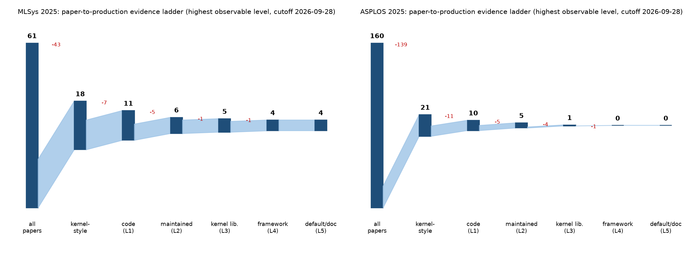
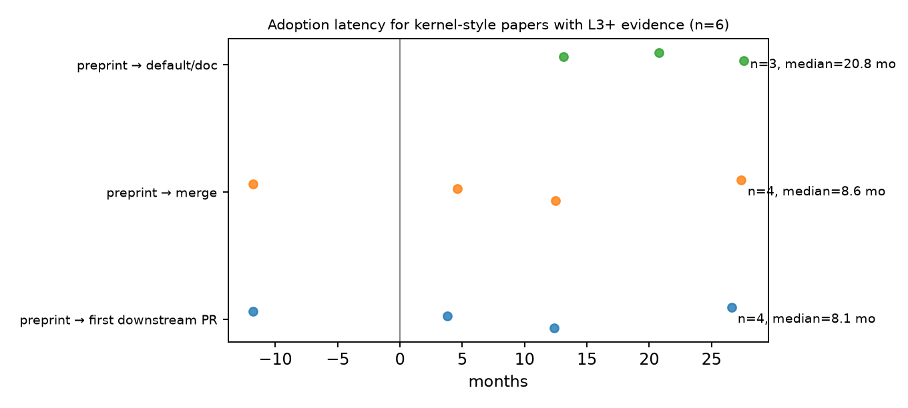

# From paper to production: MLSys 2025 and ASPLOS 2025

**Deep follow-up, WP-C. Cutoff 2026-09-28.** Census `data/paper-census.csv` (all 61 MLSys 2025 papers; all 160 papers in the official ASPLOS 2025 proceedings, ACM Vol. 1 and 2), evaluation audit and deployment ladder `data/paper-deployment-ladder.csv`, funnel `data/paper-funnel.csv`. Classification used the broad definition of kernel-style optimization in `studies/04-paper-to-production.md`; every positive/ambiguous paper was second-passed and disagreements adjudicated (model–model agreement, not human IRR). The ladder records the **highest publicly observable** evidence — a lower bound on deployment.

## Executive summary

1. **Kernel-style work is a minority of both venues:** 18<!-- claim:data/c-census-summary.csv::venue=MLSys 2025&measure=kernel_style&category=yes::n::int --> of 61<!-- claim:data/c-census-summary.csv::venue=MLSys 2025&measure=kernel_style&category=yes::denominator::int --> MLSys 2025 papers (29.5<!-- claim:data/c-census-summary.csv::venue=MLSys 2025&measure=kernel_style&category=yes::share::pct1 -->%) and 21<!-- claim:data/c-census-summary.csv::venue=ASPLOS 2025&measure=kernel_style&category=yes::n::int --> of 160<!-- claim:data/c-census-summary.csv::venue=ASPLOS 2025&measure=kernel_style&category=yes::denominator::int --> ASPLOS 2025 papers (13.1<!-- claim:data/c-census-summary.csv::venue=ASPLOS 2025&measure=kernel_style&category=yes::share::pct1 -->%) propose a kernel-style optimization.
2. **Code release is common; maintenance and adoption are not.** Of 39<!-- claim:data/paper-funnel.csv::venue=both&stage=kernel_style::n::int --> kernel-style papers, 21<!-- claim:data/paper-funnel.csv::venue=both&stage=reached_L1::n::int --> released code (L1+), 11<!-- claim:data/paper-funnel.csv::venue=both&stage=reached_L2::n::int --> show maintenance after publication (L2+), 6<!-- claim:data/paper-funnel.csv::venue=both&stage=reached_L3::n::int --> reached a kernel library or beyond (L3+), 4<!-- claim:data/paper-funnel.csv::venue=both&stage=reached_L4::n::int --> were merged into a serving/training framework (L4+) and 4<!-- claim:data/paper-funnel.csv::venue=both&stage=reached_L5::n::int --> are default, documented or release-noted (L5).
3. **Observable framework adoption is 10.3<!-- claim:data/paper-funnel.csv::venue=both&stage=reached_L4::share::pct1 -->% of kernel-style papers** (Wilson 95% [4.1–23.6%]), and 2<!-- claim:data/paper-funnel.csv::venue=both&stage=L4plus_framework_code_before_publication::n::int --> of those 4<!-- claim:data/paper-funnel.csv::venue=both&stage=reached_L4::n::int --> were in a framework *before* the paper/preprint appeared (the paper documents an already-deployed system); only 2<!-- claim:data/paper-funnel.csv::venue=both&stage=L4plus_adopted_after_publication::n::int --> show paper → framework flow. Self-reported production deployment (S) appears in 3<!-- claim:data/paper-funnel.csv::venue=both&stage=self_reported_production_S::n::int --> papers and is tracked separately.
4. **Evaluation is narrow in hardware and often thin on correctness:** among kernel-style papers, 65.8<!-- claim:data/paper-eval-audit-summary.csv::venue=both&field=hardware_vendors&value=single_vendor::share::pct1 -->% evaluate on a single hardware vendor, 38.5<!-- claim:data/paper-eval-audit-summary.csv::venue=both&field=n_hardware_targets&value=single_target::share::pct1 -->% on a single hardware target, 15.4<!-- claim:data/paper-eval-audit-summary.csv::venue=both&field=eval_scope&value=microbenchmark_only::share::pct1 -->% only at kernel/operator level, and 41.0<!-- claim:data/paper-eval-audit-summary.csv::venue=both&field=correctness_validation&value=none_reported::share::pct1 -->% report no correctness/accuracy validation.
5. **The negative check found adoption outside the kernel-style set:** 3<!-- claim:data/paper-funnel.csv::venue=both&stage=negatives_with_L3plus_evidence::n::int --> of 40<!-- claim:data/paper-funnel.csv::venue=both&stage=negatives_with_L3plus_evidence::denominator::int --> randomly sampled non-kernel-style papers had verified L3+ evidence, and 0<!-- claim:data/paper-funnel.csv::venue=both&stage=negatives_missed_kernel_style_with_L3plus::n::int --> of those were judged missed kernel-style papers on verification (estimated missed kernel-style adoption ≤ 8.8% of negatives, Wilson upper bound). Production uptake of *system* ideas (caching, parallelism, optimizers) is real but outside the kernel-style funnel.

## C1 — census

| Venue | Papers | Kernel-style | Ambiguous | Not kernel-style |
|---|---:|---:|---:|---:|
| MLSys 2025 | 61<!-- claim:data/c-census-summary.csv::venue=MLSys 2025&measure=kernel_style&category=yes::denominator::int --> | 18<!-- claim:data/c-census-summary.csv::venue=MLSys 2025&measure=kernel_style&category=yes::n::int --> | 0 | 43<!-- claim:data/c-census-summary.csv::venue=MLSys 2025&measure=kernel_style&category=no::n::int --> |
| ASPLOS 2025 | 160<!-- claim:data/c-census-summary.csv::venue=ASPLOS 2025&measure=kernel_style&category=yes::denominator::int --> | 21<!-- claim:data/c-census-summary.csv::venue=ASPLOS 2025&measure=kernel_style&category=yes::n::int --> | 2<!-- claim:data/c-census-summary.csv::venue=ASPLOS 2025&measure=kernel_style&category=ambiguous::n::int --> | 137<!-- claim:data/c-census-summary.csv::venue=ASPLOS 2025&measure=kernel_style&category=no::n::int --> |

| Category (kernel-style papers) | MLSys | ASPLOS |
|---|---:|---:|
| compiler_dsl | 2<!-- claim:data/c-census-summary.csv::venue=MLSys 2025&measure=category&category=compiler_dsl::n::int --> | 7<!-- claim:data/c-census-summary.csv::venue=ASPLOS 2025&measure=category&category=compiler_dsl::n::int --> |
| fusion_family | 1<!-- claim:data/c-census-summary.csv::venue=MLSys 2025&measure=category&category=fusion_family::n::int --> | 1<!-- claim:data/c-census-summary.csv::venue=ASPLOS 2025&measure=category&category=fusion_family::n::int --> |
| kernel | 7<!-- claim:data/c-census-summary.csv::venue=MLSys 2025&measure=category&category=kernel::n::int --> | 7<!-- claim:data/c-census-summary.csv::venue=ASPLOS 2025&measure=category&category=kernel::n::int --> |
| precision_format | 4<!-- claim:data/c-census-summary.csv::venue=MLSys 2025&measure=category&category=precision_format::n::int --> | 1<!-- claim:data/c-census-summary.csv::venue=ASPLOS 2025&measure=category&category=precision_format::n::int --> |
| scheduling_layout | 4<!-- claim:data/c-census-summary.csv::venue=MLSys 2025&measure=category&category=scheduling_layout::n::int --> | 5<!-- claim:data/c-census-summary.csv::venue=ASPLOS 2025&measure=category&category=scheduling_layout::n::int --> |

Reading depth: full text was read for every MLSys paper and for ASPLOS papers with an open copy; 41<!-- claim:data/c-census-summary.csv::venue=ASPLOS 2025&measure=abstract_only&category=abstract_only::n::int --> ASPLOS papers had no reachable open copy (ACM DL blocks automated access) and were classified from the abstract and public descriptions; re-reading 45 other abstract-only papers from located full text changed 1 classification. Second pass on all yes/ambiguous papers: kernel-style agreement 72.5<!-- claim:data/paper-census-agreement.csv::field=kernel_style::percent_agreement::pct1 -->% (κ = 0.30<!-- claim:data/paper-census-agreement.csv::field=kernel_style::cohen_kappa::dec2 -->), category agreement 70.6<!-- claim:data/paper-census-agreement.csv::field=category::percent_agreement::pct1 -->% (κ = 0.63<!-- claim:data/paper-census-agreement.csv::field=category::cohen_kappa::dec2 -->); all disagreements were adjudicated. The low kernel-style κ reflects boundary cases (system papers whose key mechanism is a kernel), which is why every such case was adjudicated.

## C2 — evaluation audit of kernel-style papers

| Field | Value | MLSys | ASPLOS | Both |
|---|---|---:|---:|---:|
| eval_scope | both | 15<!-- claim:data/paper-eval-audit-summary.csv::venue=MLSys 2025&field=eval_scope&value=both::n::int -->/18 | 11<!-- claim:data/paper-eval-audit-summary.csv::venue=ASPLOS 2025&field=eval_scope&value=both::n::int -->/21 | 26<!-- claim:data/paper-eval-audit-summary.csv::venue=both&field=eval_scope&value=both::n::int -->/39 |
| eval_scope | end_to_end_only | 3<!-- claim:data/paper-eval-audit-summary.csv::venue=MLSys 2025&field=eval_scope&value=end_to_end_only::n::int -->/18 | 4<!-- claim:data/paper-eval-audit-summary.csv::venue=ASPLOS 2025&field=eval_scope&value=end_to_end_only::n::int -->/21 | 7<!-- claim:data/paper-eval-audit-summary.csv::venue=both&field=eval_scope&value=end_to_end_only::n::int -->/39 |
| eval_scope | microbenchmark_only | 0 | 6<!-- claim:data/paper-eval-audit-summary.csv::venue=ASPLOS 2025&field=eval_scope&value=microbenchmark_only::n::int -->/21 | 6<!-- claim:data/paper-eval-audit-summary.csv::venue=both&field=eval_scope&value=microbenchmark_only::n::int -->/39 |
| correctness_validation | both | 1<!-- claim:data/paper-eval-audit-summary.csv::venue=MLSys 2025&field=correctness_validation&value=both::n::int -->/18 | 0 | 1<!-- claim:data/paper-eval-audit-summary.csv::venue=both&field=correctness_validation&value=both::n::int -->/39 |
| correctness_validation | formal_or_exact | 1<!-- claim:data/paper-eval-audit-summary.csv::venue=MLSys 2025&field=correctness_validation&value=formal_or_exact::n::int -->/18 | 4<!-- claim:data/paper-eval-audit-summary.csv::venue=ASPLOS 2025&field=correctness_validation&value=formal_or_exact::n::int -->/21 | 5<!-- claim:data/paper-eval-audit-summary.csv::venue=both&field=correctness_validation&value=formal_or_exact::n::int -->/39 |
| correctness_validation | model_accuracy_eval | 9<!-- claim:data/paper-eval-audit-summary.csv::venue=MLSys 2025&field=correctness_validation&value=model_accuracy_eval::n::int -->/18 | 4<!-- claim:data/paper-eval-audit-summary.csv::venue=ASPLOS 2025&field=correctness_validation&value=model_accuracy_eval::n::int -->/21 | 13<!-- claim:data/paper-eval-audit-summary.csv::venue=both&field=correctness_validation&value=model_accuracy_eval::n::int -->/39 |
| correctness_validation | none_reported | 5<!-- claim:data/paper-eval-audit-summary.csv::venue=MLSys 2025&field=correctness_validation&value=none_reported::n::int -->/18 | 11<!-- claim:data/paper-eval-audit-summary.csv::venue=ASPLOS 2025&field=correctness_validation&value=none_reported::n::int -->/21 | 16<!-- claim:data/paper-eval-audit-summary.csv::venue=both&field=correctness_validation&value=none_reported::n::int -->/39 |
| correctness_validation | tolerance_vs_reference | 2<!-- claim:data/paper-eval-audit-summary.csv::venue=MLSys 2025&field=correctness_validation&value=tolerance_vs_reference::n::int -->/18 | 2<!-- claim:data/paper-eval-audit-summary.csv::venue=ASPLOS 2025&field=correctness_validation&value=tolerance_vs_reference::n::int -->/21 | 4<!-- claim:data/paper-eval-audit-summary.csv::venue=both&field=correctness_validation&value=tolerance_vs_reference::n::int -->/39 |
| baseline_versions_stated | no | 9<!-- claim:data/paper-eval-audit-summary.csv::venue=MLSys 2025&field=baseline_versions_stated&value=no::n::int -->/18 | 10<!-- claim:data/paper-eval-audit-summary.csv::venue=ASPLOS 2025&field=baseline_versions_stated&value=no::n::int -->/21 | 19<!-- claim:data/paper-eval-audit-summary.csv::venue=both&field=baseline_versions_stated&value=no::n::int -->/39 |
| baseline_versions_stated | partial | 8<!-- claim:data/paper-eval-audit-summary.csv::venue=MLSys 2025&field=baseline_versions_stated&value=partial::n::int -->/18 | 9<!-- claim:data/paper-eval-audit-summary.csv::venue=ASPLOS 2025&field=baseline_versions_stated&value=partial::n::int -->/21 | 17<!-- claim:data/paper-eval-audit-summary.csv::venue=both&field=baseline_versions_stated&value=partial::n::int -->/39 |
| baseline_versions_stated | yes | 1<!-- claim:data/paper-eval-audit-summary.csv::venue=MLSys 2025&field=baseline_versions_stated&value=yes::n::int -->/18 | 2<!-- claim:data/paper-eval-audit-summary.csv::venue=ASPLOS 2025&field=baseline_versions_stated&value=yes::n::int -->/21 | 3<!-- claim:data/paper-eval-audit-summary.csv::venue=both&field=baseline_versions_stated&value=yes::n::int -->/39 |
| public_code | no | 7<!-- claim:data/paper-eval-audit-summary.csv::venue=MLSys 2025&field=public_code&value=no::n::int -->/18 | 11<!-- claim:data/paper-eval-audit-summary.csv::venue=ASPLOS 2025&field=public_code&value=no::n::int -->/21 | 18<!-- claim:data/paper-eval-audit-summary.csv::venue=both&field=public_code&value=no::n::int -->/39 |
| public_code | yes | 11<!-- claim:data/paper-eval-audit-summary.csv::venue=MLSys 2025&field=public_code&value=yes::n::int -->/18 | 10<!-- claim:data/paper-eval-audit-summary.csv::venue=ASPLOS 2025&field=public_code&value=yes::n::int -->/21 | 21<!-- claim:data/paper-eval-audit-summary.csv::venue=both&field=public_code&value=yes::n::int -->/39 |
| claimed_production | no | 16<!-- claim:data/paper-eval-audit-summary.csv::venue=MLSys 2025&field=claimed_production&value=no::n::int -->/18 | 20<!-- claim:data/paper-eval-audit-summary.csv::venue=ASPLOS 2025&field=claimed_production&value=no::n::int -->/21 | 36<!-- claim:data/paper-eval-audit-summary.csv::venue=both&field=claimed_production&value=no::n::int -->/39 |
| claimed_production | yes | 2<!-- claim:data/paper-eval-audit-summary.csv::venue=MLSys 2025&field=claimed_production&value=yes::n::int -->/18 | 1<!-- claim:data/paper-eval-audit-summary.csv::venue=ASPLOS 2025&field=claimed_production&value=yes::n::int -->/21 | 3<!-- claim:data/paper-eval-audit-summary.csv::venue=both&field=claimed_production&value=yes::n::int -->/39 |

MLSys 2025: median hardware targets 2.0<!-- claim:data/paper-eval-audit-summary.csv::venue=MLSys 2025&field=n_hardware_targets&value=median::n::dec1 -->; single-target papers 38.9<!-- claim:data/paper-eval-audit-summary.csv::venue=MLSys 2025&field=n_hardware_targets&value=single_target::share::pct1 -->%.

ASPLOS 2025: median hardware targets 2.0<!-- claim:data/paper-eval-audit-summary.csv::venue=ASPLOS 2025&field=n_hardware_targets&value=median::n::dec1 -->; single-target papers 38.1<!-- claim:data/paper-eval-audit-summary.csv::venue=ASPLOS 2025&field=n_hardware_targets&value=single_target::share::pct1 -->%.

both: median hardware targets 2.0<!-- claim:data/paper-eval-audit-summary.csv::venue=both&field=n_hardware_targets&value=median::n::dec1 -->; single-target papers 38.5<!-- claim:data/paper-eval-audit-summary.csv::venue=both&field=n_hardware_targets&value=single_target::share::pct1 -->%.

## C3 — deployment ladder

| Stage | MLSys 2025 | ASPLOS 2025 | Both |
|---|---:|---:|---:|
| all papers | 61<!-- claim:data/paper-funnel.csv::venue=MLSys 2025&stage=all_papers::n::int -->/61 | 160<!-- claim:data/paper-funnel.csv::venue=ASPLOS 2025&stage=all_papers::n::int -->/160 | 221<!-- claim:data/paper-funnel.csv::venue=both&stage=all_papers::n::int -->/221 |
| kernel-style | 18<!-- claim:data/paper-funnel.csv::venue=MLSys 2025&stage=kernel_style::n::int -->/61 | 21<!-- claim:data/paper-funnel.csv::venue=ASPLOS 2025&stage=kernel_style::n::int -->/160 | 39<!-- claim:data/paper-funnel.csv::venue=both&stage=kernel_style::n::int -->/221 |
| L1+ code released | 11<!-- claim:data/paper-funnel.csv::venue=MLSys 2025&stage=reached_L1::n::int -->/18 | 10<!-- claim:data/paper-funnel.csv::venue=ASPLOS 2025&stage=reached_L1::n::int -->/21 | 21<!-- claim:data/paper-funnel.csv::venue=both&stage=reached_L1::n::int -->/39 |
| L2+ maintained | 6<!-- claim:data/paper-funnel.csv::venue=MLSys 2025&stage=reached_L2::n::int -->/18 | 5<!-- claim:data/paper-funnel.csv::venue=ASPLOS 2025&stage=reached_L2::n::int -->/21 | 11<!-- claim:data/paper-funnel.csv::venue=both&stage=reached_L2::n::int -->/39 |
| L3+ kernel library | 5<!-- claim:data/paper-funnel.csv::venue=MLSys 2025&stage=reached_L3::n::int -->/18 | 1<!-- claim:data/paper-funnel.csv::venue=ASPLOS 2025&stage=reached_L3::n::int -->/21 | 6<!-- claim:data/paper-funnel.csv::venue=both&stage=reached_L3::n::int -->/39 |
| L4+ framework | 4<!-- claim:data/paper-funnel.csv::venue=MLSys 2025&stage=reached_L4::n::int -->/18 | 0<!-- claim:data/paper-funnel.csv::venue=ASPLOS 2025&stage=reached_L4::n::int -->/21 | 4<!-- claim:data/paper-funnel.csv::venue=both&stage=reached_L4::n::int -->/39 |
| L5 default/documented | 4<!-- claim:data/paper-funnel.csv::venue=MLSys 2025&stage=reached_L5::n::int -->/18 | 0<!-- claim:data/paper-funnel.csv::venue=ASPLOS 2025&stage=reached_L5::n::int -->/21 | 4<!-- claim:data/paper-funnel.csv::venue=both&stage=reached_L5::n::int -->/39 |
| S self-reported production | 2<!-- claim:data/paper-funnel.csv::venue=MLSys 2025&stage=self_reported_production_S::n::int -->/18 | 1<!-- claim:data/paper-funnel.csv::venue=ASPLOS 2025&stage=self_reported_production_S::n::int -->/21 | 3<!-- claim:data/paper-funnel.csv::venue=both&stage=self_reported_production_S::n::int -->/39 |
| negative sample with L3+ (of sampled) | 3<!-- claim:data/paper-funnel.csv::venue=MLSys 2025&stage=negatives_with_L3plus_evidence::n::int -->/20 | 0<!-- claim:data/paper-funnel.csv::venue=ASPLOS 2025&stage=negatives_with_L3plus_evidence::n::int -->/20 | 3<!-- claim:data/paper-funnel.csv::venue=both&stage=negatives_with_L3plus_evidence::n::int -->/40 |
| … of which missed kernel-style papers | 0<!-- claim:data/paper-funnel.csv::venue=MLSys 2025&stage=negatives_missed_kernel_style_with_L3plus::n::int -->/20 | 0<!-- claim:data/paper-funnel.csv::venue=ASPLOS 2025&stage=negatives_missed_kernel_style_with_L3plus::n::int -->/20 | 0<!-- claim:data/paper-funnel.csv::venue=both&stage=negatives_missed_kernel_style_with_L3plus::n::int -->/40 |

*Observation:* highest observable evidence level per kernel-style paper. *Interpretation:* the pipeline leaks mostly between "code released" and "used by a library or framework"; this is a conservative lower bound because renamed or reimplemented techniques can be missed.

Every L3–L5 label with its evidence (URL | quote):

| Paper | Venue | Role | Level | Evidence |
|---|---|---|---|---|
| LeanAttention: Hardware-Aware Scalable Attention Mechanism for the Dec | MLSys 2025 | positive | L5 | https://github.com/sgl-project/sglang/releases/tag/v0.5.19 / Lean attention on AMD... turns on by itself where it helps, and SGLANG_DISABLE_LEAN_ATTENTION=1 turns it off. |
| APOLLO: SGD-like Memory, AdamW-level Performance | MLSys 2025 | negative_check | L5 | https://huggingface.co/docs/transformers/main/en/optimizers#apollo / "APOLLO — apollo-torch — apollo_adamw — Memory-efficient full-param via random projections" |
| FlexAttention: A Programming Model for Generating Fused Attention Vari | MLSys 2025 | positive | L5 | https://docs.pytorch.org/docs/2.14/nn.attention.flex_attention.html / "Created On: Jul 16, 2024" and documents torch.nn.attention.flex_attention.flex_attention |
| Marconi: Prefix Caching for the Era of Hybrid LLMs | MLSys 2025 | negative_check | L5 | https://github.com/vllm-project/vllm/releases/tag/v0.24.0 / "Marconi-style admission policy for hybrid cache (#37898)" (2026-06-29) |
| Training Ultra Long Context Language Model with Fully Pipelined Distri | MLSys 2025 | negative_check | L5 | https://github.com/deepspeedai/DeepSpeed/blob/master/docs/_tutorials/ulysses-offload.md / "ds_sequence_parallel_fpdt: Boolean indicating whether to use FPDT, default is false" |
| FlashInfer: Efficient and Customizable Attention Engine for LLM Infere | MLSys 2025 | positive | L5 | https://docs.sglang.io/docs/advanced_features/attention_backend / "SGLang supports a large variety of attention backends" and lists FlashInfer in the support matrix |
| QServe:W4A8KV4 Quantization and System Co-design for Efficient LLM Ser | MLSys 2025 | positive | L5 | https://github.com/sgl-project/sglang/releases/tag/v0.4.7 / "[1/2] Support Qserve" in SGLang v0.4.7 release notes (2025-06-11) |
| POD-Attention: Unlocking Full Prefill-Decode Overlap for Faster LLM In | ASPLOS 2025 | positive | L3 | https://github.com/flashinfer-ai/flashinfer/pull/858 / "Adds POD-Attention kernel (https://arxiv.org/abs/2410.18038) with all necessary files. Both AOT and JIT are supported." |
| COMET: Fine-grained Computation-communication Overlapping for Mixture- | MLSys 2025 | positive | L3 | https://github.com/bytedance/flux/blob/main/README.md / "[2025/03/10] We have released COMET" in Flux, a "GPU Kernel Library" |

## C4 — adoption latency

| Paper | Level | Preprint | First downstream PR | Merge | Default/doc | Months preprint→merge |
|---|---|---|---|---|---|---:|
| POD-Attention: Unlocking Full Prefill-Decode Overlap for Fas | L3 | 2024-10-23 | 2025-02-17 | 2025-03-13 |  | 4.6 |
| LeanAttention: Hardware-Aware Scalable Attention Mechanism f | L5 | 2024-05-17 | 2026-08-04 | 2026-08-29 | 2026-09-05 | 27.4 |
| FlexAttention: A Programming Model for Generating Fused Atte | L5 |  | 2024-06-15 | 2024-06-17 | 2024-07-16 | n/a |
| FlashInfer: Efficient and Customizable Attention Engine for  | L5 | 2025-01-02 | 2024-01-08 | 2024-01-08 | 2026-09-28 | -11.8 |
| COMET: Fine-grained Computation-communication Overlapping fo | L3 | 2025-02-27 |  |  |  | n/a |
| QServe:W4A8KV4 Quantization and System Co-design for Efficie | L5 | 2024-05-07 | 2025-05-20 | 2025-05-22 | 2025-06-11 | 12.5 |

## Negative-sample check (missed adoption)

Twenty random non-kernel-style papers per venue received the same systematic adoption search. Papers with L3+ evidence are listed in the evidence table above with role `negative_check`; they were reviewed to see whether the census had missed a kernel-style contribution. They are reported separately and are **not** added to the kernel-style funnel.

## Limitations

- Two venues, one year; results do not represent OSDI/SOSP/ISCA/MICRO or earlier cohorts with longer adoption windows.
- The ladder is a lower bound: renamed, reimplemented or privately adopted techniques are invisible; downstream searches used HEAD snapshots (2026-09-29) plus PR search, with hits dated by their introducing PR.
- 41 ASPLOS papers were classified from abstracts because no open full text was reachable.
- Self-reported production (S) is not verified and is never counted as observable adoption.

