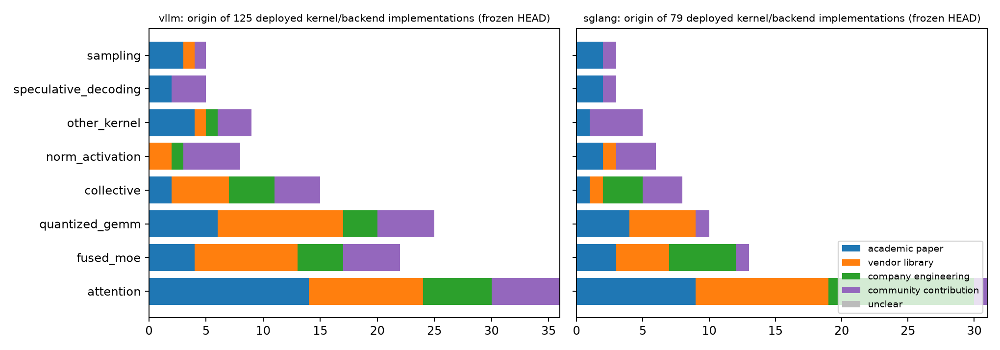

# Where deployed kernels come from: reverse provenance in vLLM and SGLang

**Deep follow-up, WP-D.** Enumeration at the frozen HEADs (vLLM `7230dfea501b`, SGLang `79cafec013d0`). Records: `data/production-kernel-provenance.csv`; aggregates `data/d-provenance-summary.csv`. Each record was verified from code, licence/"adapted from" comments, vendored sources, dependency pins, docs and the introducing PR; a blinded second pass re-derived the provenance class and disagreements were adjudicated.

## Executive summary

1. **204<!-- claim:data/d-provenance-summary.csv::repo=both&scope=all&provenance_class=academic_paper::denominator::int --> deployed kernel/backend implementations** were verified (125<!-- claim:data/d-provenance-summary.csv::repo=vllm&scope=all&provenance_class=academic_paper::denominator::int --> vLLM, 79<!-- claim:data/d-provenance-summary.csv::repo=sglang&scope=all&provenance_class=academic_paper::denominator::int --> SGLang), well above the 40-family floor.
2. **Only 28.9<!-- claim:data/d-provenance-summary.csv::repo=both&scope=all&provenance_class=academic_paper::share::pct1 -->% trace to an academic paper** (95% CI [23.5–34.8%]); vendor libraries account for 29.4<!-- claim:data/d-provenance-summary.csv::repo=both&scope=all&provenance_class=vendor_library::share::pct1 -->%, non-vendor company engineering 18.6<!-- claim:data/d-provenance-summary.csv::repo=both&scope=all&provenance_class=company_engineering::share::pct1 -->%, and in-repo community work 23.0<!-- claim:data/d-provenance-summary.csv::repo=both&scope=all&provenance_class=community_contribution::share::pct1 -->%.
3. **Among implementations that are on by default somewhere,** academic provenance is 26.7<!-- claim:data/d-provenance-summary.csv::repo=vllm&scope=default&provenance_class=academic_paper::share::pct1 -->% in vLLM (n=60<!-- claim:data/d-provenance-summary.csv::repo=vllm&scope=default&provenance_class=academic_paper::denominator::int -->) and 40.9<!-- claim:data/d-provenance-summary.csv::repo=sglang&scope=default&provenance_class=academic_paper::share::pct1 -->% in SGLang (n=22<!-- claim:data/d-provenance-summary.csv::repo=sglang&scope=default&provenance_class=academic_paper::denominator::int -->).
4. **Attention is the paper-heavy family**: 23<!-- claim:data/d-provenance-summary.csv::repo=both&scope=operator:attention&provenance_class=academic_paper::n::int --> of 67<!-- claim:data/d-provenance-summary.csv::repo=both&scope=operator:attention&provenance_class=academic_paper::denominator::int --> attention implementations trace to papers, versus 7<!-- claim:data/d-provenance-summary.csv::repo=both&scope=operator:fused_moe&provenance_class=academic_paper::n::int --> of 35<!-- claim:data/d-provenance-summary.csv::repo=both&scope=operator:fused_moe&provenance_class=academic_paper::denominator::int --> fused-MoE and 3<!-- claim:data/d-provenance-summary.csv::repo=both&scope=operator:collective&provenance_class=academic_paper::n::int --> of 23<!-- claim:data/d-provenance-summary.csv::repo=both&scope=operator:collective&provenance_class=academic_paper::denominator::int --> collective implementations.
5. **Provenance judgements are moderately stable:** the two independent passes agreed on 76.5<!-- claim:data/provenance-agreement.csv::field=provenance_class::percent_agreement::pct1 -->% of records (κ = 0.69<!-- claim:data/provenance-agreement.csv::field=provenance_class::cohen_kappa::dec2 -->); on paper-versus-not the agreement was 88.2<!-- claim:data/provenance-agreement.csv::field=academic_paper_vs_other::percent_agreement::pct1 -->%.

## Provenance by repository

| Class | vLLM all | vLLM default | SGLang all | SGLang default |
|---|---:|---:|---:|---:|
| academic_paper | 35<!-- claim:data/d-provenance-summary.csv::repo=vllm&scope=all&provenance_class=academic_paper::n::int --> | 16<!-- claim:data/d-provenance-summary.csv::repo=vllm&scope=default&provenance_class=academic_paper::n::int --> | 24<!-- claim:data/d-provenance-summary.csv::repo=sglang&scope=all&provenance_class=academic_paper::n::int --> | 9<!-- claim:data/d-provenance-summary.csv::repo=sglang&scope=default&provenance_class=academic_paper::n::int --> |
| vendor_library | 39<!-- claim:data/d-provenance-summary.csv::repo=vllm&scope=all&provenance_class=vendor_library::n::int --> | 23<!-- claim:data/d-provenance-summary.csv::repo=vllm&scope=default&provenance_class=vendor_library::n::int --> | 21<!-- claim:data/d-provenance-summary.csv::repo=sglang&scope=all&provenance_class=vendor_library::n::int --> | 4<!-- claim:data/d-provenance-summary.csv::repo=sglang&scope=default&provenance_class=vendor_library::n::int --> |
| company_engineering | 19<!-- claim:data/d-provenance-summary.csv::repo=vllm&scope=all&provenance_class=company_engineering::n::int --> | 4<!-- claim:data/d-provenance-summary.csv::repo=vllm&scope=default&provenance_class=company_engineering::n::int --> | 19<!-- claim:data/d-provenance-summary.csv::repo=sglang&scope=all&provenance_class=company_engineering::n::int --> | 2<!-- claim:data/d-provenance-summary.csv::repo=sglang&scope=default&provenance_class=company_engineering::n::int --> |
| community_contribution | 32<!-- claim:data/d-provenance-summary.csv::repo=vllm&scope=all&provenance_class=community_contribution::n::int --> | 17<!-- claim:data/d-provenance-summary.csv::repo=vllm&scope=default&provenance_class=community_contribution::n::int --> | 15<!-- claim:data/d-provenance-summary.csv::repo=sglang&scope=all&provenance_class=community_contribution::n::int --> | 7<!-- claim:data/d-provenance-summary.csv::repo=sglang&scope=default&provenance_class=community_contribution::n::int --> |
| unclear | 0<!-- claim:data/d-provenance-summary.csv::repo=vllm&scope=all&provenance_class=unclear::n::int --> | 0<!-- claim:data/d-provenance-summary.csv::repo=vllm&scope=default&provenance_class=unclear::n::int --> | 0<!-- claim:data/d-provenance-summary.csv::repo=sglang&scope=all&provenance_class=unclear::n::int --> | 0<!-- claim:data/d-provenance-summary.csv::repo=sglang&scope=default&provenance_class=unclear::n::int --> |

*Observation:* verified implementations per operator class, coloured by origin. *Interpretation:* papers seed the attention stack (FlashAttention, FlashInfer, PagedAttention-style layouts, Marlin-style quantized GEMM), while MoE, quantized GEMM paths, collectives and fused norms are dominated by vendor libraries, company releases and in-repo engineering.

## Implementation records

| Repo | Operator | Implementation | Origin | Upstream / vendored | Cited paper/system | Status | Introduced |
|---|---|---|---|---|---|---|---|
| sglang | attention | MiniMax sparse backend | company_engineering | in-repo MiniMax sparse kernels | MiniMax sparse attention | default | #28715 (2026-07-11) |
| sglang | attention | aiter attention backend | vendor_library | ROCm/aiter optional package | AITER | default | #4178 (2025-03-07) |
| sglang | attention | ascend attention backend | vendor_library | Ascend/torch_npu/sgl_kernel_npu | Ascend NPU kernels | selectable | #13359 (2025-12-04) |
| sglang | attention | cutedsl_mla attention backend | academic_paper | FlashInfer CuTe DSL / nvidia-cutlass-dsl | FlashInfer | selectable | #32612 (2026-07-28) |
| sglang | attention | dsa attention backend | company_engineering | in-repo DSA kernels; optional FlashInfer | DeepSeek sparse attention | selectable | #25821 (2026-05-20) |
| sglang | attention | dsv4 attention backend | company_engineering | in-repo JIT kernels; DeepGEMM/FlashInfer | DeepSeek-V4 sparse/compressed attention | selectable | #23882 (2026-05-07) |
| sglang | attention | dsv4 trtllm-gen backend | vendor_library | FlashInfer trtllm-gen sparse MLA | TensorRT-LLM / DeepSeek-V4 | selectable | #30805 (2026-09-09) |
| sglang | attention | fa3 attention backend | academic_paper | pip flash-attn-4; CMake FetchContent sgl | FlashAttention / FlashAttention-3 | default | #4680 (2025-03-23) |
| sglang | attention | fa4 attention backend | academic_paper | pip dependency flash-attn-4 | FlashAttention-4 | default | #4680 (2025-03-23) |
| sglang | attention | flashinfer MLA attention backend | academic_paper | pip dependency flashinfer_python[cu13]== | FlashInfer MLA | default | #3785 (2025-02-24) |
| sglang | attention | flashinfer attention backend | academic_paper | pip dependency flashinfer_python[cu13]== | FlashInfer | default | #1547 (2024-09-30) |
| sglang | attention | flashmla attention backend | company_engineering | sgl_kernel.flash_mla / DeepSeek FlashMLA | FlashMLA | selectable | #4472 (2025-03-17) |
| sglang | attention | flex_attention backend | company_engineering | PyTorch FlexAttention | PyTorch FlexAttention | selectable | #9947 (2025-09-19) |
| sglang | attention | hpc_ops attention backend | company_engineering | Tencent hpc-ops package | HPC-Ops | selectable | #30540 (2026-07-22) |
| sglang | attention | intel_amx attention backend | vendor_library | in-repo CPU/AMX backend | Intel AMX CPU attention | selectable | #6408 (2025-05-31) |
| sglang | attention | intel_xpu attention backend | vendor_library | Intel XPU / sgl_kernel XPU | Intel XPU / AMX sgl-kernel attention | selectable | #10656 (2025-10-21) |
| sglang | attention | linear_attn_backend=cutedsl for KDA | vendor_library | in-repo wrapper over nvidia-cutlass-dsl/ | NVIDIA CUTLASS CuTe DSL | selectable | #21203 (2026-03-25) |
| sglang | attention | linear_attn_backend=flashinfer for GDN | academic_paper | FlashInfer GDN kernels | FlashInfer GDN | selectable | #18361 (2026-03-03) |
| sglang | attention | linear_attn_backend=flashinfer for KDA | academic_paper | FlashInfer kda_decode.recurrent_kda | FlashInfer KDA | selectable | #30113 (2026-07-15) |
| sglang | attention | linear_attn_backend=triton for GDN | academic_paper | in-repo Triton/FLA kernels | flash-linear-attention gated delta rule | selectable | #18622 (2026-02-25) |
| sglang | attention | linear_attn_backend=triton for KDA | academic_paper | in-repo Triton/FLA kernels | flash-linear-attention / Kimi Delta Atte | selectable | #18622 (2026-02-25) |
| sglang | attention | linear_attn_prefill_backend=flashkda | company_engineering | MoonshotAI/FlashKDA external package | FlashKDA | selectable | #29472 (2026-07-02) |
| sglang | attention | linear_attn_prefill_backend=nvidia_kda | vendor_library | vendored NVIDIA KDA prefill pipeline | NVIDIA KDA | selectable | #32541 (2026-08-04) |
| sglang | attention | nsa attention backend alias | company_engineering | deprecated in-repo re-export to DSA | NSA/DSA sparse attention | deprecated | #25821 (2026-05-20) |
| sglang | attention | qsa attention backend | company_engineering | in-repo QSA kernels plus FlashInfer/Flas | Qwen sparse attention | selectable | #37500 (2026-09-08) |
| sglang | attention | tokenspeed_mla attention backend | company_engineering | pip dependency tokenspeed_mla==0.1.8 | TokenSpeed MLA | selectable | #24925 (2026-05-13) |
| sglang | attention | torch_native attention backend | company_engineering | PyTorch scaled_dot_product_attention | PyTorch SDPA | default | #2241 (2024-12-01) |
| sglang | attention | triton attention backend | community_contribution | in-repo Triton kernels | LightLLM | default | #1547 (2024-09-30) |
| sglang | attention | trtllm_mha attention backend | vendor_library | FlashInfer bindings for TensorRT-LLM MHA | TensorRT-LLM | default | #8782 (2025-08-05) |
| sglang | attention | trtllm_mla attention backend | vendor_library | FlashInfer bindings for TensorRT-LLM MLA | TensorRT-LLM | selectable | #8632 (2025-07-31) |
| sglang | attention | wave attention backend | vendor_library | wave_lang kernel cache / in-repo wave_op | AMD Wave / wave-lang | selectable | #8660 (2025-08-13) |
| sglang | collective | custom_all_reduce | community_contribution | adapted from vLLM custom all-reduce | vLLM custom all-reduce | default | #2244 (2024-12-01) |
| sglang | collective | flashinfer token dispatcher | academic_paper | flashinfer.comm.MoeAlltoAll | FlashInfer MoeAlltoAll | selectable | #14668 (2026-01-24) |
| sglang | collective | flashinfer_allreduce_fusion | vendor_library | flashinfer.comm allreduce_fusion | TensorRT-LLM / MNNVL FlashInfer allreduc | default | #7621 (2025-07-03) |
| sglang | collective | moe_a2a_backend=deepep | company_engineering | pip dependency sgl-deep-ep==0.1.2 / deep | DeepEP | selectable | #8658 (2025-08-01) |
| sglang | collective | mooncake transfer backend | company_engineering | mooncake.engine TransferEngine | Mooncake | selectable | #17810 (2026-02-09) |
| sglang | collective | quick_all_reduce | community_contribution | in-repo quick reduce library | QuickReduce | selectable | #6619 (2025-07-25) |
| sglang | collective | torch_symm_mem | company_engineering | torch.distributed._symmetric_memory | PyTorch symmetric_memory | selectable | #12506 (2025-11-03) |
| sglang | collective | triton_symm_mem_ag | community_contribution | in-repo Triton multimem.st all-gather | none found | selectable | #29223 (2026-06-27) |
| sglang | fused_moe | moe_a2a_backend=megamoe | company_engineering | DeepGEMM mega_moe_pre_dispatch/fp8_fp4_m | DeepGEMM MegaMoE | selectable | #23882 (2026-05-07) |
| sglang | fused_moe | moe_runner_backend=aiter | vendor_library | ROCm/aiter fused_moe | AITER | selectable | #23597 (2026-04-30) |
| sglang | fused_moe | moe_runner_backend=cutlass | vendor_library | sgl_kernel CUTLASS grouped GEMM kernels | CUTLASS | selectable | #5694 (2025-05-16) |
| sglang | fused_moe | moe_runner_backend=deep_gemm | company_engineering | pip dependency sgl-deep-gemm==0.2.0 | DeepGEMM | selectable | #11211 (2025-10-07) |
| sglang | fused_moe | moe_runner_backend=flashinfer_cutedsl | academic_paper | FlashInfer CuteDSL grouped_gemm_nt_maske | FlashInfer CuteDSL MoE | selectable | #21339 (2026-04-10) |
| sglang | fused_moe | moe_runner_backend=flashinfer_cutlass | vendor_library | FlashInfer cutlass_fused_moe | CUTLASS / FlashInfer | selectable | #28211 (2026-06-26) |
| sglang | fused_moe | moe_runner_backend=flashinfer_megamoe | academic_paper | FlashInfer moe_ep.MoEEpMegaLayer; DeepGE | FlashInfer MegaMOE | selectable | #31470 (2026-09-10) |
| sglang | fused_moe | moe_runner_backend=flashinfer_trtllm | vendor_library | FlashInfer fused_moe TRTLLM kernels | TensorRT-LLM / FlashInfer | selectable | #15151 (2026-01-07) |
| sglang | fused_moe | moe_runner_backend=hpc_ops | company_engineering | Tencent hpc-ops package | HPC-Ops | selectable | #30541 (2026-07-24) |
| sglang | fused_moe | moe_runner_backend=humming | company_engineering | pip dependency humming-kernels[cu13]==0. | Humming kernels | selectable | #23754 (2026-07-14) |
| sglang | fused_moe | moe_runner_backend=marlin | academic_paper | Marlin kernels in sglang.kernels.jit/csr | Marlin | selectable | #14554 (2025-12-10) |
| sglang | fused_moe | moe_runner_backend=triton | community_contribution | adapted from vLLM plus in-repo Triton ke | vLLM fused MoE | default | #23019 (2026-04-17) |
| sglang | fused_moe | native fused_moe | company_engineering | in-repo PyTorch reference based on gpt-f | PyTorch gpt-fast / DeepSeek-V2 | selectable | #2563 (2024-12-24) |
| sglang | norm_activation | activation AITER backend | vendor_library | ROCm/aiter silu_and_mul | AITER | selectable | #30044 (2026-07-10) |
| sglang | norm_activation | activation AOT backend | community_contribution | sglang-kernel AOT wheel | none found | default | #30044 (2026-07-10) |
| sglang | norm_activation | activation JIT backend | community_contribution | in-repo JIT CUDA kernels | none found | default | #32148 (2026-07-23) |
| sglang | norm_activation | layernorm AOT backend | academic_paper | sglang-kernel AOT wheel | FlashInfer | default | #32648 (2026-07-29) |
| sglang | norm_activation | layernorm JIT backend | community_contribution | in-repo JIT CUDA kernels | none found | selectable | #32148 (2026-07-23) |
| sglang | norm_activation | rotary/rope kernels | academic_paper | in-repo JIT/Triton kernels | RoPE | selectable | #32072 (2026-07-23) |
| sglang | other_kernel | LoRA SGMV and chunked GEMM | community_contribution | in-repo JIT/Triton LoRA kernels | none found | selectable | #32072 (2026-07-23) |
| sglang | other_kernel | causal_conv1d kernels | academic_paper | in-repo Triton/JIT and sgl_kernel_npu ke | Mamba | default | #30795 (2026-07-15) |
| sglang | other_kernel | diffusion norm/rope/activation/attention ops | community_contribution | in-repo JIT/Triton diffusion kernels | diffusion transformer serving | selectable | #30044 (2026-07-10) |
| sglang | other_kernel | kv_canary plan/verify/write | community_contribution | in-repo Triton kernels | KV Canary | experimental | #32045 (2026-07-22) |
| sglang | other_kernel | reshape/cache/kv-index kernels | community_contribution | in-repo sglang kernels | Paged KV cache | default | #30044 (2026-07-10) |
| sglang | quantized_gemm | AOT fp8_gemm | vendor_library | sglang-kernel AOT with CUTLASS FetchCont | CUTLASS | default | #32648 (2026-07-29) |
| sglang | quantized_gemm | AOT int8_gemm | vendor_library | sglang-kernel AOT with CUTLASS FetchCont | CUTLASS | selectable | #32648 (2026-07-29) |
| sglang | quantized_gemm | JIT fp8_blockwise_scaled_mm | vendor_library | in-repo JIT kernel with CUTLASS dependen | CUTLASS | selectable | #32015 (2026-07-22) |
| sglang | quantized_gemm | awq linear | academic_paper | sgl_kernel AWQ dequantize or Triton fall | AWQ | selectable | #21126 (2026-04-30) |
| sglang | quantized_gemm | awq_marlin linear | academic_paper | Marlin JIT kernels | AWQ / Marlin | selectable | #21126 (2026-04-30) |
| sglang | quantized_gemm | bitsandbytes quantizer | academic_paper | bitsandbytes optional dependency | QLoRA, arXiv:2305.14314 | selectable | #15325 (2026-01-20) |
| sglang | quantized_gemm | gptq_marlin linear | academic_paper | Marlin JIT kernels | GPTQ / Marlin | selectable | #26402 (2026-05-28) |
| sglang | quantized_gemm | modelopt_fp4/nvfp4_online | vendor_library | NVIDIA ModelOpt / NVFP4; FlashInfer fp4  | NVIDIA ModelOpt | selectable | #2792 (2025-01-08) |
| sglang | quantized_gemm | quark quantized linear/MoE | vendor_library | AMD Quark quantizer | AMD Quark | selectable | #9049 (2025-08-17) |
| sglang | quantized_gemm | w8a8_block_int8_matmul | community_contribution | in-repo Triton kernel | none found | selectable | #3730 (2025-02-24) |
| sglang | sampling | sampling_backend=flashinfer | academic_paper | flashinfer.sampling | FlashInfer | default | #1168 (2024-08-21) |
| sglang | sampling | sampling_backend=pytorch | community_contribution | torch.multinomial/topk fallback | PyTorch | default | #1168 (2024-08-21) |
| sglang | sampling | sgl_kernel top-k/top-p renorm | academic_paper | sglang-kernel AOT sampling kernels | FlashInfer | default | #30044 (2026-07-10) |
| sglang | speculative_decoding | classic speculative_sampling kernel | community_contribution | in-repo Triton kernel | none found | selectable | #31582 (2026-07-18) |
| sglang | speculative_decoding | speculative tree kernels | academic_paper | in-repo JIT/AOT speculative kernels | EAGLE speculative decoding | default | #40033 (2026-09-17) |
| sglang | speculative_decoding | tree_speculative_sampling_target_only | academic_paper | in-repo JIT with FlashInfer dependency | FlashInfer speculative sampling | selectable | #40033 (2026-09-17) |
| vllm | attention | B12X / B12xPagedAttentionBackend | community_contribution | optional b12x Python package | B12X | selectable | 3c79b1a8bf71 (2026-08-13) |
| vllm | attention | CPU_ATTN / CPUAttentionBackend | community_contribution | in-repo CPU C++ kernels | none found | default | 4555143ea7fd (2025-06-04) |
| vllm | attention | CPU_MLA / AMX_MLA | community_contribution | in-repo CPU kernels | MLA / DeepSeek | default | 4f044b1d6796 (2025-03-25) |
| vllm | attention | CUTLASS_MLA / CutlassMLABackend | vendor_library | NVIDIA CUTLASS fetched by CMake | CUTLASS MLA / FMHA | default | 41aa5784287f (2025-06-04) |
| vllm | attention | CUTLASS_MSA / TRITON_MSA / MINIMAX_M3_SPARSE | company_engineering | CMake FetchContent vllm-project/MSA plus | MSA sparse attention | selectable | 0a1c5034f5e4 (2026-06-16) |
| vllm | attention | FA4 CuteDSL private namespace | academic_paper | CMake FetchContent vllm-project/tml-fa4 | FlashAttention-4 | selectable | 6c5af09b3969 (2024-10-22) |
| vllm | attention | FLASHINFER / FlashInferBackend | academic_paper | pip dependency flashinfer-python==0.7.0  | FlashInfer | default | 206e2577fa9c (2025-03-08) |
| vllm | attention | FLASHINFER_MLA / FlashInferMLABackend | academic_paper | flashinfer-python | FlashInfer; MLA | default | 206e2577fa9c (2025-03-08) |
| vllm | attention | FLASHINFER_MLA_SPARSE / FlashInferMLASparseTRTLL | vendor_library | flashinfer-python TensorRT-LLM/CuteDSL s | FlashInfer; TensorRT-LLM | default | 206e2577fa9c (2025-03-08) |
| vllm | attention | FLASHINFER_MLA_SPARSE_SM120 / FlashInferMLASpars | academic_paper | flashinfer-python | FlashInfer | default | 206e2577fa9c (2025-03-08) |
| vllm | attention | FLASHINFER_MLA_SPARSE_SM90 / FlashInferMLASparse | academic_paper | flashinfer-python BatchMLAPagedAttention | FlashInfer | selectable | 206e2577fa9c (2025-03-08) |
| vllm | attention | FLASHMLA / FlashMLABackend | company_engineering | CMake FetchContent vllm-project/FlashMLA | FlashMLA | default | f95903909f07 (2025-02-26) |
| vllm | attention | FLASHMLA_SPARSE / FlashMLASparseBackend | company_engineering | CMake FetchContent vllm-project/FlashMLA | FlashMLA sparse MLA | default | f95903909f07 (2025-02-26) |
| vllm | attention | FLASH_ATTN / FlashAttentionBackend | academic_paper | CMake FetchContent vllm-project/flash-at | FlashAttention | default | 6c5af09b3969 (2024-10-22) |
| vllm | attention | FLASH_ATTN_MLA / FlashAttnMLABackend | academic_paper | vllm-project/flash-attention fork | FlashAttention; MLA | default | f95903909f07 (2025-02-26) |
| vllm | attention | FLASH_ATTN_MLA_SPARSE / FlashAttnMLASparseBacken | academic_paper | vllm-project/flash-attention fork | FlashAttention; sparse MLA | selectable | f95903909f07 (2025-02-26) |
| vllm | attention | FLEX_ATTENTION / FlexAttentionBackend | company_engineering | PyTorch FlexAttention | PyTorch FlexAttention | selectable | 482045ee77a4 (2024-07-02) |
| vllm | attention | FlashInferDecodeKernel.XQA / TRTLLM_GEN | vendor_library | flashinfer-python with TensorRT-LLM-gene | FlashInfer; TensorRT-LLM | default | 986537f1c3c8 (2025-04-21) |
| vllm | attention | FlashKDA external KDA kernels | vendor_library | CMake FetchContent vllm-project/FlashKDA | NVIDIA FlashKDA / Kimi Delta Attention | selectable | 7c6729b76959 (2026-07-29) |
| vllm | attention | GDN_ATTN / GDNAttentionBackend | academic_paper | vendored flash-linear-attention ops plus | Gated DeltaNet / Flash Linear Attention | selectable | e93f4cc9e374 (2025-09-11) |
| vllm | attention | HPC_ATTN / HpcAttentionBackend | company_engineering | Tencent hpc-ops | HPC attention | selectable | 2612ba9285d8 (2026-01-09) |
| vllm | attention | LINEAR_ATTN / BAILING_LINEAR_ATTN | academic_paper | vendored flash-linear-attention code | Flash Linear Attention | selectable | 6ade99eafa37 (2025-08-09) |
| vllm | attention | ROCM_AITER_FA / AiterFlashAttentionBackend | vendor_library | ROCm/aiter Python ops | FlashAttention | selectable | 8b6e1d639c66 (2025-06-18) |
| vllm | attention | ROCM_AITER_MLA / AiterMLABackend | vendor_library | ROCm/aiter | MLA / DeepSeek | default | 482045ee77a4 (2024-07-02) |
| vllm | attention | ROCM_AITER_MLA_SPARSE / ROCMAiterMLASparseBacken | vendor_library | ROCm/aiter | MLA sparse attention | default | 482045ee77a4 (2024-07-02) |
| vllm | attention | ROCM_AITER_TRITON_MLA / AiterTritonMLABackend | vendor_library | ROCm/aiter plus Triton | MLA / DeepSeek | selectable | 482045ee77a4 (2024-07-02) |
| vllm | attention | ROCM_AITER_UNIFIED_ATTN / RocmAiterUnifiedAttent | vendor_library | ROCm/aiter | none found | selectable | 482045ee77a4 (2024-07-02) |
| vllm | attention | ROCM_ATTN / RocmAttentionBackend | community_contribution | in-repo HIP/CUDA source for ROCm | PagedAttention | default | 1ef0d2efd07f (2024-09-13) |
| vllm | attention | TOKENSPEED_MLA / TokenspeedMLABackend | company_engineering | pip dependency tokenspeed-mla==0.1.8 | TokenSpeed MLA | selectable | 206e2577fa9c (2025-03-08) |
| vllm | attention | TRITON_ATTN / TritonAttentionBackend | academic_paper | in-repo Triton kernels | PagedAttention | default | f8a08cb90dc0 (2025-03-21) |
| vllm | attention | TRITON_FLASHINFER / TritonFlashInferBackend | academic_paper | in-repo Triton implementation compatible | FlashInfer | selectable | 482045ee77a4 (2024-07-02) |
| vllm | attention | TRITON_FLASH_ATTN / TritonFlashAttentionBackend | academic_paper | in-repo Triton kernels | FlashAttention | selectable | 482045ee77a4 (2024-07-02) |
| vllm | attention | TRITON_MLA / TritonMLABackend | community_contribution | in-repo Triton kernels | MLA / DeepSeek | default | 482045ee77a4 (2024-07-02) |
| vllm | attention | TURBOQUANT / TurboQuantAttentionBackend | academic_paper | in-repo TurboQuant Triton/FlyDSL ops | TurboQuant (Zandieh et al., ICLR 2026) | experimental | f4b42df04847 (2026-04-15) |
| vllm | attention | XPU_MLA_SPARSE / XPUMLASparseBackend | vendor_library | Intel torch.xpu and in-repo XPU backend | MLA sparse attention | default | 260024a3749f (2024-09-27) |
| vllm | attention | sparse_indexer_topk_backend=deep_select | community_contribution | CMake FetchContent vllm-project/DeepSele | DeepSelect | selectable | dd6a6e119062 (2026-02-07) |
| vllm | collective | AiterCustomAllreduce | vendor_library | ROCm/aiter CustomAllreduce | AITER CustomAllreduce | selectable | a0231b7c25d6 (2025-02-16) |
| vllm | collective | CustomAllreduce / custom_all_reduce.cu | community_contribution | in-repo CUDA IPC custom collective | none found | default | 63e7176f265b (2024-04-10) |
| vllm | collective | DCP A2A LSE reduce / Q gather / KV gather | community_contribution | in-repo CUDA symmetric-memory direct ker | none found | selectable | 63ac04a61e62 (2026-08-10) |
| vllm | collective | DeepEPHTPrepareAndFinalize / DeepEPHTAll2AllMana | company_engineering | deepseek-ai/DeepEP kernels installed out | DeepEP | selectable | 6266c57bae0f (2025-05-14) |
| vllm | collective | DeepEPLLPrepareAndFinalize / DeepEPLLAll2AllMana | company_engineering | deepseek-ai/DeepEP hybrid-ep branch | DeepEP | selectable | 6266c57bae0f (2025-05-14) |
| vllm | collective | DeepEPV2PrepareAndFinalize / DeepEPV2All2AllMana | company_engineering | deepseek-ai/DeepEP v2 | DeepEP v2 | selectable | 6266c57bae0f (2025-05-14) |
| vllm | collective | FlashInferAllReduce / MNNVL | academic_paper | flashinfer-python | FlashInfer allreduce | selectable | 0313cf854d87 (2025-08-22) |
| vllm | collective | FlashInferNVLinkOneSided/TwoSidedPrepareAndFinal | vendor_library | flashinfer-python MoE AllToAll kernels | TensorRT-LLM / MNNVL all-to-all | selectable | 4383f1532e87 (2026-03-22) |
| vllm | collective | FlashInferPcieIpcAllReduce | academic_paper | flashinfer-python | FlashInfer allreduce | selectable | a0231b7c25d6 (2025-02-16) |
| vllm | collective | MoonEPPrepareAndFinalize / MoonEPAll2AllManager | company_engineering | MoonshotAI/MoonEP optional package | MoonEP | experimental | 6266c57bae0f (2025-05-14) |
| vllm | collective | MoriPrepareAndFinalize / MoriAll2AllManager | vendor_library | mori optional Python package | MoRI / AMD AITER | selectable | 6266c57bae0f (2025-05-14) |
| vllm | collective | NixlEPPrepareAndFinalize | vendor_library | NIXL pip dependency | NIXL | selectable | 447c372ac504 (2026-04-23) |
| vllm | collective | PyNCCL symm_mem allreduce | vendor_library | NVIDIA NCCL/PyNCCL symmetric memory | NCCL symmetric memory | default | 0313cf854d87 (2025-08-22) |
| vllm | collective | QuickAllReduce / quickreduce | community_contribution | in-repo wrapper based on mk1-project/qui | none found | selectable | 0740e29b66ca (2025-06-27) |
| vllm | collective | custom_all_gather_reduce_scatter | community_contribution | in-repo CUDA custom collective | none found | selectable | 7c6729b76959 (2026-07-29) |
| vllm | fused_moe | AiterExperts | vendor_library | ROCm/aiter | none found | default | f080a8351151 (2025-11-10) |
| vllm | fused_moe | AiterMxfp8Experts | vendor_library | ROCm/aiter FlyDSL two-stage grouped GEMM | none found | default | 0a6a3a12906b (2026-03-08) |
| vllm | fused_moe | AiterW4A8ExpertsMonolithic / AiterW4A16ExpertsMo | vendor_library | ROCm/aiter CK/Triton/FlyDSL kernels | none found | default | 1e9500410a21 (2026-05-04) |
| vllm | fused_moe | B12xExperts | community_contribution | optional b12x Python package | B12X | selectable | 3c79b1a8bf71 (2026-08-13) |
| vllm | fused_moe | BatchedDeepGemmExperts | company_engineering | CMake FetchContent vllm-project/DeepGEMM | DeepGEMM | selectable | 5dcd7ef1f219 (2026-01-07) |
| vllm | fused_moe | BatchedTritonExperts | community_contribution | in-repo Triton kernels | none found | selectable | 31c29257c852 (2026-01-15) |
| vllm | fused_moe | CPUUnquantizedExperts / CPUExpertsInt4 / CPU FP8 | community_contribution | in-repo CPU C++ kernels | none found | default | e3ab93c89667 (2025-12-18) |
| vllm | fused_moe | CutlassExpertsFp8/CutlassExpertsFp4 | vendor_library | NVIDIA CUTLASS FetchContent | CUTLASS grouped GEMM | default | ab1a6a43fa95 (2026-03-30) |
| vllm | fused_moe | FlashInferB12xExperts | academic_paper | flashinfer-python B12xMoEWrapper | FlashInfer | selectable | 9f6dcb71ae4f (2026-01-07) |
| vllm | fused_moe | FlashInferCuteDSLExperts / Batched | academic_paper | flashinfer-python CuteDSL MoE kernels | FlashInfer | selectable | 6b2fa3a76204 (2026-03-21) |
| vllm | fused_moe | FlashInferExperts | academic_paper | flashinfer-python CUTLASS MoE kernels | FlashInfer CUTLASS fused MoE | default | 31c29257c852 (2026-01-15) |
| vllm | fused_moe | HummingGroupedExperts / BatchedHummingGroupedExp | company_engineering | pip dependency humming-kernels[cu13]==0. | Humming kernels | selectable | 206e2577fa9c (2025-03-08) |
| vllm | fused_moe | MarlinExperts / BatchedMarlinExperts | academic_paper | in-repo adaptation of IST-DASLab/marlin | Marlin | default | 1b57eb41f241 (2026-05-10) |
| vllm | fused_moe | OAITritonMxfp4ExpertsMonolithic / OAITritonExper | company_engineering | ROCm/triton triton_kernels FetchContent  | OpenAI Triton kernels | selectable | 9912b8ccb861 (2025-11-18) |
| vllm | fused_moe | Rdna3WNA16Experts | community_contribution | in-repo HIP kernel | none found | default | 062b05ff3af4 (2026-06-06) |
| vllm | fused_moe | TritonExperts / TritonWNA16Experts | community_contribution | in-repo Triton kernels | none found | default | 31c29257c852 (2026-01-15) |
| vllm | fused_moe | TritonOrDeepGemmExperts / DeepGemmExperts | company_engineering | CMake FetchContent vllm-project/DeepGEMM | DeepGEMM | default | a776a48b1c75 (2026-04-08) |
| vllm | fused_moe | TrtLlmBf16ExpertsMonolithic/Modular | vendor_library | flashinfer-python fused_moe/TensorRT-LLM | FlashInfer; TensorRT-LLM | default | 31c29257c852 (2026-01-15) |
| vllm | fused_moe | TrtLlmFp8ExpertsMonolithic/Modular | vendor_library | flashinfer-python TensorRT-LLM FP8 MoE k | TensorRT-LLM | default | 5dcd7ef1f219 (2026-01-07) |
| vllm | fused_moe | TrtLlmMxfp4Experts / TrtLlmMxint4Experts | vendor_library | flashinfer-python TensorRT-LLM MXFP4/MXI | TensorRT-LLM | selectable | 87bd91892f8c (2026-03-20) |
| vllm | fused_moe | TrtLlmNvFp4ExpertsMonolithic/Modular | vendor_library | flashinfer-python TensorRT-LLM NVFP4 MoE | TensorRT-LLM | selectable | 9f6dcb71ae4f (2026-01-07) |
| vllm | fused_moe | XPUExperts / XPUExpertsFp8 / XPUExpertsWNA16 | vendor_library | Intel XPU/oneAPI ops via torch.xpu | none found | default | 31c29257c852 (2026-01-15) |
| vllm | norm_activation | CPU RMSNorm/activation C++ kernels | community_contribution | in-repo CPU kernels | none found | default | 0e3f06fe9ccf (2024-04-02) |
| vllm | norm_activation | Silu/GELU/GeGLU/SwiGLU activation kernels | community_contribution | in-repo CUDA/HIP kernels | none found | default | 0b98ba15c744 (2023-06-17) |
| vllm | norm_activation | fused_deepseek_v4_qnorm_rope_kv_insert_kernel | vendor_library | in-repo model-specific CUDA/HIP fusion | TensorRT-LLM MLA kernels | default | 87b08c5f6460 (2026-05-18) |
| vllm | norm_activation | fused_qk_norm_rope_kernel | vendor_library | NVIDIA-authored in-repo kernel | none found | selectable | a7be0f342dd3 (2026-05-23) |
| vllm | norm_activation | rms_norm_kernel and variants | community_contribution | in-repo CUDA/HIP kernels | none found | default | 0b98ba15c744 (2023-06-17) |
| vllm | norm_activation | rotary_embedding_kernel | community_contribution | in-repo CUDA/HIP kernels | none found | default | a7be0f342dd3 (2026-05-23) |
| vllm | norm_activation | silu_and_mul_per_block_quant_kernel | community_contribution | in-repo CUDA/HIP kernels | none found | default | ff1f83b056ae (2026-02-11) |
| vllm | norm_activation | silu_mul_fp8 Helion kernel | company_engineering | optional helion==1.4.0 | Helion | experimental | 3be29a1104e1 (2023-02-09) |
| vllm | other_kernel | FLA chunk/recurrent/KDA ops | academic_paper | vendored flash-linear-attention project | Flash Linear Attention | selectable | 626c90b2d51e (2026-07-16) |
| vllm | other_kernel | HiSparseCacheHandle / hisparse kernels | community_contribution | in-repo sparse-cache kernels | HiSparse | selectable | d43bb2f37f87 (2026-09-12) |
| vllm | other_kernel | PunicaWrapperGPU / Triton LoRA expand/shrink/fus | academic_paper | in-repo implementation based on Punica | Punica: Multi-Tenant LoRA Serving | default | ca871491edb0 (2024-12-10) |
| vllm | other_kernel | fused_kda_chunk/decode/residual kernels | vendor_library | in-repo Kimi/KDA kernels plus optional F | NVIDIA Kimi K3 KDA kernels | selectable | 61ac36802103 (2026-07-28) |
| vllm | other_kernel | mamba_cpu / causal conv CPU | academic_paper | in-repo CPU kernels adapted from Mamba s | Mamba | default | 5c9f6557d784 (2026-07-20) |
| vllm | other_kernel | reshape_and_cache / swap_blocks / concat_and_cac | community_contribution | in-repo CUDA/HIP kernels | PagedAttention KV cache | default | e0c6f556e850 (2023-11-23) |
| vllm | other_kernel | selective_scan_fwd / selective_state_update | academic_paper | adapted from state-spaces/mamba | Mamba | default | fdd9daafa3b3 (2024-08-29) |
| vllm | other_kernel | vLLM HelionKernelWrapper registry | company_engineering | optional helion==1.4.0 | Helion | experimental | 3be29a1104e1 (2023-02-09) |
| vllm | other_kernel | vocab_parallel_embedding / type conversion helpe | community_contribution | in-repo CUDA/HIP kernels | none found | default | 7076fa1c9f57 (2023-11-15) |
| vllm | quantized_gemm | AiterInt8/Fp8Block/PerToken/Mxfp4 kernels | vendor_library | ROCm/aiter | none found | default | 6af03f2394b5 (2026-02-24) |
| vllm | quantized_gemm | AutoAWQLinearMethod / awq_gemm | academic_paper | adapted in-repo from mit-han-lab/llm-awq | AWQ: Activation-aware Weight Quantizatio | selectable | 85b2fecab777 (2026-05-13) |
| vllm | quantized_gemm | AutoGPTQLinearMethod / gptq q_gemm | academic_paper | adapted in-repo from ExLlamaV2 and GPTQ- | GPTQ | selectable | fa2a33b893d8 (2026-05-14) |
| vllm | quantized_gemm | B12x FP8/MXFP/NVFP kernels | community_contribution | optional b12x Python package | B12X | selectable | 3c79b1a8bf71 (2026-08-13) |
| vllm | quantized_gemm | CPUInt8ScaledMM / ZentorchInt8 / Dynamic4bit / C | vendor_library | in-repo CPU kernels; ZenTorch/oneDNN CPU | oneDNN/ZenTorch | default | 7be5d113d878 (2025-08-21) |
| vllm | quantized_gemm | CutlassFp8BlockScaledMMKernel | vendor_library | NVIDIA CUTLASS FetchContent | CUTLASS | default | 6af03f2394b5 (2026-02-24) |
| vllm | quantized_gemm | CutlassInt8ScaledMMLinearKernel / CutlassFP8Scal | vendor_library | NVIDIA CUTLASS FetchContent | CUTLASS | default | 6af03f2394b5 (2026-02-24) |
| vllm | quantized_gemm | CutlassW4A8LinearKernel | vendor_library | NVIDIA CUTLASS FetchContent | CUTLASS | default | 6af03f2394b5 (2026-02-24) |
| vllm | quantized_gemm | DeepGemmFp8BlockScaledMMKernel / DeepGemmMxfp8Bm | company_engineering | CMake FetchContent vllm-project/DeepGEMM | DeepGEMM | default | e2de455c349d (2025-07-10) |
| vllm | quantized_gemm | ExllamaLinearKernel / ConchLinearKernel | community_contribution | in-repo wrappers for ExLLaMA/Conch-style | ExLLaMA / Conch | selectable | 6af03f2394b5 (2026-02-24) |
| vllm | quantized_gemm | FBGEMMFp8LinearMethod / FbgemmNvFp4LinearKernel | company_engineering | FBGEMM / fbgemm-gpu style kernels | FBGEMM | selectable | 683e3cb9c4b2 (2024-07-20) |
| vllm | quantized_gemm | FPQuantLinearMethod | academic_paper | in-repo FPQuant integration with QUTLASS | FP-Quant (arXiv:2509.23202) | selectable | 96ad65b7fe51 (2025-10-10) |
| vllm | quantized_gemm | FlashInferCuteDsl/Cutlass/Trtllm NVFP4 and MXFP  | vendor_library | flashinfer-python | FlashInfer; TensorRT-LLM | default | 2800706f0649 (2026-04-09) |
| vllm | quantized_gemm | FlashInferFP8ScaledMMLinearKernel / FlashInferFp | academic_paper | flashinfer-python | FlashInfer | default | 206e2577fa9c (2025-03-08) |
| vllm | quantized_gemm | HummingLinearKernel and FP8/INT8/MX/NVFP kernels | community_contribution | pip dependency humming-kernels[cu13]==0. | Humming | selectable | 206e2577fa9c (2025-03-08) |
| vllm | quantized_gemm | INCLinearMethod / INCARKLinearMethod / INCMxfp* | vendor_library | Intel Neural Compressor / Intel Extensio | Intel Neural Compressor | selectable | bcb518ad7a21 (2026-06-17) |
| vllm | quantized_gemm | MacheteLinearKernel | vendor_library | in-repo CUTLASS-based Machete kernels | Marlin successor; CUTLASS | default | 6af03f2394b5 (2026-02-24) |
| vllm | quantized_gemm | MarlinLinearKernel / Marlin FP8/NVFP4/MXFP kerne | academic_paper | adapted in-repo from IST-DASLab/marlin | Marlin | default | 6af03f2394b5 (2026-02-24) |
| vllm | quantized_gemm | ModelOptLinearMethod / ModelOptNvFp4FusedMoE / M | vendor_library | NVIDIA ModelOpt checkpoint format plus v | NVIDIA ModelOpt | selectable | efcf946a158f (2024-09-10) |
| vllm | quantized_gemm | QuarkLinearMethod / Quark MoE methods | vendor_library | amd-quark==0.12.post1 | AMD Quark | selectable | de0526f668d6 (2025-01-16) |
| vllm | quantized_gemm | QutlassNvFP4LinearMethod | academic_paper | CMake FetchContent IST-DASLab/qutlass | QUTLASS | selectable | 22feac8e957a (2025-08-28) |
| vllm | quantized_gemm | ROCmFP8ScaledMMLinearKernel / RocmDotScaledMxfp8 | community_contribution | in-repo HIP kernels plus ROCm platform o | none found | default | 188b7f9b8c30 (2025-04-21) |
| vllm | quantized_gemm | TorchAOLinearMethod | company_engineering | torchao Python package | TorchAO | selectable | 7076fa1c9f57 (2023-11-15) |
| vllm | quantized_gemm | TritonW4A16LinearKernel / TritonInt8ScaledMM / T | community_contribution | in-repo Triton kernels | none found | selectable | 6af03f2394b5 (2026-02-24) |
| vllm | quantized_gemm | XPUW8A8FP8 / XPUW4A8Int / XPUMxFp kernels | vendor_library | Intel torch.xpu / oneAPI custom ops | none found | default | 6af03f2394b5 (2026-02-24) |
| vllm | sampling | FlashInfer sampler path in TopKTopPSampler | academic_paper | flashinfer-python JIT sampler | FlashInfer | selectable | 371d04d39bf0 (2024-12-27) |
| vllm | sampling | Sampler torch multinomial/topk fallback | community_contribution | PyTorch torch ops | none found | default | 6c5af09b3969 (2024-10-22) |
| vllm | sampling | apply_top_k_top_p_triton / _topk_topp | academic_paper | in-repo Triton kernels | Qrita: High-performance Top-k and Top-p  | default | 371d04d39bf0 (2024-12-27) |
| vllm | sampling | persistent_topk / cooperative_topk / sampled_top | academic_paper | in-repo CUDA kernels, partially adapted  | FlashInfer top-k/radix select | default | 284e6f543d46 (2026-05-27) |
| vllm | sampling | xpu_topk_topp_sampler | vendor_library | Intel XPU custom ops | none found | selectable | 371d04d39bf0 (2024-12-27) |
| vllm | speculative_decoding | EagleProposer / MedusaProposer / Step3.5 MTP | academic_paper | in-repo proposer code using model forwar | EAGLE; Medusa; MTP | selectable | e75a6301bda3 (2025-04-01) |
| vllm | speculative_decoding | NgramGPUKernel | community_contribution | in-repo PyTorch tensor operations compil | prompt lookup / n-gram speculative decod | selectable | a6be75dbd2a8 (2026-03-08) |
| vllm | speculative_decoding | RejectionSampler Triton kernels | academic_paper | in-repo Triton kernels | Speculative Decoding, arXiv:2211.17192 | default | 80f63a3966a6 (2025-02-15) |
| vllm | speculative_decoding | _copy_and_expand_dflash_inputs | community_contribution | in-repo Triton kernel | DFlash | selectable | 8d6cf89526ff (2025-03-16) |
| vllm | speculative_decoding | ngram_compute_n_gram_ids | community_contribution | in-repo CUDA kernel adapted from SGLang | LongCat-Flash n-gram embedding | selectable | 206e2577fa9c (2025-03-08) |

## Method notes and limitations

- Implementation granularity: a *record* is one selectable/dispatched implementation of an operator class; related variants (e.g. per-dtype kernels of one backend) are merged. Different granularity would change denominators, not the qualitative split.
- `academic_paper` means the implementation originates from, or directly implements, a published paper/artifact (as cited in code, docs or the introducing PR). Industry papers (e.g. FlashInfer, Marlin) count as academic papers; unpublished company releases do not.
- Introduction references are the first PR/commit adding the implementation's source path in first-parent history; earlier prototypes under other paths may exist.
- Both passes were model-based; κ is model–model consistency, not human inter-rater reliability.

