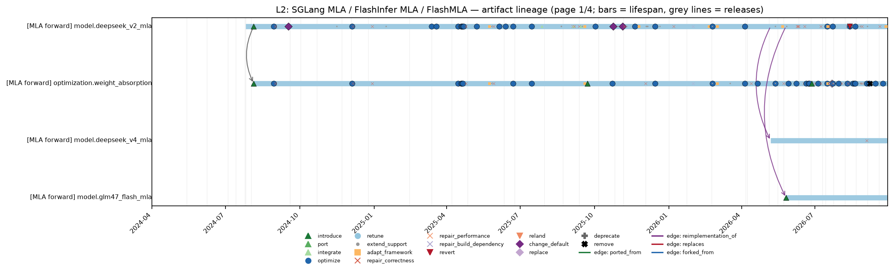
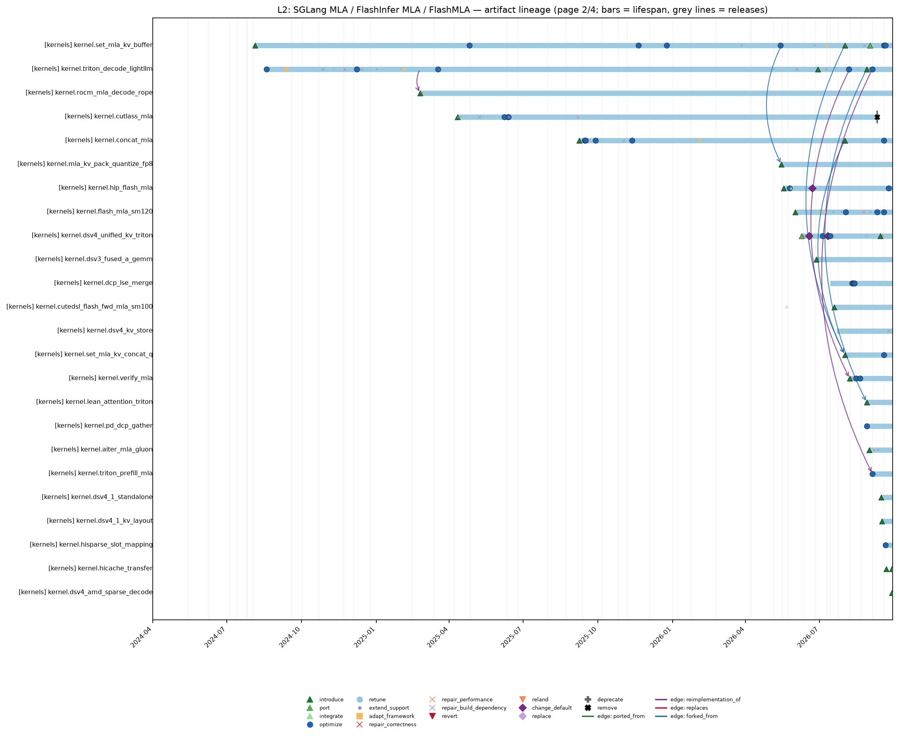
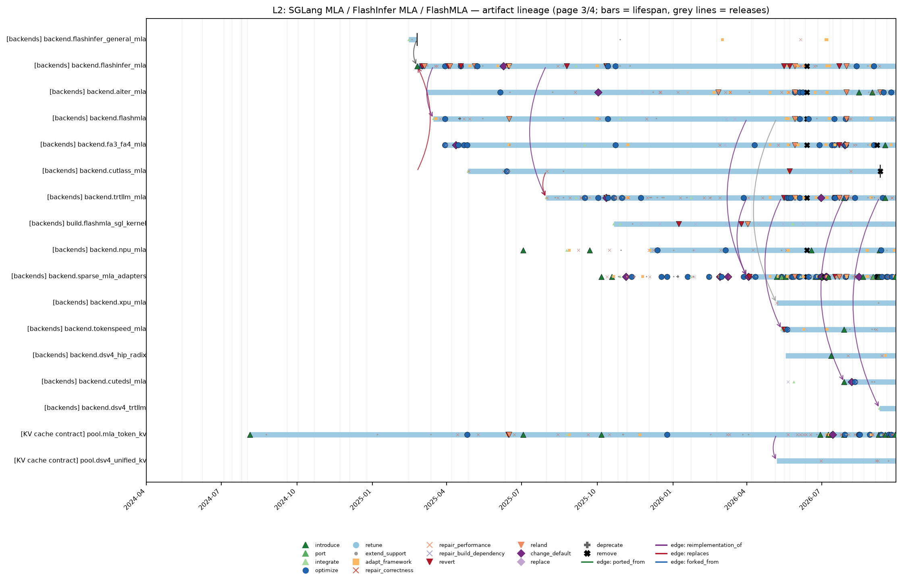
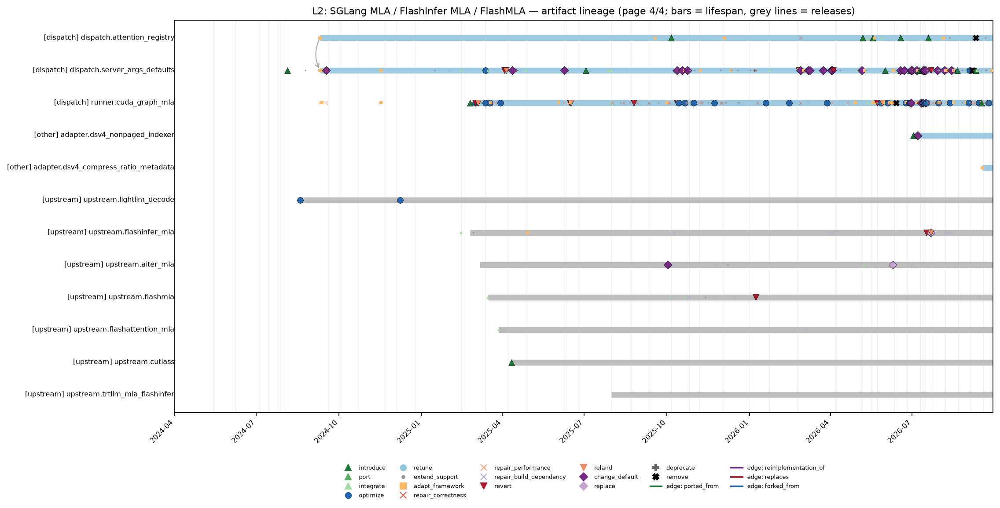
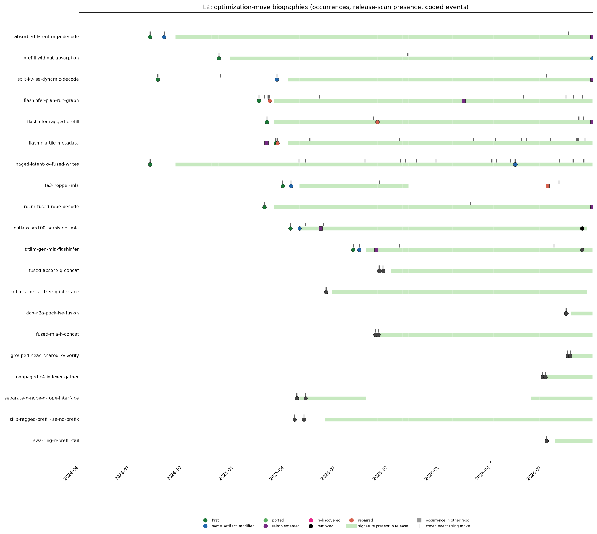
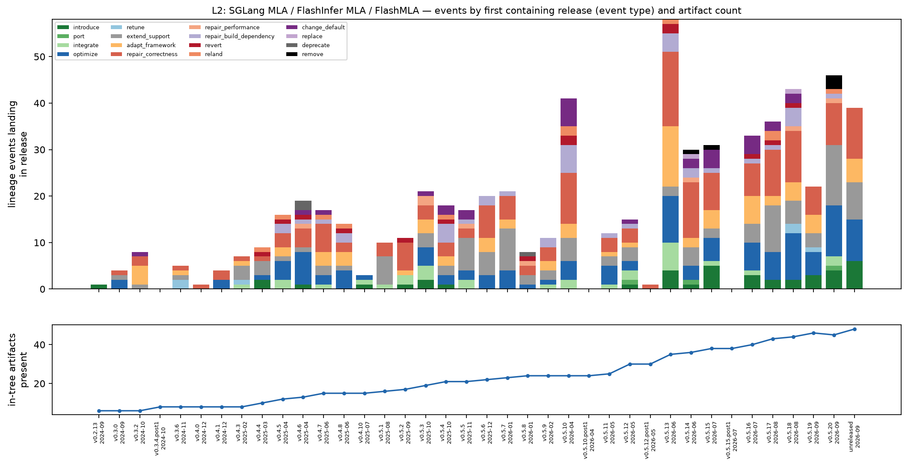

# SGLang MLA, FlashInfer MLA and FlashMLA — kernel lineage report (L2)

*Kernel lineage study. Frozen cutoff 2026-09-28T23:59:59Z; repository `sgl-project/sglang` at `89e1316eae9a`. Tables and every number are generated by `scripts/reports.py` from `data/*.csv` (each number carries a hidden claim tag re-verified by `scripts/consistency.py`); prose in the narrative sections was drafted from the same records and reviewed. Coding was done by LLM coders under `CODEBOOK.md`; agreement figures are model–model consistency, not human inter-rater reliability. Nothing here is causal. See [`METHODS.md`](METHODS.md).*

## Summary

L2 starts as a DeepSeek-V2 MLA model path with weight absorption, a latent KV pool, and LightLLM-derived Triton split-KV decode; it then becomes a backend-selection problem spanning Triton, FlashInfer, FlashMLA, FA3/FA4, TRT-LLM Gen through FlashInfer, CUTLASS, CuTe-DSL, ROCm AITER/HIP FlashMLA, NPU, XPU, and sparse DeepSeek-V4 adapters [#905](https://github.com/sgl-project/sglang/pull/905) [#1138](https://github.com/sgl-project/sglang/pull/1138) [#8632](https://github.com/sgl-project/sglang/pull/8632) [#41020](https://github.com/sgl-project/sglang/pull/41020). The surviving mechanism is less a single kernel than a contract: latent noPE plus RoPE cache layout, absorbed query/value algebra, per-backend metadata planning, and graph-safe replay buffers must agree across optional and default backend choices `L2-E-e1eae1fd15` `L2-E-b110084654` `L2-E-a53fe428f9` `L2-E-4b04998d38`. *Interpretation:* L2 shows optimization knowledge surviving by being re-expressed as adapters, guards, default-selection rules, and dependency pins rather than by keeping every original kernel textually alive `L2-E-c0b790cf7f` [#32114](https://github.com/sgl-project/sglang/pull/32114).

- **Census.** 1,621<!-- claim:data/lineage-metrics.csv::lineage=L2&metric=candidates::value::int --> candidates were screened in context; 653<!-- claim:data/lineage-metrics.csv::lineage=L2&metric=verified_events::value::int --> are verified lineage events (252<!-- claim:data/lineage-metrics.csv::lineage=L2&metric=key_events::value::int --> key events: introductions, ports, integrations, default changes, replacements, removals, reverts, relands, deprecations).
- **Artifacts.** 57<!-- claim:data/lineage-metrics.csv::lineage=L2&metric=artifacts_registered::value::int --> artifacts registered (7<!-- claim:data/lineage-metrics.csv::lineage=L2&metric=artifacts_upstream::value::int --> upstream kernels or pins); 54<!-- claim:data/lineage-metrics.csv::lineage=L2&metric=artifacts_live_at_cutoff::value::int --> live at the cutoff, 3<!-- claim:data/lineage-metrics.csv::lineage=L2&metric=artifacts_ended::value::int --> ended.
- **Moves.** 20<!-- claim:data/lineage-metrics.csv::lineage=L2&metric=moves::value::int --> optimization moves traced, 5<!-- claim:data/lineage-metrics.csv::lineage=L2&metric=moves_with_biography::value::int --> with biographies; 83<!-- claim:data/lineage-metrics.csv::lineage=L2&metric=events_with_moves::value::int --> events carry a verified move.
- **Code vs mechanism.** Across one subsequent release, 27.8<!-- claim:data/survival-by-releases.csv::kind=artifact_unchanged&lineage=L2&k_releases=1&basis=all_present_releases::share::pct1 -->% of present artifacts stayed textually unchanged, and across three releases 8.7<!-- claim:data/survival-by-releases.csv::kind=artifact_unchanged&lineage=L2&k_releases=3&basis=all_present_releases::share::pct1 -->%; move code signatures persisted across three releases in 97.9<!-- claim:data/survival-by-releases.csv::kind=move&lineage=L2&k_releases=3&basis=all_present_releases::share::pct1 -->% of cases.
- **Maintenance mix.** Primary causes: correctness 181<!-- claim:data/lineage-metrics.csv::lineage=L2&metric=primary_cause:correctness::value::int -->, performance 194<!-- claim:data/lineage-metrics.csv::lineage=L2&metric=primary_cause:performance::value::int -->, framework integration 130<!-- claim:data/lineage-metrics.csv::lineage=L2&metric=primary_cause:framework_integration::value::int -->, specification 71<!-- claim:data/lineage-metrics.csv::lineage=L2&metric=primary_cause:specification::value::int -->, build/dependency 39<!-- claim:data/lineage-metrics.csv::lineage=L2&metric=primary_cause:build_dependency::value::int -->, hardware/compiler 25<!-- claim:data/lineage-metrics.csv::lineage=L2&metric=primary_cause:hardware_compiler::value::int -->, maintenance 13<!-- claim:data/lineage-metrics.csv::lineage=L2&metric=primary_cause:maintenance::value::int -->.
- **Failures.** 4<!-- claim:data/lineage-metrics.csv::lineage=L2&metric=failure_histories::value::int --> failure-to-successor histories reconstructed; 15<!-- claim:data/lineage-metrics.csv::lineage=L2&metric=edge_type:reverts::value::int --> revert edges and 14<!-- claim:data/lineage-metrics.csv::lineage=L2&metric=edge_type:relands::value::int --> reland edges; median time from artifact introduction to first correctness/performance repair (Kaplan–Meier) 119<!-- claim:data/lineage-metrics.csv::lineage=L2&metric=km-first-repair_median_days::value::int --> days.

## 1. Scope and identity rules

**Scope.** SGLang MLA, FlashInfer MLA and FlashMLA. Operational scope: `scripts/scope.py` (paths, integration paths, keywords) and `cache/task-screen.md` (decision rule and scope reminders). Identity rules: `CODEBOOK.md` §2. Lineage-specific identity notes from the artifact registry (`staging/registry/L2-registry.json`):

- Pure moves preserve identity; rewrites/new backends get new IDs.
- Upstream kernels and in-tree adapters are separate artifacts.
- Sparse MLA kernel adapters are included; sparse indexer/top-k is excluded.
- KV/cache auxiliary kernels are included because they define the MLA cache contract.
- CUTLASS artifacts end at #32114 because no textual successor remains.

**Discovery strategies** (a candidate may carry several):

| strategy | candidates |
|---|---|
| `body_keyword` | 656<!-- claim:data/lineage-metrics.csv::lineage=L2&metric=discovery:body_keyword::value::int --> |
| `symbol_pickaxe` | 493<!-- claim:data/lineage-metrics.csv::lineage=L2&metric=discovery:symbol_pickaxe::value::int --> |
| `path_core` | 405<!-- claim:data/lineage-metrics.csv::lineage=L2&metric=discovery:path_core::value::int --> |
| `dependency_pin` | 375<!-- claim:data/lineage-metrics.csv::lineage=L2&metric=discovery:dependency_pin::value::int --> |
| `subject_keyword` | 340<!-- claim:data/lineage-metrics.csv::lineage=L2&metric=discovery:subject_keyword::value::int --> |
| `release_notes` | 274<!-- claim:data/lineage-metrics.csv::lineage=L2&metric=discovery:release_notes::value::int --> |
| `path_integration+keyword` | 241<!-- claim:data/lineage-metrics.csv::lineage=L2&metric=discovery:path_integration+keyword::value::int --> |
| `corpus:performance-pr-population` | 66<!-- claim:data/lineage-metrics.csv::lineage=L2&metric=discovery:corpus:performance-pr-population::value::int --> |
| `cross_reference` | 21<!-- claim:data/lineage-metrics.csv::lineage=L2&metric=discovery:cross_reference::value::int --> |
| `corpus:kernel-correctness-cases` | 19<!-- claim:data/lineage-metrics.csv::lineage=L2&metric=discovery:corpus:kernel-correctness-cases::value::int --> |
| `corpus:confirmed-reverts` | 16<!-- claim:data/lineage-metrics.csv::lineage=L2&metric=discovery:corpus:confirmed-reverts::value::int --> |
| `corpus:production-kernel-provenance` | 8<!-- claim:data/lineage-metrics.csv::lineage=L2&metric=discovery:corpus:production-kernel-provenance::value::int --> |

**Screening outcome** (all candidates inspected in context; final labels after stage-2 and reconciliation): `related_context_only` 673<!-- claim:data/lineage-metrics.csv::lineage=L2&metric=candidate_label:related_context_only::value::int -->; `verified_lineage_event` 653<!-- claim:data/lineage-metrics.csv::lineage=L2&metric=candidate_label:verified_lineage_event::value::int -->; `out_of_scope` 278<!-- claim:data/lineage-metrics.csv::lineage=L2&metric=candidate_label:out_of_scope::value::int -->; `name_collision` 16<!-- claim:data/lineage-metrics.csv::lineage=L2&metric=candidate_label:name_collision::value::int -->; `insufficient_evidence` 1<!-- claim:data/lineage-metrics.csv::lineage=L2&metric=candidate_label:insufficient_evidence::value::int -->.

**Excluded look-alikes** (name collisions / other scope):

- Sparse DSA/NSA indexer/top-k selection: out_of_scope — Task explicitly excludes sparse indexer/top-k selection.
- Generic MHA use of MLA-capable backends: out_of_scope — Task says generic MHA use is context, not lineage.
- MLAMA multimodal processor: name_collision — MLAMA contains substring mla but is unrelated.
- concat_and_cast_mha_k_pad_kernel: out_of_scope — MHA K concat/pad helper; not an MLA/FlashMLA lineage artifact. Diff comment says 'concat_and_cast_mha_k_kernel'.

## 2. Chronology and mechanism narrative

The first durable SGLang MLA path appears when DeepSeek-V2 support adds an opt-in `--enable-mla` model path, an `MLATokenToKVPool`, and Triton cache writers for a latent KV layout whose row concatenates `kv_lora_rank` noPE state with RoPE dimensions [#905](https://github.com/sgl-project/sglang/pull/905) `L2-E-e1eae1fd15`. Its central algebraic move is weight absorption: `q_nope` is multiplied by absorbed K weights before attention, the decode kernel sees a single KV head with latent value width, and the result is de-absorbed through V weights after attention [#905](https://github.com/sgl-project/sglang/pull/905) `L2-E-e1eae1fd15`. Offline transposition later makes the absorbed V-side weights contiguous at load time rather than transposing them during the forward path [#1261](https://github.com/sgl-project/sglang/pull/1261) `L2-E-f414352ae6`. *Interpretation:* this turned MLA from a model equation into a cache-layout and backend-shape contract, because every later backend had to preserve the one-KV-head latent view or explicitly route around it `L2-E-e1eae1fd15` `L2-E-f414352ae6`.

The first decode kernel branch is Triton split-KV attention, and its source comments and PR evidence connect it to LightLLM-style token attention while adding MLA/GQA/MQA grouping for SGLang [#1138](https://github.com/sgl-project/sglang/pull/1138) `L2-E-df191254ab`. Mechanically, stage one partitions a request's KV span across splits and stores partial outputs plus LSE, and stage two merges those partials with online-softmax correction [#1138](https://github.com/sgl-project/sglang/pull/1138) `L2-E-df191254ab`. Later long-context and dynamic-workload changes make the split count tunable and then per-batch, which moves the optimization from a fixed kernel geometry into metadata that CUDA graph replay must carry consistently [#2394](https://github.com/sgl-project/sglang/pull/2394) [#4553](https://github.com/sgl-project/sglang/pull/4553) `L2-E-7dc66fcb40` `L2-E-c0e9a36c5f`. Prefill diverges from decode when SGLang adds the no-prefix path that materializes K/V through the normal computation for large prefill while keeping absorbed decode and prefix-bearing extend on the absorbed path [#2349](https://github.com/sgl-project/sglang/pull/2349) `L2-E-ec52464dde`.

Dispatch then changes from MLA-specific booleans into named attention backends, first by introducing `--attention-backend`, then by making MLA the default, and later by deprecating the old enable/disable flags [#1380](https://github.com/sgl-project/sglang/pull/1380) [#1447](https://github.com/sgl-project/sglang/pull/1447) [#5480](https://github.com/sgl-project/sglang/pull/5480) [#5481](https://github.com/sgl-project/sglang/pull/5481). This matters mechanistically because backend choice becomes a registry and default-selection protocol rather than a single model flag, and later hardware defaults can map the same model-side MLA contract to Triton, FA3, FlashInfer, AITER, Ascend, or TRT-LLM MLA [#5210](https://github.com/sgl-project/sglang/pull/5210) [#8632](https://github.com/sgl-project/sglang/pull/8632) `L2-E-57de7c6b5f` `L2-E-4b04998d38`. FlashInfer MLA first enters as an optional DeepSeek-V3/R1 path inside the general FlashInfer backend, wrapping `BatchMLAPagedAttentionWrapper` and selected by the FlashInfer MLA flag [#3550](https://github.com/sgl-project/sglang/pull/3550) `L2-E-70f894b810`. It is split into a dedicated `flashinfer_mla_backend.py`, where plan/run state, page indices, and wrapper-specific metadata are isolated from the general FlashInfer backend [#3785](https://github.com/sgl-project/sglang/pull/3785) `L2-E-b110084654`. Ragged prefill adds a second FlashInfer planning mode for no-prefix extend, so the backend dispatches to ragged contiguous metadata only when prefix cache is absent and otherwise stays on paged MLA metadata [#3967](https://github.com/sgl-project/sglang/pull/3967) `L2-E-90a4b7d98a`.

The FlashInfer fast-plan episode exposes how CUDA graph replay constrains optimization mechanisms: the first fast decode plan tries to avoid host synchronization in replay, is reverted for regressions in other cases, and is relanded as a narrower `fast_mla_decode_plan` with replay-specific CPU indptr and preallocated buffers [#3987](https://github.com/sgl-project/sglang/pull/3987) [#4008](https://github.com/sgl-project/sglang/pull/4008) [#4012](https://github.com/sgl-project/sglang/pull/4012). *Interpretation:* the surviving move is not simply "use FlashInfer faster," because the durable part is the separation between normal planning and replay-safe cached metadata `L2-E-fa56106731` `L2-E-9e1014cf99` `L2-E-fc91d08a8f`.

FlashMLA introduces another metadata-centered implementation: SGLang wraps `flash_mla_with_kvcache` and `get_mla_metadata`, requires the backend's page geometry, and passes tile scheduler metadata plus `num_splits` to the upstream kernel [#4472](https://github.com/sgl-project/sglang/pull/4472) `L2-E-a53fe428f9`. CUDA graph support copies recomputed FlashMLA metadata into fixed graph buffers before replay, preserving dynamic split planning while satisfying stable-address replay constraints [#4514](https://github.com/sgl-project/sglang/pull/4514) `L2-E-b6944f97a6`. Delivery then moves from an external FlashMLA package toward sgl-kernel build integration and later `kernels/aot` packaging, so the same upstream kernel identity is delivered through different build rules rather than only by a Python import [#11717](https://github.com/sgl-project/sglang/pull/11717) [#32648](https://github.com/sgl-project/sglang/pull/32648) `L2-E-23afdfd1c2`.

The cache-side helpers become their own optimization branch once backend adapters stop being the only bottleneck. SGLang fuses MLA KV writes, removes query and key concatenation before selected FA3, FlashInfer, and CUTLASS paths, introduces CUDA/JIT helpers such as `concat_mla_k` and `concat_mla_absorb_q`, and later fuses KV packing plus FP8 quantization for chunked prefill [#5748](https://github.com/sgl-project/sglang/pull/5748) [#5638](https://github.com/sgl-project/sglang/pull/5638) [#5822](https://github.com/sgl-project/sglang/pull/5822) [#10156](https://github.com/sgl-project/sglang/pull/10156) [#10473](https://github.com/sgl-project/sglang/pull/10473) [#25333](https://github.com/sgl-project/sglang/pull/25333). These changes preserve the same MLA layout contract but move work from Python tensor construction and generic assignments into kernel-side packing, concat-free interfaces, or fused quantization stages `L2-E-799c4bb502` `L2-E-e30c273bc9` `L2-E-0096798ed6` `L2-E-3b25dc127a` `L2-E-ee93795476`.

Hardware-specific successors branch after the FlashMLA/FlashInfer split rather than forming one total order. FA3 adds a FlashAttention backend branch for MLA and becomes the Hopper default when the hardware and CUDA rule applies [#4831](https://github.com/sgl-project/sglang/pull/4831) [#5210](https://github.com/sgl-project/sglang/pull/5210) `L2-E-20c90be23d` `L2-E-57de7c6b5f`. Blackwell initially gets an in-tree CUTLASS SM100 MLA kernel with persistent tile scheduling and then a selectable CUTLASS backend, but that path is later deleted because it is SM10.0-only, disabled on GB300, and lacks CI coverage according to the removal PR [#5142](https://github.com/sgl-project/sglang/pull/5142) [#5390](https://github.com/sgl-project/sglang/pull/5390) [#32114](https://github.com/sgl-project/sglang/pull/32114). TRT-LLM Gen MLA arrives through FlashInfer, subclasses the FlashInfer MLA adapter, pads block tables to the external kernel's block constraints, and later becomes the explicit or model-default Blackwell replacement direction after CUTLASS removal [#8632](https://github.com/sgl-project/sglang/pull/8632) [#8638](https://github.com/sgl-project/sglang/pull/8638) [#32114](https://github.com/sgl-project/sglang/pull/32114). CuTe-DSL, SM120, ROCm AITER/HIP FlashMLA, and sparse DeepSeek-V4/DSA/NSA branches reuse the same higher-level obligations--latent or compressed KV layout, plan metadata, split/LSE merge, and graph-safe buffers--while changing the concrete kernel provider [#24737](https://github.com/sgl-project/sglang/pull/24737) [#24692](https://github.com/sgl-project/sglang/pull/24692) [#24933](https://github.com/sgl-project/sglang/pull/24933) [#21783](https://github.com/sgl-project/sglang/pull/21783) [#29775](https://github.com/sgl-project/sglang/pull/29775). *Interpretation:* the lineage's mechanism is a succession of contracts and adapters, not a single kernel that happens to keep identical code; each branch re-materializes the contract in the syntax and failure modes of its kernel library [#8632](https://github.com/sgl-project/sglang/pull/8632) [#32612](https://github.com/sgl-project/sglang/pull/32612) [#34647](https://github.com/sgl-project/sglang/pull/34647).

### Chronological table of key events

Showing 140 of 169 key events (all events with full fields: `data/lineage-events.csv`, filter `lineage == L2`).

| date | first release | event | type | artifacts | PR | evidence (excerpt) |
|---|---|---|---|---|---|---|
| 2024-08-05 | v0.2.13 | `L2-E-e1eae1fd15` | introduce | L2.model.deepseek_v2_mla; L2.optimization.weight_absorption; L2.pool.m | [#905](https://github.com/sgl-project/sglang/pull/905) | MLA implementation. |
| 2024-08-19 | v0.3.0 | `L2-E-df191254ab` | optimize | L2.kernel.triton_decode_lightllm; L2.upstream.lightllm_decode | [#1138](https://github.com/sgl-project/sglang/pull/1138) | One block handle `BLOCK_H` q heads with shared k/v head. |
| 2024-08-30 | v0.3.0 | `L2-E-f414352ae6` | optimize | L2.optimization.weight_absorption; L2.model.deepseek_v2_mla | [#1261](https://github.com/sgl-project/sglang/pull/1261) | Preprocess weight after weight loading. |
| 2024-09-17 | v0.3.2 | `L2-E-c6b6d2e71b` | change_default | L2.dispatch.server_args_defaults; L2.model.deepseek_v2_mla | [#1447](https://github.com/sgl-project/sglang/pull/1447) | Enable MLA by default. Add server arg `--disable-mla` to switch it. |
| 2024-12-05 | v0.4.1 | `L2-E-ec52464dde` | optimize | L2.optimization.weight_absorption; L2.model.deepseek_v2_mla | [#2349](https://github.com/sgl-project/sglang/pull/2349) | For large batch sizes, not using weight absorption in the MLA prefill phase will be more efficient. |
| 2024-12-08 | v0.4.1 | `L2-E-7dc66fcb40` | optimize | L2.kernel.triton_decode_lightllm; L2.upstream.lightllm_decode | [#2394](https://github.com/sgl-project/sglang/pull/2394) | adapted the flash decoding implementation from [lightllm] |
| 2025-02-24 | v0.4.4 | `L2-E-b110084654` | introduce | L2.backend.flashinfer_mla; L2.runner.cuda_graph_mla | [#3785](https://github.com/sgl-project/sglang/pull/3785) | creates a new `flashinfer_mla_backend.py` |
| 2025-02-24 | v0.4.4 | `L2-E-6ce9dbe828` | introduce | L2.kernel.rocm_mla_decode_rope | [#3237](https://github.com/sgl-project/sglang/pull/3237) | fusing MLA rope into the grouped attention on ROCm. |
| 2025-03-02 | v0.4.4 | `L2-E-fa56106731` | optimize | L2.backend.flashinfer_mla; L2.runner.cuda_graph_mla | [#3987](https://github.com/sgl-project/sglang/pull/3987) | Write `fast_mla_decode_plan` that can avoid transmitting indptr tensors |
| 2025-03-02 | v0.4.4 | `L2-E-9e1014cf99` | revert | L2.backend.flashinfer_mla; L2.runner.cuda_graph_mla | [#4008](https://github.com/sgl-project/sglang/pull/4008) | Reverts sgl-project/sglang#3987 because it introduces regression for other cases. |
| 2025-03-05 | v0.4.4 | `L2-E-fc91d08a8f` | reland | L2.backend.flashinfer_mla; L2.runner.cuda_graph_mla | [#4012](https://github.com/sgl-project/sglang/pull/4012) | Revision of #3987 |
| 2025-03-18 | v0.4.5 | `L2-E-c0e9a36c5f` | optimize | L2.kernel.triton_decode_lightllm; L2.runner.cuda_graph_mla | [#4553](https://github.com/sgl-project/sglang/pull/4553) | Use `max_kv_splits` to launch kernels |
| 2025-04-03 | v0.4.5 | `L2-E-74885a848b` | revert | L2.backend.flashinfer_mla; L2.dispatch.server_args_defaults | [#5048](https://github.com/sgl-project/sglang/pull/5048) | Reverts sgl-project/sglang#5005 because it breaks CI |
| 2025-04-05 | v0.4.5 | `L2-E-efbae697b3` | reland | L2.backend.flashinfer_mla; L2.dispatch.server_args_defaults | [#5052](https://github.com/sgl-project/sglang/pull/5052) | Fixing the default backend bug caused by #5005 |
| 2025-04-11 | v0.4.6 | `L2-E-f65b8d5c89` | introduce | L2.kernel.cutlass_mla; L2.upstream.cutlass | [#5142](https://github.com/sgl-project/sglang/pull/5142) | Sm100MlaPersistentTileScheduler |
| 2025-04-12 | v0.4.6 | `L2-E-57de7c6b5f` | change_default | L2.backend.fa3_fa4_mla; L2.dispatch.server_args_defaults | [#5210](https://github.com/sgl-project/sglang/pull/5210) | server_args.attention_backend = "fa3" |
| 2025-04-17 | v0.4.6 | `L2-E-4fb05583ef` | deprecate | L2.dispatch.server_args_defaults; L2.model.deepseek_v2_mla | [#5481](https://github.com/sgl-project/sglang/pull/5481) | Deprecate disable-mla |
| 2025-04-17 | v0.4.6 | `L2-E-6fb29ffd9e` | deprecate | L2.dispatch.server_args_defaults; L2.backend.flashinfer_mla; L2.backen | [#5480](https://github.com/sgl-project/sglang/pull/5480) | replaced by `--attention-backend flashinfer` and `--attention-backend flashmla` |
| 2025-04-18 | v0.4.6 | `L2-E-bfa3922451` | optimize | L2.backend.flashinfer_mla | [#5476](https://github.com/sgl-project/sglang/pull/5476) | Small tweak to save a bit of compute. |
| 2025-04-18 | v0.4.6 | `L2-E-a6f892e5d0` | revert | L2.backend.flashinfer_mla | [#5544](https://github.com/sgl-project/sglang/pull/5544) | fix `python3 models/test_reward_models.py` |
| 2025-04-22 | v0.4.6 | `L2-E-6b6e748775` | optimize | L2.backend.fa3_fa4_mla; L2.model.deepseek_v2_mla | [#5638](https://github.com/sgl-project/sglang/pull/5638) | concat for q in FA3 backend can be removed |
| 2025-04-26 | v0.4.6 | `L2-E-799c4bb502` | optimize | L2.pool.mla_token_kv; L2.kernel.set_mla_kv_buffer; L2.backend.fa3_fa4_ | [#5748](https://github.com/sgl-project/sglang/pull/5748) | Fuse MLA set kv cache kernel and remove k concat operation |
| 2025-05-05 | v0.4.7 | `L2-E-22da3d978f` | reland | L2.backend.flashinfer_mla | [#5555](https://github.com/sgl-project/sglang/pull/5555) | Reopens #5476 as per #5544 |
| 2025-05-08 | v0.4.7 | `L2-E-e30c273bc9` | optimize | L2.backend.flashinfer_mla; L2.model.deepseek_v2_mla | [#5822](https://github.com/sgl-project/sglang/pull/5822) | Base on  #5748 and #5638 , for flashinfer mla, remove q and k cat. |
| 2025-06-08 | v0.4.8 | `L2-E-18efb5e8e0` | optimize | L2.kernel.cutlass_mla | [#6929](https://github.com/sgl-project/sglang/pull/6929) | improve performance up to 1.8x for page_size == 128 |
| 2025-06-09 | v0.4.7 | `L2-E-6716b41786` | change_default | L2.dispatch.server_args_defaults; L2.backend.flashinfer_mla | [#7023](https://github.com/sgl-project/sglang/pull/7023) | server_args.attention_backend = "flashinfer" |
| 2025-06-13 | v0.4.8 | `L2-E-aa46ed34d2` | optimize | L2.kernel.cutlass_mla | [#7145](https://github.com/sgl-project/sglang/pull/7145) | Remove 200us slow concat kernel |
| 2025-06-13 | v0.4.8 | `L2-E-c49c1d9226` | optimize | L2.backend.cutlass_mla; L2.kernel.cutlass_mla; L2.model.deepseek_v2_ml | [#7020](https://github.com/sgl-project/sglang/pull/7020) | gsm8k and mmlu ok after integrating this pr |
| 2025-06-15 | v0.4.8 | `L2-E-fff10809bf` | revert | L2.backend.flashinfer_mla; L2.pool.mla_token_kv; L2.runner.cuda_graph_ | [#7210](https://github.com/sgl-project/sglang/pull/7210) | Reverts sgl-project/sglang#7163 because it failed some test cases |
| 2025-06-16 | v0.4.8 | `L2-E-b1286a116a` | reland | L2.backend.flashinfer_mla; L2.backend.flashmla; L2.pool.mla_token_kv;  | [#7213](https://github.com/sgl-project/sglang/pull/7213) | This PR re-applies https://github.com/sgl-project/sglang/pull/7163 |
| 2025-07-03 | v0.4.10 | `L2-E-1e0e549766` | introduce | L2.backend.npu_mla; L2.pool.mla_token_kv; L2.dispatch.server_args_defa | [#7722](https://github.com/sgl-project/sglang/pull/7722) | New attention backend - `AscendAttnBackend` |
| 2025-08-25 | v0.5.2 | `L2-E-ebd9dbe71b` | revert | L2.backend.flashinfer_mla; L2.runner.cuda_graph_mla | [#9581](https://github.com/sgl-project/sglang/pull/9581) | fix: revert #8593 |
| 2025-09-08 | v0.5.2 | `L2-E-0096798ed6` | introduce | L2.kernel.concat_mla | [#10156](https://github.com/sgl-project/sglang/pull/10156) | cuda |
| 2025-09-15 | v0.5.3 | `L2-E-3b25dc127a` | optimize | L2.kernel.concat_mla | [#10473](https://github.com/sgl-project/sglang/pull/10473) | 17.5% e2e speedup for short seq len |
| 2025-09-16 | v0.5.3 | `L2-E-311de47bb7` | optimize | L2.backend.trtllm_mla; L2.kernel.concat_mla | [#10474](https://github.com/sgl-project/sglang/pull/10474) | see https://github.com/sgl-project/sglang/pull/10473 for info |
| 2025-09-22 | v0.5.3 | `L2-E-d27a6f7092` | introduce | L2.backend.npu_mla; L2.optimization.weight_absorption | [#10130](https://github.com/sgl-project/sglang/pull/10130) | new fused op that warps whole `forward_absorb_prepare` function |
| 2025-10-02 | v0.5.3 | `L2-E-b00a0c786f` | change_default | L2.backend.aiter_mla; L2.upstream.aiter_mla | [#11161](https://github.com/sgl-project/sglang/pull/11161) | aiter will only be used when the number of KV heads is 16 or 128 |
| 2025-10-06 | v0.5.3 | `L2-E-efbc687c28` | introduce | L2.backend.sparse_mla_adapters; L2.pool.mla_token_kv; L2.dispatch.atte | [#11061](https://github.com/sgl-project/sglang/pull/11061) | We now support DeepSeek V3.2 |
| 2025-10-12 | v0.5.4 | `L2-E-1bdd010291` | revert | L2.backend.flashinfer_mla; L2.backend.trtllm_mla; L2.runner.cuda_graph | [#11520](https://github.com/sgl-project/sglang/pull/11520) | Reverts sgl-project/sglang#11331 |
| 2025-10-12 | v0.5.4 | `L2-E-a2b3d9b90b` | change_default | L2.dispatch.server_args_defaults; L2.backend.trtllm_mla | [#11512](https://github.com/sgl-project/sglang/pull/11512) | self.attention_backend = "trtllm_mla" |
| 2025-10-13 | v0.5.4 | `L2-E-516738b096` | reland | L2.backend.flashinfer_mla; L2.backend.trtllm_mla; L2.runner.cuda_graph | [#11528](https://github.com/sgl-project/sglang/pull/11528) | get_global_server_args().disable_chunked_prefix_cache |
| 2025-10-18 | v0.5.4 | `L2-E-f4488e9dd9` | change_default | L2.dispatch.server_args_defaults | [#11801](https://github.com/sgl-project/sglang/pull/11801) | ## Motivation Set default deterministic compatible attention backend when deterministic enabled and no attenti |
| 2025-10-19 | v0.5.4 | `L2-E-3b80232d06` | introduce | L2.backend.sparse_mla_adapters | [#11815](https://github.com/sgl-project/sglang/pull/11815) | Transform topk indices to indices to ragged kv |
| 2025-10-21 | v0.5.4 | `L2-E-d9a20fd28a` | optimize | L2.backend.trtllm_mla; L2.runner.cuda_graph_mla | [#11664](https://github.com/sgl-project/sglang/pull/11664) | flashinfer_mla doesn't support fp8 |
| 2025-10-23 | v0.5.5 | `L2-E-4793ec7d1a` | optimize | L2.optimization.weight_absorption; L2.backend.flashinfer_mla; L2.backe | [#10953](https://github.com/sgl-project/sglang/pull/10953) | ## Motivation For fa3 and flashinfer backends, when seq_lens ≤ 128K, fuse prefix and extended kv and perform o |
| 2025-10-24 | v0.5.5 | `L2-E-f4b78d137c` | change_default | L2.model.deepseek_v2_mla; L2.dispatch.server_args_defaults | [#12000](https://github.com/sgl-project/sglang/pull/12000) | ## Motivation Part of this Issue: https://github.com/sgl-project/sglang/issues/10278 As part of deepseek deter |
| 2025-11-05 | v0.5.5 | `L2-E-f235498eca` | change_default | L2.model.deepseek_v2_mla; L2.backend.sparse_mla_adapters | [#11892](https://github.com/sgl-project/sglang/pull/11892) | Prefill <= 2048: MHA |
| 2025-11-20 | v0.5.6 | `L2-E-c8ede0e93c` | optimize | L2.kernel.set_mla_kv_buffer; L2.model.deepseek_v2_mla | [#13617](https://github.com/sgl-project/sglang/pull/13617) | Enable fused set_mla_kv_buffer kernel for MI355x |
| 2025-12-25 | v0.5.7 | `L2-E-9d878c1f3e` | optimize | L2.pool.mla_token_kv; L2.kernel.set_mla_kv_buffer; L2.backend.sparse_m | [#15522](https://github.com/sgl-project/sglang/pull/15522) | This avoids the concat operation and enables direct reuse of set_mla_kv_buffer_triton |
| 2026-01-07 | v0.5.8 | `L2-E-7d757d6f17` | deprecate | L2.backend.sparse_mla_adapters; L2.dispatch.server_args_defaults | [#15938](https://github.com/sgl-project/sglang/pull/15938) | Deprecate SGLANG_NSA_DUAL_STREAM, SGLANG_NSA_FLASHMLA_BACKEND_DECODE_COMPUTE_FP8 |
| 2026-01-08 | v0.5.8 | `L2-E-12a0292bfd` | revert | L2.build.flashmla_sgl_kernel; L2.upstream.flashmla | [#16678](https://github.com/sgl-project/sglang/pull/16678) | Revert "[sgl-kernel] Update flashmla to include fp8 sparse_mla optimizations" |
| 2026-02-25 | v0.5.10 | `L2-E-60eeef7370` | reland | L2.backend.aiter_mla; L2.dispatch.server_args_defaults | [#19216](https://github.com/sgl-project/sglang/pull/19216) | This PR is new version of old PR https://github.com/sgl-project/sglang/pull/17953 |
| 2026-02-27 | v0.5.10 | `L2-E-9496bbd7b1` | change_default | L2.backend.sparse_mla_adapters; L2.dispatch.server_args_defaults | [#18319](https://github.com/sgl-project/sglang/pull/18319) | As per title. This PR adds a default on Instinct to `tilelang` for NSA attention backend. "flashmla_sparse" an |
| 2026-03-01 | v0.5.10 | `L2-E-80a6b32703` | optimize | L2.backend.sparse_mla_adapters | [#19536](https://github.com/sgl-project/sglang/pull/19536) | ## Motivation This PR is authored by @Baidu-AIAK in https://github.com/sgl-project/sglang/pull/17647. I just t |
| 2026-03-07 | v0.5.10 | `L2-E-d28f35240a` | change_default | L2.dispatch.server_args_defaults | [#20086](https://github.com/sgl-project/sglang/pull/20086) | ## Motivation After the flashmla is rebased to latest version, DeepSeekV32 fp4+tp4 will break on flashmla deco |
| 2026-03-09 | v0.5.10 | `L2-E-be63f982b7` | change_default | L2.backend.sparse_mla_adapters; L2.dispatch.server_args_defaults | [#20062](https://github.com/sgl-project/sglang/pull/20062) | ## Motivation - Add an environ `SGLANG_NSA_DENSE_ATTN_KV_LEN_THRESHOLD`, for controlling whether to use dense  |
| 2026-03-24 | v0.5.10 | `L2-E-2b75fed0dd` | change_default | L2.dispatch.server_args_defaults | [#21337](https://github.com/sgl-project/sglang/pull/21337) | ## Motivation #21291 Route the config of glmfp8+B200+DP to bf16 kvcache+flashmla sparse prefill+trtllm decode  |
| 2026-03-25 | v0.5.10 | `L2-E-dbe871efdd` | revert | L2.build.flashmla_sgl_kernel | [#21430](https://github.com/sgl-project/sglang/pull/21430) | ## Motivation Temporarily avoid #21291 ## Modifications ## Accuracy Tests ## Benchmarking and Profiling ## Che |
| 2026-04-02 | v0.5.10 | `L2-E-fbc1f92453` | change_default | L2.dispatch.server_args_defaults | [#21914](https://github.com/sgl-project/sglang/pull/21914) | ## Motivation ## Modifications ## Accuracy Tests ## Speed Tests and Profiling ## Checklist ## Review and Merge |
| 2026-04-02 | v0.5.10 | `L2-E-c7d03a6215` | reland | L2.build.flashmla_sgl_kernel | [#21922](https://github.com/sgl-project/sglang/pull/21922) | Reverts sgl-project/sglang#21430 |
| 2026-04-03 | v0.5.10 | `L2-E-8cb337c8ea` | change_default | L2.backend.sparse_mla_adapters; L2.dispatch.server_args_defaults | [#21906](https://github.com/sgl-project/sglang/pull/21906) | ## Summary Temporary workaround until FlashInfer fixes TRTLLM attention on SM103 (flashinfer-ai/flashinfer#293 |
| 2026-04-04 | v0.5.10 | `L2-E-bf984ae65d` | revert | L2.backend.sparse_mla_adapters; L2.dispatch.server_args_defaults | [#22098](https://github.com/sgl-project/sglang/pull/22098) | Reverts sgl-project/sglang#21906 This temporary fix can be reverted due to release of flashinfer v0.6.7.post2  |
| 2026-04-10 | v0.5.11 | `L2-E-6af34b95b6` | optimize | L2.backend.fa3_fa4_mla | [#21104](https://github.com/sgl-project/sglang/pull/21104) | ## Summary Call `get_scheduler_metadata` once per batch in decode metadata init (including CUDA graph capture/ |
| 2026-04-11 | v0.5.11 | `L2-E-19cb918653` | optimize | L2.backend.sparse_mla_adapters | [#21166](https://github.com/sgl-project/sglang/pull/21166) | ## Motivation Optimize GLM-5 model performance. ## Modifications 1. Pad IO tensor shape in framework level for |
| 2026-05-06 | v0.5.12 | `L2-E-3da87902d7` | change_default | L2.dispatch.server_args_defaults | [#23013](https://github.com/sgl-project/sglang/pull/23013) | flashmla_sparse does not accept FP8 input, so HiSparse was previously pinned to BF16 KV. The flashmla_kv kerne |
| 2026-05-07 | v0.5.12 | `L2-E-35870d55ac` | introduce | L2.backend.sparse_mla_adapters; L2.dispatch.attention_registry | [#23882](https://github.com/sgl-project/sglang/pull/23882) | ## Rebase progress merge-base 0519b09 → target main ea794de (latest), 2880 commits across **29 batches** (~100 |
| 2026-05-13 | v0.5.12 | `L2-E-e2290b155a` | port | L2.backend.sparse_mla_adapters | [#24890](https://github.com/sgl-project/sglang/pull/24890) | Port the fused KV compression V2 kernels (c4, c128, online c128) from `deepseek_v4_dev` branch to main. |
| 2026-05-14 | v0.5.12 | `L2-E-dca9ba6321` | optimize | L2.kernel.set_mla_kv_buffer | [#25311](https://github.com/sgl-project/sglang/pull/25311) | ## Motivation The MLA paged-KV scatter-write (`set_mla_kv_buffer`) was a 1D Triton kernel (`BLOCK=128`, grid ` |
| 2026-05-15 | v0.5.13 | `L2-E-ee93795476` | introduce | L2.kernel.mla_kv_pack_quantize_fp8 | [#25333](https://github.com/sgl-project/sglang/pull/25333) | ## Motivation The MLA chunked-prefill path packs strided `k_nope` and broadcast `k_pe` into a contiguous K ten |
| 2026-05-16 | v0.5.13 | `L2-E-9869ef0849` | revert | L2.backend.flashinfer_mla; L2.backend.trtllm_mla; L2.backend.tokenspee | [#25488](https://github.com/sgl-project/sglang/pull/25488) | Reverts sgl-project/sglang#25321 --- ### CI States Latest PR Test (Base): :x: **Missing `run-ci` label** — add |
| 2026-05-18 | v0.5.13 | `L2-E-866793c502` | introduce | L2.kernel.hip_flash_mla; L2.dispatch.attention_registry; L2.backend.sp | [#24933](https://github.com/sgl-project/sglang/pull/24933) | ## Motivation Enable deepseek v4 model support (merge to main) to ROCm platform. This is a first PR to add ROC |
| 2026-05-23 | v0.5.13 | `L2-E-83a18e687d` | revert | L2.backend.flashinfer_mla; L2.runner.cuda_graph_mla; L2.backend.cutlas | [#26166](https://github.com/sgl-project/sglang/pull/26166) | Reverts #26134. The conflict in `triton_backend.py` (from #26152 building on top of #26134) is resolved: the s |
| 2026-05-26 | v0.5.13 | `L2-E-7ef06bfc06` | introduce | L2.model.glm47_flash_mla | [#26088](https://github.com/sgl-project/sglang/pull/26088) | ## Motivation `glm4_moe_lite` (GLM-4.7-Flash, MLA) had a few issues when running with the native SGLang implem |
| 2026-05-29 | v0.5.13 | `L2-E-ff8ed7a302` | reland | L2.backend.flashinfer_mla; L2.backend.flashmla; L2.backend.trtllm_mla; | [#26665](https://github.com/sgl-project/sglang/pull/26665) | ## Motivation Reland of #26134 (reverted by #26166), extended to cover four additional backends. Single PR rep |
| 2026-06-01 | v0.5.13 | `L2-E-524ba10eda` | introduce | L2.kernel.flash_mla_sm120; L2.dispatch.server_args_defaults | [#24692](https://github.com/sgl-project/sglang/pull/24692) | ## Summary Adds full **SM120** (RTX PRO 6000 / RTX 5090 / DGX Spark, compute 12.0) support for DeepSeek-V4/V3  |
| 2026-06-09 | v0.5.14 | `L2-E-2fef951fe8` | replace | L2.upstream.aiter_mla | [#23927](https://github.com/sgl-project/sglang/pull/23927) | ## Motivation Dependency: https://github.com/ROCm/aiter/pull/2911 (merged) The original FP8 prefill path in th |
| 2026-06-09 | v0.5.14 | `L2-E-f2bcdb0508` | port | L2.kernel.dsv4_unified_kv_triton | [#27380](https://github.com/sgl-project/sglang/pull/27380) | ## Motivation Add a unified-KV attention backend for DeepSeek-V4 on amd code path, porting [ATOM's sparse atte |
| 2026-06-13 | v0.5.14 | `L2-E-bde6bccf39` | remove | L2.backend.flashinfer_mla; L2.backend.flashmla; L2.backend.trtllm_mla; | [#28129](https://github.com/sgl-project/sglang/pull/28129) | ## Motivation EAGLE v1 is deprecated — all speculative workers are v2. This removes the v1 `ForwardMode.DRAFT_ |
| 2026-06-18 | v0.5.14 | `L2-E-9b10821c8e` | introduce | L2.backend.npu_mla; L2.dispatch.attention_registry; L2.dispatch.server | [#25144](https://github.com/sgl-project/sglang/pull/25144) | ## Summary Adds end-to-end Ascend NPU support for the **DeepSeek-V4** architecture, covering both the **V4-Fla |
| 2026-06-18 | v0.5.14 | `L2-E-24d15dd92e` | change_default | L2.dispatch.server_args_defaults; L2.kernel.dsv4_unified_kv_triton | [#28541](https://github.com/sgl-project/sglang/pull/28541) | ## Motivation Enabling hicache will hit the following issue for dsv4 unified kv triton ``` AttributeError: 'No |
| 2026-06-22 | v0.5.14 | `L2-E-04d952ea10` | change_default | L2.kernel.hip_flash_mla; L2.dispatch.server_args_defaults | [#28920](https://github.com/sgl-project/sglang/pull/28920) | > **Will fire another PR to update the codebook after this PR is merged.** ## Motivation As raised in SA's iss |
| 2026-06-23 | v0.5.15 | `L2-E-7454735be9` | introduce | L2.backend.sparse_mla_adapters | [#28975](https://github.com/sgl-project/sglang/pull/28975) | ## Motivation This affects HIP serving of DSA (DeepSeek Sparse Attention) models; it was found and validated o |
| 2026-06-27 | v0.5.15 | `L2-E-e4253b39e2` | introduce | L2.kernel.dsv3_fused_a_gemm; L2.optimization.weight_absorption | [#27397](https://github.com/sgl-project/sglang/pull/27397) | JIT kernel for DeepSeek V3 fused QKV-A GEMM |
| 2026-06-29 | v0.5.15 | `L2-E-fc96edd297` | introduce | L2.pool.mla_token_kv; L2.kernel.triton_decode_lightllm; L2.dispatch.se | [#29533](https://github.com/sgl-project/sglang/pull/29533) | flips the outermost axis to the **page** |
| 2026-06-30 | v0.5.15 | `L2-E-bc8b3ab1f5` | introduce | L2.backend.sparse_mla_adapters | [#25751](https://github.com/sgl-project/sglang/pull/25751) | Both QK and PV are issued as native FP8 GMMA |
| 2026-06-30 | v0.5.15 | `L2-E-2f730e299f` | change_default | L2.backend.trtllm_mla; L2.dispatch.server_args_defaults; L2.runner.cud | [#28053](https://github.com/sgl-project/sglang/pull/28053) | Disable it by default. |
| 2026-07-01 | v0.5.15 | `L2-E-c865347b98` | change_default | L2.backend.sparse_mla_adapters; L2.dispatch.server_args_defaults | [#29775](https://github.com/sgl-project/sglang/pull/29775) | SGLANG_OPT_FLASHMLA_SPARSE_PREFILL = EnvBool(True) |
| 2026-07-02 | v0.5.15 | `L2-E-a6ee64d237` | introduce | L2.adapter.dsv4_nonpaged_indexer; L2.backend.sparse_mla_adapters | [#29619](https://github.com/sgl-project/sglang/pull/29619) | gathering the C4 index keys and scales into contiguous storage |
| 2026-07-05 | v0.5.15 | `L2-E-5eb1b6a7ba` | remove | L2.backend.sparse_mla_adapters | [#29912](https://github.com/sgl-project/sglang/pull/29912) | Remove retired DSA env descriptors and legacy NSA aliases |
| 2026-07-06 | v0.5.15 | `L2-E-80decc78ec` | change_default | L2.dispatch.server_args_defaults; L2.backend.sparse_mla_adapters | [#30237](https://github.com/sgl-project/sglang/pull/30237) | Set SGLANG_OPT_FLASHMLA_SPARSE_PREFILL to false on hip code path |
| 2026-07-07 | v0.5.15 | `L2-E-48ad6a83cf` | change_default | L2.adapter.dsv4_nonpaged_indexer; L2.backend.sparse_mla_adapters | [#30140](https://github.com/sgl-project/sglang/pull/30140) | SGLANG_OPT_DSV4_NONPAGED_INDEXER = EnvBool(True) |
| 2026-07-09 | v0.5.16 | `L2-E-8e54517f02` | introduce | L2.backend.sparse_mla_adapters; L2.pool.mla_token_kv; L2.dispatch.serv | [#29421](https://github.com/sgl-project/sglang/pull/29421) | KV/indexer cache layers are sharded across CP ranks |
| 2026-07-11 | v0.5.16 | `L2-E-7bac9c8cdb` | change_default | L2.runner.cuda_graph_mla; L2.kernel.dsv4_unified_kv_triton | [#30853](https://github.com/sgl-project/sglang/pull/30853) | register it in the EAGLE draft worker's supported list |
| 2026-07-12 | v0.5.16 | `L2-E-6cc9352dfe` | introduce | L2.backend.dsv4_hip_radix; L2.pool.mla_token_kv; L2.dispatch.server_ar | [#30261](https://github.com/sgl-project/sglang/pull/30261) | semi-autoregressive block drafting + confidence-scheduled, variable-length verify |
| 2026-07-13 | v0.5.16 | `L2-E-7da30f4e55` | change_default | L2.dispatch.server_args_defaults; L2.runner.cuda_graph_mla | [#30889](https://github.com/sgl-project/sglang/pull/30889) | upgrade the default CUDA prefill backend from incompatible `breakable` to `tc_piecewise` |
| 2026-07-14 | v0.5.16 | `L2-E-a3194d3585` | change_default | L2.dispatch.server_args_defaults; L2.pool.mla_token_kv | [#30622](https://github.com/sgl-project/sglang/pull/30622) | Removes the ROCm-only block that rewrites `page_first` + `kernel` |
| 2026-07-16 | v0.5.16 | `L2-E-9910ef8167` | optimize | L2.backend.flashmla; L2.runner.cuda_graph_mla | [#31090](https://github.com/sgl-project/sglang/pull/31090) | needs_cpu_seq_lens: bool = False |
| 2026-07-16 | v0.5.16 | `L2-E-96dd96c02b` | change_default | L2.dispatch.server_args_defaults; L2.runner.cuda_graph_mla | [#31532](https://github.com/sgl-project/sglang/pull/31532) | disable when `dcp_size > 1` |
| 2026-07-17 | v0.5.16 | `L2-E-304a529558` | revert | L2.upstream.flashinfer_mla; L2.backend.trtllm_mla; L2.backend.sparse_m | [#31625](https://github.com/sgl-project/sglang/pull/31625) | Reverts sgl-project/sglang#31502, since the new flashinfer version caused performance regression |
| 2026-07-19 | v0.5.16 | `L2-E-02236fa38c` | introduce | L2.kernel.cutedsl_flash_fwd_mla_sm100; L2.dispatch.attention_registry | [#31681](https://github.com/sgl-project/sglang/pull/31681) | FA4 (Blackwell) / Triton backends, selected automatically for the architecture |
| 2026-07-22 | v0.5.18 | `L2-E-2f4f2362fb` | replace | L2.optimization.weight_absorption; L2.upstream.flashinfer_mla | [#31202](https://github.com/sgl-project/sglang/pull/31202) | from sglang.kernels.ops.gemm import bmm_fp8 |
| 2026-07-22 | v0.5.17 | `L2-E-f5dcbe8f14` | revert | L2.backend.flashinfer_mla; L2.backend.trtllm_mla; L2.backend.fa3_fa4_m | [#32100](https://github.com/sgl-project/sglang/pull/32100) | Reverts the upper half of the RuntimeContext config-namespace migration |
| 2026-07-22 | v0.5.17 | `L2-E-0c29c8fece` | reland | L2.upstream.flashinfer_mla; L2.backend.trtllm_mla; L2.backend.sparse_m | [#31927](https://github.com/sgl-project/sglang/pull/31927) | flashinfer_python[cu13]==0.6.15.post1 |
| 2026-07-28 | v0.5.17 | `L2-E-ef6c07008b` | introduce | L2.backend.cutedsl_mla; L2.backend.tokenspeed_mla; L2.backend.trtllm_m | [#32612](https://github.com/sgl-project/sglang/pull/32612) | Attention backend for the flashinfer cute-dsl MLA decode kernels with decode context parallelism |
| 2026-07-29 | v0.5.17 | `L2-E-e5c46ff07d` | change_default | L2.dispatch.server_args_defaults; L2.backend.fa3_fa4_mla | [#32818](https://github.com/sgl-project/sglang/pull/32818) | SM100, asymmetric-KV MHA models now resolve to `fa4` |
| 2026-07-31 | v0.5.17 | `L2-E-55b6769b0e` | reland | L2.backend.flashinfer_mla; L2.backend.flashmla; L2.backend.trtllm_mla; | [#33013](https://github.com/sgl-project/sglang/pull/33013) | Re-lands the reader migration reverted in #32100 |
| 2026-08-01 | v0.5.17 | `L2-E-fb207b72b0` | introduce | L2.kernel.set_mla_kv_concat_q; L2.kernel.set_mla_kv_buffer; L2.kernel. | [#32890](https://github.com/sgl-project/sglang/pull/32890) | MLA KV-cache write fused with the Q concat |
| 2026-08-06 | v0.5.17 | `L2-E-971932d661` | change_default | L2.backend.cutedsl_mla; L2.dispatch.server_args_defaults | [#33650](https://github.com/sgl-project/sglang/pull/33650) | return True |
| 2026-08-07 | v0.5.18 | `L2-E-6679d9b60c` | introduce | L2.kernel.verify_mla | [#33981](https://github.com/sgl-project/sglang/pull/33981) | Grid is ``(bs, n_head_blocks, split)`` |
| 2026-08-12 | v0.5.18 | `L2-E-4f883636a2` | optimize | L2.backend.flashinfer_mla; L2.runner.cuda_graph_mla | [#27689](https://github.com/sgl-project/sglang/pull/27689) | # use sync-free fast_mla_prefill_plan for replay |
| 2026-08-12 | v0.5.18 | `L2-E-6c6294b7be` | optimize | L2.kernel.dcp_lse_merge | [#34614](https://github.com/sgl-project/sglang/pull/34614) | def dcp_pack_a2a_send( |
| 2026-08-13 | v0.5.18 | `L2-E-aefe2d0207` | revert | L2.model.deepseek_v2_mla | [#34642](https://github.com/sgl-project/sglang/pull/34642) | Reverts sgl-project/sglang#33623 |
| 2026-08-13 | v0.5.18 | `L2-E-81fe452810` | optimize | L2.kernel.dcp_lse_merge | [#34651](https://github.com/sgl-project/sglang/pull/34651) | dcp_pack_a2a_send now takes independently strided payload and LSE destinations |
| 2026-08-14 | v0.5.18 | `L2-E-1af761a09a` | change_default | L2.dispatch.server_args_defaults | [#34019](https://github.com/sgl-project/sglang/pull/34019) | envs.SGLANG_OPT_FUSE_MHC_POST_PRE.set(True) |
| 2026-08-15 | v0.5.18 | `L2-E-6cbfa791d6` | optimize | L2.kernel.verify_mla | [#34517](https://github.com/sgl-project/sglang/pull/34517) | each program loads a KV tile once and reuses it across a block of query heads |
| 2026-08-15 | v0.5.18 | `L2-E-4d0c5a89af` | introduce | L2.backend.aiter_mla | [#34837](https://github.com/sgl-project/sglang/pull/34837) | concat_and_cast_mha_k_kernel for a head count that is not a power of two. |
| 2026-08-15 | v0.5.18 | `L2-E-4c0e85524d` | change_default | L2.backend.sparse_mla_adapters | [#30808](https://github.com/sgl-project/sglang/pull/30808) | include it in the `use_mha` prefill device gate |
| 2026-08-17 | v0.5.18 | `L2-E-92bce3d7bb` | optimize | L2.optimization.weight_absorption | [#30519](https://github.com/sgl-project/sglang/pull/30519) | batched_gemm_a8w8_a_per_token_group_prequant_w_per_batched_tensor_quant( |
| 2026-08-20 | v0.5.19 | `L2-E-9db4ba8da1` | introduce | L2.backend.sparse_mla_adapters; L2.dispatch.server_args_defaults | [#32327](https://github.com/sgl-project/sglang/pull/32327) | adds a runtime dispatch path via `--dsv4-prefill-backend flashmla_sparse_q8` |
| 2026-08-20 | v0.5.19 | `L2-E-34180a0d35` | optimize | L2.kernel.verify_mla | [#35499](https://github.com/sgl-project/sglang/pull/35499) | Route DSpark draft attn to `verify_shared_kv` |
| 2026-08-28 | v0.5.19 | `L2-E-4944e50e2c` | introduce | L2.kernel.triton_decode_lightllm; L2.kernel.lean_attention_triton | [#33576](https://github.com/sgl-project/sglang/pull/33576) | Add Work-Centric (Lean) Attention: a persistent-CTA decode kernel for long-context serving |
| 2026-08-31 | v0.5.19 | `L2-E-8a191554e3` | introduce | L2.backend.aiter_mla; L2.kernel.aiter_mla_gluon | [#34647](https://github.com/sgl-project/sglang/pull/34647) | Enable 12-head MLA aiter fp8 Gluon decode on gfx950 for Kimi-K3 TP8 12 local heads. If aiter is not updated to |
| 2026-09-01 | v0.5.20 | `L2-E-c66a285c94` | port | L2.backend.sparse_mla_adapters; L2.kernel.set_mla_kv_buffer | [#37477](https://github.com/sgl-project/sglang/pull/37477) | Ported from 36507. No behavior change on main: new files with no callers, plus additive parameters that defaul |
| 2026-09-02 | v0.5.20 | `L2-E-d9848b9ecd` | optimize | L2.backend.flashinfer_mla; L2.backend.fa3_fa4_mla; L2.runner.cuda_grap | [#37512](https://github.com/sgl-project/sglang/pull/37512) | Stack — second of four. Depends on 37511 its base branch; review only the commits above Test the fused tombsto |
| 2026-09-04 | v0.5.20 | `L2-E-3c2724c48d` | optimize | L2.kernel.triton_prefill_mla; L2.kernel.triton_decode_lightllm | [#35770](https://github.com/sgl-project/sglang/pull/35770) | Motivation Kimi-K3 uses two attention representations during prefill at TP8 on MI355X: - Fresh/zero-prefix MHA |
| 2026-09-06 | v0.5.20 | `L2-E-b6c31b155c` | remove | L2.backend.sparse_mla_adapters; L2.backend.fa3_fa4_mla; L2.dispatch.se | [#36228](https://github.com/sgl-project/sglang/pull/36228) | Summary - Remove generic prefill CP v1 branches and the DSA v1 in-seq-split indexer/backend path; remove the o |
| 2026-09-07 | v0.5.20 | `L2-E-85d39401c8` | remove | L2.optimization.weight_absorption; L2.backend.sparse_mla_adapters; L2. | [#38293](https://github.com/sgl-project/sglang/pull/38293) | Motivation Deprecate the legacy prefill context-parallel implementations on HIP/ROCm, Ascend NPU, and MUSA ahe |
| 2026-09-08 | v0.5.20 | `L2-E-8a0863c728` | introduce | L2.pool.mla_token_kv; L2.backend.sparse_mla_adapters | [#36800](https://github.com/sgl-project/sglang/pull/36800) | Motivation MLA/DSA target KV is replicated across attention-TP ranks. Deduplicating the host copy needs two re |
| 2026-09-09 | v0.5.20 | `L2-E-295132c4a5` | introduce | L2.backend.npu_mla; L2.backend.sparse_mla_adapters | [#33089](https://github.com/sgl-project/sglang/pull/33089) | NPU Add sparsity-driven KV offload for DeepSeek DSA on Ascend USTC: Yinhe Chen, Chengru Yang, Chengjie TangSXU |
| 2026-09-10 | v0.5.20 | `L2-E-8a6ab89bf0` | introduce | L2.backend.sparse_mla_adapters; L2.dispatch.server_args_defaults | [#30575](https://github.com/sgl-project/sglang/pull/30575) | Fast Triton Sparse MLA Kernels for DSA Prefill + Decode Summary This adds triton as an explicit DSA prefill/de |
| 2026-09-10 | v0.5.20 | `L2-E-12771786f2` | reland | L2.backend.aiter_mla | [#38575](https://github.com/sgl-project/sglang/pull/38575) | Restores the two 31221 hunks that 34647 accidentally reverted: - non-MLA eager verify: size draftnum from the  |
| 2026-09-10 | v0.5.20 | `L2-E-c0b790cf7f` | remove | L2.kernel.cutlass_mla; L2.backend.cutlass_mla; L2.dispatch.attention_r | [#32114](https://github.com/sgl-project/sglang/pull/32114) | Summary - Delete the cutlassmla attention backend kernel + Python integration: SM10.0-only decode kernel, alre |
| 2026-09-13 | v0.5.20 | `L2-E-5a132c061b` | optimize | L2.backend.trtllm_mla; L2.runner.cuda_graph_mla | [#39232](https://github.com/sgl-project/sglang/pull/39232) | Motivation Closes 39107. TRTLLMMLABackend.forwarddecode already fuses the fp8 no-RoPE preparation bf16 - fp8 q |
| 2026-09-14 | v0.5.20 | `L2-E-5aa9b8fb3e` | introduce | L2.kernel.dsv4_unified_kv_triton | [#37413](https://github.com/sgl-project/sglang/pull/37413) | Motivation Under unifiedkv, DSv4 keeps KV in bf16 across the full latent — qknopeheaddim 448 plus qkropeheaddi |
| 2026-09-15 | unreleased_at_cutoff | `L2-E-91f691c490` | introduce | L2.kernel.dsv4_1_standalone | [#39646](https://github.com/sgl-project/sglang/pull/39646) | Extract standalone DeepSeek V4.1 kernels and Python wrappers from #38798 |
| 2026-09-16 | unreleased_at_cutoff | `L2-E-13d593b6cf` | introduce | L2.kernel.dsv4_1_kv_layout | [#39652](https://github.com/sgl-project/sglang/pull/39652) | V41_FP4 (288 B, e2m1 codes with one e4m3 scale per 16) |
| 2026-09-16 | unreleased_at_cutoff | `L2-E-e7f7447333` | introduce | L2.backend.trtllm_mla; L2.backend.fa3_fa4_mla; L2.pool.mla_token_kv; L | [#37615](https://github.com/sgl-project/sglang/pull/37615) | Pool tensors keep their stock shape and size on every rank; only the written rows differ |
| 2026-09-21 | unreleased_at_cutoff | `L2-E-7ad55e4386` | introduce | L2.pool.mla_token_kv; L2.kernel.hicache_transfer | [#40278](https://github.com/sgl-project/sglang/pull/40278) | HiCache host<->device KV transfer staged through shared memory by the TMA |
| 2026-09-28 | unreleased_at_cutoff | `L2-E-e581520c67` | introduce | L2.pool.mla_token_kv; L2.kernel.hicache_transfer | [#39726](https://github.com/sgl-project/sglang/pull/39726) | MLA: (page, layer, page_size, dim) |
| 2026-09-28 | wheel_not_built_by_cutoff | `L2-E-096b066fb4` | introduce | L2.backend.sparse_mla_adapters; L2.kernel.dsv4_amd_sparse_decode | [#41020](https://github.com/sgl-project/sglang/pull/41020) | gfx_sparse_split_reduce combines the split-KV partials |

## 3. Artifact-lineage DAG

Lane diagrams (x = time; bar = artifact lifespan from introduction to end or cutoff; markers = coded events by type; arrows = registry predecessor relations; grey verticals = final releases). Editable sources: [`figures/l2-artifact-lineage.dot`](figures/l2-artifact-lineage.dot), [`figures/l2-artifact-lineage.mmd`](figures/l2-artifact-lineage.mmd).









<details><summary>Artifact table</summary>

| artifact | kind | language | introduced | ended | predecessors (relation) |
|---|---|---|---|---|---|
| `L2.model.deepseek_v2_mla` | reference_impl | Python | 2024-07-26 [#693](https://github.com/sgl-project/sglang/pull/693) | live |  |
| `L2.kernel.triton_decode_lightllm` | kernel | Triton | 2024-08-19 [#1138](https://github.com/sgl-project/sglang/pull/1138) | live | L2.upstream.lightllm_decode:ported_from |
| `L2.optimization.weight_absorption` | adapter | Python/PyTorch | 2024-08-05 [#905](https://github.com/sgl-project/sglang/pull/905) | live | L2.model.deepseek_v2_mla:textual_successor |
| `L2.backend.flashinfer_mla` | backend | Python | 2025-02-24 [#3785](https://github.com/sgl-project/sglang/pull/3785) | live | L2.upstream.flashinfer_mla:wraps;L2.backend.flashinfer_general_mla:textual_succe |
| `L2.upstream.flashinfer_mla` | upstream_kernel | CUDA C++/Python | 2025-02-24  | live |  |
| `L2.backend.flashmla` | backend | Python | 2025-03-16 [#4472](https://github.com/sgl-project/sglang/pull/4472) | live | L2.backend.flashinfer_mla:reimplementation_of;L2.upstream.flashmla:wraps |
| `L2.upstream.flashmla` | upstream_kernel | CUDA C++ | 2025-03-16  | live |  |
| `L2.build.flashmla_sgl_kernel` | build_rule | CMake/Python/C++ | 2025-10-21 [#11717](https://github.com/sgl-project/sglang/pull/11717) | live | L2.upstream.flashmla:integrates |
| `L2.kernel.cutlass_mla` | kernel | CUTLASS C++ | 2025-04-11 [#5142](https://github.com/sgl-project/sglang/pull/5142) | 2026-09-10 replaced_by:L2.backend.flashinfer_mla fo | L2.upstream.cutlass:ported_from |
| `L2.backend.cutlass_mla` | backend | Python | 2025-04-27 [#5390](https://github.com/sgl-project/sglang/pull/5390) | 2026-09-10 replaced_by:L2.backend.flashinfer_mla fo | L2.kernel.cutlass_mla:wraps |
| `L2.upstream.cutlass` | upstream_kernel | CUTLASS C++ | 2025-04-11  | live |  |
| `L2.backend.trtllm_mla` | backend | Python | 2025-07-31 [#8632](https://github.com/sgl-project/sglang/pull/8632) | live | L2.backend.flashinfer_mla:reimplementation_of;L2.upstream.trtllm_mla_flashinfer: |
| `L2.upstream.trtllm_mla_flashinfer` | upstream_kernel | CUDA C++ | 2025-07-31  | live |  |
| `L2.backend.fa3_fa4_mla` | backend | Python | 2025-03-28 [#4831](https://github.com/sgl-project/sglang/pull/4831) | live | L2.upstream.flashattention_mla:wraps |
| `L2.upstream.flashattention_mla` | upstream_kernel | CUDA C++/Python | 2025-03-28  | live |  |
| `L2.backend.cutedsl_mla` | backend | Python | 2026-07-28 [#32612](https://github.com/sgl-project/sglang/pull/32612) | live | L2.backend.trtllm_mla:reimplementation_of |
| `L2.kernel.cutedsl_flash_fwd_mla_sm100` | kernel | CuTe DSL | 2026-07-19 [#31681](https://github.com/sgl-project/sglang/pull/31681) | live | L2.backend.cutedsl_mla:wraps |
| `L2.backend.tokenspeed_mla` | backend | Python | 2026-05-13 [#24925](https://github.com/sgl-project/sglang/pull/24925) | live | L2.backend.trtllm_mla:reimplementation_of |
| `L2.kernel.rocm_mla_decode_rope` | kernel | Triton/HIP | 2025-02-24 [#3237](https://github.com/sgl-project/sglang/pull/3237) | live | L2.kernel.triton_decode_lightllm:reimplementation_of |
| `L2.backend.aiter_mla` | backend | Python/HIP | 2025-03-07  | live | L2.upstream.aiter_mla:wraps |
| `L2.upstream.aiter_mla` | upstream_kernel | HIP/C++ | 2025-03-07  | live |  |
| `L2.kernel.hip_flash_mla` | kernel | HIP/Python | 2026-05-18 [#24933](https://github.com/sgl-project/sglang/pull/24933) | live | L2.backend.flashmla:reimplementation_of |
| `L2.kernel.aiter_mla_gluon` | kernel | HIP/Python | 2026-08-31 [#34647](https://github.com/sgl-project/sglang/pull/34647) | live | L2.backend.aiter_mla:optimized_from |
| `L2.kernel.flash_mla_sm120` | kernel | Python/Triton/CUDA | 2026-06-01 [#24692](https://github.com/sgl-project/sglang/pull/24692) | live | L2.backend.flashinfer_mla:reimplementation_of |
| `L2.backend.npu_mla` | backend | Python/NPU | 2025-12-04 [#13359](https://github.com/sgl-project/sglang/pull/13359) | live | L2.model.deepseek_v2_mla:reimplementation_of |
| `L2.backend.sparse_mla_adapters` | adapter | Python/Triton/CUDA | 2026-04-01 [#21783](https://github.com/sgl-project/sglang/pull/21783) | live | L2.backend.flashmla:reimplementation_of;L2.backend.trtllm_mla:reimplementation_o |
| `L2.pool.mla_token_kv` | adapter | Python | 2024-08-05 [#905](https://github.com/sgl-project/sglang/pull/905) | live | L2.model.deepseek_v2_mla:integrates |
| `L2.kernel.set_mla_kv_buffer` | kernel | Triton/CUDA C++ | 2024-08-05 [#905](https://github.com/sgl-project/sglang/pull/905) | live | L2.pool.mla_token_kv:integrates |
| `L2.kernel.concat_mla` | kernel | CUDA C++/Python | 2025-09-08 [#10156](https://github.com/sgl-project/sglang/pull/10156) | live | L2.optimization.weight_absorption:optimized_from |
| `L2.kernel.mla_kv_pack_quantize_fp8` | kernel | Triton/Python | 2026-05-15 [#25333](https://github.com/sgl-project/sglang/pull/25333) | live | L2.kernel.set_mla_kv_buffer:optimized_from |
| `L2.kernel.set_mla_kv_concat_q` | kernel | CUDA C++/Python | 2026-08-01 [#32890](https://github.com/sgl-project/sglang/pull/32890) | live | L2.kernel.set_mla_kv_buffer:optimized_from;L2.kernel.concat_mla:optimized_from |
| `L2.dispatch.attention_registry` | dispatcher | Python | 2024-09-10 [#1380](https://github.com/sgl-project/sglang/pull/1380) | live | L2.model.deepseek_v2_mla:integrates |
| `L2.dispatch.server_args_defaults` | dispatcher | Python | 2024-09-10 [#1380](https://github.com/sgl-project/sglang/pull/1380) | live | L2.dispatch.attention_registry:integrates |
| `L2.runner.cuda_graph_mla` | runner | Python | 2025-03-05 [#4012](https://github.com/sgl-project/sglang/pull/4012) | live | L2.backend.flashinfer_mla:adapt_framework;L2.backend.flashmla:adapt_framework |
| `L2.upstream.lightllm_decode` | upstream_kernel | Triton | 2024-08-19 [#1138](https://github.com/sgl-project/sglang/pull/1138) | live |  |
| `L2.backend.flashinfer_general_mla` | backend | Python | 2025-02-14 [#3550](https://github.com/sgl-project/sglang/pull/3550) | 2025-02-24 merged_into:L2.backend.flashinfer_mla | L2.upstream.flashinfer_mla:wraps |
| `L2.model.deepseek_v4_mla` | reference_impl | Python | 2026-05-07 [#23882](https://github.com/sgl-project/sglang/pull/23882) | live | L2.model.deepseek_v2_mla:reimplementation_of |
| `L2.backend.dsv4_hip_radix` | backend | Python/HIP | 2026-05-18 [#24933](https://github.com/sgl-project/sglang/pull/24933) | live | L2.kernel.hip_flash_mla:reimplementation_of |
| `L2.kernel.dsv4_unified_kv_triton` | kernel | Triton/Python | 2026-06-09 [#27380](https://github.com/sgl-project/sglang/pull/27380) | live | L2.backend.dsv4_hip_radix:integrates |
| `L2.pool.dsv4_unified_kv` | adapter | Python | 2026-05-07 [#23882](https://github.com/sgl-project/sglang/pull/23882) | live | L2.pool.mla_token_kv:reimplementation_of |
| `L2.kernel.verify_mla` | kernel | Triton/Python | 2026-08-07 [#33981](https://github.com/sgl-project/sglang/pull/33981) | live | L2.kernel.triton_decode_lightllm:reimplementation_of |
| `L2.kernel.dcp_lse_merge` | kernel | Triton/Python | 2026-07-14 [#30789](https://github.com/sgl-project/sglang/pull/30789) | live | L2.backend.flashinfer_mla:integrates |
| `L2.adapter.dsv4_nonpaged_indexer` | adapter | Python | 2026-07-02 [#29619](https://github.com/sgl-project/sglang/pull/29619) | live | L2.backend.dsv4_hip_radix:integrates |
| `L2.backend.xpu_mla` | backend | Python/XPU | 2026-05-07 [#24372](https://github.com/sgl-project/sglang/pull/24372) | live | L2.backend.flashmla:wraps |
| `L2.model.glm47_flash_mla` | reference_impl | Python/PyTorch | 2026-05-26 [#26088](https://github.com/sgl-project/sglang/pull/26088) | live | L2.model.deepseek_v2_mla:reimplementation_of |
| `L2.kernel.dsv3_fused_a_gemm` | kernel | CUDA C++/CuTe DSL/ | 2026-06-27 [#27397](https://github.com/sgl-project/sglang/pull/27397) | live | L2.optimization.weight_absorption:optimized_from |
| `L2.kernel.lean_attention_triton` | kernel | Triton/Python | 2026-08-28 [#33576](https://github.com/sgl-project/sglang/pull/33576) | live | L2.kernel.triton_decode_lightllm:optimized_from |
| `L2.kernel.pd_dcp_gather` | kernel | Triton/Python | 2026-08-28 [#35762](https://github.com/sgl-project/sglang/pull/35762) | live | L2.pool.mla_token_kv:integrates |
| `L2.kernel.triton_prefill_mla` | kernel | Triton/Python | 2026-09-04 [#35770](https://github.com/sgl-project/sglang/pull/35770) | live | L2.kernel.triton_decode_lightllm:reimplementation_of |
| `L2.backend.dsv4_trtllm` | backend | Python | 2026-09-09 [#30805](https://github.com/sgl-project/sglang/pull/30805) | live | L2.backend.trtllm_mla:reimplementation_of |
| `L2.kernel.dsv4_1_standalone` | kernel | CUDA C++/Python | 2026-09-15 [#39646](https://github.com/sgl-project/sglang/pull/39646) | live | L2.backend.flashmla:reimplementation_of |
| `L2.kernel.dsv4_1_kv_layout` | kernel | CUDA C++/Python | 2026-09-16 [#39652](https://github.com/sgl-project/sglang/pull/39652) | live | L2.pool.dsv4_unified_kv:optimized_from |
| `L2.adapter.dsv4_compress_ratio_metadata` | adapter | Python | 2026-09-17 [#39921](https://github.com/sgl-project/sglang/pull/39921) | live | L2.kernel.dsv4_1_kv_layout:integrates |
| `L2.kernel.hisparse_slot_mapping` | kernel | Triton/Python | 2026-09-20 [#39837](https://github.com/sgl-project/sglang/pull/39837) | live | L2.pool.dsv4_unified_kv:integrates |
| `L2.kernel.hicache_transfer` | kernel | CUDA C++/Python | 2026-09-28 [#39726](https://github.com/sgl-project/sglang/pull/39726) | live | L2.pool.mla_token_kv:integrates |
| `L2.kernel.dsv4_kv_store` | kernel | Triton/Python | 2026-07-22 [#32015](https://github.com/sgl-project/sglang/pull/32015) | live | L2.pool.dsv4_unified_kv:integrates |
| `L2.kernel.dsv4_amd_sparse_decode` | kernel | HIP/Triton/Python | 2026-09-28 [#41020](https://github.com/sgl-project/sglang/pull/41020) | live | L2.backend.dsv4_hip_radix:optimized_from |

</details>

## 4. Optimization-move DAG



Each lane is one move: dots are catalogued occurrences (colour = relation to the first occurrence; squares = other repository), the green band marks final releases whose tree matches the move's validated code signature, ticks are coded events that apply the move. Sources: [`figures/l2-move-dag.dot`](figures/l2-move-dag.dot), [`figures/l2-move-dag.mmd`](figures/l2-move-dag.mmd).

| move | category | first observed (event) | status at cutoff | coded events | cross-repo occurrences | assumption statuses |
|---|---|---|---|---|---|---|
| `M-L2-absorbed-latent-mqa-decode` | algebraic_rewrite | L2-E-e1eae1fd15 | live_textual_refactored | 3<!-- claim:data/optimization-moves.csv::move_id=M-L2-absorbed-latent-mqa-decode::n_coded_events::int --> | 1<!-- claim:data/optimization-moves.csv::move_id=M-L2-absorbed-latent-mqa-decode::cross_repo_occurrences::int --> | derived=3; specified_guarantee=1 (spec-checked audit) |
| `M-L2-prefill-without-absorption` | algebraic_rewrite | L2-E-ec52464dde | live_textual | 2<!-- claim:data/optimization-moves.csv::move_id=M-L2-prefill-without-absorption::n_coded_events::int --> | 0<!-- claim:data/optimization-moves.csv::move_id=M-L2-prefill-without-absorption::cross_repo_occurrences::int --> | derived=1; specified_guarantee=1; tested_only=1; unclear=1 ( |
| `M-L2-split-kv-lse-dynamic-decode` | split_reduction | L2-E-df191254ab | live_textual | 4<!-- claim:data/optimization-moves.csv::move_id=M-L2-split-kv-lse-dynamic-decode::n_coded_events::int --> | 1<!-- claim:data/optimization-moves.csv::move_id=M-L2-split-kv-lse-dynamic-decode::cross_repo_occurrences::int --> | derived=2; specified_guarantee=1; undocumented_behavior=1 (s |
| `M-L2-flashinfer-plan-run-graph` | dispatch_plan | L2-E-70f894b810 | live_textual | 10<!-- claim:data/optimization-moves.csv::move_id=M-L2-flashinfer-plan-run-graph::n_coded_events::int --> | 1<!-- claim:data/optimization-moves.csv::move_id=M-L2-flashinfer-plan-run-graph::cross_repo_occurrences::int --> | derived=3; specified_guarantee=1 (spec-checked audit) |
| `M-L2-flashinfer-ragged-prefill` | dispatch_plan | L2-E-90a4b7d98a | live_textual | 4<!-- claim:data/optimization-moves.csv::move_id=M-L2-flashinfer-ragged-prefill::n_coded_events::int --> | 1<!-- claim:data/optimization-moves.csv::move_id=M-L2-flashinfer-ragged-prefill::cross_repo_occurrences::int --> | derived=2; specified_guarantee=1; tested_only=1 (spec-checke |
| `M-L2-flashmla-tile-metadata` | persistent_scheduling | L2-E-a53fe428f9 | live_textual | 13<!-- claim:data/optimization-moves.csv::move_id=M-L2-flashmla-tile-metadata::n_coded_events::int --> | 1<!-- claim:data/optimization-moves.csv::move_id=M-L2-flashmla-tile-metadata::cross_repo_occurrences::int --> | derived=4 (spec-checked audit) |
| `M-L2-paged-latent-kv-fused-writes` | layout_transformation | L2-E-e1eae1fd15 | live_textual | 16<!-- claim:data/optimization-moves.csv::move_id=M-L2-paged-latent-kv-fused-writes::n_coded_events::int --> | 0<!-- claim:data/optimization-moves.csv::move_id=M-L2-paged-latent-kv-fused-writes::cross_repo_occurrences::int --> | derived=3; specified_guarantee=1 (spec-checked audit) |
| `M-L2-fa3-hopper-mla` | specialization | L2-E-20c90be23d | live_textual | 4<!-- claim:data/optimization-moves.csv::move_id=M-L2-fa3-hopper-mla::n_coded_events::int --> | 1<!-- claim:data/optimization-moves.csv::move_id=M-L2-fa3-hopper-mla::cross_repo_occurrences::int --> | derived=2; specified_guarantee=1; tested_only=1 (spec-checke |
| `M-L2-rocm-fused-rope-decode` | fusion | L2-E-6ce9dbe828 | live_textual | 2<!-- claim:data/optimization-moves.csv::move_id=M-L2-rocm-fused-rope-decode::n_coded_events::int --> | 1<!-- claim:data/optimization-moves.csv::move_id=M-L2-rocm-fused-rope-decode::cross_repo_occurrences::int --> | derived=1; specified_guarantee=1; tested_only=1; unclear=1 ( |
| `M-L2-cutlass-sm100-persistent-mla` | persistent_scheduling | L2-E-f65b8d5c89 | removed_textually_in_sglang_concept_reappears_in_vllm | 3<!-- claim:data/optimization-moves.csv::move_id=M-L2-cutlass-sm100-persistent-mla::n_coded_events::int --> | 1<!-- claim:data/optimization-moves.csv::move_id=M-L2-cutlass-sm100-persistent-mla::cross_repo_occurrences::int --> | derived=4 (spec-checked audit) |
| `M-L2-trtllm-gen-mla-flashinfer` | specialization | L2-E-4b04998d38 | live_textual | 4<!-- claim:data/optimization-moves.csv::move_id=M-L2-trtllm-gen-mla-flashinfer::n_coded_events::int --> | 1<!-- claim:data/optimization-moves.csv::move_id=M-L2-trtllm-gen-mla-flashinfer::cross_repo_occurrences::int --> | derived=3; specified_guarantee=1 (spec-checked audit) |
| `M-L2-fused-absorb-q-concat` | fusion | L2-E-3b25dc127a | live_textual | 3<!-- claim:data/optimization-moves.csv::move_id=M-L2-fused-absorb-q-concat::n_coded_events::int --> | 0<!-- claim:data/optimization-moves.csv::move_id=M-L2-fused-absorb-q-concat::cross_repo_occurrences::int --> | derived=1; tested_only=1; unclear=1 (spec-checked audit) |
| `M-L2-cutlass-concat-free-q-interface` | fusion | L2-E-aa46ed34d2 | removed | 2<!-- claim:data/optimization-moves.csv::move_id=M-L2-cutlass-concat-free-q-interface::n_coded_events::int --> | 0<!-- claim:data/optimization-moves.csv::move_id=M-L2-cutlass-concat-free-q-interface::cross_repo_occurrences::int --> | derived=1; tested_only=1; unclear=1 (spec-checked audit) |
| `M-L2-dcp-a2a-pack-lse-fusion` | fusion | L2-E-6c6294b7be | live_textual | 2<!-- claim:data/optimization-moves.csv::move_id=M-L2-dcp-a2a-pack-lse-fusion::n_coded_events::int --> | 0<!-- claim:data/optimization-moves.csv::move_id=M-L2-dcp-a2a-pack-lse-fusion::cross_repo_occurrences::int --> | derived=1; tested_only=1; unclear=1 (spec-checked audit) |
| `M-L2-fused-mla-k-concat` | fusion | L2-E-0096798ed6 | live_textual | 2<!-- claim:data/optimization-moves.csv::move_id=M-L2-fused-mla-k-concat::n_coded_events::int --> | 0<!-- claim:data/optimization-moves.csv::move_id=M-L2-fused-mla-k-concat::cross_repo_occurrences::int --> | derived=1; tested_only=1; unclear=1 (spec-checked audit) |
| `M-L2-grouped-head-shared-kv-verify` | work_partitioning | L2-E-6cbfa791d6 | live_textual | 2<!-- claim:data/optimization-moves.csv::move_id=M-L2-grouped-head-shared-kv-verify::n_coded_events::int --> | 0<!-- claim:data/optimization-moves.csv::move_id=M-L2-grouped-head-shared-kv-verify::cross_repo_occurrences::int --> | derived=1; tested_only=1; unclear=1 (spec-checked audit) |
| `M-L2-nonpaged-c4-indexer-gather` | layout_transformation | L2-E-a6ee64d237 | live_textual | 2<!-- claim:data/optimization-moves.csv::move_id=M-L2-nonpaged-c4-indexer-gather::n_coded_events::int --> | 0<!-- claim:data/optimization-moves.csv::move_id=M-L2-nonpaged-c4-indexer-gather::cross_repo_occurrences::int --> | derived=1; tested_only=1; unclear=1 (spec-checked audit) |
| `M-L2-separate-q-nope-q-rope-interface` | fusion | L2-E-6b6e748775 | live_textual | 2<!-- claim:data/optimization-moves.csv::move_id=M-L2-separate-q-nope-q-rope-interface::n_coded_events::int --> | 0<!-- claim:data/optimization-moves.csv::move_id=M-L2-separate-q-nope-q-rope-interface::cross_repo_occurrences::int --> | derived=1; tested_only=1; unclear=1 (spec-checked audit) |
| `M-L2-skip-ragged-prefill-lse-no-prefix` | fusion | L2-E-bfa3922451 | live_textual | 2<!-- claim:data/optimization-moves.csv::move_id=M-L2-skip-ragged-prefill-lse-no-prefix::n_coded_events::int --> | 0<!-- claim:data/optimization-moves.csv::move_id=M-L2-skip-ragged-prefill-lse-no-prefix::cross_repo_occurrences::int --> | derived=1; tested_only=1; unclear=1 (spec-checked audit) |
| `M-L2-swa-ring-reprefill-tail` | layout_transformation | L2-E-462b6171bd | live_textual | 2<!-- claim:data/optimization-moves.csv::move_id=M-L2-swa-ring-reprefill-tail::n_coded_events::int --> | 0<!-- claim:data/optimization-moves.csv::move_id=M-L2-swa-ring-reprefill-tail::cross_repo_occurrences::int --> | derived=1; tested_only=1; unclear=1 (spec-checked audit) |

## 5. Release-overlaid timeline



Events are placed in the first final release that contains them (ancestry of the release's branch point, cherry-picks matched by PR number, and for `sgl-kernel`/`sglang-kernel` paths the first release pinning a kernel wheel built after the change). Over 48<!-- claim:data/lineage-metrics.csv::lineage=L2&metric=transitions::value::int --> release transitions the mean number of repair events landing per transition was 4.19<!-- claim:data/lineage-metrics.csv::lineage=L2&metric=repairs_per_transition_mean::value::dec2 --> (median 3<!-- claim:data/lineage-metrics.csv::lineage=L2&metric=repairs_per_transition_median::value::int -->); 32<!-- claim:data/lineage-metrics.csv::lineage=L2&metric=transitions_with_repair::value::int --> transitions carried at least one repair.

How each present artifact crossed each release boundary (analytical classification, `CODEBOOK.md` §9, v1.2 and v1.3; one row per artifact × transition):

| rebase class | artifact × transitions | of |
|---|---|---|
| `direct_carry` | 467<!-- claim:data/lineage-metrics.csv::lineage=L2&metric=artifact_transition_class:direct_carry::value::int --> | 852<!-- claim:data/lineage-metrics.csv::lineage=L2&metric=artifact_transition_class:direct_carry::denominator::int --> |
| `derivation_repair` | 228<!-- claim:data/lineage-metrics.csv::lineage=L2&metric=artifact_transition_class:derivation_repair::value::int --> | 852<!-- claim:data/lineage-metrics.csv::lineage=L2&metric=artifact_transition_class:derivation_repair::denominator::int --> |
| `adapter_repair` | 68<!-- claim:data/lineage-metrics.csv::lineage=L2&metric=artifact_transition_class:adapter_repair::value::int --> | 852<!-- claim:data/lineage-metrics.csv::lineage=L2&metric=artifact_transition_class:adapter_repair::denominator::int --> |
| `backend_replacement` | 34<!-- claim:data/lineage-metrics.csv::lineage=L2&metric=artifact_transition_class:backend_replacement::value::int --> | 852<!-- claim:data/lineage-metrics.csv::lineage=L2&metric=artifact_transition_class:backend_replacement::denominator::int --> |
| `manual_reimplementation` | 31<!-- claim:data/lineage-metrics.csv::lineage=L2&metric=artifact_transition_class:manual_reimplementation::value::int --> | 852<!-- claim:data/lineage-metrics.csv::lineage=L2&metric=artifact_transition_class:manual_reimplementation::denominator::int --> |
| `obsolete` | 22<!-- claim:data/lineage-metrics.csv::lineage=L2&metric=artifact_transition_class:obsolete::value::int --> | 852<!-- claim:data/lineage-metrics.csv::lineage=L2&metric=artifact_transition_class:obsolete::denominator::int --> |
| `parameter_retune` | 2<!-- claim:data/lineage-metrics.csv::lineage=L2&metric=artifact_transition_class:parameter_retune::value::int --> | 852<!-- claim:data/lineage-metrics.csv::lineage=L2&metric=artifact_transition_class:parameter_retune::denominator::int --> |

`direct_carry` means that no verified lineage event on the artifact landed in the transition; in 256<!-- claim:data/lineage-metrics.csv::lineage=L2&metric=artifact_transition_direct_carry_textually_modified::value::int --> of these observations the artifact's files still changed textually, through commits that were screened as outside the lineage (for example shared-file refactors).

Most invasive class per transition: `direct_carry` 12<!-- claim:data/lineage-metrics.csv::lineage=L2&metric=rebase_class:direct_carry::value::int -->; `manual_reimplementation` 11<!-- claim:data/lineage-metrics.csv::lineage=L2&metric=rebase_class:manual_reimplementation::value::int -->; `derivation_repair` 10<!-- claim:data/lineage-metrics.csv::lineage=L2&metric=rebase_class:derivation_repair::value::int -->; `backend_replacement` 10<!-- claim:data/lineage-metrics.csv::lineage=L2&metric=rebase_class:backend_replacement::value::int -->; `obsolete` 5<!-- claim:data/lineage-metrics.csv::lineage=L2&metric=rebase_class:obsolete::value::int -->. Full table: `data/release-transitions.csv`; per artifact: `data/release-transition-artifacts.csv`.

## 6. Specification and framework-boundary changes

Events coded with a specification change (102<!-- claim:data/lineage-metrics.csv::lineage=L2&metric=spec_change_events::value::int --> contract changes; 164<!-- claim:data/lineage-metrics.csv::lineage=L2&metric=newly_supported_events::value::int --> newly supported inputs), by requirement:

| requirement | events |
|---|---|
| `newly_supported` | 164<!-- claim:data/lineage-metrics.csv::lineage=L2&metric=spec_requirement:newly_supported::value::int --> |
| `cache_representation` | 41<!-- claim:data/lineage-metrics.csv::lineage=L2&metric=spec_requirement:cache_representation::value::int --> |
| `quantization_scaling` | 15<!-- claim:data/lineage-metrics.csv::lineage=L2&metric=spec_requirement:quantization_scaling::value::int --> |
| `shapes_layouts_dtypes` | 14<!-- claim:data/lineage-metrics.csv::lineage=L2&metric=spec_requirement:shapes_layouts_dtypes::value::int --> |
| `implementation_contract` | 12<!-- claim:data/lineage-metrics.csv::lineage=L2&metric=spec_requirement:implementation_contract::value::int --> |
| `distributed_semantics` | 11<!-- claim:data/lineage-metrics.csv::lineage=L2&metric=spec_requirement:distributed_semantics::value::int --> |
| `numerical_behavior` | 3<!-- claim:data/lineage-metrics.csv::lineage=L2&metric=spec_requirement:numerical_behavior::value::int --> |
| `error_fallback` | 3<!-- claim:data/lineage-metrics.csv::lineage=L2&metric=spec_requirement:error_fallback::value::int --> |
| `graph_compile_protocol` | 3<!-- claim:data/lineage-metrics.csv::lineage=L2&metric=spec_requirement:graph_compile_protocol::value::int --> |

443<!-- claim:data/lineage-metrics.csv::lineage=L2&metric=events_integration_change::value::int --> events changed the framework-facing protocol (metadata, backend API, CUDA-graph path, registry, flags) and 66<!-- claim:data/lineage-metrics.csv::lineage=L2&metric=events_default_change::value::int --> changed which implementation is selected by default for some configuration.

The real semantic contract changes begin with the MLA cache representation: SGLang adds a latent KV pool whose row shape is noPE latent state plus RoPE dimensions, and later fused writers and FP8 side buffers depend on that boundary being exactly preserved [#905](https://github.com/sgl-project/sglang/pull/905) [#5748](https://github.com/sgl-project/sglang/pull/5748) `L2-E-e1eae1fd15` `L2-E-799c4bb502`. FP8 and quantized MLA paths add numerical contracts rather than mere backend switches, because scales must accompany absorbed weights, KV cache writes, and TRT-LLM MLA FP8 paths [#8638](https://github.com/sgl-project/sglang/pull/8638) [#25333](https://github.com/sgl-project/sglang/pull/25333) `L2-E-f508cd3cb7` `L2-E-ee93795476`. DeepSeek-V4 and DSV4.1 change the cache and metadata contract again through unified KV, compressed ratios, sparse prefill metadata, and compression/layout helper kernels [#23882](https://github.com/sgl-project/sglang/pull/23882) [#27380](https://github.com/sgl-project/sglang/pull/27380) [#39652](https://github.com/sgl-project/sglang/pull/39652) [#39921](https://github.com/sgl-project/sglang/pull/39921).

Newly supported cases should be separated from changed semantics: ROCm fused MLA decode with RoPE, FA3 MLA, FA4/Blackwell prefill support, NPU MLA modules, XPU FlashMLA calls, SM120 DeepSeek-V4 inference, AITER Gluon decode, and TRT-LLM DSv4 all extend the set of hardware/model domains while preserving the general MLA attention role [#3237](https://github.com/sgl-project/sglang/pull/3237) [#4831](https://github.com/sgl-project/sglang/pull/4831) [#9928](https://github.com/sgl-project/sglang/pull/9928) [#13359](https://github.com/sgl-project/sglang/pull/13359) [#35866](https://github.com/sgl-project/sglang/pull/35866) [#24692](https://github.com/sgl-project/sglang/pull/24692) [#34647](https://github.com/sgl-project/sglang/pull/34647) [#30805](https://github.com/sgl-project/sglang/pull/30805). The metric rows distinguish contract-changing specification events from newly supported cases as `102<!-- claim:data/lineage-metrics.csv::lineage=L2&metric=spec_change_events::n::int -->` contract-change events and `164<!-- claim:data/lineage-metrics.csv::lineage=L2&metric=newly_supported_events::n::int -->` newly supported events, so the prose should not collapse both categories into "spec changes" `L2-E-6ce9dbe828` `L2-E-20c90be23d`.

The framework-boundary changes are mostly about how metadata reaches kernels. Named backend selection replaces MLA booleans, hybrid prefill/decode selection separates backend slots, and later model overrides choose backend strings automatically for Hopper, Blackwell, ROCm, NPU, and DeepSeek model variants [#1380](https://github.com/sgl-project/sglang/pull/1380) [#6338](https://github.com/sgl-project/sglang/pull/6338) [#8632](https://github.com/sgl-project/sglang/pull/8632). CUDA graph and compile boundaries force metadata to be preallocated, host-derived, copied into stable graph buffers, or guarded by backend-specific conditions, as shown by FlashInfer fast plan, FlashMLA graph support, FA3 stream-sync avoidance, and the later CUDA Graph Runner/Backend refactor [#4012](https://github.com/sgl-project/sglang/pull/4012) [#4514](https://github.com/sgl-project/sglang/pull/4514) [#4932](https://github.com/sgl-project/sglang/pull/4932) [#23906](https://github.com/sgl-project/sglang/pull/23906). These are real framework contracts because a kernel that is correct in eager mode can fail under captured padding, stale addresses, or missing replay metadata [#27343](https://github.com/sgl-project/sglang/pull/27343) [#40205](https://github.com/sgl-project/sglang/pull/40205).

Bugs should not be recoded as intended specification changes. The FlashInfer page-size rollback removes an attempted page-size expansion after it proved unsafe for the adapter, so the durable lesson is a guarded cache-layout boundary rather than a new supported shape [#9581](https://github.com/sgl-project/sglang/pull/9581) `L2-E-ebd9dbe71b`. The DSV4.1 HIP radix draft-worker repair prevents compressed-KV metadata construction when the draft pool has no compressed ratio, which is an adapter correction around model/runtime filtering rather than a new attention equation [#38798](https://github.com/sgl-project/sglang/pull/38798) [#40205](https://github.com/sgl-project/sglang/pull/40205). *Interpretation:* L2's boundary changes show that GPU-kernel knowledge survives when metadata protocols become explicit enough for backends, graph runners, and model overrides to reject or bypass incompatible cases `L2-E-4b04998d38` `L2-E-2305242f51`.

## 7. Optimization biographies

### MLA decode by absorbing K/V projection weights into latent-cache attention (`M-L2-absorbed-latent-mqa-decode`)

1. **First appearance.** SGLang PR #905 / e1eae1fd15ed (2024-08-05) in deepseek_v2.py; pickaxe first hit is e1eae1fd15 for w_kc/w_vc.
2. **Problem solved.** Avoids per-head K/V expansion and cache bandwidth in MLA decode by treating latent cache as one KV head and absorbing/de-absorbing projection weights.
3. **Preconditions.** MLA exposes kv_lora_rank and qk_rope_head_dim; latent cache is stored as kv_lora_rank+RoPE; RadixAttention/attention backend accepts num_kv_heads=1 and v_head_dim=kv_lora_rank.
4. **Survival.** conceptual + textual evidence: original file moved/refactored, but cutoff git grep finds w_kc/w_vc in forward_mla.py; v0.2.9 absent and v0.2.13 present.
5. **Ported / repeated / replaced / rediscovered.** Modified by #1261 offline transposition and later FP8 paths; vLLM cutoff DeepSeek/LongCat MLA backends keep latent_cache split by kv_lora_rank/qk_rope_head_dim and absorbed-style backend interfaces.
6. **Failures and reverts.** FP8 repair #1285 followed the absorbed-weight path; no revert of the core algebraic move found.
7. **Acknowledgement of earlier work.** no acknowledgement found in checked SGLang/vLLM PR text for vLLM reappearance; SGLang PR #905 only says "MLA implementation."

*Events:* `L2-E-e1eae1fd15`, `L2-E-f414352ae6`, `L2-E-92bce3d7bb`. *Evidence:* [1](https://github.com/sgl-project/sglang/pull/905) [2](https://github.com/sgl-project/sglang/pull/1261). *Evidence types:* benchmark, diff, pr_body, upstream_source. *Confidence:* high.

<details><summary>Load-bearing assumptions (spec-checked audit)</summary>

| assumption | kind | platform | status | spec / evidence |
|---|---|---|---|---|
| Absorbed decode treats the latent cache as one KV head with kv_lora_rank value width. | semantic | all | derived | python/sglang/srt/models/deepseek_common/attention_forward_methods/forward_mla.py:806: att |
| q_nope is multiplied by w_kc before attention and attention output by w_vc after attention. | semantic | all | derived | python/sglang/srt/models/deepseek_common/attention_forward_methods/forward_mla.py:568: q_n |
| FP8 absorbed weights require explicit scale compensation before/inside the BMM path. | numerical | nvidia | derived | python/sglang/srt/models/deepseek_common/attention_forward_methods/forward_mla.py:548: sel |
| The selected attention backend supports a single-KV-head MQA shape. | library_contract | all | specified_guarantee | https://docs.flashinfer.ai/api/attention.html#module-flashinfer.mla |

</details>

### Split-KV flash-decoding with LSE merge and dynamic per-batch split counts (`M-L2-split-kv-lse-dynamic-decode`)

1. **First appearance.** SGLang PR #1138 / df191254abc0 (2024-08-19); pickaxe first hit for Att_Lse/_fwd_grouped_kernel_stage1 is df191254ab.
2. **Problem solved.** Improves long-context decode occupancy and heterogeneous-batch balance by splitting KV work and merging partial values with LSE/online-softmax correction.
3. **Preconditions.** Each request has valid KV span metadata; partial outputs and LSE are allocated for max_kv_splits; merge stage sees the same split count used by stage 1.
4. **Survival.** textual: cutoff git grep finds max_kv_splits and Att_Lse in python/sglang/kernels/ops/attention/decode_attention.py; v0.3.0 and v0.4.5 release checks are present.
5. **Ported / repeated / replaced / rediscovered.** #4553 makes splits dynamic per batch and separates attn_lse; vLLM cutoff MLA FlashInfer path carries explicit LSE workspace constants for MLA backends.
6. **Failures and reverts.** Catalog/failure evidence records #2479 as a Triton decoding correctness repair; split count/LSE workspace remains live after the repair.
7. **Acknowledgement of earlier work.** SGLang #1138 acknowledges upstream inspiration: "Inspired by https://github.com/InternLM/lmdeploy/pull/1649." No vLLM acknowledgement found in checked PR text.

*Events:* `L2-E-df191254ab`, `L2-E-c0e9a36c5f`. *Evidence:* [1](https://github.com/sgl-project/sglang/pull/1138) [2](https://github.com/sgl-project/sglang/pull/4553). *Evidence types:* benchmark, diff, pr_body, test, upstream_source. *Confidence:* high.

<details><summary>Load-bearing assumptions (spec-checked audit)</summary>

| assumption | kind | platform | status | spec / evidence |
|---|---|---|---|---|
| Every request's KV span is split by the per-batch num_kv_splits used by stage 1 and merge. | semantic | all | derived | python/sglang/kernels/ops/attention/decode_attention.py:283: kv_splits = tl.load(num_kv_sp |
| Stage 1 stores both partial values and LSE for every non-empty split. | numerical | all | derived | python/sglang/kernels/ops/attention/decode_attention.py:408: Att_Lse + offs_mid_o_1 |
| Triton program instances can communicate only via global-memory partial buffers across kernel phases. | programming_model | all | specified_guarantee | https://triton-lang.org/main/python-api/generated/triton.jit.html |
| The LSE merge order is numerically tolerated but not bitwise deterministic across split choices. | numerical | all | undocumented_behavior | python/sglang/kernels/ops/attention/decode_attention.py:294: tl.cdiv(tl.cdiv(cur_batch_seq |

</details>

### FlashInfer MLA plan/run split with CUDA-graph-safe fast planning (`M-L2-flashinfer-plan-run-graph`)

1. **First appearance.** SGLang PR #3550 / 70f894b810c0 (2025-02-14) wraps FlashInfer BatchMLAPagedAttentionWrapper; pickaxe first hit is #3550.
2. **Problem solved.** Separates FlashInfer MLA planning from run and later removes CUDA-graph replay synchronization from repeated plan metadata handling.
3. **Preconditions.** FlashInfer MLA wrapper installed; page/indptr metadata match its API; graph replay reuses preallocated buffers and host-derivable indptr/length data.
4. **Survival.** textual: cutoff git grep finds BatchMLAPagedAttentionWrapper and fast_mla_decode_plan in flashinfer_mla_backend.py; v0.4.4 release check present.
5. **Ported / repeated / replaced / rediscovered.** #3987 introduced fast plan, #4008 reverted it for regressions, #4012 revised it; #4f883636 later feeds host-derived indptr/lengths. vLLM PR #33451 integrates FlashInfer sparse MLA backend.
6. **Failures and reverts.** #4008 explicitly reverts #3987 "because it introduces regression for other cases"; CUDA-graph metadata failures are recorded in L2 failure links.
7. **Acknowledgement of earlier work.** SGLang #3550 acknowledges FlashInfer release v0.2.1 and asks downstream users to cite the PR; vLLM #33451 cites FlashInfer PR #2138, not SGLang.

*Events:* `L2-E-70f894b810`, `L2-E-fa56106731`, `L2-E-9e1014cf99`, `L2-E-fc91d08a8f`, `L2-E-4f883636a2`. *Evidence:* [1](https://github.com/sgl-project/sglang/pull/3550) [2](https://github.com/sgl-project/sglang/pull/4008) [3](https://github.com/sgl-project/sglang/pull/4012) [4](https://github.com/vllm-project/vllm/pull/33451). *Evidence types:* benchmark, deep_study_record, diff, pr_body, revert_record, test, upstream_source. *Confidence:* high.

<details><summary>Load-bearing assumptions (spec-checked audit)</summary>

| assumption | kind | platform | status | spec / evidence |
|---|---|---|---|---|
| Plan buffers and wrapper objects are reused across run calls instead of reconstructed per layer. | library_contract | nvidia | derived | python/sglang/srt/layers/attention/flashinfer_mla_backend.py:303: self.decode_wrapper = Ba |
| CUDA-graph metadata uses fixed device buffers and host-derived indptrs during replay. | framework | nvidia | derived | https://docs.nvidia.com/cuda/cuda-c-programming-guide/index.html#cuda-graphs |
| fast_mla_decode_plan bypasses upstream blocking scalar reads only after a real plan initialized cached modules | library_contract | nvidia | derived | python/sglang/srt/layers/attention/flashinfer_mla_backend.py:639: the real plan() populate |
| FlashInfer page_size and paged KV layouts match the wrapper's plan/run contract. | library_contract | nvidia | specified_guarantee | https://docs.flashinfer.ai/api/attention.html#module-flashinfer.mla |

</details>

### FlashMLA tile-scheduler metadata and graph-replayed num_splits (`M-L2-flashmla-tile-metadata`)

1. **First appearance.** SGLang PR #4472 / a53fe428f9f5 (2025-03-16); pickaxe first hit for get_mla_metadata/flash_mla_with_kvcache is a53fe428f9.
2. **Problem solved.** Supplies FlashMLA decode with tile_scheduler_metadata/num_splits and later makes those metadata buffers safe for CUDA graph replay.
3. **Preconditions.** Sequence lengths are known before decode; FlashMLA page_size is 64 in SGLang integration; CUDA graph mode copies recomputed metadata into fixed graph buffers.
4. **Survival.** textual: cutoff git grep finds get_mla_metadata, num_splits, and tile_scheduler metadata in flashmla_backend.py; v0.4.5 release check present.
5. **Ported / repeated / replaced / rediscovered.** #4514 adds CUDA graph support and copies metadata; vLLM PR #13867 adds flashmla.py with scheduler_metadata and cutoff vLLM keeps cg_buf_tile_scheduler_metadata/cg_buf_num_splits.
6. **Failures and reverts.** SGLang records FlashMLA submodule/build reverts and FP8 sparse_mla zero-accuracy rollback; #4514 reports GSM8K 0.980 and MMLU 0.878 after graph support.
7. **Acknowledgement of earlier work.** SGLang #4472 says it directly integrates FlashMLA; no acknowledgement of SGLang found in checked vLLM #13867 PR text.

*Events:* `L2-E-a53fe428f9`, `L2-E-b6944f97a6`, `L2-E-2966367a31`. *Evidence:* [1](https://github.com/sgl-project/sglang/pull/4472) [2](https://github.com/sgl-project/sglang/pull/4514) [3](https://github.com/vllm-project/vllm/pull/13867). *Evidence types:* benchmark, deep_study_record, diff, pr_body, test, upstream_source. *Confidence:* high.

<details><summary>Load-bearing assumptions (spec-checked audit)</summary>

| assumption | kind | platform | status | spec / evidence |
|---|---|---|---|---|
| get_mla_metadata must produce tile_scheduler_metadata and num_splits from the exact current sequence lengths. | library_contract | nvidia | derived | python/sglang/srt/layers/attention/flashmla_backend.py:184: mla_metadata, num_splits = get |
| FlashMLA integration requires page_size == PAGE_SIZE (64 in the FlashMLA wrapper). | framework | nvidia | derived | python/sglang/srt/layers/attention/flashmla_backend.py:166: assert self.page_size == PAGE_ |
| CUDA graph replay copies recomputed metadata into fixed graph buffers before run. | programming_model | nvidia | derived | https://docs.nvidia.com/cuda/cuda-c-programming-guide/index.html#cuda-graphs |
| num_splits shape is batch-size dependent and must match tile metadata. | semantic | nvidia | derived | python/sglang/srt/layers/attention/flashmla_backend.py:396: num_splits has shape (bs+1,) |

</details>

### CUTLASS SM100 MLA kernel with persistent tile scheduler (`M-L2-cutlass-sm100-persistent-mla`)

1. **First appearance.** SGLang PR #5142 / f65b8d5c896c (2025-04-11) adds Blackwell CUTLASS MLA kernel; pickaxe first hit is f65b8d5c89.
2. **Problem solved.** Provides SM100/Blackwell-specific MLA decode using CUTLASS TMA warp-specialized persistent tile scheduling and split-KV workspace sizing.
3. **Preconditions.** Blackwell SM100/CUTLASS 3.9 family templates; tensors match SM100 MLA expected shapes; extension exports cutlass_mla_decode and workspace-size functions.
4. **Survival.** lost + evidence: v0.4.6 release check finds cutlass_mla_kernel.cu, but cutoff git grep finds no Sm100MlaPersistentTileScheduler/cutlass_mla_decode in SGLang after #32114 deletion.
5. **Ported / repeated / replaced / rediscovered.** SGLang #5390 adds backend wrapper; vLLM PR #17625 independently adds CUTLASS_MLA backend with ~17% throughput claim; SGLang #32114 removes cutlass_mla and leaves FlashInferMLABackend fallback.
6. **Failures and reverts.** SGLang failure links include CUTLASS MLA CUDA-graph near-zero accuracy and build failures; vLLM later records CUTLASS MLA partial-domain failures such as FP8 support in CI.
7. **Acknowledgement of earlier work.** SGLang #5142 thanks upstream kernel/test code; vLLM #17625 does not acknowledge SGLang in checked PR text. #32114 explains removal: "SM10.0-only... no CI coverage."

*Events:* `L2-E-f65b8d5c89`, `L2-E-84810da4ae`, `L2-E-c0b790cf7f`. *Evidence:* [1](https://github.com/sgl-project/sglang/pull/5142) [2](https://github.com/sgl-project/sglang/pull/5390) [3](https://github.com/sgl-project/sglang/pull/32114) [4](https://github.com/vllm-project/vllm/pull/17625). *Evidence types:* benchmark, diff, issue, pr_body, test, upstream_source. *Confidence:* high.

<details><summary>Load-bearing assumptions (spec-checked audit)</summary>

| assumption | kind | platform | status | spec / evidence |
|---|---|---|---|---|
| The CUTLASS kernel instantiates the SM100 TMA warp-specialized MLA kernel. | hardware | nvidia | derived | f65b8d5c896c:sgl-kernel/csrc/attention/cutlass_mla_kernel.cu:63: Sm100FmhaMlaKernelTmaWarp |
| PersistenceOption selects Sm100MlaPersistentTileScheduler rather than individual scheduling. | framework | nvidia | derived | f65b8d5c896c:sgl-kernel/csrc/attention/cutlass_mla_kernel.cu:61: Sm100MlaPersistentTileSch |
| Workspace size must be computed for max sequence length, batch count and SM count. | framework | nvidia | derived | f65b8d5c896c:sgl-kernel/csrc/attention/cutlass_mla_kernel.cu:190: cutlass_mla_get_workspac |
| The deleted SGLang path had no cutoff textual successor. | framework | nvidia | derived | c0b790cf7f: D python/sglang/srt/layers/attention/cutlass_mla_backend.py |

</details>

## 8. Failures, reverts, relands and replacements

Census of failures linked to lineage events: 74<!-- claim:data/lineage-metrics.csv::lineage=L2&metric=failure_census:linked_failures::value::int --> linked failure/revert events, 57<!-- claim:data/lineage-metrics.csv::lineage=L2&metric=failure_census:with_introducing_change::value::int --> with an identifiable introducing change (see `staging/failures/L2-failures.json` for the counting rule). The event graph holds 44<!-- claim:data/lineage-metrics.csv::lineage=L2&metric=edge_type:repairs::value::int --> `repairs`, 15<!-- claim:data/lineage-metrics.csv::lineage=L2&metric=edge_type:reverts::value::int --> `reverts` and 14<!-- claim:data/lineage-metrics.csv::lineage=L2&metric=edge_type:relands::value::int --> `relands` edges and 29<!-- claim:data/lineage-metrics.csv::lineage=L2&metric=event_type:change_default::value::int --> default changes.

### F-L2-01: FA3 raw-K/V embedding fast path violated piecewise CUDA-graph varlen shape contract

- **What failed:** FA3 `fa_skip_kv_cache` embedding fast path that bypassed paged KV cache and called `flash_attn_varlen_func` with raw K/V tensors.
- **Mechanism:** Piecewise CUDA graph padded Q to a captured bucket while `cu_seqlens_q` covered only real tokens. FA3 varlen requires `q.shape[0] == cu_seqlens_q[-1]`, so the boundary block corrupted the last real token used by LAST-token pooling.
- **Scope of invalidation:** `partial_domain`
- **Durable encoding:** test, guard, comment — PR #27343 added `test/registered/prefill_only/test_fa_skip_kv_cache_piecewise_nan.py`, cached `fa_skip_cu_seqlens_q`, and comments explaining dummy-tail metadata for piecewise CUDA graph; PR #24097 had already guarded `fa_skip_kv_cache` with `and not self.use_mla` for MLA.
- **Later repetition of the assumption:** none found (searched: L2 events for PR #27343/#21971/fa_skip/piecewise CUDA graph; first-parent `flashattention_backend.py` history after #27343; cutoff source for `fa_skip_cu_seqlens_q`, `fa_skip_kv_cache`, and `q.shape[0] == cu_seqlens_q`).
- **Did the move return?** Yes. The raw-K/V FA embedding fast path stayed in `flashattention_backend.py`, but with dummy-tail varlen metadata for padded piecewise runs and a registered no-NaN/cosine-match test.
- **Timeline:** 2026-04-13 introduce [#21971](https://github.com/sgl-project/sglang/pull/21971); 2026-05-09 repair [#24097](https://github.com/sgl-project/sglang/pull/24097); 2026-06-05 failure_report [#27343](https://github.com/sgl-project/sglang/pull/27343); 2026-06-15 repair [#27343](https://github.com/sgl-project/sglang/pull/27343); 2026-09-28 successor [#27343](https://github.com/sgl-project/sglang/pull/27343)

PR #21971 optimized embedding mode by skipping FA KV-cache writes and reading raw K/V through `flash_attn_varlen_func`. It tested embedding cosine and non-FA backends, but not the production piecewise CUDA-graph padding case. PR #27343 reported about 40% fully-NaN short embeddings on H100 with FA3 + `fa_skip_kv_cache` + piecewise graph. The repair did not abandon the fast path; it encoded the missing shape contract by appending padded rows as a dummy self-attending segment and added a registered regression test.

*Evidence types:* pr_body, diff, test, deep_study_record, code_at_commit; *confidence:* high.

### F-L2-02: FlashInfer MLA fast decode planning was reverted for cross-workload regression and relanded as a graph-replay plan wrapper

- **What failed:** Fast decode planning for the FlashInfer MLA backend under CUDA graph replay.
- **Mechanism:** The first fast-plan change removed a graph-replay synchronization cost but regressed other cases. The reland narrowed the mechanism to replay-time CPU indptr buffers and a `fast_mla_decode_plan` wrapper instead of replacing all planning behavior.
- **Scope of invalidation:** `implementation`
- **Durable encoding:** abstraction, comment — PR #4012 added `fast_mla_decode_plan`, `fast_decode_kwargs`, replay-only CPU indptr buffers, and the docstring/comment: 'for skipping the stream synchronization in original plan function during cuda graph replaying.' No regression test was added.
- **Later repetition of the assumption:** none found (searched: L2 move registry occurrences for `M-L2-flashinfer-plan-run-graph`, failure-links for #3987/#4008/#4012, and cutoff `flashinfer_mla_backend.py` for later unconditional plan replacement).
- **Did the move return?** Yes. #4008 reverted #3987 within minutes, then #4012 relanded the fast planning idea in revised form; the move registry records it live at cutoff and reimplemented later in vLLM FlashInfer MLA sparse wrappers.
- **Timeline:** 2025-03-02 introduce [#3987](https://github.com/sgl-project/sglang/pull/3987); 2025-03-02 revert [#4008](https://github.com/sgl-project/sglang/pull/4008); 2025-03-05 reland [#4012](https://github.com/sgl-project/sglang/pull/4012); 2026-02-12 successor [#33451](https://github.com/vllm-project/vllm/pull/33451)

PR #3987 targeted a real CUDA-graph cost: FlashInfer MLA replay was blocked by indptr tensor transfer in `BatchMLAPagedAttentionWrapper.plan`, and the PR reported 1-2% throughput gains. PR #4008 immediately reverted it because it regressed other cases. PR #4012 relanded the idea with a replay-specific wrapper and preallocated CPU/GPU indptr state, preserving normal planning outside replay. The optimization survived as a dispatch-plan pattern rather than an unconditional backend replacement.

*Evidence types:* pr_body, diff, benchmark, revert_record, code_at_commit; *confidence:* high.

### F-L2-03: FlashMLA FP8 sparse update produced NVFP4 accuracy collapse and returned through rollback/reland dependency pins

- **What failed:** SGLang's FlashMLA dependency pin and sgl-kernel build integration for FP8 sparse MLA optimizations.
- **Mechanism:** Updating the vendored FlashMLA source for FP8 sparse MLA worked for the FP8 checkpoint but broke the NVFP4 DeepSeek checkpoint: GSM8K accuracy fell to zero and kernel comparison produced NaN diffs/mismatches under larger batches.
- **Scope of invalidation:** `partial_domain`
- **Durable encoding:** no durable encoding found — The linked revert #16678 changed only `sgl-kernel/cmake/flashmla.cmake` GIT_TAG; later #21922 restored newer FlashMLA sources and Python import guards/comments, but no regression test or explicit NVFP4/sparse requirement was found in the checked diffs.
- **Later repetition of the assumption:** possible later recurrence: #21430 again rolled FlashMLA back to an older version to temporarily avoid #21291, then #21922 reverted that rollback; evidence is a repeated dependency-pin rollback/reland, not enough to prove the same NVFP4 numerical assumption repeated.
- **Did the move return?** Yes. #16678 rolled back the FP8 sparse FlashMLA pin from `b1860dc...` to `be055fb...`; #21430 later rolled back again; #21922 restored newer FlashMLA integration at `9804b120...` with sparse decode/prefill source lists and import-error guards.
- **Timeline:** 2025-12-16 introduce [#15242](https://github.com/sgl-project/sglang/pull/15242); 2026-01-08 revert [#16678](https://github.com/sgl-project/sglang/pull/16678); 2026-03-25 revert [#21430](https://github.com/sgl-project/sglang/pull/21430); 2026-04-02 reland [#21922](https://github.com/sgl-project/sglang/pull/21922)

PR #15242 bumped FlashMLA to include FP8 sparse MLA optimizations and reported FP8 DeepSeek-V3.2 accuracy and a modest serving improvement. PR #16678 reverted the pin because the same update broke an NVFP4 DeepSeek checkpoint: GSM8K 8-shot accuracy became zero and direct kernel comparison showed NaN mismatches. The lineage did not discard FlashMLA; it used dependency rollback as containment, then later restored a newer FlashMLA integration with broader source lists and compatibility shims.

*Evidence types:* pr_body, diff, benchmark, revert_record, deep_study_record; *confidence:* high.

### F-L2-04: DeepSeek-V4 HIP radix draft worker still built compressed-KV metadata after DSV4.1 pool filtering

- **What failed:** HIP radix DeepSeek-V4 compressed-KV metadata builders for speculative draft workers.
- **Mechanism:** DSV4.1 filtered `compressed_pool_configs` to actual model ratios; draft workers use ratio 0 and therefore no ratio-4 indexer pool. HIP radix metadata builders still passed `need_compress=True`, causing startup assertion and then a `None` compressed-page-table path.
- **Scope of invalidation:** `adapter`
- **Durable encoding:** guard, comment — PR #40205 derives `self.need_compress = not self.is_draft_worker`, passes it to metadata builders, uses dummy paged-compress data, sets `csa_width=0` when compressed pages are absent, and comments that draft pools have no compressed KV/indexer pool.
- **Later repetition of the assumption:** none found (searched: L2 failure-links for #38798/#40205, repair edge X04731, and cutoff `deepseek_v4_backend_hip_radix.py` for later unconditional `need_compress=True` in raw verify metadata builders).
- **Did the move return?** Yes. DSV4.1 HIP radix support remained enabled; only draft-worker compressed metadata construction was guarded while target workers kept `need_compress=True`.
- **Timeline:** 2026-09-18 introduce [#38798](https://github.com/sgl-project/sglang/pull/38798); 2026-09-18 failure_report [#40205](https://github.com/sgl-project/sglang/pull/40205); 2026-09-19 repair [#40205](https://github.com/sgl-project/sglang/pull/40205)

PR #38798 added DSV4.1 model/runtime integration and filtered compressed-pool allocation to ratios present in the model. The draft worker overwrote all ratios to `COMPRESS_RATIO_NEXTN_LAYER` (0), so the filtered draft pool had no ratio-4 indexer. Three HIP radix builders nevertheless assumed compressed metadata existed. PR #40205 encoded draft-vs-target behavior as a constructor-time guard and made the no-compressed case explicit with dummy metadata and zero-width compressed stream inputs.

*Evidence types:* pr_body, diff, benchmark, deep_study_record, code_at_commit; *confidence:* high.

The failure census records `74<!-- claim:data/lineage-metrics.csv::lineage=L2&metric=failure_census:linked_failures::value::int -->` linked L2 failure or repair events, with `14<!-- claim:data/lineage-metrics.csv::lineage=L2&metric=failure_census:reverts::value::int -->` reverts and `10<!-- claim:data/lineage-metrics.csv::lineage=L2&metric=failure_census:relands::value::int -->` relands, so the lineage should be read as repeated narrowing and re-expression rather than monotone improvement `L2-E-9e1014cf99` `L2-E-c7d03a6215`. The clearest performance revert is FlashInfer MLA fast decode planning: #3987 removes a graph replay synchronization point, #4008 reverts it for regressions in other cases, and #4012 relands it as a replay-specific wrapper with CPU indptr buffers and comments documenting the synchronization issue [#3987](https://github.com/sgl-project/sglang/pull/3987) [#4008](https://github.com/sgl-project/sglang/pull/4008) [#4012](https://github.com/sgl-project/sglang/pull/4012). The durable encoding there is an abstraction and comments rather than a new test, so the lesson is present in the API shape but not fully encoded as a regression suite `L2-E-fc91d08a8f`.

A correctness-oriented graph failure appears in the FA3 raw-K/V embedding fast path, where piecewise CUDA graph padding conflicted with varlen FlashAttention sequence metadata and produced NaN embeddings in the reported case [#21971](https://github.com/sgl-project/sglang/pull/21971) [#27343](https://github.com/sgl-project/sglang/pull/27343). The repair restricts `fa_skip_kv_cache` away from MLA and then adds dummy-tail metadata plus a registered regression test for the padded piecewise graph case [#24097](https://github.com/sgl-project/sglang/pull/24097) [#27343](https://github.com/sgl-project/sglang/pull/27343). *Interpretation:* this failure invalidated a partial domain of the FA3 fast path rather than the FA3 MLA backend idea, because the successor keeps the backend and narrows the graph-mode metadata contract `L2-E-fd636410a2`.

FlashMLA dependency history shows replacement-by-pin rather than replacement-by-code. A FlashMLA update for FP8 sparse MLA is reverted because it breaks an NVFP4 DeepSeek checkpoint with zero GSM8K accuracy in the PR evidence, then later rollback/reland changes restore newer FlashMLA integration through dependency pins and build lists [#15242](https://github.com/sgl-project/sglang/pull/15242) [#16678](https://github.com/sgl-project/sglang/pull/16678) [#21430](https://github.com/sgl-project/sglang/pull/21430) [#21922](https://github.com/sgl-project/sglang/pull/21922). The failure history records "no durable encoding found" for this path, so the narrative should not invent a missing test or documented requirement [#16678](https://github.com/sgl-project/sglang/pull/16678) `L2-E-12a0292bfd`. A smaller ragged-prefill optimization also follows a revert/reland path when skipping unused LSE in no-prefix ragged prefill is reverted and then reopened with a corrected change [#5476](https://github.com/sgl-project/sglang/pull/5476) [#5544](https://github.com/sgl-project/sglang/pull/5544) [#5555](https://github.com/sgl-project/sglang/pull/5555).

The CUTLASS branch is a replacement and removal story rather than a reland. SGLang introduces a SM100 persistent CUTLASS MLA kernel and Python backend, repairs or extends it for head-count cases, and then removes it at #32114 because the remaining use is SM10.0-only, GB300-disabled, and uncovered by CI [#5142](https://github.com/sgl-project/sglang/pull/5142) [#5390](https://github.com/sgl-project/sglang/pull/5390) [#6929](https://github.com/sgl-project/sglang/pull/6929) [#32114](https://github.com/sgl-project/sglang/pull/32114). The replacement keeps the use-case alive through FlashInfer fallback and TRT-LLM MLA paths rather than preserving the CUTLASS code text `L2-E-c0b790cf7f` [#8632](https://github.com/sgl-project/sglang/pull/8632). *Interpretation:* L2 failures usually invalidate a partial domain or adapter assumption, and the durable encodings are often guards, comments, abstractions, or dependency pins rather than formal specifications `L2-E-2305242f51` `L2-E-c7d03a6215`.

## 9. What survives at the cutoff

Share of events (by year) whose added lines still exist at the cutoff (`git blame -w -M` over every live lineage file), and share with no surviving line but a live move (concept-only survival):

| event year | code survives | concept only | events |
|---|---|---|---|
| 2024 | 33.3<!-- claim:data/lineage-metrics.csv::lineage=L2&metric=event_code_survival_share:2024::value::pct1 -->% | 8.3<!-- claim:data/lineage-metrics.csv::lineage=L2&metric=event_concept_only_share:2024::value::pct1 -->% | 24<!-- claim:data/lineage-metrics.csv::lineage=L2&metric=event_code_survival_share:2024::denominator::int --> |
| 2025 | 46.1<!-- claim:data/lineage-metrics.csv::lineage=L2&metric=event_code_survival_share:2025::value::pct1 -->% | 3.6<!-- claim:data/lineage-metrics.csv::lineage=L2&metric=event_concept_only_share:2025::value::pct1 -->% | 193<!-- claim:data/lineage-metrics.csv::lineage=L2&metric=event_code_survival_share:2025::denominator::int --> |
| 2026 | 61.3<!-- claim:data/lineage-metrics.csv::lineage=L2&metric=event_code_survival_share:2026::value::pct1 -->% | 1.4<!-- claim:data/lineage-metrics.csv::lineage=L2&metric=event_concept_only_share:2026::value::pct1 -->% | 416<!-- claim:data/lineage-metrics.csv::lineage=L2&metric=event_code_survival_share:2026::denominator::int --> |

Move status at the cutoff: `live_textual_refactored` 1<!-- claim:data/lineage-metrics.csv::lineage=L2&metric=move_status:live_textual_refactored::value::int -->; `live_textual` 17<!-- claim:data/lineage-metrics.csv::lineage=L2&metric=move_status:live_textual::value::int -->; `removed_textually_in_sglang_concept_reappears_in_vllm` 1<!-- claim:data/lineage-metrics.csv::lineage=L2&metric=move_status:removed_textually_in_sglang_concept_reappears_in_vllm::value::int -->; `removed` 1<!-- claim:data/lineage-metrics.csv::lineage=L2&metric=move_status:removed::value::int -->.

Kaplan–Meier median artifact lifetime (introduction → removal/replacement, censored at cutoff): not reached — fewer than half of the artifacts had ended by the cutoff.

At the cutoff, L2 has `54<!-- claim:data/lineage-metrics.csv::lineage=L2&metric=artifacts_live_at_cutoff::value::int -->` live registered artifacts out of `57<!-- claim:data/lineage-metrics.csv::lineage=L2&metric=artifacts_registered::value::int -->`, and the event-level survival rows report `352<!-- claim:data/lineage-metrics.csv::lineage=L2&metric=survives_at_cutoff:code::n::int -->` code-surviving events, `15<!-- claim:data/lineage-metrics.csv::lineage=L2&metric=survives_at_cutoff:concept_only::n::int -->` concept-only events, and `266<!-- claim:data/lineage-metrics.csv::lineage=L2&metric=survives_at_cutoff:no::n::int -->` events with no cutoff survival `L2-E-c0b790cf7f`. Textually live pieces include the refactored DeepSeek common `forward_mla.py` weight-absorption path, `MLATokenToKVPool`, Triton `decode_attention.py`, `flashinfer_mla_backend.py`, `flashmla_backend.py`, `trtllm_mla_backend.py`, ROCm fused RoPE decode, AITER/Gluon paths, DeepSeek-V4 memory pools, and sparse/DSV4 helper kernels [#19122](https://github.com/sgl-project/sglang/pull/19122) [#30044](https://github.com/sgl-project/sglang/pull/30044) [#3785](https://github.com/sgl-project/sglang/pull/3785) [#4472](https://github.com/sgl-project/sglang/pull/4472) [#8632](https://github.com/sgl-project/sglang/pull/8632) [#34647](https://github.com/sgl-project/sglang/pull/34647). Textually dead but conceptually important pieces include the general FlashInfer MLA-in-general-backend phase and the CUTLASS MLA kernel/backend after #32114, because successor paths keep the same role through dedicated FlashInfer MLA, TRT-LLM MLA, or hardware-specific alternatives [#3550](https://github.com/sgl-project/sglang/pull/3550) [#3785](https://github.com/sgl-project/sglang/pull/3785) [#32114](https://github.com/sgl-project/sglang/pull/32114).

Optional and default status also survives differently from source text. Generic CUDA sm80 and many non-specialized cases retain Triton MLA fallback behavior, Hopper defaults to FA3 when the hardware and CUDA rule applies, Blackwell generic and model-specific paths route through FlashInfer or TRT-LLM MLA according to override logic, ROCm can choose AITER only under the head-count and speculative-decoding constraints, and DeepSeek-V4 sparse prefill defaults to FlashMLA sparse when the DSv4 option is active [#5210](https://github.com/sgl-project/sglang/pull/5210) [#8632](https://github.com/sgl-project/sglang/pull/8632) [#29775](https://github.com/sgl-project/sglang/pull/29775). Optional branches remain available for tokenspeed MLA, CuTe-DSL MLA, SM120 sparse/FlashInfer helpers, XPU FlashMLA calls, NPU MLA modules, and ROCm HIP FlashMLA/AITER variants, but optional availability should not be described as default deployment [#24925](https://github.com/sgl-project/sglang/pull/24925) [#32612](https://github.com/sgl-project/sglang/pull/32612) [#24692](https://github.com/sgl-project/sglang/pull/24692) [#35866](https://github.com/sgl-project/sglang/pull/35866) [#13359](https://github.com/sgl-project/sglang/pull/13359) [#24933](https://github.com/sgl-project/sglang/pull/24933). *Interpretation:* L2's strongest survival is conceptual and configurational: the latent-cache, absorbed-decode, split/LSE, plan/run, tile-metadata, and graph-replay contracts continue even when a particular backend implementation is deleted or repackaged `L2-E-c0b790cf7f` `L2-E-23afdfd1c2`.

## 10. Limitations and uncertain ancestry

2<!-- claim:data/lineage-metrics.csv::lineage=L2&metric=edge_type:historical_connection_uncertain::value::int --> edges are recorded as `historical_connection_uncertain`:
- `L2-E-46094e0c1b` → `L2-E-c6b6d2e71b`: later MLA default uses this named attention backend; chronology noted in registry [retrospective]
- `L2-E-b94ac87e0c` → `L2-E-688a6d23f1`: deep-study flags this as introducing the defect fixed in #31705 [retrospective]

Open identity/ancestry questions from the registry:

- Exact upstream FlashInfer commits for BatchMLAPagedAttentionWrapper/TRTLLM/CuTe kernels. *(missing: No local upstream clone; only SGLang PR/code evidence.)*
- Exact first AITER MLA change in aiter_backend.py. *(missing: Path predates MLA; cutoff grep confirms but pickaxe isolation remains.)*
- FA4 upstream lineage separate from FA3. *(missing: SGLang backend has FA4 branch but upstream PR/SHA unresolved.)*

Blind recoding agreement for this lineage's sampled events: event type 75.0<!-- claim:recoding/agreement.csv::field=event_type[L2]::percent_agreement::pct1 -->% (κ = 0.68<!-- claim:recoding/agreement.csv::field=event_type[L2]::cohen_kappa::dec2 -->); pooled figures for all fields are in [`SYNTHESIS.md`](SYNTHESIS.md) and `recoding/agreement.csv`.

The registry's open questions matter because several live adapters wrap upstream kernels without a locally resolved upstream commit: FlashInfer MLA, FlashInfer TRT-LLM Gen MLA, FlashInfer CuTe-DSL MLA, FlashMLA, FA4, and AITER MLA are anchored by SGLang imports, dependency pins, and PR text rather than exact upstream SHAs [#3550](https://github.com/sgl-project/sglang/pull/3550) [#4472](https://github.com/sgl-project/sglang/pull/4472) [#24737](https://github.com/sgl-project/sglang/pull/24737) [#34647](https://github.com/sgl-project/sglang/pull/34647). The exact first AITER MLA change in `aiter_backend.py` remains unresolved in the registry, so the narrative treats AITER as a confirmed cutoff wrapper and default-selection target but not as a precisely dated first implementation beyond the available PR and grep evidence [#6838](https://github.com/sgl-project/sglang/pull/6838) [#11161](https://github.com/sgl-project/sglang/pull/11161).

The edge table has `2<!-- claim:data/lineage-metrics.csv::lineage=L2&metric=edge_type:historical_connection_uncertain::n::int -->` L2 `historical_connection_uncertain` edges, and they should be reported as uncertainty rather than ancestry. Edge `X04883` connects named attention-backend introduction to the later MLA default only retrospectively, because the later default uses the backend machinery but the evidence does not prove that #1380 caused #1447 [#1380](https://github.com/sgl-project/sglang/pull/1380) [#1447](https://github.com/sgl-project/sglang/pull/1447) `L2-E-46094e0c1b` `L2-E-c6b6d2e71b`. Edge `X04974` connects breakable prefill CUDA graph enablement to the later idle-rank sparse-prefill crash repair, but the evidence is a deep-study retrospective defect link rather than a mechanistic proof from the introducing diff alone [#30898](https://github.com/sgl-project/sglang/pull/30898) [#31705](https://github.com/sgl-project/sglang/pull/31705) `L2-E-b94ac87e0c` `L2-E-688a6d23f1`.

The move catalog was expanded with recently added L2 recurring moves, but the most reliable biographical claims remain the original biography-bearing moves such as absorbed latent decode, split-KV LSE decode, FlashInfer plan/run, FlashMLA tile metadata, and CUTLASS SM100 persistent MLA [#905](https://github.com/sgl-project/sglang/pull/905) [#1138](https://github.com/sgl-project/sglang/pull/1138) [#3550](https://github.com/sgl-project/sglang/pull/3550) [#4472](https://github.com/sgl-project/sglang/pull/4472) [#5142](https://github.com/sgl-project/sglang/pull/5142). *Interpretation:* for newer sparse-MLA, DSv4.1, HiSparse, HiCache, and DSV4 AMD branches, the report should emphasize observed mechanisms and event evidence while avoiding claims that file continuity, matching names, or common upstream libraries establish intellectual ancestry [#39646](https://github.com/sgl-project/sglang/pull/39646) [#39652](https://github.com/sgl-project/sglang/pull/39652) [#39837](https://github.com/sgl-project/sglang/pull/39837) [#39726](https://github.com/sgl-project/sglang/pull/39726) [#41020](https://github.com/sgl-project/sglang/pull/41020).
