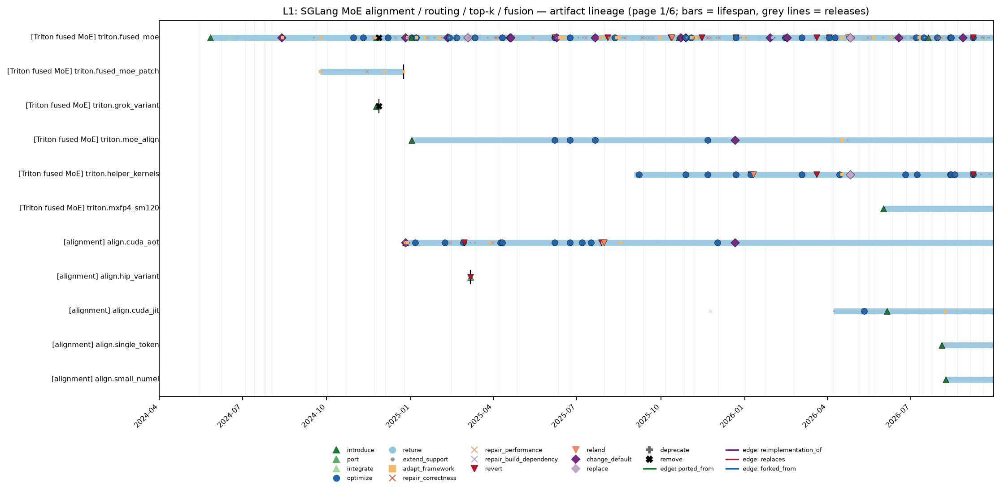
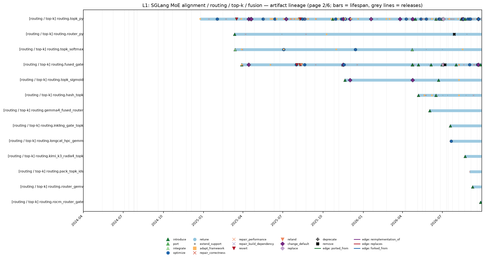
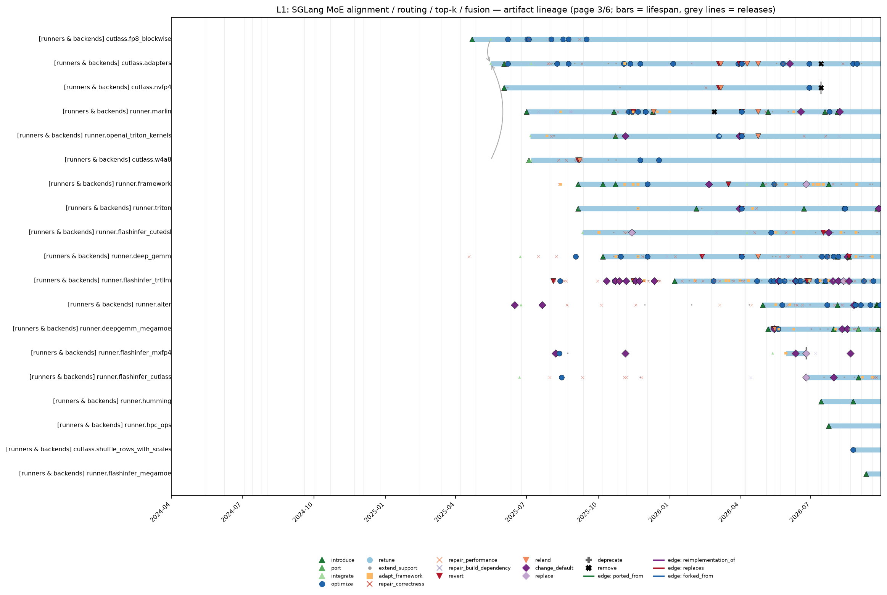
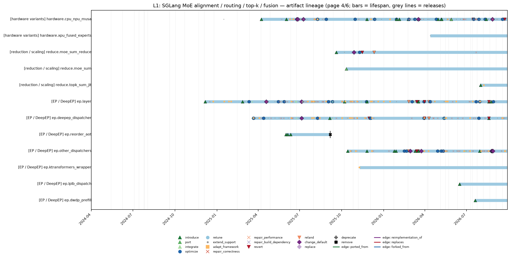
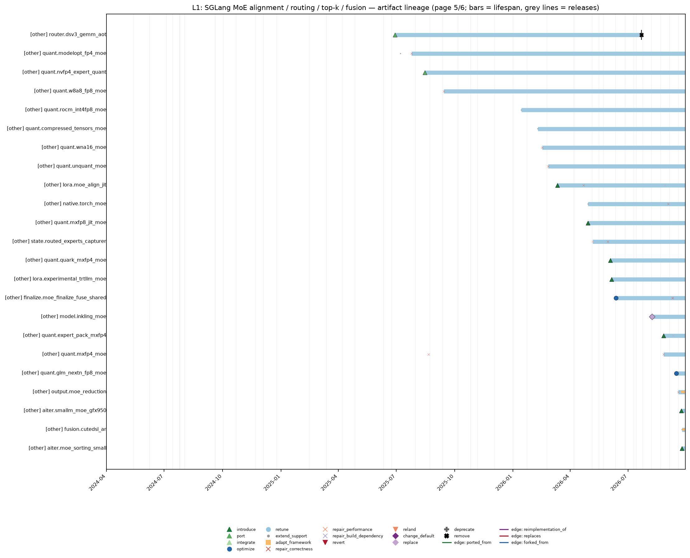
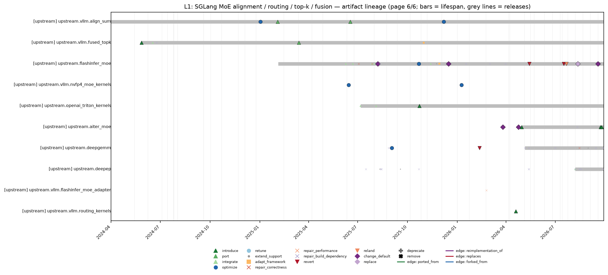
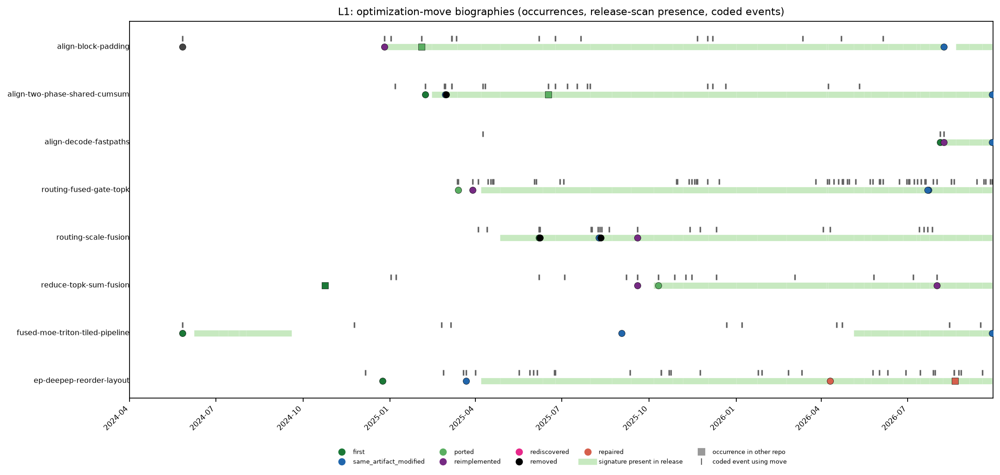
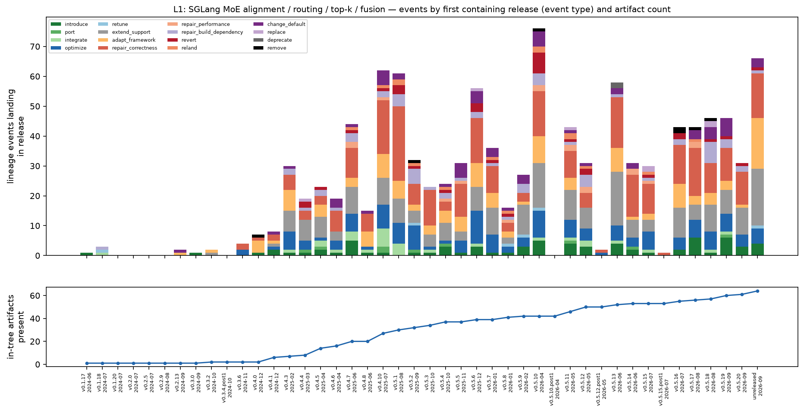

# SGLang MoE alignment, routing, top-k and fusion — kernel lineage report (L1)

*Kernel lineage study. Frozen cutoff 2026-09-28T23:59:59Z; repository `sgl-project/sglang` at `89e1316eae9a`. Tables and every number are generated by `scripts/reports.py` from `data/*.csv` (each number carries a hidden claim tag re-verified by `scripts/consistency.py`); prose in the narrative sections was drafted from the same records and reviewed. Coding was done by LLM coders under `CODEBOOK.md`; agreement figures are model–model consistency, not human inter-rater reliability. Nothing here is causal. See [`METHODS.md`](METHODS.md).*

## Summary

L1 is a MoE-kernel lineage in which the original SGLang Triton `fused_moe` path imported vLLM's sorted-token, padded-expert contract, then repeatedly split that contract across CUDA AOT, Triton helpers, JIT kernels, runner backends, and external libraries while keeping the same router→align→grouped-GEMM→combine skeleton `L1-E-09de730dee`, [vLLM #2453](https://github.com/vllm-project/vllm/pull/2453). The durable mechanism is not one file but a bundle: BLOCK_M-padded expert runs, fused gate/top-k selection, routed-scaling placement, fused top-k output reduction, and expert-parallel token permutation `L1-E-31548116a8`, `L1-E-45dcfc2e76`, `L1-E-616a3e20df`, `L1-E-c2bd094d6e`. The dataset records 1,100<!-- claim:data/lineage-metrics.csv::lineage=L1&metric=verified_events::value::int --> verified events, 8<!-- claim:data/lineage-metrics.csv::lineage=L1&metric=moves::value::int --> audited moves, and 8<!-- claim:data/lineage-metrics.csv::lineage=L1&metric=move_status:live_textual::n::int --> live-textual moves at cutoff, but the prose below treats those aggregates as generated measurements rather than causal proof `L1-E-3fa62da78c`.

- **Census.** 2,391<!-- claim:data/lineage-metrics.csv::lineage=L1&metric=candidates::value::int --> candidates were screened in context; 1,100<!-- claim:data/lineage-metrics.csv::lineage=L1&metric=verified_events::value::int --> are verified lineage events (377<!-- claim:data/lineage-metrics.csv::lineage=L1&metric=key_events::value::int --> key events: introductions, ports, integrations, default changes, replacements, removals, reverts, relands, deprecations).
- **Artifacts.** 88<!-- claim:data/lineage-metrics.csv::lineage=L1&metric=artifacts_registered::value::int --> artifacts registered (10<!-- claim:data/lineage-metrics.csv::lineage=L1&metric=artifacts_upstream::value::int --> upstream kernels or pins); 81<!-- claim:data/lineage-metrics.csv::lineage=L1&metric=artifacts_live_at_cutoff::value::int --> live at the cutoff, 7<!-- claim:data/lineage-metrics.csv::lineage=L1&metric=artifacts_ended::value::int --> ended.
- **Moves.** 8<!-- claim:data/lineage-metrics.csv::lineage=L1&metric=moves::value::int --> optimization moves traced, 5<!-- claim:data/lineage-metrics.csv::lineage=L1&metric=moves_with_biography::value::int --> with biographies; 162<!-- claim:data/lineage-metrics.csv::lineage=L1&metric=events_with_moves::value::int --> events carry a verified move.
- **Code vs mechanism.** Across one subsequent release, 44.7<!-- claim:data/survival-by-releases.csv::kind=artifact_unchanged&lineage=L1&k_releases=1&basis=all_present_releases::share::pct1 -->% of present artifacts stayed textually unchanged, and across three releases 20.2<!-- claim:data/survival-by-releases.csv::kind=artifact_unchanged&lineage=L1&k_releases=3&basis=all_present_releases::share::pct1 -->%; move code signatures persisted across three releases in 97.5<!-- claim:data/survival-by-releases.csv::kind=move&lineage=L1&k_releases=3&basis=all_present_releases::share::pct1 -->% of cases.
- **Maintenance mix.** Primary causes: correctness 312<!-- claim:data/lineage-metrics.csv::lineage=L1&metric=primary_cause:correctness::value::int -->, performance 293<!-- claim:data/lineage-metrics.csv::lineage=L1&metric=primary_cause:performance::value::int -->, framework integration 185<!-- claim:data/lineage-metrics.csv::lineage=L1&metric=primary_cause:framework_integration::value::int -->, specification 144<!-- claim:data/lineage-metrics.csv::lineage=L1&metric=primary_cause:specification::value::int -->, build/dependency 71<!-- claim:data/lineage-metrics.csv::lineage=L1&metric=primary_cause:build_dependency::value::int -->, hardware/compiler 70<!-- claim:data/lineage-metrics.csv::lineage=L1&metric=primary_cause:hardware_compiler::value::int -->, maintenance 25<!-- claim:data/lineage-metrics.csv::lineage=L1&metric=primary_cause:maintenance::value::int -->.
- **Failures.** 4<!-- claim:data/lineage-metrics.csv::lineage=L1&metric=failure_histories::value::int --> failure-to-successor histories reconstructed; 42<!-- claim:data/lineage-metrics.csv::lineage=L1&metric=edge_type:reverts::value::int --> revert edges and 25<!-- claim:data/lineage-metrics.csv::lineage=L1&metric=edge_type:relands::value::int --> reland edges; median time from artifact introduction to first correctness/performance repair (Kaplan–Meier) 126<!-- claim:data/lineage-metrics.csv::lineage=L1&metric=km-first-repair_median_days::value::int --> days.

## 1. Scope and identity rules

**Scope.** SGLang MoE alignment, routing, top-k and fusion. Operational scope: `scripts/scope.py` (paths, integration paths, keywords) and `cache/task-screen.md` (decision rule and scope reminders). Identity rules: `CODEBOOK.md` §2. Lineage-specific identity notes from the artifact registry (`staging/registry/L1-registry.json`):

- Pure moves keep identity; AOT-to-kernels/aot is same artifact.
- JIT copies are separate when they create distinct runtime compilation/dispatch path.
- Upstream kernels are separate from SGLang adapters.
- Attention/indexer top-k, sampling top-k and request routers are excluded name collisions.
- CPU/NPU/MUSA variants are registered with hardware scope.

**Discovery strategies** (a candidate may carry several):

| strategy | candidates |
|---|---|
| `path_core` | 1,259<!-- claim:data/lineage-metrics.csv::lineage=L1&metric=discovery:path_core::value::int --> |
| `symbol_pickaxe` | 779<!-- claim:data/lineage-metrics.csv::lineage=L1&metric=discovery:symbol_pickaxe::value::int --> |
| `body_keyword` | 637<!-- claim:data/lineage-metrics.csv::lineage=L1&metric=discovery:body_keyword::value::int --> |
| `subject_keyword` | 566<!-- claim:data/lineage-metrics.csv::lineage=L1&metric=discovery:subject_keyword::value::int --> |
| `release_notes` | 513<!-- claim:data/lineage-metrics.csv::lineage=L1&metric=discovery:release_notes::value::int --> |
| `dependency_pin` | 403<!-- claim:data/lineage-metrics.csv::lineage=L1&metric=discovery:dependency_pin::value::int --> |
| `path_integration+keyword` | 243<!-- claim:data/lineage-metrics.csv::lineage=L1&metric=discovery:path_integration+keyword::value::int --> |
| `corpus:performance-pr-population` | 101<!-- claim:data/lineage-metrics.csv::lineage=L1&metric=discovery:corpus:performance-pr-population::value::int --> |
| `path_config_only` | 78<!-- claim:data/lineage-metrics.csv::lineage=L1&metric=discovery:path_config_only::value::int --> |
| `corpus:confirmed-reverts` | 37<!-- claim:data/lineage-metrics.csv::lineage=L1&metric=discovery:corpus:confirmed-reverts::value::int --> |
| `corpus:kernel-correctness-cases` | 29<!-- claim:data/lineage-metrics.csv::lineage=L1&metric=discovery:corpus:kernel-correctness-cases::value::int --> |
| `cross_reference` | 26<!-- claim:data/lineage-metrics.csv::lineage=L1&metric=discovery:cross_reference::value::int --> |
| `corpus:production-kernel-provenance` | 15<!-- claim:data/lineage-metrics.csv::lineage=L1&metric=discovery:corpus:production-kernel-provenance::value::int --> |
| `upstream_repo` | 3<!-- claim:data/lineage-metrics.csv::lineage=L1&metric=discovery:upstream_repo::value::int --> |

**Screening outcome** (all candidates inspected in context; final labels after stage-2 and reconciliation): `verified_lineage_event` 1,100<!-- claim:data/lineage-metrics.csv::lineage=L1&metric=candidate_label:verified_lineage_event::value::int -->; `related_context_only` 1,019<!-- claim:data/lineage-metrics.csv::lineage=L1&metric=candidate_label:related_context_only::value::int -->; `out_of_scope` 198<!-- claim:data/lineage-metrics.csv::lineage=L1&metric=candidate_label:out_of_scope::value::int -->; `name_collision` 72<!-- claim:data/lineage-metrics.csv::lineage=L1&metric=candidate_label:name_collision::value::int -->; `insufficient_evidence` 2<!-- claim:data/lineage-metrics.csv::lineage=L1&metric=candidate_label:insufficient_evidence::value::int -->.

**Excluded look-alikes** (name collisions / other scope):

- DSA/DeepSeek-V4 attention/indexer top-k: name_collision — attention/dsv4 topk used by dsa_backend/indexer, not layers/moe routing
- sampling top-k/top-p: name_collision — sampling kernel, not select_experts
- request router/gateway: name_collision — server request router, not MoE expert router
- LoRA-only fused MoE kernels: out_of_scope — LoRA-only; shared align tests only
- MiniMax/DSA attention top-k: name_collision — attention sparse indexer paths
- DeepSelect topk_select vendor: other_lineage:Lx — not called by MoE topk.py/hash_topk.py at cutoff

## 2. Chronology and mechanism narrative

The first durable L1 mechanism is the vLLM-style transformation from flat router output to expert-contiguous GEMM work: group `(token, top-k-slot)` pairs by expert, pad each expert run to a tile multiple, and feed `sorted_token_ids`, `expert_ids`, and a post-pad count to a fused expert GEMM [vLLM #2453](https://github.com/vllm-project/vllm/pull/2453). SGLang's initial Triton `fused_moe` import explicitly cited a vLLM fused_moe blob and combined that padding contract with a Triton two-GEMM expert pipeline whose program IDs traverse token tiles, N tiles, and experts `L1-E-09de730dee`. That early path already made the key boundary decision: padding rows are metadata for scheduling, not real tokens, so consumers must mask padded token IDs before loading activations `L1-E-09de730dee`. *Interpretation:* this is why the lineage survives later file moves: the invariant is the buffer contract, not the original Python file `L1-E-e835a50021`.

SGLang next turned the padding contract into explicit alignment artifacts, first as CUDA AOT and then as Triton/JIT variants `L1-E-31548116a8`, `L1-E-ba5112ff69`. The AOT align path computed padded cumulative counts and sorted routed pairs for the same downstream fused_moe consumer, while the Triton align path exposed a selectable `ENABLE_MOE_ALIGN_BLOCK_SIZE_TRITON` route rather than replacing every caller by default `L1-E-31548116a8`, `L1-E-ba5112ff69`. The multi-block branch came when SGLang split counting/prefix construction from token scatter and used shared-memory cumsum plus atomic scatter to let many CTAs populate expert ranges `L1-E-cdae77b03d`. A follow-up advertised multi-block acceleration, but it was reverted before becoming the stable form, and the reverted title should be read only as evidence that the implementation was rolled back pending more modification `L1-E-1c96fa86cf`, `L1-E-18bb216c28`. The same cross-repo current later reversed direction when vLLM ported SGLang's align kernel back into its own align/sum family and then optimized around padded experts and warp/expert partitioning [vLLM #12574](https://github.com/vllm-project/vllm/pull/12574), [vLLM #19572](https://github.com/vllm-project/vllm/pull/19572).

Routing followed a second ancestry chain through fused top-k kernels, where vLLM's `topk_softmax` template came from a TensorRT-LLM-descended CUDA source before SGLang cherry-picked it `L1-E-61e4433caf`, [vLLM #2769](https://github.com/vllm-project/vllm/pull/2769). SGLang then added a DeepSeek-style fused gate kernel that fused score handling, grouped or biased expert selection, top-k writes, and later shared-expert slots into one routing path `L1-E-45dcfc2e76`. The Python `topk.py` layer remained important because it mediated biased grouped top-k, FlashInfer/AITER/SGL-kernel choices, EPLB masks, and later HashTopK dispatch rather than simply disappearing behind CUDA `L1-E-e835a50021`, `L1-E-35870d55ac`. HashTopK extended the same routing family for DeepSeek V4 by adding hash/vocab top-k artifacts and by calling MoE DSV4 kernels rather than the excluded attention top-k paths `L1-E-35870d55ac`. In 2026, routing also acquired model-specific fast paths: Kimi K3 ported standalone radix routing and packed IDs, and AMD DSV4.1 added ROCm router kernels that compare against AITER semantics, not a generic request-router path `L1-E-fb207b72b0`, `L1-E-effb752188`.

The combine side became its own recurring fusion problem after vLLM introduced `moe_sum` to replace generic `torch.sum` on expert outputs [vLLM #9384](https://github.com/vllm-project/vllm/pull/9384). SGLang first tried to fold `routed_scaling_factor` into a topk_reduce path and immediately reverted that implementation, showing that scale placement was a correctness boundary, not just a micro-optimization `L1-E-515ef4facb`, `L1-E-1fb76ebb93`. The idea returned through gate-output scaling and then a CUDA `moe_sum_reduce` kernel that accumulates top-k expert rows and multiplies by the scalar after the accumulation `L1-E-591c232f7c`, `L1-E-dd949ace23`, `L1-E-616a3e20df`. SGLang separately ported vLLM's `moe_sum` helper and later added a JIT `topk_sum` decode path for Kimi K3, so the current family has both vLLM-acknowledged and SGLang-local reduction implementations `L1-E-8fdcd98efe`, `L1-E-fb207b72b0`.

The fused MoE core then became a backend slot rather than a single implementation, especially after the MoeRunner framework split dispatch, pre-permute, core runner, post-permute, and combine phases `L1-E-3fa62da78c`. The Triton runner preserved the original tiled expert-GEMM logic, but OpenAI `triton_kernels`, DeepGEMM, Marlin, FlashInfer TRT-LLM, FlashInfer CuteDSL/CUTLASS/MegaMOE, AITER, and HPC-Ops integrations made the same framework boundary host many kernels with different quantization and hardware preconditions `L1-E-253454de9b`, `L1-E-62eff37ba1`, `L1-E-3c06b673af`, `L1-E-8642dbe416`, `L1-E-24b30f7757`, `L1-E-c554dc5c64`, `L1-E-108bfd8b6a`, `L1-E-1b77f498a0`. CUTLASS FP8, NVFP4, and W4A8 changed lineage only where they changed scale layouts, TMA synchronization, or adapter contracts; they are not counted as the same Triton code just because they implement routed experts `L1-E-e62c49557d`, `L1-E-eb38c7d1ca`, `L1-E-da3890e82a`. The later AOT-to-JIT and kernels.ops moves kept many concepts live while changing packaging and dispatch surfaces, especially for `moe_fused_gate`, top-k softmax/sigmoid, align, and helper kernels [SGLang #30786](https://github.com/sgl-project/sglang/pull/30786), [SGLang #32072](https://github.com/sgl-project/sglang/pull/32072), [SGLang #32648](https://github.com/sgl-project/sglang/pull/32648).

The 2026 fast paths sharpened the distinction between prefill-style throughput and decode-style launch overhead, because Kimi K3 and tiny-batch work added one-warp or one-CTA align, JIT top-k sum, packed top-k IDs, and model-specific fused routers without removing the generic align/reduce contracts `L1-E-abddb1c7e9`, `L1-E-5fdf6cd18f`, `L1-E-fb207b72b0`. The JIT namespace migration and AOT-to-JIT topk_softmax migration changed when kernels are compiled and loaded, while preserving the routing or alignment postconditions that callers observe `L1-E-4ad5bb5d9a`, `L1-E-56a759cffc`. CuTe DSL all-reduce/finalize hooks and CUTLASS row/scale gathering show the same late-stage pattern at layer boundaries: fuse adjacent MoE bookkeeping only when the adapter can carry enough metadata to recover the original output contract `L1-E-3177d10ca6`, `L1-E-77940dec80`.

Expert parallelism is the other major branch of L1, because DeepEP and EP layers transform router outputs into communication/GEMM layouts rather than only local grouped GEMM tiles `L1-E-e835a50021`. The EP move sorts flattened top-k IDs, computes segment pointers and `src2dst`, permutes hidden states into expert-contiguous buffers, and post-reorders outputs while applying top-k weights and optional routed scaling `L1-E-c2bd094d6e`. DeepEP low-latency relands and DeepEP wheel pinning show that the adapter/library boundary became part of the kernel lineage, because SGLang code relied on external dispatcher metadata and later on an `sgl-deep-ep` wheel rather than only in-tree kernels `L1-E-18f41ac427`, `L1-E-eb3cc879e0`. *Interpretation:* L1's central survival pattern is therefore “contract migration”: padding, routing, and scaling assumptions are repeatedly moved into faster or more specialized kernels, while the MoeRunner/dispatcher abstractions absorb the churn `L1-E-3fa62da78c`.

### Chronological table of key events

Showing 140 of 284 key events (all events with full fields: `data/lineage-events.csv`, filter `lineage == L1`).

| date | first release | event | type | artifacts | PR | evidence (excerpt) |
|---|---|---|---|---|---|---|
| 2024-01-29 | v0.3.0 | `L1-E-5d60def02c` | introduce | L1.upstream.vllm.align_sum | [#2453](https://github.com/vllm-project/vllm/pull/2453) (vllm-project) | Implement the `align_block_size` function in C++ to achieve a 10% performance improvement. |
| 2024-05-27 | v0.1.17 | `L1-E-09de730dee` | introduce | L1.triton.fused_moe; L1.upstream.vllm.fused_topk | [#484](https://github.com/sgl-project/sglang/pull/484) | Adapted from https://github.com/vllm-project/vllm/blob/c7f2cf2b7f67 |
| 2024-08-13 | v0.2.13 | `L1-E-ad3e4f1619` | change_default | L1.triton.fused_moe | [#1081](https://github.com/sgl-project/sglang/pull/1081) | Update the mixtral to use the better FusedMoE layer |
| 2024-11-24 | v0.4.0 | `L1-E-be0124bda0` | introduce | L1.triton.fused_moe; L1.triton.grok_variant | [#2163](https://github.com/sgl-project/sglang/pull/2163) | Adapted from https://github.com/vllm-project/vllm/blob/a6221a144af772fd1a68fe7e627935dc53e81738 |
| 2024-11-27 | v0.4.0 | `L1-E-dd5eba4c88` | remove | L1.triton.grok_variant; L1.triton.fused_moe | [#2223](https://github.com/sgl-project/sglang/pull/2223) | We do not want to maintain a separate fused moe folder. |
| 2024-12-06 | v0.4.1 | `L1-E-3d32e4a32c` | introduce | L1.ep.layer | [#2371](https://github.com/sgl-project/sglang/pull/2371) | Resubmit the PR for MoE-EP. |
| 2024-12-26 | v0.4.1 | `L1-E-31548116a8` | introduce | L1.align.cuda_aot | [#2579](https://github.com/sgl-project/sglang/pull/2579) | CEILDIV(tokens_cnts[index(num_experts, blockDim.x, i - 1)], block_size) * block_size |
| 2024-12-26 | v0.4.1 | `L1-E-60e2fdcf4f` | change_default | L1.align.cuda_aot; L1.triton.fused_moe | [#2581](https://github.com/sgl-project/sglang/pull/2581) | from sgl_kernel import moe_align_block_size as sgl_moe_align_block_size |
| 2025-01-02 | v0.4.3 | `L1-E-148254d4db` | optimize | L1.triton.fused_moe; L1.upstream.vllm.align_sum | [#2705](https://github.com/sgl-project/sglang/pull/2705) | modify torch.sum to ops.moe_sum in fused_moe.py |
| 2025-01-02 | v0.4.3 | `L1-E-ba5112ff69` | introduce | L1.triton.moe_align; L1.triton.fused_moe | [#2712](https://github.com/sgl-project/sglang/pull/2712) | export ENABLE_MOE_ALIGN_BLOCK_SIZE_TRITON=1 |
| 2025-01-06 | v0.4.3 | `L1-E-ded9fcd09a` | optimize | L1.align.cuda_aot | [#2735](https://github.com/sgl-project/sglang/pull/2735) | atomicAdd(&shared_counts[warp_idx][expert_offset], 1); |
| 2025-01-07 | v0.4.3 | `L1-E-bdc1acf6cd` | optimize | L1.triton.fused_moe | [#2761](https://github.com/sgl-project/sglang/pull/2761) | if topk_ids.shape[1] == 1: |
| 2025-02-03 | v0.7.2 | `L1-E-95460fc513` | port | L1.upstream.vllm.align_sum | [#12574](https://github.com/vllm-project/vllm/pull/12574) (vllm-project) | sgl_moe_align_block_size is based on: https://github.com/sgl-project/sglang/commit/ded9fcd09a43d5e7d5bb31a2bc3 |
| 2025-02-07 | v0.4.3 | `L1-E-cdae77b03d` | optimize | L1.align.cuda_aot | [#3347](https://github.com/sgl-project/sglang/pull/3347) | moe_token_sort_kernel |
| 2025-02-10 | v0.4.3 | `L1-E-64c8713573` | change_default | L1.triton.fused_moe | [#3433](https://github.com/sgl-project/sglang/pull/3433) | from sgl_kernel import gelu_and_mul, silu_and_mul |
| 2025-02-26 | v0.4.4 | `L1-E-21463e321a` | introduce | L1.ep.layer | [#3602](https://github.com/sgl-project/sglang/pull/3602) | Expert Parallelism (EP) Support for DeepSeek  V3/R1 |
| 2025-02-27 | v0.4.4 | `L1-E-1c96fa86cf` | optimize | L1.align.cuda_aot | [#3613](https://github.com/sgl-project/sglang/pull/3613) | overall acceleration under A100 chip could be up to **6x** |
| 2025-02-28 | v0.4.4 | `L1-E-18bb216c28` | revert | L1.align.cuda_aot | [#3982](https://github.com/sgl-project/sglang/pull/3982) | Revert "[MOE] enable efficient moe_alignment multi-blocks execution (3x~6x)" |
| 2025-03-04 | v0.4.4 | `L1-E-51d25405a7` | replace | L1.triton.fused_moe | [#4053](https://github.com/sgl-project/sglang/pull/4053) | Performance boost (DSv3 +25~35%) |
| 2025-03-07 | v0.4.4 | `L1-E-0beea4503f` | port | L1.align.hip_variant | [#4178](https://github.com/sgl-project/sglang/pull/4178) | This is a file automatically generated by hipify |
| 2025-03-07 | v0.4.4 | `L1-E-eb61f5c9af` | revert | L1.align.hip_variant | [#4186](https://github.com/sgl-project/sglang/pull/4186) | Revert "ROCm: Flex Attention Enablement with custom backends (#4178)" |
| 2025-03-13 | v0.4.5 | `L1-E-c6d7f8d370` | introduce | L1.routing.router_py | [#4398](https://github.com/sgl-project/sglang/pull/4398) | fused_moe_router_kernel |
| 2025-03-14 | v0.4.5 | `L1-E-61e4433caf` | port | L1.routing.topk_softmax; L1.upstream.vllm.fused_topk | [#4302](https://github.com/sgl-project/sglang/pull/4302) | Adapt from https://github.com/vllm-project/vllm/blob/v0.7.3 |
| 2025-03-17 | v0.4.5 | `L1-E-3ded4b215d` | revert | L1.routing.topk_py | [#4505](https://github.com/sgl-project/sglang/pull/4505) | Revert "feat: update grouped_topk to support softmax and sigmoid" |
| 2025-03-22 | v0.4.5 | `L1-E-c2bd094d6e` | optimize | L1.ep.deepep_dispatcher | [#4643](https://github.com/sgl-project/sglang/pull/4643) | implemented high-efficiency Triton kernels |
| 2025-03-29 | v0.4.5 | `L1-E-45dcfc2e76` | introduce | L1.routing.fused_gate | [#4530](https://github.com/sgl-project/sglang/pull/4530) | PR adapted and improved from #3191 |
| 2025-04-08 | v0.4.6 | `L1-E-a73c4df438` | introduce | L1.hardware.cpu_npu_musa | [#5150](https://github.com/sgl-project/sglang/pull/5150) | Fused MoE kernel with AMX |
| 2025-04-09 | v0.4.6 | `L1-E-f730362ee2` | optimize | L1.align.cuda_aot | [#5086](https://github.com/sgl-project/sglang/pull/5086) | for (size_t i = tid; i < numel; i += stride) |
| 2025-04-11 | v0.4.6 | `L1-E-60bcbf2a35` | optimize | L1.align.cuda_aot; L1.triton.fused_moe | [#5298](https://github.com/sgl-project/sglang/pull/5298) | Follow [pr 5086] |
| 2025-04-13 | v0.4.6 | `L1-E-adca585bfb` | optimize | L1.ep.deepep_dispatcher | [#5277](https://github.com/sgl-project/sglang/pull/5277) | Using `masked_scale` tooks 36.5 us |
| 2025-04-14 | v0.4.6 | `L1-E-38076dea84` | change_default | L1.routing.topk_py; L1.routing.fused_gate | [#5371](https://github.com/sgl-project/sglang/pull/5371) | Only one kernel now. |
| 2025-04-19 | v0.4.6 | `L1-E-d58e354472` | change_default | L1.routing.topk_py; L1.triton.fused_moe; L1.ep.layer | [#5504](https://github.com/sgl-project/sglang/pull/5504) | control over this optimization is given to the user |
| 2025-04-20 | v0.4.6 | `L1-E-d9dd529854` | change_default | L1.routing.topk_py; L1.triton.fused_moe | [#5571](https://github.com/sgl-project/sglang/pull/5571) | when SM version >=90 |
| 2025-04-22 | v0.4.7 | `L1-E-e62c49557d` | introduce | L1.cutlass.fp8_blockwise | [#5281](https://github.com/sgl-project/sglang/pull/5281) | FP8 Blockscale MoE CUTLASS kernels on Blackwell |
| 2025-05-17 | v0.4.7 | `L1-E-2716830802` | optimize | L1.routing.topk_py | [#6175](https://github.com/sgl-project/sglang/pull/6175) | baseline: 6 tok/s/gpu |
| 2025-05-28 | v0.4.7 | `L1-E-c087ddd686` | optimize | L1.ep.layer | [#6627](https://github.com/sgl-project/sglang/pull/6627) | kernel gains 10-15% performance |
| 2025-06-01 | v0.4.7 | `L1-E-55444ed667` | introduce | L1.ep.reorder_aot | [#6699](https://github.com/sgl-project/sglang/pull/6699) | introduce cuda implementation for this kernel |
| 2025-06-02 | v0.4.7 | `L1-E-eb38c7d1ca` | introduce | L1.cutlass.nvfp4; L1.cutlass.adapters | [#6093](https://github.com/sgl-project/sglang/pull/6093) | This kernel adds support for NVFP4 MoE kernels |
| 2025-06-02 | v0.4.7 | `L1-E-ff00895c46` | introduce | L1.hardware.cpu_npu_musa | [#6456](https://github.com/sgl-project/sglang/pull/6456) | TopK+sigmoid |
| 2025-06-05 | v0.4.7 | `L1-E-43baba649e` | introduce | L1.ep.reorder_aot | [#6837](https://github.com/sgl-project/sglang/pull/6837) | moe_post_reorder is one of the important kernels |
| 2025-06-07 | v0.4.7 | `L1-E-8b5f83ed3b` | optimize | L1.triton.fused_moe; L1.triton.moe_align; L1.align.cuda_aot | [#6369](https://github.com/sgl-project/sglang/pull/6369) | reduce torch.zeros overhead |
| 2025-06-07 | v0.4.7 | `L1-E-515ef4facb` | optimize | L1.triton.fused_moe | [#6220](https://github.com/sgl-project/sglang/pull/6220) | accumulator = accumulator * routed_scaling_factor |
| 2025-06-07 | v0.4.7 | `L1-E-3e56f557fd` | optimize | L1.cutlass.fp8_blockwise; L1.cutlass.adapters | [#6916](https://github.com/sgl-project/sglang/pull/6916) | Fuses this single line |
| 2025-06-07 | v0.4.7 | `L1-E-1fb76ebb93` | revert | L1.triton.fused_moe | [#6968](https://github.com/sgl-project/sglang/pull/6968) | This reverts commit 515ef4facbc89cd7c093c198386a8817fce856d6. |
| 2025-06-08 | v0.4.7 | `L1-E-3712abfaf9` | reland | L1.triton.fused_moe | [#6970](https://github.com/sgl-project/sglang/pull/6970) | Fuse routed scaling factor in deepseek |
| 2025-06-09 | v0.4.7 | `L1-E-a979daac3b` | change_default | L1.triton.fused_moe | [#7013](https://github.com/sgl-project/sglang/pull/7013) | Fallback to triton version |
| 2025-06-11 | v0.4.8 | `L1-E-84727a5139` | introduce | L1.ep.reorder_aot | [#6919](https://github.com/sgl-project/sglang/pull/6919) | Rewrite moe_ep_silu_and_mul Triton kernel in CUDA. |
| 2025-06-16 | v0.4.8 | `L1-E-405780bcf0` | change_default | L1.runner.aiter | [#7160](https://github.com/sgl-project/sglang/pull/7160) | Use new aiter moe implementation |
| 2025-06-17 | v0.9.2 | `L1-E-ffb2cd6b54` | port | L1.upstream.vllm.align_sum | [#19572](https://github.com/vllm-project/vllm/pull/19572) (vllm-project) | The implementation is taken from https://github.com/sgl-project/sglang/blob/8b5f83ed3b7d2a49ad5c5cd5aa61c5d502 |
| 2025-06-24 | v0.4.10 | `L1-E-7151194bb2` | optimize | L1.triton.fused_moe; L1.triton.moe_align | [#7439](https://github.com/sgl-project/sglang/pull/7439) | `cumsum_buffer` is not needed to be initialized here. |
| 2025-06-24 | v0.4.10 | `L1-E-57ab776910` | optimize | L1.align.cuda_aot | [#7437](https://github.com/sgl-project/sglang/pull/7437) | Fuse `sorted_token_ids` padding to `moe_align_block_size`. |
| 2025-06-25 | v0.4.10 | `L1-E-7eb47b0f3d` | change_default | L1.hardware.cpu_npu_musa | [#6641](https://github.com/sgl-project/sglang/pull/6641) | replace `moe_forward_native` with `fused_experts_cpu` |
| 2025-06-27 | v0.4.10 | `L1-E-a5317b2fd3` | change_default | L1.hardware.cpu_npu_musa | [#6769](https://github.com/sgl-project/sglang/pull/6769) | INT8 and FP8 MoE: `fused_experts_cpu` |
| 2025-06-29 | v0.4.10 | `L1-E-7248272ccc` | port | L1.router.dsv3_gemm_aot | [#7627](https://github.com/sgl-project/sglang/pull/7627) | Adapt router gemm kernel from [trtllm] |
| 2025-07-01 | v0.4.10 | `L1-E-8e03b641ba` | introduce | L1.runner.marlin | [#7683](https://github.com/sgl-project/sglang/pull/7683) | remove the wna16 quantization dependency on vllm |
| 2025-07-03 | v0.4.10 | `L1-E-2998c4bdf4` | optimize | L1.routing.topk_softmax | [#7744](https://github.com/sgl-project/sglang/pull/7744) | Fuse renormalization of topk_weights into this kernel |
| 2025-07-04 | v0.4.10 | `L1-E-da3890e82a` | port | L1.cutlass.w4a8 | [#7772](https://github.com/sgl-project/sglang/pull/7772) | adapted from [trtllm] |
| 2025-07-05 | v0.4.10 | `L1-E-8fc910db03` | change_default | L1.ep.deepep_dispatcher; L1.ep.layer | [#7222](https://github.com/sgl-project/sglang/pull/7222) | enables auto DeepEP dispatch for DP attention |
| 2025-07-07 | v0.4.10 | `L1-E-a3398d8478` | optimize | L1.align.cuda_aot | [#7794](https://github.com/sgl-project/sglang/pull/7794) | Blelloch scan |
| 2025-07-09 | v0.4.10 | `L1-E-d389bedf72` | change_default | L1.hardware.cpu_npu_musa; L1.routing.topk_py | [#7838](https://github.com/sgl-project/sglang/pull/7838) | fused_topk = fused_topk_cpu |
| 2025-07-17 | v0.4.10 | `L1-E-af1cc8fe2d` | optimize | L1.align.cuda_aot | [#7884](https://github.com/sgl-project/sglang/pull/7884) | introduce block / warp scan algorithm in fused MoE path |
| 2025-07-21 | v0.4.10 | `L1-E-c9e8613c97` | optimize | L1.triton.fused_moe; L1.triton.moe_align | [#8193](https://github.com/sgl-project/sglang/pull/8193) | fuse_sorted_ids_padding = sorted_ids.shape[0] <= 4096 |
| 2025-07-21 | v0.4.10 | `L1-E-e50109f2ed` | change_default | L1.runner.aiter; L1.triton.fused_moe | [#7484](https://github.com/sgl-project/sglang/pull/7484) | vLLM's `scaled_fp8_quant` and `moe_sum` will be replaced with the aiter's counterparts |
| 2025-07-28 | v0.4.10 | `L1-E-2262369905` | revert | L1.align.cuda_aot | [#8457](https://github.com/sgl-project/sglang/pull/8457) | PR has bug, and it caused a lot of test failture in ci. |
| 2025-07-31 | v0.4.10 | `L1-E-3bdcdd134b` | reland | L1.align.cuda_aot | [#8461](https://github.com/sgl-project/sglang/pull/8461) | diverge the branches for HIP and CUDA. |
| 2025-08-01 | v0.5.1 | `L1-E-f642524fd9` | optimize | L1.routing.fused_gate | [#8364](https://github.com/sgl-project/sglang/pull/8364) | Fuse the multiply by routed_scaling_factor into select_experts |
| 2025-08-02 | v0.5.1 | `L1-E-f9f0138f80` | revert | L1.routing.fused_gate | [#8706](https://github.com/sgl-project/sglang/pull/8706) | Reverts sgl-project/sglang#8364 |
| 2025-08-04 | v0.5.1 | `L1-E-5e91fed1c5` | revert | L1.triton.fused_moe; L1.runner.flashinfer_trtllm | [#8797](https://github.com/sgl-project/sglang/pull/8797) | This reverts commit b01eeb80f8406cba569af5deb40f394293f9950d. |
| 2025-08-07 | v0.5.1 | `L1-E-47824c1488` | change_default | L1.runner.flashinfer_mxfp4; L1.upstream.flashinfer_moe | [#8898](https://github.com/sgl-project/sglang/pull/8898) | Auto enable best flashinfer mxfp4  kernel in b200 |
| 2025-08-07 | v0.5.1 | `L1-E-76915d68a8` | change_default | L1.runner.flashinfer_mxfp4 | [#8950](https://github.com/sgl-project/sglang/pull/8950) | Fix running lmsys/gpt-oss-20b-bf16 |
| 2025-08-08 | v0.5.1 | `L1-E-591c232f7c` | reland | L1.routing.fused_gate; L1.routing.topk_py | [#8770](https://github.com/sgl-project/sglang/pull/8770) | Resubmit of https://github.com/sgl-project/sglang/pull/8364 |
| 2025-08-10 | v0.5.1 | `L1-E-dd949ace23` | revert | L1.routing.fused_gate; L1.routing.topk_py | [#9035](https://github.com/sgl-project/sglang/pull/9035) | This reverts commit 591c232f7c9ef959c8620567789fe9d918a58bb4. |
| 2025-08-12 | v0.5.1 | `L1-E-13c48dcf88` | reland | L1.routing.fused_gate | [#9088](https://github.com/sgl-project/sglang/pull/9088) | 2nd resubmit of https://github.com/sgl-project/sglang/pull/8364 |
| 2025-08-15 | v0.5.2 | `L1-E-4fc09e0df0` | port | L1.quant.nvfp4_expert_quant | [#8777](https://github.com/sgl-project/sglang/pull/8777) | Port vLLM's [FP4 MoE kernel optimization (PR #19500)] |
| 2025-08-20 | v0.5.2 | `L1-E-a91e90d9a3` | optimize | L1.routing.topk_py; L1.routing.fused_gate | [#8690](https://github.com/sgl-project/sglang/pull/8690) | Fuse routed scaling factor into select_experts |
| 2025-09-05 | v0.5.2 | `L1-E-0e78c63c0e` | revert | L1.cutlass.w4a8 | [#10097](https://github.com/sgl-project/sglang/pull/10097) | This reverts commit f78b7fd16dbfe32c2ee73c1f3fef49fc1257b27f. |
| 2025-09-05 | v0.5.2 | `L1-E-3fa62da78c` | introduce | L1.runner.framework; L1.runner.triton; L1.ep.deepep_dispatcher | [#9269](https://github.com/sgl-project/sglang/pull/9269) | dispatch -> pre-permute -> core runner -> post-permute -> combine |
| 2025-09-06 | v0.5.2 | `L1-E-5f1eb20484` | remove | L1.ep.reorder_aot | [#9956](https://github.com/sgl-project/sglang/pull/9956) | Remove unused ep_moe cuda kernels |
| 2025-09-07 | v0.5.2 | `L1-E-cb3918a091` | optimize | L1.triton.helper_kernels | [#9477](https://github.com/sgl-project/sglang/pull/9477) | get speedup up to 17.6% |
| 2025-09-07 | v0.5.2 | `L1-E-ee0b3c5bad` | reland | L1.cutlass.w4a8 | [#10108](https://github.com/sgl-project/sglang/pull/10108) | use bfloat16 as the output type |
| 2025-09-11 | v0.5.2 | `L1-E-c5d2b01cea` | optimize | L1.ep.layer | [#10303](https://github.com/sgl-project/sglang/pull/10303) | throughput of our model in the prefill phase increased by 10% |
| 2025-09-19 | v0.5.3 | `L1-E-616a3e20df` | introduce | L1.reduce.moe_sum_reduce | [#10321](https://github.com/sgl-project/sglang/pull/10321) | rewrite it in CUDA for better performance |
| 2025-10-07 | v0.5.4 | `L1-E-3c06b673af` | introduce | L1.runner.deep_gemm; L1.runner.framework; L1.ep.layer | [#11211](https://github.com/sgl-project/sglang/pull/11211) | return MoeRunnerBackend.DEEP_GEMM |
| 2025-10-11 | v0.5.4 | `L1-E-8fdcd98efe` | port | L1.reduce.moe_sum | [#11019](https://github.com/sgl-project/sglang/pull/11019) | Adapted from: https://github.com/vllm-project/vllm/tree/c85be1f6 |
| 2025-10-12 | v0.5.4 | `L1-E-1bdd010291` | revert | L1.triton.fused_moe | [#11520](https://github.com/sgl-project/sglang/pull/11520) | Reverts sgl-project/sglang#11331 |
| 2025-10-12 | v0.5.4 | `L1-E-a2b3d9b90b` | change_default | L1.runner.flashinfer_trtllm | [#11512](https://github.com/sgl-project/sglang/pull/11512) | replacing triton (current default) |
| 2025-10-13 | v0.5.4 | `L1-E-516738b096` | reland | L1.triton.fused_moe | [#11528](https://github.com/sgl-project/sglang/pull/11528) | Depreate `global_server_args_dict` |
| 2025-10-14 | v0.5.4 | `L1-E-a40229f6f8` | introduce | L1.ep.other_dispatchers | [#10423](https://github.com/sgl-project/sglang/pull/10423) | Set `--moe-a2a-backend mooncake`. |
| 2025-10-21 | v0.5.4 | `L1-E-7e6191c098` | introduce | L1.triton.fused_moe; L1.runner.marlin | [#11487](https://github.com/sgl-project/sglang/pull/11487) | KTransformers Integration to Support CPU/GPU Hybrid Inference for MoE Models |
| 2025-10-23 | v0.5.5 | `L1-E-62eff37ba1` | introduce | L1.runner.openai_triton_kernels; L1.upstream.openai_triton_kernels; L1 | [#11795](https://github.com/sgl-project/sglang/pull/11795) | Execute MoE experts via the external triton_kernels package. |
| 2025-10-23 | v0.5.5 | `L1-E-f80371ff8c` | change_default | L1.runner.flashinfer_trtllm; L1.triton.fused_moe | [#11816](https://github.com/sgl-project/sglang/pull/11816) | use flashinfer_trtllm as default moe runner backend, replacing triton |
| 2025-10-28 | v0.5.5 | `L1-E-77225d602a` | change_default | L1.runner.flashinfer_trtllm | [#11928](https://github.com/sgl-project/sglang/pull/11928) | Only for SM100 |
| 2025-10-28 | v0.5.5 | `L1-E-813bd6f85c` | change_default | L1.reduce.moe_sum_reduce; L1.triton.fused_moe | [#10654](https://github.com/sgl-project/sglang/pull/10654) | use moe_sum_reduce cuda kernel implemented in #10321 |
| 2025-10-30 | v0.5.5 | `L1-E-cafebef154` | optimize | L1.routing.topk_py; L1.hardware.cpu_npu_musa | [#11969](https://github.com/sgl-project/sglang/pull/11969) | Replaces torch-natively implemented topk with fused kernel api provided with torch_npu |
| 2025-11-05 | v0.5.5 | `L1-E-fb2e816e83` | change_default | L1.runner.flashinfer_mxfp4; L1.runner.openai_triton_kernels | [#12696](https://github.com/sgl-project/sglang/pull/12696) | if self.moe_runner_backend == "auto": |
| 2025-11-06 | v0.5.5 | `L1-E-cd135bfe30` | change_default | L1.runner.flashinfer_trtllm | [#12778](https://github.com/sgl-project/sglang/pull/12778) | self.quantization in ["fp8", "modelopt_fp8", "modelopt_fp4"] |
| 2025-11-09 | v0.5.6 | `L1-E-44f594d832` | optimize | L1.runner.marlin; L1.reduce.moe_sum_reduce | [#12888](https://github.com/sgl-project/sglang/pull/12888) | moe_sum_reduce( intermediate_cache3, output, routed_scaling_factor |
| 2025-11-12 | v0.5.6 | `L1-E-a1cb717d0b` | optimize | L1.routing.topk_py | [#13150](https://github.com/sgl-project/sglang/pull/13150) | Optimized version for num_expert_group=1 case |
| 2025-11-13 | v0.5.6 | `L1-E-4edb240112` | optimize | L1.runner.marlin | [#12998](https://github.com/sgl-project/sglang/pull/12998) | routed_scaling_factor=self.moe_runner_config.routed_scaling_factor |
| 2025-11-13 | v0.5.6 | `L1-E-6664083522` | replace | L1.runner.flashinfer_cutedsl | [#12376](https://github.com/sgl-project/sglang/pull/12376) | equivalent in implementation with sglang's |
| 2025-11-15 | v0.5.6 | `L1-E-2a96e302cb` | revert | L1.runner.marlin; L1.reduce.moe_sum_reduce | [#13314](https://github.com/sgl-project/sglang/pull/13314) | Revert moe sum reduce for marlin moe |
| 2025-11-15 | v0.5.6 | `L1-E-1d3d42bda0` | introduce | L1.routing.fused_gate | [#13287](https://github.com/sgl-project/sglang/pull/13287) | Each block handles one token with WARPS_PER_TOKEN_SMALL warps collaborating |
| 2025-11-15 | v0.5.6 | `L1-E-78a4b446c6` | revert | L1.triton.fused_moe; L1.runner.flashinfer_trtllm | [#13348](https://github.com/sgl-project/sglang/pull/13348) | Fix dpsk-r1-fp4 tp8 by reverting two commits |
| 2025-11-16 | v0.5.6 | `L1-E-50691d7b49` | change_default | L1.routing.topk_py; L1.routing.fused_gate | [#13332](https://github.com/sgl-project/sglang/pull/13332) | return kimi_k2_moe_fused_gate( gating_output.to(dtype=torch.float32) |
| 2025-11-18 | v0.5.6 | `L1-E-92ad2ff9ce` | change_default | L1.runner.flashinfer_trtllm | [#13489](https://github.com/sgl-project/sglang/pull/13489) | Use flashinfer_trtllm as MoE runner backend on sm100 for |
| 2025-11-18 | v0.5.6 | `L1-E-820e13c9c1` | optimize | L1.routing.fused_gate | [#13374](https://github.com/sgl-project/sglang/pull/13374) | Vectorization constants (used by large token kernel) |
| 2025-11-20 | v0.5.6 | `L1-E-e72cf13693` | introduce | L1.routing.topk_sigmoid | [#13049](https://github.com/sgl-project/sglang/pull/13049) | It fuses the sigmoid, max and argmax into a single kernel. |
| 2025-11-21 | v0.5.6 | `L1-E-eff7df6d0a` | optimize | L1.triton.helper_kernels; L1.routing.topk_py | [#13705](https://github.com/sgl-project/sglang/pull/13705) | Introduced a fused shared-expert append Triton kernel |
| 2025-11-21 | v0.5.6 | `L1-E-bfcf15a129` | optimize | L1.triton.moe_align | [#13587](https://github.com/sgl-project/sglang/pull/13587) | fuse_sorted_ids_padding, True |
| 2025-11-23 | v0.5.6 | `L1-E-618ca23802` | change_default | L1.runner.flashinfer_trtllm | [#13687](https://github.com/sgl-project/sglang/pull/13687) | --moe-runner-backend flashinfer_trtllm  --quantization fp8 will be set automatically |
| 2025-11-24 | v0.5.6 | `L1-E-9535015d05` | optimize | L1.ep.layer; L1.cutlass.w4a8; L1.cutlass.adapters | [#10027](https://github.com/sgl-project/sglang/pull/10027) | Increased parallelism in the pre-reorder and post-reorder kernels |
| 2025-11-25 | v0.5.6 | `L1-E-432ecf841e` | introduce | L1.ep.other_dispatchers; L1.ep.layer; L1.hardware.cpu_npu_musa | [#12078](https://github.com/sgl-project/sglang/pull/12078) | add moe-a2a-backend named ascend_fuseep |
| 2025-11-30 | v0.5.6 | `L1-E-f1115cf58d` | revert | L1.ep.deepep_dispatcher | [#14171](https://github.com/sgl-project/sglang/pull/14171) | Reverts sgl-project/sglang#14065 |
| 2025-12-02 | v0.5.6 | `L1-E-3dabd609fb` | change_default | L1.routing.topk_py; L1.routing.topk_sigmoid | [#14047](https://github.com/sgl-project/sglang/pull/14047) | using the `topk_sigmoid` kernel implementation from #13049 |
| 2025-12-02 | v0.5.7 | `L1-E-c5947ecd85` | optimize | L1.align.cuda_aot | [#14133](https://github.com/sgl-project/sglang/pull/14133) | Use a separate group of threads to initialize `sorted_token_ids` in parallel |
| 2025-12-07 | v0.13.0 | `L1-E-879ddb09c3` | optimize | L1.upstream.vllm.align_sum | [#29642](https://github.com/vllm-project/vllm/pull/29642) (vllm-project) | use additional thread or threadblock resources to fill `sorted_token_ids` |
| 2025-12-10 | v0.5.7 | `L1-E-8642dbe416` | introduce | L1.runner.marlin | [#14554](https://github.com/sgl-project/sglang/pull/14554) | Implemented `MarlinRunnerInput`, `MarlinRunnerOutput`, `MarlinMoeQuantInfo`, `MarlinRunnerCore` |
| 2025-12-11 | v0.5.7 | `L1-E-5b5571a8da` | reland | L1.runner.marlin; L1.reduce.moe_sum_reduce | [#14829](https://github.com/sgl-project/sglang/pull/14829) | Now the marlin kernel crash issue is solved, so we can apply this change back. |
| 2025-12-12 | v0.5.7 | `L1-E-4eda4194f2` | change_default | L1.runner.flashinfer_trtllm | [#15002](https://github.com/sgl-project/sglang/pull/15002) | A quick fix for draft model acc regression of DeepSeek V3. |
| 2025-12-14 | v0.5.7 | `L1-E-a9ce1623cd` | optimize | L1.routing.topk_softmax | [#13969](https://github.com/sgl-project/sglang/pull/13969) | each thread to maintain its local top-2 elements |
| 2025-12-16 | v0.5.7 | `L1-E-435d1c83c1` | change_default | L1.upstream.flashinfer_moe | [#14357](https://github.com/sgl-project/sglang/pull/14357) | enable Flashinfer autotune by default to achieve possible perf gain |
| 2025-12-21 | v0.5.7 | `L1-E-4b351f6b95` | change_default | L1.triton.moe_align; L1.align.cuda_aot | [#14134](https://github.com/sgl-project/sglang/pull/14134) | Follow https://github.com/sgl-project/sglang/pull/14133 |
| 2025-12-22 | v0.5.7 | `L1-E-393e2f9b62` | revert | L1.triton.fused_moe | [#15579](https://github.com/sgl-project/sglang/pull/15579) | Reverts sgl-project/sglang#15432 |
| 2025-12-22 | v0.5.7 | `L1-E-061f41affc` | optimize | L1.triton.fused_moe; L1.triton.helper_kernels | [#15539](https://github.com/sgl-project/sglang/pull/15539) | should skip activation computation |
| 2026-01-07 | v0.5.8 | `L1-E-3e73e12458` | revert | L1.triton.helper_kernels | [#16676](https://github.com/sgl-project/sglang/pull/16676) | pr [#15712] merged cause AMD CI failed |
| 2026-01-07 | v0.5.8 | `L1-E-24b30f7757` | introduce | L1.runner.flashinfer_trtllm | [#15151](https://github.com/sgl-project/sglang/pull/15151) | There are many bugs recently related to Flashinfer MoE |
| 2026-01-10 | v0.5.8 | `L1-E-67b61a4e8d` | reland | L1.triton.helper_kernels | [#16723](https://github.com/sgl-project/sglang/pull/16723) | Rework of reverted pr https://github.com/sgl-project/sglang/pull/15712 |
| 2026-01-19 | v0.5.8 | `L1-E-84c8390514` | change_default | L1.routing.topk_py | [#15347](https://github.com/sgl-project/sglang/pull/15347) | flashinfer's fused_topk_deepseek |
| 2026-01-24 | v0.5.9 | `L1-E-2c2c4e446b` | introduce | L1.ep.other_dispatchers | [#14668](https://github.com/sgl-project/sglang/pull/14668) | class FlashinferDispatcher(BaseDispatcher): |
| 2026-01-28 | v0.5.9 | `L1-E-1953efb60e` | change_default | L1.triton.fused_moe | [#17863](https://github.com/sgl-project/sglang/pull/17863) | Using CompressedTensorsWNA16TritonMoEMethod (ROCm) |
| 2026-01-28 | v0.5.9 | `L1-E-f1384f5293` | introduce | L1.ep.other_dispatchers | [#17012](https://github.com/sgl-project/sglang/pull/17012) | Integration mori backend for EP a2a data communication |
| 2026-01-29 | v0.5.10 | `L1-E-c35aa0238c` | introduce | L1.hardware.cpu_npu_musa | [#8226](https://github.com/sgl-project/sglang/pull/8226) | fused_experts_int4_w4a8_kernel_impl |
| 2026-02-04 | v0.5.9 | `L1-E-368936a62b` | introduce | L1.hardware.cpu_npu_musa; L1.runner.triton | [#13561](https://github.com/sgl-project/sglang/pull/13561) | add sgl-kernel-xpu implementation as the high efficiency path for XPU |
| 2026-02-11 | v0.5.10 | `L1-E-2d38b8aca0` | revert | L1.runner.deep_gemm; L1.upstream.deepgemm | [#18562](https://github.com/sgl-project/sglang/pull/18562) | Reverts sgl-project/sglang#18362 |
| 2026-02-16 | v0.5.9 | `L1-E-1b659bcb08` | change_default | L1.triton.fused_moe | [#18804](https://github.com/sgl-project/sglang/pull/18804) | causes the fused shared expert to be disabled by default |
| 2026-02-20 | v0.5.9 | `L1-E-4bffd3a232` | change_default | L1.runner.framework | [#18988](https://github.com/sgl-project/sglang/pull/18988) | Keep `moe_runner_backend` as `auto` when launch gpt-oss bf16 with online quantization |
| 2026-02-24 | v0.5.10 | `L1-E-4f25a48d7a` | introduce | L1.hardware.cpu_npu_musa |  | self.fused_moe_method = fused_moe if not is_npu() else fused_moe_npu |
| 2026-02-25 | v0.5.10 | `L1-E-60eeef7370` | reland | L1.ep.other_dispatchers; L1.ep.layer | [#19216](https://github.com/sgl-project/sglang/pull/19216) | We introduce multi hip stream to enable communication-computation overlapping |
| 2026-02-27 | v0.5.10 | `L1-E-054bd71086` | remove | L1.runner.marlin | [#19379](https://github.com/sgl-project/sglang/pull/19379) | Follow https://github.com/sgl-project/sglang/pull/19181 |
| 2026-02-28 | v0.5.10 | `L1-E-5fa6633485` | change_default | L1.ep.other_dispatchers | [#19498](https://github.com/sgl-project/sglang/pull/19498) | The fix set `deepep_mode="normal"` by default for MoRI EP |

## 3. Artifact-lineage DAG

Lane diagrams (x = time; bar = artifact lifespan from introduction to end or cutoff; markers = coded events by type; arrows = registry predecessor relations; grey verticals = final releases). Editable sources: [`figures/l1-artifact-lineage.dot`](figures/l1-artifact-lineage.dot), [`figures/l1-artifact-lineage.mmd`](figures/l1-artifact-lineage.mmd).

Artifact table

| artifact | kind | language | introduced | ended | predecessors (relation) |
|---|---|---|---|---|---|
| `L1.upstream.vllm.align_sum` | upstream_kernel | CUDA C++ | 2024-01-29 [#2453](https://github.com/sgl-project/sglang/pull/2453) | live |  |
| `L1.upstream.vllm.fused_topk` | upstream_kernel | Triton\|CUDA C++ | 2024-05-27  | live |  |
| `L1.triton.fused_moe` | kernel | Triton | 2024-05-27 [#484](https://github.com/sgl-project/sglang/pull/484) | live | L1.upstream.vllm.fused_topk:ported_from |
| `L1.triton.helper_kernels` | kernel | Triton | 2025-09-02 [#9878](https://github.com/sgl-project/sglang/pull/9878) | live |  |
| `L1.triton.moe_align` | kernel | Triton | 2025-01-02 [#2712](https://github.com/sgl-project/sglang/pull/2712) | live |  |
| `L1.align.cuda_aot` | kernel | CUDA C++ | 2024-12-26 [#2579](https://github.com/sgl-project/sglang/pull/2579) | live |  |
| `L1.routing.topk_py` | adapter | Python | 2024-12-24 [#2563](https://github.com/sgl-project/sglang/pull/2563) | live |  |
| `L1.routing.topk_softmax` | kernel | CUDA C++ | 2025-03-14 [#4302](https://github.com/sgl-project/sglang/pull/4302) | live |  |
| `L1.routing.topk_sigmoid` | kernel | CUDA C++ | 2025-11-20 [#13049](https://github.com/sgl-project/sglang/pull/13049) | live |  |
| `L1.routing.fused_gate` | kernel | CUDA C++ | 2025-03-29 [#4530](https://github.com/sgl-project/sglang/pull/4530) | live |  |
| `L1.routing.hash_topk` | kernel | CUDA C++\|Triton\|Py | 2026-05-07 [#23882](https://github.com/sgl-project/sglang/pull/23882) | live |  |
| `L1.runner.framework` | dispatcher | Python | 2025-09-05 [#9269](https://github.com/sgl-project/sglang/pull/9269) | live |  |
| `L1.hardware.cpu_npu_musa` | backend | C++ CPU\|Python\|oth | 2025-04-08  | live |  |
| `L1.cutlass.fp8_blockwise` | kernel | CUTLASS C++\|Python | 2025-04-22 [#5281](https://github.com/sgl-project/sglang/pull/5281) | live |  |
| `L1.cutlass.nvfp4` | kernel | CUTLASS C++\|CUDA C | 2025-06-02 [#6093](https://github.com/sgl-project/sglang/pull/6093) | 2026-07-14 removed/replaced_by:L1.runner.flashinfer |  |
| `L1.cutlass.w4a8` | kernel | CUTLASS C++\|Python | 2025-07-07 [#7762](https://github.com/sgl-project/sglang/pull/7762) | live |  |
| `L1.align.cuda_jit` | kernel | CUDA C++ | 2026-04-08  | live |  |
| `L1.align.single_token` | kernel | Python/JIT | 2026-08-04 [#32541](https://github.com/sgl-project/sglang/pull/32541) | live |  |
| `L1.align.small_numel` | kernel | Python/JIT | 2026-08-08 [#32395](https://github.com/sgl-project/sglang/pull/32395) | live |  |
| `L1.align.hip_variant` | kernel | HIP | 2025-03-07 [#4178](https://github.com/sgl-project/sglang/pull/4178) | 2025-03-07 removed |  |
| `L1.reduce.moe_sum_reduce` | kernel | CUDA C++ | 2025-09-19 [#10321](https://github.com/sgl-project/sglang/pull/10321) | live |  |
| `L1.reduce.moe_sum` | kernel | CUDA C++ | 2025-10-11 [#11019](https://github.com/sgl-project/sglang/pull/11019) | live |  |
| `L1.reduce.topk_sum_jit` | kernel | CUDA C++\|Python | 2026-08-01 [#32890](https://github.com/sgl-project/sglang/pull/32890) | live |  |
| `L1.runner.triton` | runner | Python | 2025-09-05 [#9269](https://github.com/sgl-project/sglang/pull/9269) | live |  |
| `L1.runner.deep_gemm` | runner | Python | 2025-10-07 [#11211](https://github.com/sgl-project/sglang/pull/11211) | live |  |
| `L1.runner.openai_triton_kernels` | runner | Python | 2025-07-06 [#7689](https://github.com/sgl-project/sglang/pull/7689) | live |  |
| `L1.runner.flashinfer_trtllm` | runner | Python | 2026-01-07 [#15151](https://github.com/sgl-project/sglang/pull/15151) | live |  |
| `L1.runner.flashinfer_cutedsl` | runner | Python | 2025-09-11 [#9199](https://github.com/sgl-project/sglang/pull/9199) | live |  |
| `L1.runner.flashinfer_mxfp4` | runner | Python | 2026-05-30 [#26489](https://github.com/sgl-project/sglang/pull/26489) | 2026-06-25 merged_into:L1.runner.flashinfer_cutlass |  |
| `L1.runner.flashinfer_cutlass` | runner | Python | 2026-06-25 [#28211](https://github.com/sgl-project/sglang/pull/28211) | live |  |
| `L1.runner.flashinfer_megamoe` | runner | Python | 2026-09-10 [#31470](https://github.com/sgl-project/sglang/pull/31470) | live |  |
| `L1.runner.marlin` | runner | CUDA C++\|Python | 2025-07-01  | live |  |
| `L1.runner.aiter` | runner | Python | 2026-04-30 [#23597](https://github.com/sgl-project/sglang/pull/23597) | live |  |
| `L1.runner.deepgemm_megamoe` | runner | Python | 2026-05-07 [#23882](https://github.com/sgl-project/sglang/pull/23882) | live |  |
| `L1.ep.layer` | dispatcher | Python\|Triton | 2024-12-06  | live |  |
| `L1.ep.deepep_dispatcher` | dispatcher | Python | 2025-03-19  | live |  |
| `L1.ep.other_dispatchers` | dispatcher | Python | 2025-10-14 [#10423](https://github.com/sgl-project/sglang/pull/10423) | live |  |
| `L1.ep.reorder_aot` | kernel | CUDA C++ | 2025-06-01  | 2025-09-06 removed/replaced_by:L1.ep.layer |  |
| `L1.upstream.deepep` | upstream_kernel | other | 2026-08-07 [#33932](https://github.com/sgl-project/sglang/pull/33932) | live |  |
| `L1.upstream.deepgemm` | upstream_kernel | other | 2026-05-06 [#24268](https://github.com/sgl-project/sglang/pull/24268) | live |  |
| `L1.upstream.flashinfer_moe` | upstream_kernel | CUDA C++\|CuTe DSL | 2025-02-04 [#3288](https://github.com/sgl-project/sglang/pull/3288) | live |  |
| `L1.upstream.openai_triton_kernels` | upstream_kernel | Triton | 2025-07-06 [#7689](https://github.com/sgl-project/sglang/pull/7689) | live |  |
| `L1.upstream.aiter_moe` | upstream_kernel | HIP/CUDA | 2026-04-30 [#23597](https://github.com/sgl-project/sglang/pull/23597) | live |  |
| `L1.triton.fused_moe_patch` | adapter | Python | 2024-09-24  | 2024-12-24 removed |  |
| `L1.triton.grok_variant` | kernel | Triton | 2024-11-24 [#2163](https://github.com/sgl-project/sglang/pull/2163) | 2024-11-27 removed |  |
| `L1.routing.router_py` | kernel | Triton\|Python | 2025-03-13 [#4398](https://github.com/sgl-project/sglang/pull/4398) | live |  |
| `L1.cutlass.adapters` | adapter | Python | 2025-05-16 [#5694](https://github.com/sgl-project/sglang/pull/5694) | live | L1.cutlass.fp8_blockwise:wraps;L1.cutlass.w4a8:wraps |
| `L1.output.moe_reduction` | adapter | Python | 2026-09-18 [#32963](https://github.com/sgl-project/sglang/pull/32963) | live |  |
| `L1.fusion.cutedsl_ar` | adapter | Python\|CuTe DSL | 2026-09-24 [#39816](https://github.com/sgl-project/sglang/pull/39816) | live |  |
| `L1.lora.moe_align_jit` | kernel | CUDA C++\|Python | 2026-03-12 [#19710](https://github.com/sgl-project/sglang/pull/19710) | live |  |
| `L1.state.routed_experts_capturer` | adapter | Python | 2026-05-06 [#24550](https://github.com/sgl-project/sglang/pull/24550) | live |  |
| `L1.finalize.moe_finalize_fuse_shared` | kernel | CUDA C++\|Python | 2026-06-12 [#27720](https://github.com/sgl-project/sglang/pull/27720) | live |  |
| `L1.runner.humming` | runner | CUDA C++\|Python | 2026-07-14 [#23754](https://github.com/sgl-project/sglang/pull/23754) | live |  |
| `L1.model.inkling_moe` | kernel | Triton\|Python | 2026-08-05 [#33108](https://github.com/sgl-project/sglang/pull/33108) | live |  |
| `L1.quant.expert_pack_mxfp4` | kernel | CUDA C++\|Python | 2026-08-26 [#35314](https://github.com/sgl-project/sglang/pull/35314) | live |  |
| `L1.router.dsv3_gemm_aot` | kernel | CUDA C++\|Python | 2025-06-29 [#7627](https://github.com/sgl-project/sglang/pull/7627) | 2026-07-22 replaced_by:JIT wrapper |  |
| `L1.quant.modelopt_fp4_moe` | adapter | Python | 2025-07-25 [#8333](https://github.com/sgl-project/sglang/pull/8333) | live |  |
| `L1.quant.nvfp4_expert_quant` | kernel | CUDA C++ | 2025-08-15 [#8777](https://github.com/sgl-project/sglang/pull/8777) | live |  |
| `L1.quant.w8a8_fp8_moe` | adapter | Python | 2025-09-14 [#10429](https://github.com/sgl-project/sglang/pull/10429) | live |  |
| `L1.ep.ktransformers_wrapper` | adapter | Python | 2025-11-09 [#12834](https://github.com/sgl-project/sglang/pull/12834) | live |  |
| `L1.quant.rocm_int4fp8_moe` | adapter | Python | 2026-01-14 [#7392](https://github.com/sgl-project/sglang/pull/7392) | live |  |
| `L1.quant.compressed_tensors_moe` | adapter | Python | 2026-02-09 [#17828](https://github.com/sgl-project/sglang/pull/17828) | live |  |
| `L1.quant.wna16_moe` | adapter | Python | 2026-02-16 [#18459](https://github.com/sgl-project/sglang/pull/18459) | live |  |
| `L1.quant.unquant_moe` | adapter | Python | 2026-02-25 [#19287](https://github.com/sgl-project/sglang/pull/19287) | live |  |
| `L1.hardware.xpu_fused_experts` | adapter | Python | 2026-04-13 [#22417](https://github.com/sgl-project/sglang/pull/22417) | live |  |
| `L1.native.torch_moe` | adapter | PyTorch\|Python | 2026-04-29 [#12771](https://github.com/sgl-project/sglang/pull/12771) | live |  |
| `L1.quant.mxfp8_jit_moe` | kernel | CUDA C++\|Python | 2026-04-29 [#23833](https://github.com/sgl-project/sglang/pull/23833) | live |  |
| `L1.triton.mxfp4_sm120` | kernel | Triton\|Python | 2026-06-01 [#24692](https://github.com/sgl-project/sglang/pull/24692) | live |  |
| `L1.routing.gemma4_fused_router` | kernel | Python\|Triton | 2026-06-02 [#26502](https://github.com/sgl-project/sglang/pull/26502) | live |  |
| `L1.quant.quark_mxfp4_moe` | adapter | Python | 2026-06-03 [#18005](https://github.com/sgl-project/sglang/pull/18005) | live |  |
| `L1.lora.experimental_trtllm_moe` | kernel | CUDA C++\|Python | 2026-06-05 [#27329](https://github.com/sgl-project/sglang/pull/27329) | live |  |
| `L1.ep.lplb_dispatch` | dispatcher | CUDA C++\|Python | 2026-06-16 [#24515](https://github.com/sgl-project/sglang/pull/24515) | live |  |
| `L1.routing.inkling_gate_topk` | kernel | CUDA C++ | 2026-07-19 [#31681](https://github.com/sgl-project/sglang/pull/31681) | live |  |
| `L1.ep.dwdp_prefill` | adapter | Python | 2026-07-20 [#29778](https://github.com/sgl-project/sglang/pull/29778) | live |  |
| `L1.routing.longcat_hpc_gemm` | adapter | Python | 2026-07-21 [#30247](https://github.com/sgl-project/sglang/pull/30247) | live |  |
| `L1.runner.hpc_ops` | runner | Python | 2026-07-24 [#30541](https://github.com/sgl-project/sglang/pull/30541) | live |  |
| `L1.routing.kimi_k3_radix4_topk` | kernel | HIP\|Python | 2026-08-22 [#34490](https://github.com/sgl-project/sglang/pull/34490) | live |  |
| `L1.cutlass.shuffle_rows_with_scales` | kernel | Python\|Triton | 2026-08-24 [#34915](https://github.com/sgl-project/sglang/pull/34915) | live |  |
| `L1.quant.mxfp4_moe` | adapter | Python | 2026-08-26 [#36456](https://github.com/sgl-project/sglang/pull/36456) | live |  |
| `L1.routing.pack_topk_ids` | kernel | Python\|Triton | 2026-09-01 [#32882](https://github.com/sgl-project/sglang/pull/32882) | live |  |
| `L1.routing.router_gemv` | kernel | Triton\|Python | 2026-09-08 [#36557](https://github.com/sgl-project/sglang/pull/36557) | live |  |
| `L1.quant.glm_nextn_fp8_moe` | adapter | Python | 2026-09-15 [#39155](https://github.com/sgl-project/sglang/pull/39155) | live |  |
| `L1.aiter.smallm_moe_gfx950` | kernel | HIP\|Python | 2026-09-23 [#40204](https://github.com/sgl-project/sglang/pull/40204) | live |  |
| `L1.aiter.moe_sorting_small` | kernel | Python\|Triton\|HIP | 2026-09-24 [#36559](https://github.com/sgl-project/sglang/pull/36559) | live |  |
| `L1.routing.rocm_router_gate` | kernel | Triton\|Python | 2026-09-26 [#41019](https://github.com/sgl-project/sglang/pull/41019) | live |  |
| `L1.upstream.vllm.nvfp4_moe_kernels` | upstream_kernel | CUDA C++/Triton | 2025-06-? [#19500](https://github.com/sgl-project/sglang/pull/19500) | live |  |
| `L1.upstream.vllm.flashinfer_moe_adapter` | upstream_kernel | CUDA C++/Triton |  [#35088](https://github.com/sgl-project/sglang/pull/35088) | live |  |
| `L1.upstream.vllm.routing_kernels` | upstream_kernel | CUDA C++/Triton |  [#39083](https://github.com/sgl-project/sglang/pull/39083) | live |  |

## 4. Optimization-move DAG

Each lane is one move: dots are catalogued occurrences (colour = relation to the first occurrence; squares = other repository), the green band marks final releases whose tree matches the move's validated code signature, ticks are coded events that apply the move. Sources: [`figures/l1-move-dag.dot`](figures/l1-move-dag.dot), [`figures/l1-move-dag.mmd`](figures/l1-move-dag.mmd).

| move | category | first observed (event) | status at cutoff | coded events | cross-repo occurrences | assumption statuses |
|---|---|---|---|---|---|---|
| `M-L1-align-block-padding` | tiling_blocking | L1-E-5d60def02c | live_textual | 18<!-- claim:data/optimization-moves.csv::move_id=M-L1-align-block-padding::n_coded_events::int --> | 3<!-- claim:data/optimization-moves.csv::move_id=M-L1-align-block-padding::cross_repo_occurrences::int --> | derived=2; specified_guarantee=1 (spec-checked audit) |
| `M-L1-align-two-phase-shared-cumsum` | multi_block | L1-E-ded9fcd09a | live_textual | 19<!-- claim:data/optimization-moves.csv::move_id=M-L1-align-two-phase-shared-cumsum::n_coded_events::int --> | 1<!-- claim:data/optimization-moves.csv::move_id=M-L1-align-two-phase-shared-cumsum::cross_repo_occurrences::int --> | specified_guarantee=4 (spec-checked audit) |
| `M-L1-align-decode-fastpaths` | specialization | L1-E-f730362ee2 | live_textual | 3<!-- claim:data/optimization-moves.csv::move_id=M-L1-align-decode-fastpaths::n_coded_events::int --> | 0<!-- claim:data/optimization-moves.csv::move_id=M-L1-align-decode-fastpaths::cross_repo_occurrences::int --> | derived=2; tested_only=1 (spec-checked audit) |
| `M-L1-routing-fused-gate-topk` | fusion | external:vllm-project/vllm#2769 | live_textual | 56<!-- claim:data/optimization-moves.csv::move_id=M-L1-routing-fused-gate-topk::n_coded_events::int --> | 4<!-- claim:data/optimization-moves.csv::move_id=M-L1-routing-fused-gate-topk::cross_repo_occurrences::int --> | derived=4 (spec-checked audit) |
| `M-L1-routing-scale-fusion` | quantization_scaling | L1-E-924ca7c92c | live_textual | 21<!-- claim:data/optimization-moves.csv::move_id=M-L1-routing-scale-fusion::n_coded_events::int --> | 0<!-- claim:data/optimization-moves.csv::move_id=M-L1-routing-scale-fusion::cross_repo_occurrences::int --> | derived=3 (spec-checked audit) |
| `M-L1-reduce-topk-sum-fusion` | fusion | external:vllm-project/vllm#9384 | live_textual | 15<!-- claim:data/optimization-moves.csv::move_id=M-L1-reduce-topk-sum-fusion::n_coded_events::int --> | 3<!-- claim:data/optimization-moves.csv::move_id=M-L1-reduce-topk-sum-fusion::cross_repo_occurrences::int --> | derived=3; specified_guarantee=1 (spec-checked audit) |
| `M-L1-fused-moe-triton-tiled-pipeline` | tiling_blocking | L1-E-5d60def02c | live_textual | 11<!-- claim:data/optimization-moves.csv::move_id=M-L1-fused-moe-triton-tiled-pipeline::n_coded_events::int --> | 1<!-- claim:data/optimization-moves.csv::move_id=M-L1-fused-moe-triton-tiled-pipeline::cross_repo_occurrences::int --> | derived=3 (spec-checked audit) |
| `M-L1-ep-deepep-reorder-layout` | sparsity_routing | L1-E-3d32e4a32c | live_textual | 33<!-- claim:data/optimization-moves.csv::move_id=M-L1-ep-deepep-reorder-layout::n_coded_events::int --> | 1<!-- claim:data/optimization-moves.csv::move_id=M-L1-ep-deepep-reorder-layout::cross_repo_occurrences::int --> | derived=4 (spec-checked audit) |

## 5. Release-overlaid timeline

Events are placed in the first final release that contains them (ancestry of the release's branch point, cherry-picks matched by PR number, and for `sgl-kernel`/`sglang-kernel` paths the first release pinning a kernel wheel built after the change). Over 43<!-- claim:data/lineage-metrics.csv::lineage=L1&metric=transitions::value::int --> release transitions the mean number of repair events landing per transition was 8.19<!-- claim:data/lineage-metrics.csv::lineage=L1&metric=repairs_per_transition_mean::value::dec2 --> (median 6<!-- claim:data/lineage-metrics.csv::lineage=L1&metric=repairs_per_transition_median::value::int -->); 33<!-- claim:data/lineage-metrics.csv::lineage=L1&metric=transitions_with_repair::value::int --> transitions carried at least one repair.

How each present artifact crossed each release boundary (analytical classification, `CODEBOOK.md` §9, v1.2 and v1.3; one row per artifact × transition):

| rebase class | artifact × transitions | of |
|---|---|---|
| `direct_carry` | 762<!-- claim:data/lineage-metrics.csv::lineage=L1&metric=artifact_transition_class:direct_carry::value::int --> | 1,205<!-- claim:data/lineage-metrics.csv::lineage=L1&metric=artifact_transition_class:direct_carry::denominator::int --> |
| `derivation_repair` | 283<!-- claim:data/lineage-metrics.csv::lineage=L1&metric=artifact_transition_class:derivation_repair::value::int --> | 1,205<!-- claim:data/lineage-metrics.csv::lineage=L1&metric=artifact_transition_class:derivation_repair::denominator::int --> |
| `backend_replacement` | 77<!-- claim:data/lineage-metrics.csv::lineage=L1&metric=artifact_transition_class:backend_replacement::value::int --> | 1,205<!-- claim:data/lineage-metrics.csv::lineage=L1&metric=artifact_transition_class:backend_replacement::denominator::int --> |
| `adapter_repair` | 64<!-- claim:data/lineage-metrics.csv::lineage=L1&metric=artifact_transition_class:adapter_repair::value::int --> | 1,205<!-- claim:data/lineage-metrics.csv::lineage=L1&metric=artifact_transition_class:adapter_repair::denominator::int --> |
| `obsolete` | 18<!-- claim:data/lineage-metrics.csv::lineage=L1&metric=artifact_transition_class:obsolete::value::int --> | 1,205<!-- claim:data/lineage-metrics.csv::lineage=L1&metric=artifact_transition_class:obsolete::denominator::int --> |
| `manual_reimplementation` | 1<!-- claim:data/lineage-metrics.csv::lineage=L1&metric=artifact_transition_class:manual_reimplementation::value::int --> | 1,205<!-- claim:data/lineage-metrics.csv::lineage=L1&metric=artifact_transition_class:manual_reimplementation::denominator::int --> |

`direct_carry` means that no verified lineage event on the artifact landed in the transition; in 288<!-- claim:data/lineage-metrics.csv::lineage=L1&metric=artifact_transition_direct_carry_textually_modified::value::int --> of these observations the artifact's files still changed textually, through commits that were screened as outside the lineage (for example shared-file refactors).

Most invasive class per transition: `backend_replacement` 18<!-- claim:data/lineage-metrics.csv::lineage=L1&metric=rebase_class:backend_replacement::value::int -->; `obsolete` 10<!-- claim:data/lineage-metrics.csv::lineage=L1&metric=rebase_class:obsolete::value::int -->; `direct_carry` 7<!-- claim:data/lineage-metrics.csv::lineage=L1&metric=rebase_class:direct_carry::value::int -->; `derivation_repair` 6<!-- claim:data/lineage-metrics.csv::lineage=L1&metric=rebase_class:derivation_repair::value::int -->; `manual_reimplementation` 1<!-- claim:data/lineage-metrics.csv::lineage=L1&metric=rebase_class:manual_reimplementation::value::int -->; `adapter_repair` 1<!-- claim:data/lineage-metrics.csv::lineage=L1&metric=rebase_class:adapter_repair::value::int -->. Full table: `data/release-transitions.csv`; per artifact: `data/release-transition-artifacts.csv`.

## 6. Specification and framework-boundary changes

Events coded with a specification change (65<!-- claim:data/lineage-metrics.csv::lineage=L1&metric=spec_change_events::value::int --> contract changes; 313<!-- claim:data/lineage-metrics.csv::lineage=L1&metric=newly_supported_events::value::int --> newly supported inputs), by requirement:

| requirement | events |
|---|---|
| `newly_supported` | 313<!-- claim:data/lineage-metrics.csv::lineage=L1&metric=spec_requirement:newly_supported::value::int --> |
| `shapes_layouts_dtypes` | 16<!-- claim:data/lineage-metrics.csv::lineage=L1&metric=spec_requirement:shapes_layouts_dtypes::value::int --> |
| `quantization_scaling` | 15<!-- claim:data/lineage-metrics.csv::lineage=L1&metric=spec_requirement:quantization_scaling::value::int --> |
| `numerical_behavior` | 14<!-- claim:data/lineage-metrics.csv::lineage=L1&metric=spec_requirement:numerical_behavior::value::int --> |
| `distributed_semantics` | 8<!-- claim:data/lineage-metrics.csv::lineage=L1&metric=spec_requirement:distributed_semantics::value::int --> |
| `cache_representation` | 6<!-- claim:data/lineage-metrics.csv::lineage=L1&metric=spec_requirement:cache_representation::value::int --> |
| `stream_sync_aliasing` | 4<!-- claim:data/lineage-metrics.csv::lineage=L1&metric=spec_requirement:stream_sync_aliasing::value::int --> |
| `error_fallback` | 1<!-- claim:data/lineage-metrics.csv::lineage=L1&metric=spec_requirement:error_fallback::value::int --> |
| `math_operation` | 1<!-- claim:data/lineage-metrics.csv::lineage=L1&metric=spec_requirement:math_operation::value::int --> |

938<!-- claim:data/lineage-metrics.csv::lineage=L1&metric=events_integration_change::value::int --> events changed the framework-facing protocol (metadata, backend API, CUDA-graph path, registry, flags) and 108<!-- claim:data/lineage-metrics.csv::lineage=L1&metric=events_default_change::value::int --> changed which implementation is selected by default for some configuration.

The strongest real contract changes in L1 concern routing semantics, quantization scaling, distributed expert layout, and graph/stream behavior, not mere support for another file path `L1-E-922756aaa1`, `L1-E-3d3a7ec031`, `L1-E-18f41ac427`. Newly supported cases are common and should be separated from contract changes: Qwen NVFP4 enablement, Kimi K3 single-token and standalone kernels, DeepSeek V4 HashTopK/MegaMoE, SM120/MI350 variants, and FlashInfer MegaMOE add domains or hardware backends but do not by themselves prove a changed MoE mathematical contract `L1-E-91e8dc371a`, `L1-E-abddb1c7e9`, `L1-E-fb207b72b0`, `L1-E-35870d55ac`, `L1-E-1b77f498a0`, `L1-E-36f59982fa`. The generated metrics distinguish these classes with 65<!-- claim:data/lineage-metrics.csv::lineage=L1&metric=spec_change_events::n::int --> contract-change events and 313<!-- claim:data/lineage-metrics.csv::lineage=L1&metric=newly_supported_events::n::int --> newly-supported events, so this section uses those placeholders rather than typed counts `L1-E-e835a50021`.

The alignment specification remained stable at its core: top-k IDs are flattened expert IDs, padded slots are sentinels, and the consumer reads only the published post-pad range `L1-E-09de730dee`, `L1-E-31548116a8`. What changed were supported execution regimes: multi-block CUDA alignment, Triton alignment, LoRA alignment, single-token alignment, and tiny-numel single-launch alignment all reimplemented the same postcondition under different launch and hardware assumptions `L1-E-cdae77b03d`, `L1-E-ba5112ff69`, `L1-E-af2807e146`, `L1-E-abddb1c7e9`, `L1-E-5fdf6cd18f`. The audited assumptions show that some alignment premises are derived from code, such as exact block-size padding and sentinel masking, while CUDA warp-shuffle participation and shared-memory limits are tied to public programming-model guarantees `L1-E-5fdf6cd18f`. The tiny-numel path is explicitly more fragile as a performance assumption, because the audited evidence classifies its register/local profitability as tested-only rather than a specification guarantee `L1-E-5fdf6cd18f`.

Routing changed contracts when biased/grouped selection, shared-expert append, HashTopK, and model-specific renormalization changed what the router output meant `L1-E-45dcfc2e76`, `L1-E-35870d55ac`, `L1-E-922756aaa1`. The fused gate contract says biased scores may determine selection while original scores determine output weights, and shared experts become appended IDs outside the normal routed-expert range `L1-E-45dcfc2e76`. The Qwen/DeepSeek NVFP4 repair shows a real boundary: router-logit dtype and renormalization placement could not be shared blindly across model families `L1-E-3339c81072`, `L1-E-922756aaa1`. The AMD AITER/DeepEP repair likewise shows that a shared expert's compensating weight depends on whether routed scaling is applied in AITER weights or in a later post-MoE multiply `L1-E-de2d01c8da`, `L1-E-3d3a7ec031`.

Framework-boundary changes came from abstraction and packaging rather than operator math `L1-E-3fa62da78c`. MoeRunner changed the call protocol by giving backends a common dispatch/pre/core/post/combine decomposition, so integrations after that point often changed adapters without changing the fused MoE derivation `L1-E-3fa62da78c`, `L1-E-3c06b673af`, `L1-E-62eff37ba1`. AOT-to-JIT and kernels.ops migrations changed build/loading protocols and symbol locations while preserving artifact identity only when the kernel role and source body carried through the move [SGLang #30786](https://github.com/sgl-project/sglang/pull/30786), [SGLang #32072](https://github.com/sgl-project/sglang/pull/32072), [SGLang #32648](https://github.com/sgl-project/sglang/pull/32648). Dependency pins for FlashInfer, DeepGEMM, and DeepEP are framework-boundary facts because they determine which external kernels the adapter can call, while optional imports without a located pin remain unresolved in the registry [SGLang #3288](https://github.com/sgl-project/sglang/pull/3288), `L1-E-ecb786c8d7`, `L1-E-eb3cc879e0`.

Bugs are separate from specification changes when the intended contract was already clear `L1-E-de4990a5b2`, `L1-E-82254bd9c5`. The W4AFP8 TMA repair did not redefine W4A8 MoE; it inserted the descriptor commit/wait sequence needed for the existing CUTLASS-derived implementation `L1-E-da3890e82a`, `L1-E-de4990a5b2`. The JIT activation reland did not change activation semantics; it encoded an empty-token guard needed by CI and piecewise CUDA graph paths `L1-E-44e5d35703`, `L1-E-ac1e437f6a`, `L1-E-82254bd9c5`. *Interpretation:* L1's framework boundary became safer when assumptions moved from implicit adapter behavior into guards, tests, or runner abstractions, but the repository history alone does not prove which deployments selected each optional backend `L1-E-3fa62da78c`.

## 7. Optimization biographies

### Pad per-expert token runs to BLOCK_M for routed GEMM tiles (`M-L1-align-block-padding`)

1. **First appearance.** vLLM #2453, commit 5d60def02c (2024-01-29), added csrc/moe_align_block_size_kernels.cu for DeepSeekMoE; SGLang #484 (09de730dee, 2024-05-27) brought the same padded per-expert sorted-token contract into its Triton fused_moe path.
2. **Problem solved.** Converts flattened token/top-k expert ids into contiguous expert runs padded to BLOCK_M, so routed GEMM tiles never mix experts and can read expert_ids/num_tokens_post_pad cheaply.
3. **Preconditions.** topk_ids are valid flattened expert ids; padding sentinel rows are masked by consumers; each BLOCK_M tile is assigned one expert; output buffers are contiguous and sized for post-pad count.
4. **Survival.** textual + evidence: git grep at 89e1316e finds moe_align_block_size, CEILDIV(...block_size), padded_count/sorted ids; release samples show presence from v0.1.17/v0.4.x through v0.5.20.
5. **Ported / repeated / replaced / rediscovered.** SGLang reimplemented/optimized it in sgl-kernel (#2579/#3347); vLLM #12574 explicitly ported SGLang ded9fcd/ba5112ff back, and vLLM #19572 later optimized the CUDA kernel with padded_num_experts/experts_per_warp.
6. **Failures and reverts.** No direct failure in failure-links; related align optimizations were reverted under the two-phase/multi-block move, not the padding contract itself.
7. **Acknowledgement of earlier work.** vLLM #12574 commit body says "sgl_moe_align_block_size is based on" SGLang ded9fcd and "moe_align_block_size is based on" SGLang ba5112ff.

*Events:* `L1-E-09de730dee`, `L1-E-31548116a8`, `L1-E-ba5112ff69`, `L1-E-0beea4503f`, `L1-E-eb61f5c9af`, `L1-E-b93ef5e56d`, `L1-E-817d43705c`, `L1-E-8b5f83ed3b`, `L1-E-57ab776910`, `L1-E-c9e8613c97`. *Evidence:* [1](https://github.com/vllm-project/vllm/pull/2453) [2](https://github.com/sgl-project/sglang/pull/484) [3](https://github.com/vllm-project/vllm/pull/12574) [4](https://github.com/vllm-project/vllm/pull/19572). *Evidence types:* diff, pr_body, test, upstream_source. *Confidence:* high.

Load-bearing assumptions (spec-checked audit)

| assumption | kind | platform | status | spec / evidence |
|---|---|---|---|---|
| Per-expert token runs are padded upward to block_size multiples before expert_ids are emitted. | semantic | all | derived | 89e1316e:python/sglang/kernels/aot/csrc/moe/moe_align_kernel.cu:302 "CEILDIV(..., block_si |
| Padding sentinel rows use numel and are masked by fused_moe consumers before token loads. | semantic | all | derived | 89e1316e:python/sglang/kernels/ops/moe/fused_moe_triton_kernels.py:190 "token_mask = offs_ |
| The align kernel's dynamic shared-memory footprint fits the target device/block configuration. | hardware | nvidia | specified_guarantee | https://docs.nvidia.com/cuda/cuda-programming-guide/02-basics/writing-cuda-kernels.html#sh |

### Shared-memory cumsum plus separate multi-block token sort (`M-L1-align-two-phase-shared-cumsum`)

1. **First appearance.** SGLang #3347, commit cdae77b03d (2025-02-07), added sgl-kernel moe_align_kernel.cu with moe_token_sort_kernel, cumsum_buffer, and atomicAdd scatter.
2. **Problem solved.** Lets alignment scale beyond a single serial expert-count pass by separating padded cumsum construction from token sorting/scatter while preserving expert-padded ranges.
3. **Preconditions.** cumsum_buffer must be initialized to padded offsets before scatter; atomicAdd order within an expert must be semantically unobserved; kernels run on one stream; warp/block scan code assumes CUDA-style WARP_SIZE.
4. **Survival.** textual + evidence: cutoff 89e1316e contains count_and_sort_expert_tokens_kernel and warp_exclusive_scan(padded_count); release samples find it in v0.4.4/v0.4.5 and v0.5.2-v0.5.20.
5. **Ported / repeated / replaced / rediscovered.** #3613 tried a multi-block follow-up; #3982 reverted it pending modification; later #19572 in vLLM ported the SGLang cdae77 lineage and rewrote around padded_num_experts/experts_per_warp.
6. **Failures and reverts.** confirmed-reverts.csv sglang:18bb216c records the #3613 multi-block optimization revert; later SGLang events remove/reintroduce block/warp scan variants.
7. **Acknowledgement of earlier work.** vLLM #19572 subject names optimizing moe_align_block_size; #12574 already acknowledged SGLang sources. SGLang #3613 PR text called it a follow-up of moe-align-with-multiple-blocks-execution.

*Events:* `L1-E-ded9fcd09a`, `L1-E-cdae77b03d`, `L1-E-1c96fa86cf`, `L1-E-18bb216c28`, `L1-E-0beea4503f`, `L1-E-eb61f5c9af`, `L1-E-f730362ee2`, `L1-E-60bcbf2a35`, `L1-E-7151194bb2`, `L1-E-a3398d8478`. *Evidence:* [1](https://github.com/sgl-project/sglang/pull/3347) [2](https://github.com/sgl-project/sglang/pull/3613) [3](https://github.com/sgl-project/sglang/pull/3982) [4](https://github.com/vllm-project/vllm/pull/19572). *Evidence types:* diff, pr_body, revert_record, test, upstream_source. *Confidence:* high.

Load-bearing assumptions (spec-checked audit)

| assumption | kind | platform | status | spec / evidence |
|---|---|---|---|---|
| CUDA warp-scan code assumes WARP_SIZE lanes and a lane id computed by masking with WARP_SIZE-1. | hardware | nvidia | specified_guarantee | https://docs.nvidia.com/cuda/cuda-programming-guide/05-appendices/cpp-language-extensions. |
| All lanes named by the full shuffle mask reach the same __shfl_up_sync call. | programming_model | nvidia | specified_guarantee | https://docs.nvidia.com/cuda/cuda-programming-guide/05-appendices/cpp-language-extensions. |
| Atomic scatter provides unique per-expert slots but not a semantically observed order. | programming_model | nvidia | specified_guarantee | https://docs.nvidia.com/cuda/cuda-programming-guide/05-appendices/cpp-language-extensions. |
| The HIP align variant must avoid CUDA-32 warp-scan assumptions on AMD wavefront-64 devices. | hardware | amd | specified_guarantee | https://rocm.docs.amd.com/projects/HIP/en/latest/how-to/hip_cpp_language_extensions.html#w |

### Fused routing score, bias/group selection and top-k gate kernels (`M-L1-routing-fused-gate-topk`)

1. **First appearance.** vLLM #2769, commit f0d4e14557 (2024-02-05), added a fused top-k softmax MoE kernel adapted from TensorRT-LLM; SGLang #4302 cherry-picked the vLLM template.
2. **Problem solved.** Eliminates Python/Torch routing pipelines and intermediate score/top-k tensors by fusing score normalization, optional bias/group choice, top-k selection, renormalization, and index/weight writes.
3. **Preconditions.** scoring function and grouped shapes must be supported; topk must exceed fused shared-expert slots; bias is for ranking while original scores feed weights; appended shared-expert ids must be interpreted by downstream MoE.
4. **Survival.** textual + evidence: cutoff grep finds moe_fused_gate, num_fused_shared_experts, and topk_softmax_kernel references; release samples show topk_softmax in v0.4.5 and fused JIT/AOT paths through v0.5.20.
5. **Ported / repeated / replaced / rediscovered.** SGLang #4302 ports vLLM/TRT-LLM topk_softmax; #4530 reimplements grouped DeepSeek-style fused gate; later SGLang variants add shared expert slots, Kimi K2, and model-specific routing.
6. **Failures and reverts.** Known partial failures include SGLang PR 4505 reverting grouped_topk softmax/sigmoid option, kernel-correctness shared-expert sort fix a9dd3ec3e9, and scale-fusion revert dd949ace.
7. **Acknowledgement of earlier work.** #4302 says "Cherry picked current vllm MoE topk softmax kernel template"; source header cites TensorRT-LLM. #4530 says "PR adapted and improved from #3191".

*Events:* `L1-E-c6d7f8d370`, `L1-E-61e4433caf`, `L1-E-45dcfc2e76`, `L1-E-924ca7c92c`, `L1-E-38076dea84`, `L1-E-8e09b37077`, `L1-E-d58e354472`, `L1-E-d9dd529854`, `L1-E-ff00895c46`, `L1-E-81964328b7`. *Evidence:* [1](https://github.com/vllm-project/vllm/pull/2769) [2](https://github.com/sgl-project/sglang/pull/4302) [3](https://github.com/sgl-project/sglang/pull/4530). *Evidence types:* diff, pr_body, revert_record, test, upstream_source. *Confidence:* high.

Load-bearing assumptions (spec-checked audit)

| assumption | kind | platform | status | spec / evidence |
|---|---|---|---|---|
| Fused shared experts are represented by reducing routed topk and appending shared-expert IDs after routed expe | semantic | all | derived | 89e1316e:python/sglang/kernels/jit/csrc/moe/moe_fused_gate.cuh:70 "topk_routed = topk - nu |
| topk must be greater than num_fused_shared_experts before the fused gate runs. | semantic | all | derived | 89e1316e:python/sglang/kernels/jit/csrc/moe/moe_fused_gate.cuh:326 "topk must be greater t |
| When bias is present, selection uses biased scores but output weights use original score values. | semantic | all | derived | 89e1316e:python/sglang/kernels/jit/csrc/moe/moe_fused_gate.cuh:93-94 "biased_val = score_v |
| AOT top-k softmax templates require THREADS_PER_ROW to divide the CUDA warp width. | hardware | nvidia | derived | https://docs.nvidia.com/cuda/cuda-programming-guide/05-appendices/cpp-language-extensions. |

### Fuse routed_scaling_factor into gate output or MoE combine reduction (`M-L1-routing-scale-fusion`)

1. **First appearance.** SGLang #6220, commit 515ef4facb (2025-06-07), fused routed_scaling_factor into topk_reduce; later SGLang #8770/#10321 moved the same idea into gate output or CUDA sum-reduce.
2. **Problem solved.** Avoids a separate routed_scaling_factor multiply and extra memory traffic after routing/combine by applying the scalar while weights or combined outputs are already in registers.
3. **Preconditions.** routed_scaling_factor is scalar for the MoE call; placement must preserve whether scaling applies to top-k weights or final output; bypass paths for topk==1/factor==1 must keep semantics.
4. **Survival.** textual + evidence: cutoff grep finds routed_scaling_factor, apply_routed_scaling_factor_on_output, and acc *= scale; release samples show scale-bearing code by v0.5.3 and through v0.5.20.
5. **Ported / repeated / replaced / rediscovered.** The first topk_reduce version was reverted (#6968), relanded/reworked, moved into moe_fused_gate (#8770), reverted again (#9035), and reappeared in moe_sum_reduce (#10321). Current vLLM/TRT-LLM MoE paths also carry routed_scaling_factor plumbing.
6. **Failures and reverts.** confirmed-reverts.csv sglang:1fb76ebb records direct topk_reduce scale-fusion revert; confirmed-reverts.csv sglang:dd949ace records moe_fused_gate scale-fusion revert.
7. **Acknowledgement of earlier work.** Revert PRs acknowledge the exact reverted commits; no earlier TRT-LLM/vLLM acknowledgement found in SGLang #6220/#10321 PR text searched.

*Events:* `L1-E-924ca7c92c`, `L1-E-adca585bfb`, `L1-E-515ef4facb`, `L1-E-1fb76ebb93`, `L1-E-3712abfaf9`, `L1-E-f642524fd9`, `L1-E-f9f0138f80`, `L1-E-591c232f7c`, `L1-E-dd949ace23`, `L1-E-13c48dcf88`. *Evidence:* [1](https://github.com/sgl-project/sglang/pull/6220) [2](https://github.com/sgl-project/sglang/pull/6968) [3](https://github.com/sgl-project/sglang/pull/8770) [4](https://github.com/sgl-project/sglang/pull/9035) [5](https://github.com/sgl-project/sglang/pull/10321). *Evidence types:* diff, pr_body, revert_record. *Confidence:* high.

Load-bearing assumptions (spec-checked audit)

| assumption | kind | platform | status | spec / evidence |
|---|---|---|---|---|
| routed_scaling_factor is a scalar per MoE invocation and can be applied once per combined output element. | semantic | all | derived | 89e1316e:python/sglang/kernels/aot/csrc/moe/moe_sum_reduce.cu:227 "moe_sum_reduce(... doub |
| Scale fusion in moe_sum_reduce happens after accumulation, matching a separate post-reduction multiply order. | numerical | all | derived | 89e1316e:python/sglang/kernels/aot/csrc/moe/moe_sum_reduce.cu:138-140 "acc += ...; acc *=  |
| Gate-output scaling is explicit and guarded by apply_routed_scaling_factor_on_output. | semantic | all | derived | 89e1316e:python/sglang/kernels/jit/csrc/moe/moe_fused_gate.cuh:180 "apply_routed_scaling_f |

### Fused top-k expert-output reduction (`M-L1-reduce-topk-sum-fusion`)

1. **First appearance.** vLLM #9384, commit 59449095ab (2024-10-24), added moe_align_sum_kernels.cu and replaced torch.sum with customized moe_sum; SGLang later added CUDA/JIT equivalents.
2. **Problem solved.** Combines top-k expert outputs directly into the final hidden vector, avoiding generic torch.sum, extra reshapes, and intermediate writes; SGLang CUDA path can also fold routed scaling.
3. **Preconditions.** input is [M, topk, hidden]; output is contiguous; vectorized paths require bf16/aligned hidden sizes; fallbacks cover unsupported small-token or dtype cases.
4. **Survival.** textual + evidence: cutoff grep finds moe_sum_reduce_kernel, topk_sum_kernel, and moe_topk_sum; release samples show moe_sum_reduce in v0.5.3 and topk_sum/JIT paths by v0.5.18-v0.5.20.
5. **Ported / repeated / replaced / rediscovered.** SGLang #10321 rewrote top-k sum in CUDA; #11019 ported vLLM moe_sum; #32890 added a decode-oriented JIT topk_sum path.
6. **Failures and reverts.** confirmed-reverts.csv sglang:2a96e302 records a moe_sum_reduce rollback for Marlin MoE launch crashes, scoped to that domain.
7. **Acknowledgement of earlier work.** SGLang #11019 says "Adapted from vllm"; no acknowledgement found in #10321/#32890 PR text searched for the CUDA/JIT rewrites.

*Events:* `L1-E-148254d4db`, `L1-E-bdc1acf6cd`, `L1-E-3e56f557fd`, `L1-E-c797322280`, `L1-E-cb3918a091`, `L1-E-616a3e20df`, `L1-E-8fdcd98efe`, `L1-E-813bd6f85c`, `L1-E-44f594d832`, `L1-E-2a96e302cb`. *Evidence:* [1](https://github.com/vllm-project/vllm/pull/9384) [2](https://github.com/sgl-project/sglang/pull/10321) [3](https://github.com/sgl-project/sglang/pull/11019) [4](https://github.com/sgl-project/sglang/pull/32890). *Evidence types:* diff, pr_body, revert_record, test, upstream_source. *Confidence:* high.

Load-bearing assumptions (spec-checked audit)

| assumption | kind | platform | status | spec / evidence |
|---|---|---|---|---|
| Inputs to CUDA moe_sum_reduce are contiguous [token, topk, hidden] tensors with matching output shape. | framework | all | derived | 89e1316e:python/sglang/kernels/aot/csrc/moe/moe_sum_reduce.cu:230-236 "3D tensor ... expec |
| The bf16 vector path is selected only when hidden_dim is divisible by 8 and token_num is large enough. | semantic | nvidia | derived | 89e1316e:python/sglang/kernels/aot/csrc/moe/moe_sum_reduce.cu:248 "hidden_dim % 8 == 0" |
| uint4 vector loads/stores require 16-byte alignment that the framework allocation/layout must supply. | framework | nvidia | specified_guarantee | https://docs.nvidia.com/cuda/cuda-programming-guide/05-appendices/cpp-language-extensions. |
| The JIT topk_sum vector path requires hidden dimension K divisible by 8. | semantic | nvidia | derived | 89e1316e:python/sglang/kernels/jit/csrc/moe/topk_sum.cuh:87 "K must be divisible by 8 for  |

## 8. Failures, reverts, relands and replacements

Census of failures linked to lineage events: 168<!-- claim:data/lineage-metrics.csv::lineage=L1&metric=failure_census:linked_failures::value::int --> linked failure/revert events, 134<!-- claim:data/lineage-metrics.csv::lineage=L1&metric=failure_census:with_introducing_change::value::int --> with an identifiable introducing change (see `staging/failures/L1-failures.json` for the counting rule). The event graph holds 105<!-- claim:data/lineage-metrics.csv::lineage=L1&metric=edge_type:repairs::value::int --> `repairs`, 42<!-- claim:data/lineage-metrics.csv::lineage=L1&metric=edge_type:reverts::value::int --> `reverts` and 25<!-- claim:data/lineage-metrics.csv::lineage=L1&metric=edge_type:relands::value::int --> `relands` edges and 59<!-- claim:data/lineage-metrics.csv::lineage=L1&metric=event_type:change_default::value::int --> default changes.

### F-L1-01: W4AFP8 MoE TMA descriptor synchronization

- **What failed:** The Hopper CUTLASS-derived W4A8/W4AFP8 MoE grouped GEMM port from PR #7772 copied TMA descriptors into shared storage without the descriptor commit/wait sequence later required by upstream CUTLASS/TensorRT-LLM.
- **Mechanism:** A rare synchronization/order bug let the W4AFP8 MoE kernel use unstable TMA descriptors. Larger multi-expert shapes could produce wrong results, and DeepSeek-R1 W4AFP8 tensor-parallel serving showed inconsistent outputs for the same seed and prompt.
- **Scope of invalidation:** `implementation`
- **Durable encoding:** no durable encoding found — The repair diff only adds cute::tma_desc_commit_group() and cute::tma_desc_wait_group() in sm90_mma_array_tma_gmma_rs_warpspecialized_mixed_input_.hpp; PR #9392 changed one source file and did not add a test, guard, comment, documented requirement, or abstraction.
- **Later repetition of the assumption:** none found (searched: L1 lineage-events and move registry after PR #9392 for W4A8/W4AFP8 TMA descriptor-copy synchronization failures; no later L1 repair/revert repeats the missing commit/wait assumption).
- **Did the move return?** The W4AFP8 grouped GEMM path was fixed forward by adding the upstream CUTLASS/TensorRT-LLM descriptor commit/wait sequence; the event later has outcome merged_modified_later and survives_at_cutoff=no, but the synchronization lesson returned in the repaired implementation rather than as a separate successor move.
- **Timeline:** 2025-07-04 introduce [#7772](https://github.com/sgl-project/sglang/pull/7772); 2025-08-20 failure_report [#9392](https://github.com/sgl-project/sglang/pull/9392); 2025-08-21 repair [#9392](https://github.com/sgl-project/sglang/pull/9392)

PR #7772 ported a Hopper W4A8 MoE grouped GEMM with tests over small multi-expert shapes. PR #9392 reported that the existing multi-expert test could rarely fail, especially at batch_size=512 and num_experts=256, and that DeepSeek-R1 W4AFP8 TP could be nondeterministic. The repair says the issue was introduced in #7772 and adapts an upstream CUTLASS/TensorRT-LLM fix. The actual diff is a four-line synchronization repair: commit and wait for TMA descriptors before copying them into shared tensormap storage. The optimization idea was not rejected; one implementation's synchronization protocol was incomplete.

*Evidence types:* pr_body, diff, deep_study_record; *confidence:* high.

### F-L1-02: TRTLLM FP4 MoE renormalization for Qwen/DeepSeek NVFP4

- **What failed:** The FlashInfer/TRTLLM FP4 MoE runner integration for Blackwell NVFP4 models enabled Qwen-series routing and then patched router-logit dtype handling, but the combined renormalization/dtype behavior still broke Qwen3 NVFP4 accuracy.
- **Mechanism:** The FP4 MoE adapter treated DeepSeek and Qwen NVFP4 routing/renormalization needs as equivalent. PR #13761 introduced DeepSeek breakage; PR #14135 fixed that by casting router logits to float32, but moved the bug to Qwen3 NVFP4 until #14350 corrected the conditional renorm path.
- **Scope of invalidation:** `partial_domain`
- **Durable encoding:** guard — The PR #14350 diff changes fused_moe_triton/layer.py so router_logits is cast to float32 only inside the RoutingMethodType.RENORMALIZE branch, preserving Qwen/DeepSeek-specific renorm behavior; no new test file is added in the repair.
- **Later repetition of the assumption:** none found (searched: L1 failure-links and lineage-events after PR #14350 for TRTLLM FP4 MoE renormalization/Qwen NVFP4 regressions; no later linked L1 repair repeats this specific Qwen-vs-DeepSeek renorm assumption).
- **Did the move return?** The FlashInfer/TRTLLM FP4 MoE path returned as an enabled Qwen-series backend after PR #14350; the repair removed an accidental server-args disable and corrected the conditional renorm handling instead of reverting the backend.
- **Timeline:** 2025-11-26 introduce [#13761](https://github.com/sgl-project/sglang/pull/13761); 2025-11-29 repair [#14135](https://github.com/sgl-project/sglang/pull/14135); 2025-12-03 failure_report [#14350](https://github.com/sgl-project/sglang/pull/14350); 2025-12-04 repair [#14350](https://github.com/sgl-project/sglang/pull/14350)

PR #13761 enabled NVFP4 MoE for Qwen-series Blackwell models and added a Qwen3 FP4 nightly test. PR #14135 fixed an illegal-memory DeepSeek failure by casting router logits to float32. PR #14350 then states that #13761 introduced a DeepSeek bug and #14135 fixed it while introducing a Qwen3 bug. The final repair keeps the backend enabled but narrows the dtype/renorm handling: router logits are cast inside the renormalization branch, and the Qwen3 TRTLLM-MHA disable is removed. This invalidated a domain-specific adapter assumption, not FP4 MoE itself.

*Evidence types:* pr_body, diff, test, deep_study_record; *confidence:* high.

### F-L1-03: AITER/DeepEP fused shared-expert scaling

- **What failed:** The AMD AITER plus DeepEP fused shared-expert remap path from PR #28450 appended shared experts as top-k slots but reused the default 1/routed_scaling_factor compensation when the AITER path had already folded routing scale into top-k weights.
- **Mechanism:** The always-on shared expert was weighted by 1/routed_scaling_factor on an AITER path that skips the later post-MoE multiply. With rsf=2.5, the shared expert contributed about 0.4x, causing long-form generation collapse while short GSM8K smoke tests remained insensitive.
- **Scope of invalidation:** `partial_domain`
- **Durable encoding:** test, comment, guard — PR #28237 adds test/registered/unit/layers/moe/test_fused_shared_expert_scaling.py with three contract tests, adds comments explaining AITER vs post-MoE scaling, and guards _remap_topk_for_deepep with if _use_aiter: shared weight = 1.0 else 1/rsf.
- **Later repetition of the assumption:** none found (searched: L1 events after #28237 for shared-expert 1/routed_scaling_factor reuse; later #39126 adds/updates shared-expert fusion gate tests, but no linked failure repeats this exact AITER shared-weight assumption).
- **Did the move return?** The shared-expert fusion and routed-scaling fusion move stayed active but with a domain split: AITER/HIP uses unit shared weight, while the post-MoE-scaled path keeps inverse-rsf compensation.
- **Timeline:** 2026-06-25 introduce [#28450](https://github.com/sgl-project/sglang/pull/28450); 2026-06-25 repair [#28237](https://github.com/sgl-project/sglang/pull/28237)

PR #28450 fused shared-expert append and DeepEP remap for the AMD AITER path. PR #28237 explains that the default DeepEP path multiplies the whole MoE output by routed_scaling_factor, so a shared weight of 1/rsf nets to 1.0, but AITER folds rsf into top-k and skips the post-MoE multiply. The fused shared expert was therefore underweighted, causing long-form reasoning to loop to the token cap and dropping MLPerf exact_match from roughly 80.5 to 62.5. The repair adds a path guard plus unit tests that encode the contract.

*Evidence types:* pr_body, diff, test, benchmark, deep_study_record; *confidence:* high.

### F-L1-04: JIT activation reland after zero-token PCG failure

- **What failed:** The JIT activation optimization in PR #21766 routed MoE activation call sites to a new vectorized/PDL JIT activation kernel, but it missed a num_tokens == 0 case that broke CI/piecewise CUDA graph paths and forced a revert.
- **Mechanism:** The JIT activation path launched as if every activation call had at least one token. A CI failure led to reverting #21766; the reland adds an early return for num_tokens == 0 before dimension checks and kernel launch.
- **Scope of invalidation:** `adapter`
- **Durable encoding:** guard, test — PR #22094's activation.cuh adds if (num_tokens == 0) return; before launching the activation kernel, and the reland includes python/sglang/jit_kernel/tests/test_activation.py covering activation correctness and out-param behavior.
- **Later repetition of the assumption:** none found (searched: L1 reverts/relands after #22094 and JIT activation records for another num_token==0 activation failure; no later linked L1 failure repeats this zero-token assumption).
- **Did the move return?** Yes. PR #22078 reverted PR #21766, and PR #22094 explicitly relanded JIT activation with the zero-token guard and tests; the move returned as the same vectorized/PDL JIT activation integration.
- **Timeline:** 2026-04-03 introduce [#21766](https://github.com/sgl-project/sglang/pull/21766); 2026-04-03 revert [#22078](https://github.com/sgl-project/sglang/pull/22078); 2026-04-24 reland [#22094](https://github.com/sgl-project/sglang/pull/22094)

PR #21766 added a JIT activation kernel and wired MoE runner activation call sites to it, claiming PDL/vectorization speedups on H200/B200. PR #22078 reverted it the same day, linking a CI failure. The reland PR #22094 states the missing fix: num_token = 0. Its C++ wrapper computes num_tokens and returns immediately when it is zero, avoiding an empty-grid launch/path error before shape-dependent checks. It also restores the activation tests. The optimization survived, but only after the adapter encoded the empty-token case.

*Evidence types:* pr_body, diff, test, revert_record, deep_study_record; *confidence:* high.

The failure census records 168<!-- claim:data/lineage-metrics.csv::lineage=L1&metric=failure_census:linked_failures::n::int --> linked L1 failure/repair/revert/reland events and 4<!-- claim:data/lineage-metrics.csv::lineage=L1&metric=failure_histories::n::int --> detailed histories, but each history below is a mechanism case rather than a population claim `L1-E-de4990a5b2`. The first detailed failure is the W4AFP8 grouped-GEMM synchronization bug: the W4A8 port adapted a TRT-LLM/CUTLASS-derived Hopper kernel, and the repair later added TMA descriptor commit/wait ordering after rare wrong results and nondeterministic serving behavior were observed `L1-E-da3890e82a`, `L1-E-de4990a5b2`. The durable encoding for that case is “no durable encoding found,” because the recorded repair changed source lines but did not add a test, guard, comment, documented requirement, or abstraction in the failure dossier `L1-E-de4990a5b2`. *Interpretation:* that case shows a fixed implementation assumption, not rejection of CUTLASS W4A8 MoE as an idea `L1-E-da3890e82a`.

The second detailed failure concerns FlashInfer/TRT-LLM FP4 MoE renormalization across Qwen and DeepSeek NVFP4 paths `L1-E-91e8dc371a`, `L1-E-3339c81072`, `L1-E-922756aaa1`. The sequence first enabled Qwen-series NVFP4 MoE, then fixed a DeepSeek illegal-memory path by casting router logits to float32, and then repaired the Qwen regression by narrowing the cast/renormalization branch `L1-E-91e8dc371a`, `L1-E-3339c81072`, `L1-E-922756aaa1`. The durable lesson is a guard in the adapter's conditional renormalization path, not a removal of the FlashInfer TRT-LLM backend `L1-E-922756aaa1`. This case is a partial-domain invalidation because Qwen and DeepSeek FP4 routing contracts diverged in a corner where the adapter had treated them as equivalent `L1-E-922756aaa1`.

The third detailed failure is the AITER/DeepEP shared-expert scaling bug, which is directly tied to routed-scaling fusion `L1-E-de2d01c8da`, `L1-E-3d3a7ec031`. The fused shared-expert append plus DeepEP remap path reused the default inverse-`routed_scaling_factor` compensation, but the AITER path had already folded routed scaling into top-k weights and skipped the later post-MoE multiply `L1-E-de2d01c8da`, `L1-E-3d3a7ec031`. The repair encoded a domain split with a guard, comments, and tests: AITER uses unit shared-expert weight, while the post-MoE-scaled path keeps inverse-rsf compensation `L1-E-3d3a7ec031`. *Interpretation:* this is the clearest example where an optimization move survived by becoming more conditional rather than by being removed `L1-E-3d3a7ec031`.

The fourth detailed failure is the JIT activation revert/reland, where a vectorized/PDL activation path touched several MoE runners and then failed for zero-token piecewise-CUDA-graph/CI cases `L1-E-44e5d35703`, `L1-E-ac1e437f6a`. The reland added an early return for `num_tokens == 0` and restored activation tests, so the lesson was encoded as both a guard and a test `L1-E-82254bd9c5`. This failure invalidated an adapter precondition, not the vectorized activation idea, because the same optimization returned after the empty-token case was made explicit `L1-E-82254bd9c5`. The broader lineage contains additional reverts around multi-block align and routed-scaling placement, including the multi-block align revert and fused-gate scale-fusion revert `L1-E-18bb216c28`, `L1-E-dd949ace23`.

Replacements were also a normal survival mechanism, especially as MoeRunner centralized backends and FlashInfer/CUTLASS adapters were consolidated `L1-E-3fa62da78c`, `L1-E-212c30d008`. The generated metrics record 75<!-- claim:data/lineage-metrics.csv::lineage=L1&metric=replacement_events::n::int --> replacement-class events and 32<!-- claim:data/lineage-metrics.csv::lineage=L1&metric=event_type:revert::n::int --> reverts, but a replacement does not always mean the conceptual move died `L1-E-212c30d008`. For example, the FlashInfer MXFP4 runner was merged into a centralized FlashInfer CUTLASS runner while retaining the backend registration/alias role for users of that path `L1-E-0d9a2a9de3`, `L1-E-212c30d008`. The registry also records relands such as DeepEP low-latency dispatch and JIT activation, so this narrative says “no durable encoding found” only for the W4AFP8 TMA history rather than treating all failed paths as forgotten `L1-E-18f41ac427`, `L1-E-82254bd9c5`.

## 9. What survives at the cutoff

Share of events (by year) whose added lines still exist at the cutoff (`git blame -w -M` over every live lineage file), and share with no surviving line but a live move (concept-only survival):

| event year | code survives | concept only | events |
|---|---|---|---|
| 2024 | 23.5<!-- claim:data/lineage-metrics.csv::lineage=L1&metric=event_code_survival_share:2024::value::pct1 -->% | 8.8<!-- claim:data/lineage-metrics.csv::lineage=L1&metric=event_concept_only_share:2024::value::pct1 -->% | 34<!-- claim:data/lineage-metrics.csv::lineage=L1&metric=event_code_survival_share:2024::denominator::int --> |
| 2025 | 58.8<!-- claim:data/lineage-metrics.csv::lineage=L1&metric=event_code_survival_share:2025::value::pct1 -->% | 6.4<!-- claim:data/lineage-metrics.csv::lineage=L1&metric=event_concept_only_share:2025::value::pct1 -->% | 454<!-- claim:data/lineage-metrics.csv::lineage=L1&metric=event_code_survival_share:2025::denominator::int --> |
| 2026 | 71.4<!-- claim:data/lineage-metrics.csv::lineage=L1&metric=event_code_survival_share:2026::value::pct1 -->% | 2.8<!-- claim:data/lineage-metrics.csv::lineage=L1&metric=event_concept_only_share:2026::value::pct1 -->% | 563<!-- claim:data/lineage-metrics.csv::lineage=L1&metric=event_code_survival_share:2026::denominator::int --> |

Move status at the cutoff: `live_textual` 8<!-- claim:data/lineage-metrics.csv::lineage=L1&metric=move_status:live_textual::value::int -->.

Kaplan–Meier median artifact lifetime (introduction → removal/replacement, censored at cutoff): not reached — fewer than half of the artifacts had ended by the cutoff.

At cutoff, all 8<!-- claim:data/lineage-metrics.csv::lineage=L1&metric=moves::value::int --> audited L1 moves are classified as live-textual, while event-level survival is more mixed and should be read through generated placeholders such as 677<!-- claim:data/lineage-metrics.csv::lineage=L1&metric=survives_at_cutoff:code::n::int --> code-surviving events and 48<!-- claim:data/lineage-metrics.csv::lineage=L1&metric=survives_at_cutoff:concept_only::n::int --> concept-only events `L1-E-5fdf6cd18f`. Textual survival includes the Triton fused_moe core after moves into `moe_runner/triton_utils`, the CUDA AOT align and sum-reduce files under `python/sglang/kernels/aot`, the JIT/ops fused-gate and top-k paths, and EP reorder/DeepEP dispatcher adapters `L1-E-5f7aee726a`, [SGLang #32648](https://github.com/sgl-project/sglang/pull/32648), [SGLang #32072](https://github.com/sgl-project/sglang/pull/32072), [SGLang #30786](https://github.com/sgl-project/sglang/pull/30786). Conceptual survival is visible when AOT or short-lived implementations disappear but their move returns elsewhere, such as routed-scaling fusion returning through `moe_sum_reduce` after topk_reduce and fused-gate attempts were reverted `L1-E-515ef4facb`, `L1-E-1fb76ebb93`, `L1-E-591c232f7c`, `L1-E-dd949ace23`, `L1-E-616a3e20df`.

The default/optional distinction matters at cutoff because many live artifacts are backends selected by flags, model families, hardware checks, or dependency availability rather than unconditional defaults `L1-E-3fa62da78c`. Triton fused MoE remains the inherited general path, but DeepGEMM, Marlin, FlashInfer TRT-LLM, FlashInfer CuteDSL/CUTLASS/MegaMOE, AITER, OpenAI `triton_kernels`, Humming, and HPC-Ops are optional or scoped runners in the registry `L1-E-3c06b673af`, `L1-E-8642dbe416`, `L1-E-24b30f7757`, `L1-E-c554dc5c64`, `L1-E-212c30d008`, `L1-E-1b77f498a0`, `L1-E-108bfd8b6a`, `L1-E-62eff37ba1`. External-library survival also differs from textual survival: FlashInfer, DeepEP, and DeepGEMM kernels survive through dependency pins or optional imports, while SGLang's adapters are the in-tree lineage artifacts [SGLang #3288](https://github.com/sgl-project/sglang/pull/3288), `L1-E-ecb786c8d7`, `L1-E-eb3cc879e0`.

The align contract survives in multiple textual forms: generic CUDA AOT/JIT align, Triton align, LoRA align, single-token align, and tiny-numel align all emit compatible padded expert metadata `L1-E-31548116a8`, `L1-E-ba5112ff69`, `L1-E-af2807e146`, `L1-E-abddb1c7e9`, `L1-E-5fdf6cd18f`. Routing survives through Python dispatch plus topk_softmax, topk_sigmoid, fused_gate, HashTopK, Gemma/Inkling/model-specific routers, and ROCm router-gate variants `L1-E-61e4433caf`, `L1-E-e72cf13693`, `L1-E-45dcfc2e76`, `L1-E-35870d55ac`, `L1-E-effb752188`. Reduction survives through CUDA `moe_sum_reduce`, CUDA `moe_sum`, and JIT `topk_sum`, with routed scaling now guarded by path-specific contracts rather than assumed globally `L1-E-616a3e20df`, `L1-E-8fdcd98efe`, `L1-E-fb207b72b0`, `L1-E-3d3a7ec031`.

*Interpretation:* L1 therefore survives most strongly at the move level and framework-contract level, while individual files and backend choices are intentionally replaceable `L1-E-3fa62da78c`. The high move-survival placeholder 100.0<!-- claim:data/lineage-metrics.csv::lineage=L1&metric=move_survival_k3_entry_cohort::value::pct1 -->% is consistent with that interpretation, but the aggregate does not prove that every optional backend was used in production `L1-E-3fa62da78c`.

## 10. Limitations and uncertain ancestry

8<!-- claim:data/lineage-metrics.csv::lineage=L1&metric=edge_type:historical_connection_uncertain::value::int --> edges are recorded as `historical_connection_uncertain`:
- `L1-E-f642524fd9` → `L1-E-89caf7a3c6`: PR body says #8364 will fuse this into select_experts
- `L1-E-bed301a5ac` → `L1-E-6448de7e96`: PR body says reorganize makes #12162 compatible with EPLB
- `L1-E-57ffc55fb6` → `L1-E-c701a08765`: PR body says feature split was requested in #19290 [retrospective]
- `L1-E-67096f48bf` → `L1-E-37f030a0de`: Deep-study notes this PR was later reverted by PR#25317.
- `L1-E-a080358cac` → `L1-E-b421e60eed`: Deep-study record says this introduced defect fixed in case sglang:b421e60eed. [retrospective]
- `L1-E-78cb38ed5e` → `L1-E-4cfebbb95f`: PR body lists SGLang PR #22918 as parent but no mechanism detail in dossier.
- `L1-E-d8462f4961` → `L1-E-3fbb5330c7`: PR body cites prior GLM-5.2 evidence that bf16 router selection was unsafe
- `L1-E-bc312d185d` → `L1-E-74df026877`: Deep-study record says this introduced the defect fixed in PR#35677 [retrospective]

Open identity/ancestry questions from the registry:

- Some census-only wrappers/hardware variants lack fetched PR bodies *(missing: Dates/paths verified; detailed intent thin)*
- Not every migration individually diffed with -M *(missing: Used PR 30786/32072/32648 broad rename claims plus census)*
- Grok variant successor unclear *(missing: No explicit replacement found)*
- Upstream FlashInfer/DeepEP/AITER histories not exhaustively mined *(missing: Only SGLang integration points recorded)*
- OpenAI triton_kernels and AITER pin files not found *(missing: No python/pyproject.toml or requirements pin located by cutoff grep; adapters use optional imports.)*

Blind recoding agreement for this lineage's sampled events: event type 66.7<!-- claim:recoding/agreement.csv::field=event_type[L1]::percent_agreement::pct1 -->% (κ = 0.61<!-- claim:recoding/agreement.csv::field=event_type[L1]::cohen_kappa::dec2 -->); pooled figures for all fields are in [`SYNTHESIS.md`](SYNTHESIS.md) and `recoding/agreement.csv`.

The main limitation is that the narrative relies on repository events, PR text, code excerpts, and registry coding rather than interviews or deployment logs, so optional backend availability is not evidence of default use `L1-E-3fa62da78c`. Some cross-repo anchors are explicit, such as SGLang citing vLLM for fused_moe and topk_softmax, and vLLM later citing SGLang for align backports `L1-E-09de730dee`, `L1-E-61e4433caf`, [vLLM #12574](https://github.com/vllm-project/vllm/pull/12574). Other upstream histories are only integration points: FlashInfer, DeepEP, AITER, OpenAI `triton_kernels`, CUTLASS, and TRT-LLM are not exhaustively mined beyond the evidence needed for SGLang lineage edges `L1-E-c554dc5c64`, `L1-E-eb3cc879e0`, `L1-E-108bfd8b6a`, `L1-E-62eff37ba1`, `L1-E-da3890e82a`.

The registry lists open questions that matter for interpretation: some hardware/small-wrapper PRs have thin intent evidence, not every migration was individually re-diffed with `git diff -M`, the Grok fused_moe deletion successor is unclear, and OpenAI `triton_kernels` plus AITER pin files were not found at cutoff `L1-E-be0124bda0`, [SGLang #30786](https://github.com/sgl-project/sglang/pull/30786), `L1-E-253454de9b`, `L1-E-108bfd8b6a`. These uncertainties mostly affect artifact identity and integration strength, not the core move biographies for alignment, routing, reduction, and EP permutation `L1-E-31548116a8`, `L1-E-45dcfc2e76`, `L1-E-616a3e20df`, `L1-E-c2bd094d6e`.

The dataset records 8<!-- claim:data/lineage-metrics.csv::lineage=L1&metric=edge_type:historical_connection_uncertain::n::int --> `historical_connection_uncertain` edges, and their mechanisms should not be over-read as ancestry `L1-E-f642524fd9`. They include a possible relation between select-experts scale fusion and a CUTLASS routed-scaling repair, EPLB compatibility after topk reorganization, a DeepEP shared-expert feature split, a MegaMoE decoupling/revert pair, a DeepEP dispatcher refactor and later repair, a parent-reference-only PR, a GLM router dtype safety note, and a retrospective defect link from a FlashInfer packer change `L1-E-f642524fd9`, `L1-E-89caf7a3c6`, `L1-E-bed301a5ac`, `L1-E-6448de7e96`, `L1-E-57ffc55fb6`, `L1-E-c701a08765`, `L1-E-67096f48bf`, `L1-E-37f030a0de`, `L1-E-a080358cac`, `L1-E-4cfebbb95f`, `L1-E-d8462f4961`, `L1-E-bc312d185d`. *Interpretation:* those edges are useful warnings about nearby mechanisms, but the missing evidence is explicit mechanism-level ancestry, not merely a missing title match `L1-E-f642524fd9`.
