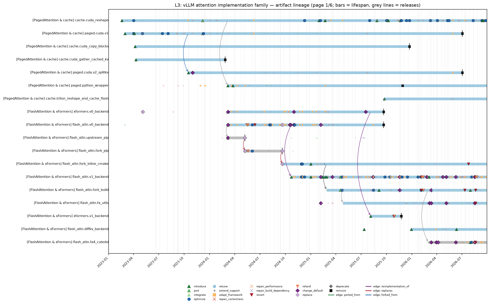
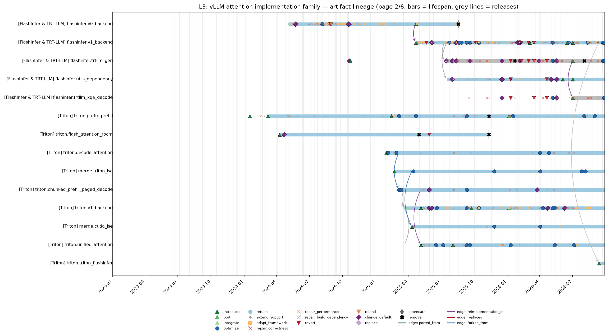
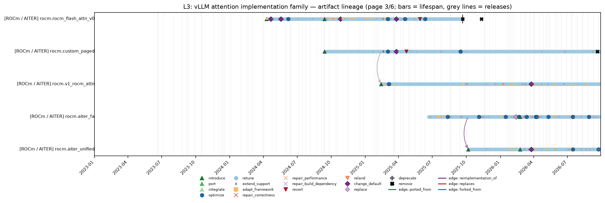
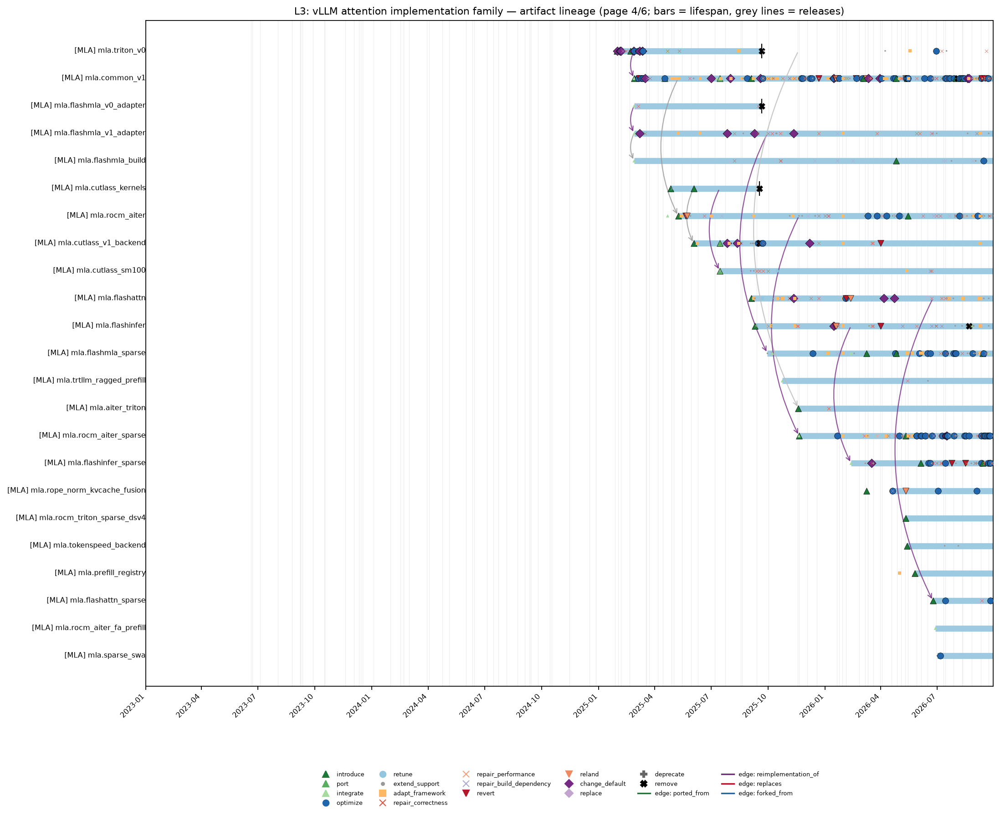
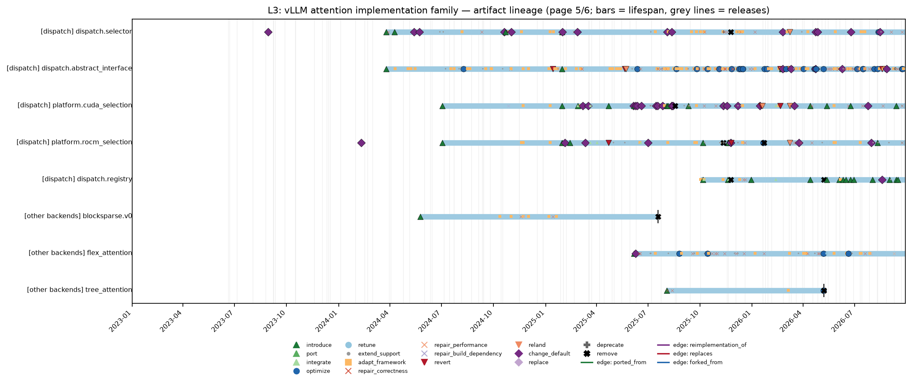
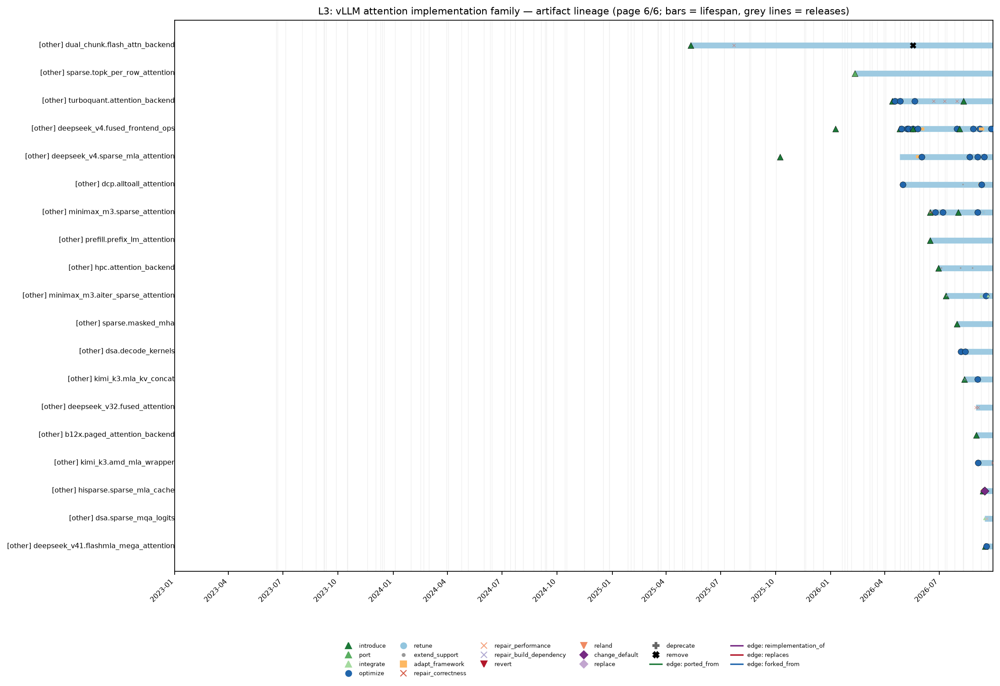
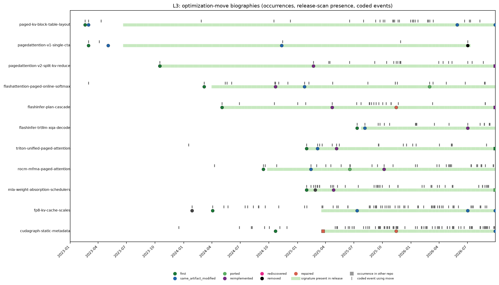
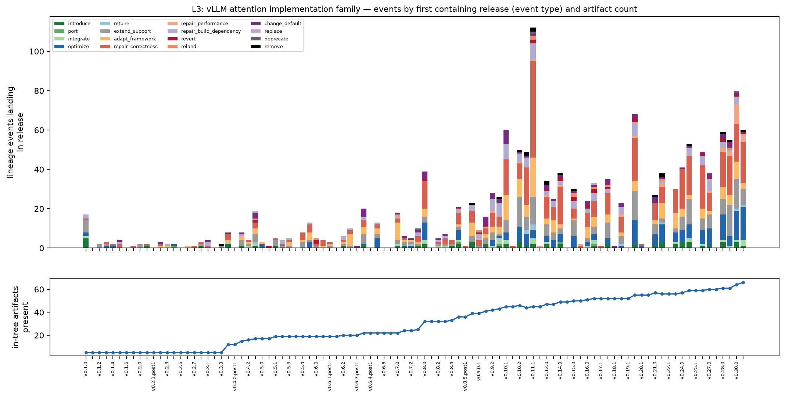

# The vLLM attention implementation family — kernel lineage report (L3)

*Kernel lineage study. Frozen cutoff 2026-09-28T23:59:59Z; repository `vllm-project/vllm` at `c68eb98b69f4`. Tables and every number are generated by `scripts/reports.py` from `data/*.csv` (each number carries a hidden claim tag re-verified by `scripts/consistency.py`); prose in the narrative sections was drafted from the same records and reviewed. Coding was done by LLM coders under `CODEBOOK.md`; agreement figures are model–model consistency, not human inter-rater reliability. Nothing here is causal. See [`METHODS.md`](METHODS.md).*

## Summary

L3 is not a single kernel lineage but a dispatch family in which a paged-KV layout outlived several attention executors: the 2023 CUDA PagedAttention V1/V2 path, xFormers, FlashAttention, FlashInfer, Triton, ROCm custom/AITER, TRT-LLM-gen/XQA, and MLA-specific backends all reused or replaced pieces of the same block-table/cache contract `L3-E-c413c41cda` `L3-E-0deacbce6e` `L3-E-928de46888` `L3-E-d715b3aa1e`.  The study codes 1,528<!-- claim:data/lineage-metrics.csv::lineage=L3&metric=verified_events::value::int --> verified events, with 762<!-- claim:data/lineage-metrics.csv::lineage=L3&metric=survives_at_cutoff:code::value::int --> surviving textually and 121<!-- claim:data/lineage-metrics.csv::lineage=L3&metric=survives_at_cutoff:concept_only::value::int --> surviving only as concepts or moves, so the interesting mechanism is migration of assumptions rather than preservation of one source file `L3-E-22a58640b4`.  *Interpretation:* the family shows optimization knowledge surviving mainly as contracts, selectors, metadata builders, and LSE/cache layouts while default executors change by hardware generation and model shape `L3-E-925f3332ca` `L3-E-2aaa423842`.

- **Census.** 3,950<!-- claim:data/lineage-metrics.csv::lineage=L3&metric=candidates::value::int --> candidates were screened in context; 1,528<!-- claim:data/lineage-metrics.csv::lineage=L3&metric=verified_events::value::int --> are verified lineage events (437<!-- claim:data/lineage-metrics.csv::lineage=L3&metric=key_events::value::int --> key events: introductions, ports, integrations, default changes, replacements, removals, reverts, relands, deprecations).
- **Artifacts.** 87<!-- claim:data/lineage-metrics.csv::lineage=L3&metric=artifacts_registered::value::int --> artifacts registered (5<!-- claim:data/lineage-metrics.csv::lineage=L3&metric=artifacts_upstream::value::int --> upstream kernels or pins); 70<!-- claim:data/lineage-metrics.csv::lineage=L3&metric=artifacts_live_at_cutoff::value::int --> live at the cutoff, 17<!-- claim:data/lineage-metrics.csv::lineage=L3&metric=artifacts_ended::value::int --> ended.
- **Moves.** 11<!-- claim:data/lineage-metrics.csv::lineage=L3&metric=moves::value::int --> optimization moves traced, 11<!-- claim:data/lineage-metrics.csv::lineage=L3&metric=moves_with_biography::value::int --> with biographies; 358<!-- claim:data/lineage-metrics.csv::lineage=L3&metric=events_with_moves::value::int --> events carry a verified move.
- **Code vs mechanism.** Across one subsequent release, 53.3<!-- claim:data/survival-by-releases.csv::kind=artifact_unchanged&lineage=L3&k_releases=1&basis=all_present_releases::share::pct1 -->% of present artifacts stayed textually unchanged, and across three releases 19.0<!-- claim:data/survival-by-releases.csv::kind=artifact_unchanged&lineage=L3&k_releases=3&basis=all_present_releases::share::pct1 -->%; move code signatures persisted across three releases in 99.6<!-- claim:data/survival-by-releases.csv::kind=move&lineage=L3&k_releases=3&basis=all_present_releases::share::pct1 -->% of cases.
- **Maintenance mix.** Primary causes: correctness 500<!-- claim:data/lineage-metrics.csv::lineage=L3&metric=primary_cause:correctness::value::int -->, performance 345<!-- claim:data/lineage-metrics.csv::lineage=L3&metric=primary_cause:performance::value::int -->, framework integration 247<!-- claim:data/lineage-metrics.csv::lineage=L3&metric=primary_cause:framework_integration::value::int -->, specification 216<!-- claim:data/lineage-metrics.csv::lineage=L3&metric=primary_cause:specification::value::int -->, build/dependency 138<!-- claim:data/lineage-metrics.csv::lineage=L3&metric=primary_cause:build_dependency::value::int -->, hardware/compiler 54<!-- claim:data/lineage-metrics.csv::lineage=L3&metric=primary_cause:hardware_compiler::value::int -->, maintenance 28<!-- claim:data/lineage-metrics.csv::lineage=L3&metric=primary_cause:maintenance::value::int -->.
- **Failures.** 4<!-- claim:data/lineage-metrics.csv::lineage=L3&metric=failure_histories::value::int --> failure-to-successor histories reconstructed; 37<!-- claim:data/lineage-metrics.csv::lineage=L3&metric=edge_type:reverts::value::int --> revert edges and 22<!-- claim:data/lineage-metrics.csv::lineage=L3&metric=edge_type:relands::value::int --> reland edges; median time from artifact introduction to first correctness/performance repair (Kaplan–Meier) 105<!-- claim:data/lineage-metrics.csv::lineage=L3&metric=km-first-repair_median_days::value::int --> days.

## 1. Scope and identity rules

**Scope.** The vLLM attention implementation family. Operational scope: `scripts/scope.py` (paths, integration paths, keywords) and `cache/task-screen.md` (decision rule and scope reminders). Identity rules: `CODEBOOK.md` §2. Lineage-specific identity notes from the artifact registry (`staging/registry/L3-registry.json`):

- Custom CUDA PagedAttention V1 and V2 are separate kernel artifacts because V2 introduced a distinct split-KV/two-pass reduction branch while coexisting with V1.
- Pure moves (csrc -> csrc/libtorch_stable, vllm/attention -> vllm/v1/attention) preserve identity when source role remained the same.
- External kernels (FlashAttention fork/FA4, FlashInfer/TRTLLM, FlashMLA, AITER, CUTLASS) are separate from in-tree adapters/build rules.
- Backend classes and platform selectors are artifacts because they determine durable dispatch/default status.
- FlexAttention/tree/blocksparse are registered briefly as same-slot peripherals; excluded hardware/name-collision backends are listed separately.
- FlashAttention delivery is split into upstream flash-attn pip/thirdparty, vllm-flash-attn pip wheel, inline CMake FetchContent, and externalized CMake FetchContent artifacts.
- FlashInfer TRTLLM-gen (SM100+) predates the later XQA sibling path; #43232 is not the first TRTLLM integration.

**Discovery strategies** (a candidate may carry several):

| strategy | candidates |
|---|---|
| `path_core` | 1,864<!-- claim:data/lineage-metrics.csv::lineage=L3&metric=discovery:path_core::value::int --> |
| `release_notes` | 1,856<!-- claim:data/lineage-metrics.csv::lineage=L3&metric=discovery:release_notes::value::int --> |
| `body_keyword` | 1,416<!-- claim:data/lineage-metrics.csv::lineage=L3&metric=discovery:body_keyword::value::int --> |
| `subject_keyword` | 1,221<!-- claim:data/lineage-metrics.csv::lineage=L3&metric=discovery:subject_keyword::value::int --> |
| `symbol_pickaxe` | 487<!-- claim:data/lineage-metrics.csv::lineage=L3&metric=discovery:symbol_pickaxe::value::int --> |
| `path_integration+keyword` | 457<!-- claim:data/lineage-metrics.csv::lineage=L3&metric=discovery:path_integration+keyword::value::int --> |
| `dependency_pin` | 248<!-- claim:data/lineage-metrics.csv::lineage=L3&metric=discovery:dependency_pin::value::int --> |
| `corpus:performance-pr-population` | 177<!-- claim:data/lineage-metrics.csv::lineage=L3&metric=discovery:corpus:performance-pr-population::value::int --> |
| `corpus:kernel-correctness-cases` | 55<!-- claim:data/lineage-metrics.csv::lineage=L3&metric=discovery:corpus:kernel-correctness-cases::value::int --> |
| `cross_reference` | 44<!-- claim:data/lineage-metrics.csv::lineage=L3&metric=discovery:cross_reference::value::int --> |
| `corpus:confirmed-reverts` | 35<!-- claim:data/lineage-metrics.csv::lineage=L3&metric=discovery:corpus:confirmed-reverts::value::int --> |
| `corpus:production-kernel-provenance` | 24<!-- claim:data/lineage-metrics.csv::lineage=L3&metric=discovery:corpus:production-kernel-provenance::value::int --> |

**Screening outcome** (all candidates inspected in context; final labels after stage-2 and reconciliation): `verified_lineage_event` 1,528<!-- claim:data/lineage-metrics.csv::lineage=L3&metric=candidate_label:verified_lineage_event::value::int -->; `out_of_scope` 1,267<!-- claim:data/lineage-metrics.csv::lineage=L3&metric=candidate_label:out_of_scope::value::int -->; `related_context_only` 1,071<!-- claim:data/lineage-metrics.csv::lineage=L3&metric=candidate_label:related_context_only::value::int -->; `name_collision` 84<!-- claim:data/lineage-metrics.csv::lineage=L3&metric=candidate_label:name_collision::value::int -->.

**Excluded look-alikes** (name collisions / other scope):

- Mamba attention/state-space backends: out_of_scope — Task excludes Mamba attention backends; SSM/convolution, not paged MHA/MLA.
- Linear/GDN/short-conv attention backends: out_of_scope — Name collision in dispatch slot; not CUDA paged/FlashAttention/MLA.
- TPU Pallas backend: out_of_scope — Other hardware scope (TPU); no shared CUDA/ROCm kernels.
- HPU/OpenVINO/IPEX-XPU/Neuron backends: out_of_scope — Other hardware/software scope; excluded unless shared kernels with CUDA family.
- CPU/XPU MLA implementations: out_of_scope — Registered as out-of-scope hardware per task.
- Encoder/cross/ViT wrappers: out_of_scope — Wrappers/callers only; no shared kernel changes registered.

## 2. Chronology and mechanism narrative

The earliest stable mechanism is the KV-cache write and paged lookup contract: `reshape_and_cache` maps token rows through `slot_mapping` into block-table-addressed cache storage, and the first CUDA PagedAttention decode kernel then reads those pages without requiring each sequence to occupy contiguous memory `L3-E-c413c41cda` `L3-E-0deacbce6e`.  V1's executor assigned one CTA to a sequence/head decode query, used warp-strided QK work, stored logits and reduction scratch in shared memory, and depended on a fixed warp-reduction structure for softmax and value accumulation `L3-E-0deacbce6e`.  Early tuning kept that artifact textual but changed numerical and movement costs, including reduced precision for `logits * V` and removal of redundant data movement between cache and attention paths `L3-E-436e523bf1` `L3-E-897cb2ae28`.  V2 did not erase V1; it branched for long contexts by partitioning KV into chunks, writing per-partition `tmp_out`, `max_logits`, and `exp_sums`, and reducing those partial softmax states in a second kernel `L3-E-928de46888`.  The source split into header and V1/V2 translation units was a packaging/maintainability change, not a new algorithmic branch, because the PR title records "Splitting attention kernel file" and the registry treats it as file continuity [#10091](https://github.com/vllm-project/vllm/pull/10091).  The later libtorch-stable move preserved the cache and attention artifacts at the ABI boundary, whereas deletion removed the CUDA PagedAttention decode ops while leaving the cache-write layout contract available for other backends `L3-E-22a58640b4` `L3-E-d715b3aa1e`.

The first replacement pressure came from external attention implementations rather than from a single in-tree rewrite `L3-E-3e9f991d6a` `L3-E-c9d5b6d4a8`.  FlashAttention entered as an integration using upstream kernels, but xFormers then became an early replacement/default path for some configurations, and a later selector change routed "flash-attn via xformers" rather than making the CUDA PagedAttention file the only decode story `L3-E-3e9f991d6a` `L3-E-c9d5b6d4a8` `L3-E-75471386de`.  The 2024 backend refactor separated the Python paged wrapper, xFormers, FlashAttention, ROCm, and FlashInfer-style paths behind an abstract interface and selector, so the unit of survival became an attention backend protocol plus metadata rather than a single kernel body `L3-E-2daf23ab0c` `L3-E-925f3332ca`.  xFormers stayed as a selectable backend through many compatibility repairs and support additions, but the V0 backend removal later ended both xFormers V0 and FlashAttention V0 as framework-facing artifacts `L3-E-6c0b7f548d` `L3-E-bc6e542d9f`.

FlashAttention's delivery branch changed independently from the backend concept `L3-E-06ec486794` `L3-E-89579a201f`.  The project first installed upstream `flash_attn`, then installed a prebuilt `vllm-flash-attn` wheel, then built the fork from source inside the repository, and then externalized the build rules into CMake machinery `L3-E-06ec486794` `L3-E-89579a201f` `L3-E-71c60491f2` `L3-E-f95903909f`.  Those changes preserved the move "paged online softmax" while shifting where the implementation lived and how ABI compatibility was maintained `L3-E-978b45f399` `L3-E-8b5014d3dd`.  FA3 selection introduced an explicit version decision because FA3 did not support `cu_seqlens_k` with paged KV cache in one path, while later FA4 integration added a CuTe DSL branch and external-project rules for its build `L3-E-978b45f399` `L3-E-8b5014d3dd` `L3-E-6570c9800c`.  LSE merge kernels are the algebraic glue for this branch: Triton LSE merge and CUDA LSE merge both combine partial attention results by max/LSE rescaling, which generalizes the split-KV V2 idea beyond the original CUDA PagedAttention file `L3-E-288cc6c234` `L3-E-e9528f6dc6`.  The CUDA merge kernel's stable-ABI migration shows that this glue survived as a callable utility even while the old paged decode kernels were headed toward removal `L3-E-284e6f543d` `L3-E-d715b3aa1e`.

The dispatch spine also made branch coexistence operational rather than merely documentary: selector logic could choose xFormers, FlashAttention, FlashInfer, Triton, ROCm, or MLA-specialized backends according to hardware, dtype, cache layout, and environment settings, while registry/platform changes kept those choices out of model-layer call sites `L3-E-925f3332ca` `L3-E-482045ee77` `L3-E-2aaa423842`.  *Interpretation:* this is why removals of one executor often leave optimization moves alive in another executor rather than producing a clean linear succession `L3-E-bc6e542d9f` `L3-E-d715b3aa1e`.

FlashInfer is a separate branch because its key optimization is plan/execution separation rather than textual inheritance from PagedAttention `L3-E-43c413ec57` `L3-E-986537f1c3`.  The V0 integration used FlashInfer paged-KV wrappers, and the V1 backend later relied on reordered batches where decode tokens are placed at the front for planning and execution `L3-E-43c413ec57` `L3-E-986537f1c3`.  TRT-LLM-gen decode was then introduced under the FlashInfer backend for SM100-class decode, extended to prefill, and later complemented by an XQA sibling path for SM90/SM12x and newer architectures `L3-E-7bd4c37ae7` `L3-E-83156c7b89` `L3-E-d29125c085`.  The dispatch meaning is optional-versus-default sensitive: one event removed the need to set `VLLM_ATTENTION_BACKEND=FLASHINFER` for a TRT-LLM path, but other events record unsupported cases and correctness repairs rather than universal defaulting `L3-E-9ad0a4588b` `L3-E-e67a79db03`.

The Triton branch started with prefix-prefill and ROCm-oriented FlashAttention kernels, then added a decode/MLA kernel, chunked-prefill paged decode, and finally a V1 unified attention kernel `L3-E-d10f8e1d43` `L3-E-6c0b04515f` `L3-E-cabaf4eff3` `L3-E-6bd1dd9d26` `L3-E-2f925e5777`.  Its mechanism is not a straight port of CUDA PagedAttention; it specializes page-table metadata and GQA geometry in Triton JIT kernels, and the registry flags SGLang/LightLLM ancestry for decode as unresolved rather than verified `L3-E-cabaf4eff3`.  The unified attention event moved toward one kernel shape for arbitrary attention forms, but later performance and correctness repairs show the abstraction still needed per-model divisibility and optional-data checks `L3-E-01c22335ba` `L3-E-6d80ae83e1`.

ROCm is also branching rather than a port-only story `L3-E-1ef0d2efd0` `L3-E-8b6e1d639c`.  A custom ROCm paged-attention kernel reimplemented the paged interface with AMD MFMA assumptions, V1 ROCm attention made that family available through the V1 engine, and AITER FlashAttention/unified backends then became selectable through ROCm platform priority logic `L3-E-1ef0d2efd0` `L3-E-ba59b78a9c` `L3-E-8b6e1d639c` `L3-E-f231e5bc21`.  MLA forms a parallel subfamily because the operator itself rewrites MHA-style attention into latent-vector MQA with backend-specific schedulers and metadata `L3-E-cabaf4eff3` `L3-E-f95903909f` `L3-E-2e94b9cfbb`.  FlashMLA, CUTLASS MLA, FlashAttention MLA, FlashInfer MLA, sparse MLA, and ROCm AITER MLA reuse the cache, LSE, FP8-scale, scheduler, and cudagraph moves, but they often replace the executor rather than preserving text from the non-MLA attention kernels `L3-E-ed7a29d9f8` `L3-E-41aa578428` `L3-E-fa7e254a7f` `L3-E-f2c47886fd` `L3-E-3c9396a64f`.

### Chronological table of key events

Showing 140 of 326 key events (all events with full fields: `data/lineage-events.csv`, filter `lineage == L3`).

| date | first release | event | type | artifacts | PR | evidence (excerpt) |
|---|---|---|---|---|---|---|
| 2023-02-18 | v0.1.0 | `L3-E-c413c41cda` | introduce | L3.cache.cuda_reshape |  | __global__ void reshape_and_cache_kernel |
| 2023-03-01 | v0.1.0 | `L3-E-0deacbce6e` | introduce | L3.paged.cuda.v1 | [#3](https://github.com/vllm-project/vllm/pull/3) | This PR adds the `single_query_cached_kv_attention` kernel. |
| 2023-04-04 | v0.1.0 | `L3-E-21b3671bbc` | introduce | L3.paged.cuda.v1 | [#24](https://github.com/vllm-project/vllm/pull/24) | basic and not highly optimized kernel |
| 2023-04-07 | v0.1.0 | `L3-E-0f40557af6` | introduce | L3.cache.cuda_copy_blocks | [#32](https://github.com/vllm-project/vllm/pull/32) | reduce the number of kernel invocations from `2 * num_layers * num_copying_blocks` to 1 |
| 2023-04-10 | v0.1.0 | `L3-E-e3cec88aa5` | introduce | L3.cache.cuda_gather_cached_kv | [#29](https://github.com/vllm-project/vllm/pull/29) | the optimized kernel works much better for smaller number of tokens (+20% speedup) |
| 2023-05-05 | v0.1.0 | `L3-E-c9d5b6d4a8` | replace | L3.xformers.v0_backend | [#70](https://github.com/vllm-project/vllm/pull/70) | This PR replaces FlashAttention with [xformers] |
| 2023-08-29 | v0.1.5 | `L3-E-75471386de` | change_default | L3.dispatch.selector | [#877](https://github.com/vllm-project/vllm/pull/877) | use flash-attn via xformers |
| 2023-10-16 | v0.2.1 | `L3-E-928de46888` | introduce | L3.paged.cuda.v2_splitkv | [#1348](https://github.com/vllm-project/vllm/pull/1348) | uses sequence-level parallelism for better work partitioning |
| 2023-11-01 | v0.2.2 | `L3-E-9738b84a08` | change_default | L3.paged.cuda.v2_splitkv | [#1510](https://github.com/vllm-project/vllm/pull/1510) | forces v2 to be used if the context cannot fit in shared memory |
| 2023-12-07 | v0.2.4 | `L3-E-6ccc0bfffb` | port | L3.paged.cuda.v1; L3.cache.cuda_reshape | [#1836](https://github.com/vllm-project/vllm/pull/1836) | incorporates the work from [Port most vLLM kernels to ROCm #1313] |
| 2024-01-17 | v0.3.0 | `L3-E-d10f8e1d43` | introduce | L3.triton.prefix_prefill | [#1669](https://github.com/vllm-project/vllm/pull/1669) | add prefix caching support |
| 2024-02-10 | v0.3.1 | `L3-E-0580aab02f` | change_default | L3.platform.rocm_selection | [#2768](https://github.com/vllm-project/vllm/pull/2768) | flash-attention does not fully support gfx1100 |
| 2024-02-26 | v0.3.3 | `L3-E-d6e4a130b0` | remove | L3.cache.cuda_gather_cached_kv | [#3043](https://github.com/vllm-project/vllm/pull/3043) | `gather_cached_kv` kernel was originally implemented for prefix sharing |
| 2024-03-07 | v0.4.0 | `L3-E-2daf23ab0c` | introduce | L3.paged.python_wrapper; L3.xformers.v0_backend; L3.flash_attn.v0_back | [#3005](https://github.com/vllm-project/vllm/pull/3005) | separates the code paths for Ampere or more recent NVIDIA GPUs |
| 2024-03-08 | v0.4.0 | `L3-E-1cb0cc2975` | change_default | L3.flash_attn.v0_backend; L3.flash_attn.upstream_pip; L3.xformers.v0_b | [#3269](https://github.com/vllm-project/vllm/pull/3269) | flash_attn is not found. Using xformers backend. |
| 2024-03-25 | v0.4.0 | `L3-E-925f3332ca` | introduce | L3.dispatch.selector; L3.dispatch.abstract_interface; L3.paged.python_ | [#3462](https://github.com/vllm-project/vllm/pull/3462) | hide any backend-specific attention implementation details from the main logic |
| 2024-04-09 | v0.4.1 | `L3-E-6c0b04515f` | introduce | L3.triton.flash_attention_rocm; L3.rocm.rocm_flash_attn_v0; L3.dispatc | [#3643](https://github.com/vllm-project/vllm/pull/3643) | creates and makes default new triton exclusive backend for attention |
| 2024-04-21 | v0.4.1 | `L3-E-95e5b087cf` | change_default | L3.rocm.rocm_flash_attn_v0; L3.triton.flash_attention_rocm | [#4129](https://github.com/vllm-project/vllm/pull/4129) | if torch.cuda.get_device_capability()[0] == 11 |
| 2024-05-08 | v0.4.3 | `L3-E-89579a201f` | replace | L3.flash_attn.fork_pip; L3.flash_attn.upstream_pip | [#4686](https://github.com/vllm-project/vllm/pull/4686) | use the pre-built `vllm-flash-attn` wheel |
| 2024-05-13 | v0.4.3 | `L3-E-0fca3cdcf2` | change_default | L3.dispatch.selector | [#4751](https://github.com/vllm-project/vllm/pull/4751) | provide more information (such as block size and kv cache dtype) to attention backend selector |
| 2024-05-15 | v0.4.3 | `L3-E-8a7cc254a0` | revert | L3.flash_attn.v0_backend | [#4820](https://github.com/vllm-project/vllm/pull/4820) | This reverts commit 1356df5. |
| 2024-05-18 | v0.4.3 | `L3-E-c0724fc915` | change_default | L3.rocm.rocm_flash_attn_v0 | [#4658](https://github.com/vllm-project/vllm/pull/4658) | Navi21/Navi10 have HW version 10 |
| 2024-05-19 | v0.4.3 | `L3-E-b57e6c5949` | reland | L3.flash_attn.v0_backend; L3.flash_attn.fork_pip | [#4907](https://github.com/vllm-project/vllm/pull/4907) | This PR reverts #4820 by adding back `flash-attn` |
| 2024-05-23 | v0.4.3 | `L3-E-ee3eea0a1b` | change_default | L3.dispatch.selector; L3.flashinfer.v0_backend | [#4960](https://github.com/vllm-project/vllm/pull/4960) | without considering consider user preference |
| 2024-05-24 | v0.4.3 | `L3-E-8e192ff967` | introduce | L3.blocksparse.v0 | [#4799](https://github.com/vllm-project/vllm/pull/4799) | For blocksparse attention: skip computation on blocks that are not attended |
| 2024-06-03 | v0.5.0 | `L3-E-0ab278ca31` | optimize | L3.flash_attn.v0_backend; L3.flash_attn.fork_pip | [#5138](https://github.com/vllm-project/vllm/pull/5138) | using the `out` kwarg directly |
| 2024-06-13 | v0.5.0.post1 | `L3-E-6b0511a57b` | revert | L3.flash_attn.v0_backend | [#5478](https://github.com/vllm-project/vllm/pull/5478) | Reverts vllm-project/vllm#5138 |
| 2024-07-02 | v0.5.1 | `L3-E-482045ee77` | introduce | L3.platform.cuda_selection; L3.platform.rocm_selection | [#6080](https://github.com/vllm-project/vllm/pull/6080) | introduce platform abstraction |
| 2024-08-05 | v0.5.5 | `L3-E-ef527be06c` | optimize | L3.flash_attn.v0_backend; L3.flashinfer.v0_backend | [#7172](https://github.com/vllm-project/vllm/pull/7172) | uses non-blocking data transfer in prepare_input |
| 2024-08-08 | v0.5.5 | `L3-E-e02ac55617` | optimize | L3.flash_attn.v0_backend | [#7162](https://github.com/vllm-project/vllm/pull/7162) | Avoid python object allocations for "InterDataForSeqGroup" objects |
| 2024-08-27 | v0.6.0 | `L3-E-9606c7197d` | revert | L3.flashinfer.v0_backend | [#7887](https://github.com/vllm-project/vllm/pull/7887) | Revert #7509 |
| 2024-08-28 | v0.6.0 | `L3-E-ef99a78760` | revert | L3.flashinfer.v0_backend | [#7982](https://github.com/vllm-project/vllm/pull/7982) | Reverts vllm-project/vllm#7798 |
| 2024-08-29 | v0.6.0 | `L3-E-6b3421567d` | reland | L3.flashinfer.v0_backend | [#7985](https://github.com/vllm-project/vllm/pull/7985) | Revert PR due to bug with `--kv-cache-dtype=auto` |
| 2024-09-13 | v0.6.2 | `L3-E-1ef0d2efd0` | introduce | L3.rocm.custom_paged; L3.rocm.rocm_flash_attn_v0 | [#8310](https://github.com/vllm-project/vllm/pull/8310) | This PR adds custom paged attention kernel support for rocm. |
| 2024-09-20 | v0.6.2 | `L3-E-71c60491f2` | replace | L3.flash_attn.fork_pip; L3.flash_attn.fork_inline_cmake; L3.flash_attn | [#8245](https://github.com/vllm-project/vllm/pull/8245) | builds vllm-flash-attn from source |
| 2024-10-17 | v0.6.3.post1 | `L3-E-81ede99ca4` | change_default | L3.flash_attn.v0_backend; L3.flashinfer.v0_backend | [#8704](https://github.com/vllm-project/vllm/pull/8704) | This PR deprecates block manager v1 and makes block manager v2 the default to simplify the code path. This is  |
| 2024-10-18 | v0.6.4 | `L3-E-0c9a5258f9` | change_default | L3.flashinfer.v0_backend; L3.flashinfer.trtllm_gen | [#9497](https://github.com/vllm-project/vllm/pull/9497) | Relates to #9471 We find that the heuristic used to decide when to enable tensor cores in Flashinfer is not wo |
| 2024-10-20 | v0.6.4 | `L3-E-4fa3e33349` | change_default | L3.flash_attn.v0_backend; L3.dispatch.selector | [#9403](https://github.com/vllm-project/vllm/pull/9403) | Flash attention backend provides sliding window support now. We can use it instead of fall back to xformer. ** |
| 2024-10-22 | v0.6.4 | `L3-E-6c5af09b39` | introduce | L3.flash_attn.v1_backend; L3.flashinfer.trtllm_gen; L3.dispatch.select | [#9289](https://github.com/vllm-project/vllm/pull/9289) | return "flash-attn-vllm-v1" |
| 2024-10-26 | v0.6.4 | `L3-E-55137e8ee3` | change_default | L3.rocm.rocm_flash_attn_v0 | [#9560](https://github.com/vllm-project/vllm/pull/9560) | FIX #[8963](https://github.com/vllm-project/vllm/issues/8963) ### Why is it needed? * Currently, Custom Paged  |
| 2024-11-01 | v0.6.4 | `L3-E-a78dd3303e` | change_default | L3.xformers.v0_backend; L3.flash_attn.v0_backend; L3.dispatch.selector | [#9559](https://github.com/vllm-project/vllm/pull/9559) | This PR adds support for flash attention kernel for encoder decoder models. For encoder-decoder models with dt |
| 2024-11-28 | v0.6.5 | `L3-E-98f47f2a40` | optimize | L3.flash_attn.v1_backend | [#10733](https://github.com/vllm-project/vllm/pull/10733) | With piece-wise CUDA graphs, we have to make sure that the attention custom op causes minimal CPU overheads. T |
| 2024-12-01 | v0.6.5 | `L3-E-073a4bd1c0` | optimize | L3.flash_attn.v1_backend; L3.flash_attn.fork_inline_cmake | [#10811](https://github.com/vllm-project/vllm/pull/10811) | This PR uses the in-place `out` argument of `flash_attn_varlen_func` to avoid redundant copy. This is possible |
| 2024-12-09 | v0.6.5 | `L3-E-3b61cb450d` | optimize | L3.cache.cuda_reshape; L3.flash_attn.v1_backend | [#10989](https://github.com/vllm-project/vllm/pull/10989) | This PR reduces the CPU ops in V1 flash-attn: two slice ops for `key` and `value` by slightly modifying the `r |
| 2025-01-01 | v0.7.0 | `L3-E-73001445fb` | introduce | L3.flash_attn.v1_backend; L3.flash_attn.fork_inline_cmake | [#11635](https://github.com/vllm-project/vllm/pull/11635) | Merge prefix and suffix outputs |
| 2025-01-14 | v0.7.0 | `L3-E-1f18adb245` | revert | L3.dispatch.abstract_interface | [#12038](https://github.com/vllm-project/vllm/pull/12038) | The changing of `kv_cache` -> `_kv_cache` and `attn_metadata` -> `_attn_metadata` in `Attention.forward` by ht |
| 2025-01-30 | v0.7.1 | `L3-E-cabaf4eff3` | introduce | L3.triton.decode_attention; L3.mla.triton_v0; L3.cache.cuda_reshape; L | [#12528](https://github.com/vllm-project/vllm/pull/12528) | computing MQA using latent vectors instead of MHA |
| 2025-01-31 | v0.7.1 | `L3-E-4f4d427ac2` | change_default | L3.dispatch.selector; L3.mla.triton_v0 | [#12642](https://github.com/vllm-project/vllm/pull/12642) | MLA is enabled; forcing chunked prefill and prefix caching to be disabled. |
| 2025-02-04 | v0.7.2 | `L3-E-c36ac98d01` | change_default | L3.platform.rocm_selection; L3.mla.triton_v0 | [#12662](https://github.com/vllm-project/vllm/pull/12662) | Using Triton MLA backend. |
| 2025-02-06 | v0.7.3 | `L3-E-c786e757fa` | change_default | L3.flash_attn.v0_backend; L3.flash_attn.v1_backend; L3.flash_attn.fa_u | [#12807](https://github.com/vllm-project/vllm/pull/12807) | Make sure we are using FA3 for MLA prefill on Hopper |
| 2025-02-13 | v0.7.3 | `L3-E-ba59b78a9c` | introduce | L3.rocm.v1_rocm_attn; L3.triton.prefix_prefill; L3.flash_attn.v1_backe | [#12790](https://github.com/vllm-project/vllm/pull/12790) | Using ROCm Attention backend on V1 engine. |
| 2025-02-19 | v0.7.3 | `L3-E-0023cd2b9d` | deprecate | L3.flash_attn.fork_inline_cmake; L3.rocm.custom_paged; L3.rocm.rocm_fl | [#13560](https://github.com/vllm-project/vllm/pull/13560) | Removing gfx940 and gfx941 targets |
| 2025-02-21 | v0.8.0 | `L3-E-288cc6c234` | introduce | L3.merge.triton_lse; L3.mla.triton_v0; L3.cache.cuda_reshape; L3.flash | [#12639](https://github.com/vllm-project/vllm/pull/12639) | lays the groundwork for a V1 implementation |
| 2025-02-26 | v0.8.0 | `L3-E-1d35662e6d` | change_default | L3.mla.triton_v0; L3.dispatch.selector | [#13844](https://github.com/vllm-project/vllm/pull/13844) | forcing chunked prefill and prefix caching to be disabled |
| 2025-02-27 | v0.8.0 | `L3-E-58d1b2aa77` | introduce | L3.mla.common_v1; L3.flash_attn.v1_backend; L3.platform.cuda_selection | [#13789](https://github.com/vllm-project/vllm/pull/13789) | Using Triton MLA backend on V1 engine. |
| 2025-03-03 | v0.8.0 | `L3-E-848a6438ae` | optimize | L3.rocm.custom_paged; L3.rocm.rocm_flash_attn_v0 | [#12348](https://github.com/vllm-project/vllm/pull/12348) | faster Custom Paged Attention (CPA) kernel based on `mfma16x16x16` instructions |
| 2025-03-06 | v0.8.0 | `L3-E-6bd1dd9d26` | optimize | L3.triton.prefix_prefill; L3.triton.chunked_prefill_paged_decode; L3.r | [#14152](https://github.com/vllm-project/vllm/pull/14152) | ensure one sequence in batch is a decode |
| 2025-03-06 | v0.8.0 | `L3-E-9f1710f1ac` | optimize | L3.mla.triton_v0; L3.mla.common_v1 | [#13897](https://github.com/vllm-project/vllm/pull/13897) | kv_c_normed unsqeezed leads to |
| 2025-03-07 | v0.8.0 | `L3-E-ca7a2d5f28` | revert | L3.mla.common_v1 | [#14471](https://github.com/vllm-project/vllm/pull/14471) | Revert "[Perf] Reduce MLA CPU overheads in V1 |
| 2025-03-08 | v0.8.0 | `L3-E-b0d541947a` | change_default | L3.platform.cuda_selection; L3.mla.flashmla_v1_adapter; L3.mla.triton_ | [#14451](https://github.com/vllm-project/vllm/pull/14451) | we default to FlashMLA backend |
| 2025-03-12 | v0.8.0 | `L3-E-d9f83d6206` | change_default | L3.mla.triton_v0; L3.platform.rocm_selection | [#14316](https://github.com/vllm-project/vllm/pull/14316) | current_platform.is_cuda() or current_platform.is_rocm() |
| 2025-03-13 | v0.8.0 | `L3-E-fb4c7f8ef0` | optimize | L3.triton.chunked_prefill_paged_decode | [#14431](https://github.com/vllm-project/vllm/pull/14431) | Q : (num_queries_per_kv, HEAD_SIZE,) |
| 2025-03-13 | v0.8.0 | `L3-E-9532c49836` | optimize | L3.mla.triton_v0; L3.mla.common_v1 | [#14770](https://github.com/vllm-project/vllm/pull/14770) | get rid of materialization |
| 2025-03-17 | v0.8.0 | `L3-E-89fca671fb` | change_default | L3.platform.cuda_selection; L3.mla.common_v1 | [#14921](https://github.com/vllm-project/vllm/pull/14921) | MLA is is supported on V1 |
| 2025-03-20 | v0.8.2 | `L3-E-2b22290ce0` | change_default | L3.flash_attn.v1_backend | [#15243](https://github.com/vllm-project/vllm/pull/15243) | Disable cascade attention for V1 |
| 2025-03-26 | v0.8.3 | `L3-E-ecff8309a3` | change_default | L3.rocm.rocm_flash_attn_v0; L3.rocm.custom_paged | [#15557](https://github.com/vllm-project/vllm/pull/15557) | VLLM_ROCM_CUSTOM_PAGED_ATTN |
| 2025-04-11 | v0.8.4 | `L3-E-e9528f6dc6` | introduce | L3.merge.cuda_lse | [#16173](https://github.com/vllm-project/vllm/pull/16173) | can be used to combine partial attention results |
| 2025-04-15 | v0.8.5 | `L3-E-280d62b8a2` | optimize | L3.merge.triton_lse | [#16123](https://github.com/vllm-project/vllm/pull/16123) | Will reuse precomputed Exp values |
| 2025-04-17 | v0.8.5 | `L3-E-183dad7a85` | port | L3.flash_attn.v1_backend; L3.flash_attn.fork_build; L3.mla.common_v1 | [#13111](https://github.com/vllm-project/vllm/pull/13111) | We don't need to pad V |
| 2025-04-17 | v0.8.5 | `L3-E-0377b8310b` | optimize | L3.mla.common_v1 | [#16673](https://github.com/vllm-project/vllm/pull/16673) | separate requests based on if |
| 2025-04-18 | v0.8.5 | `L3-E-aaec845f8e` | optimize | L3.rocm.rocm_flash_attn_v0 | [#16431](https://github.com/vllm-project/vllm/pull/16431) | Output tensor must be provided |
| 2025-04-22 | v0.8.5 | `L3-E-986537f1c3` | introduce | L3.flashinfer.v1_backend; L3.platform.cuda_selection; L3.flashinfer.v0 | [#16684](https://github.com/vllm-project/vllm/pull/16684) | all decode tokens are at the front |
| 2025-04-22 | v0.8.5 | `L3-E-bc7c4d206b` | optimize | L3.triton.prefix_prefill | [#13305](https://github.com/vllm-project/vllm/pull/13305) | Vectorization in the context loop |
| 2025-04-22 | v0.8.5 | `L3-E-7e081ba7ca` | revert | L3.platform.rocm_selection; L3.rocm.custom_paged | [#17022](https://github.com/vllm-project/vllm/pull/17022) | VLLM_ROCM_CUSTOM_PAGED_ATTN |
| 2025-04-24 | v0.8.5 | `L3-E-41ca7eb491` | optimize | L3.flash_attn.fork_build; L3.flash_attn.v1_backend | [#16864](https://github.com/vllm-project/vllm/pull/16864) | single mma warp group support |
| 2025-04-27 | v0.8.5 | `L3-E-ed7a29d9f8` | introduce | L3.mla.cutlass_kernels | [#16032](https://github.com/vllm-project/vllm/pull/16032) | This PR integrates this kernel as `ops.cutlass_mla_decode`. |
| 2025-05-01 | v0.9.0 | `L3-E-28566d73b3` | remove | L3.triton.flash_attention_rocm | [#17536](https://github.com/vllm-project/vllm/pull/17536) | gfx940 and gfx941 are no longer supported since ROCm 6.3 |
| 2025-05-06 | v0.9.0 | `L3-E-2f925e5777` | introduce | L3.triton.unified_attention; L3.triton.v1_backend | [#16828](https://github.com/vllm-project/vllm/pull/16828) | kernel_unified_attention_2d |
| 2025-05-09 | v0.9.0 | `L3-E-3c9396a64f` | introduce | L3.mla.rocm_aiter | [#17523](https://github.com/vllm-project/vllm/pull/17523) | AITER MLA attention backend support for the V1 engine |
| 2025-05-12 | v0.9.0 | `L3-E-60f7624334` | introduce | L3.dual_chunk.flash_attn_backend | [#11844](https://github.com/vllm-project/vllm/pull/11844) | implements the [dual-chunk flash attention] |
| 2025-05-21 | v0.9.0.1 | `L3-E-bb0a311213` | revert | L3.dispatch.abstract_interface; L3.flashinfer.v1_backend; L3.mla.rocm_ | [#18459](https://github.com/vllm-project/vllm/pull/18459) | This reverts commit e60f550b3825cbce2d3c7e882b029e2c1d914d8d. |
| 2025-05-23 | v0.9.0.1 | `L3-E-6550114c9c` | reland | L3.dispatch.abstract_interface; L3.mla.rocm_aiter | [#18593](https://github.com/vllm-project/vllm/pull/18593) | Redo #17945 that reverted by |
| 2025-05-29 | v0.9.1 | `L3-E-da4b69d0b4` | change_default | L3.triton.v1_backend; L3.triton.chunked_prefill_paged_decode | [#18275](https://github.com/vllm-project/vllm/pull/18275) | force fallback to the 2 stage attention kernel in V1 |
| 2025-05-29 | v0.9.1 | `L3-E-1b7cfd5a36` | revert | L3.triton.flash_attention_rocm; L3.rocm.rocm_flash_attn_v0 | [#18226](https://github.com/vllm-project/vllm/pull/18226) | performance issues, and broken support for FP8 quantized models |
| 2025-06-03 | v0.9.1 | `L3-E-41aa578428` | introduce | L3.mla.cutlass_v1_backend; L3.mla.cutlass_kernels | [#17625](https://github.com/vllm-project/vllm/pull/17625) | Add Cutlass MLA backend |
| 2025-06-05 | v0.9.1 | `L3-E-87360308b7` | change_default | L3.platform.cuda_selection; L3.flashinfer.v1_backend | [#19118](https://github.com/vllm-project/vllm/pull/19118) | Using FlashInfer backend on V1 engine by default for Blackwell |
| 2025-06-05 | v0.9.1 | `L3-E-18093084be` | change_default | L3.triton.v1_backend | [#19138](https://github.com/vllm-project/vllm/pull/19138) | Remove unnecessary fallback to prefill-decode attention |
| 2025-06-06 | v0.9.1 | `L3-E-cf02f9b283` | introduce | L3.flex_attention; L3.platform.cuda_selection | [#16078](https://github.com/vllm-project/vllm/pull/16078) | Add FlexAttention to V1 |
| 2025-06-09 | v0.9.1 | `L3-E-b8089195b4` | change_default | L3.platform.cuda_selection; L3.flex_attention | [#19319](https://github.com/vllm-project/vllm/pull/19319) | Using FlexAttenion backend for torch.float32 on V1 engine. |
| 2025-06-12 | v0.9.2 | `L3-E-f98548b9da` | optimize | L3.rocm.rocm_flash_attn_v0; L3.dispatch.abstract_interface | [#16756](https://github.com/vllm-project/vllm/pull/16756) | This pass fuses post-attention quantization onto attention |
| 2025-06-12 | v0.9.2 | `L3-E-af09b3f0a0` | change_default | L3.platform.cuda_selection | [#19492](https://github.com/vllm-project/vllm/pull/19492) | Using Flash Attention backend on V1 engine. |
| 2025-06-17 | v0.9.2 | `L3-E-ccd7c05089` | optimize | L3.triton.unified_attention | [#19152](https://github.com/vllm-project/vllm/pull/19152) | segm_max_ptr,  # [num_tokens, num_query_heads, num_segments] |
| 2025-06-19 | v0.9.2 | `L3-E-36239f79dd` | change_default | L3.platform.cuda_selection | [#19781](https://github.com/vllm-project/vllm/pull/19781) | if cls.has_device_capability(80): |
| 2025-06-19 | v0.9.2 | `L3-E-aa20d10a91` | optimize | L3.triton.v1_backend | [#19803](https://github.com/vllm-project/vllm/pull/19803) | there is no need to reshape |
| 2025-07-01 | v0.9.2 | `L3-E-96453cfa83` | change_default | L3.mla.common_v1; L3.platform.rocm_selection | [#19067](https://github.com/vllm-project/vllm/pull/19067) | Using Triton MLA backend on V1 engine. |
| 2025-07-12 | v0.10.0 | `L3-E-2c11a738b3` | introduce | L3.flash_attn.diffkv_backend | [#20702](https://github.com/vllm-project/vllm/pull/20702) | differential_flash_attn.py (+1000/-0) |
| 2025-07-15 | v0.10.0 | `L3-E-8cdc371217` | port | L3.mla.cutlass_sm100; L3.mla.cutlass_v1_backend; L3.mla.common_v1 | [#20769](https://github.com/vllm-project/vllm/pull/20769) | Taken from SGLANG PR https://github.com/sgl-project/sglang/pull/6929 |
| 2025-07-15 | v0.10.0 | `L3-E-9ad0a4588b` | change_default | L3.platform.cuda_selection; L3.flashinfer.trtllm_gen | [#20934](https://github.com/vllm-project/vllm/pull/20934) | Removes the necessity for specifying `VLLM_ATTENTION_BACKEND=FLASHINFER` |
| 2025-07-18 | v0.10.0 | `L3-E-5782581acf` | change_default | L3.xformers.v0_backend; L3.platform.cuda_selection | [#21077](https://github.com/vllm-project/vllm/pull/21077) | falling back to torch_sdpa backend |
| 2025-07-19 | v0.10.0 | `L3-E-752c6ade2e` | remove | L3.blocksparse.v0 | [#21217](https://github.com/vllm-project/vllm/pull/21217) | This PR removes the block sparse attention and the support for phi3-small |
| 2025-07-24 | v0.10.1 | `L3-E-61b8cea3b4` | optimize | L3.flashinfer.v1_backend | [#21137](https://github.com/vllm-project/vllm/pull/21137) | pass host side buffers ... to reduce D2H transfers |
| 2025-07-27 | v0.10.1 | `L3-E-8f605ee309` | change_default | L3.platform.cuda_selection; L3.mla.cutlass_v1_backend; L3.mla.flashmla | [#21626](https://github.com/vllm-project/vllm/pull/21626) | Blackwell => Force CutlassMLA |
| 2025-08-01 | v0.10.1 | `L3-E-f81c1bb055` | change_default | L3.flashinfer.utils_dependency; L3.flashinfer.trtllm_gen; L3.mla.commo | [#21893](https://github.com/vllm-project/vllm/pull/21893) | gate default usage of kernels that require downloading |
| 2025-08-01 | v0.10.1 | `L3-E-eefbf4a68b` | optimize | L3.cache.cuda_reshape | [#22036](https://github.com/vllm-project/vllm/pull/22036) | Using vectorization utils to  `reshape_and_cache_flash` |
| 2025-08-03 | v0.10.1 | `L3-E-aa7012eb6d` | introduce | L3.tree_attention; L3.triton.unified_attention; L3.platform.cuda_selec | [#20401](https://github.com/vllm-project/vllm/pull/20401) | added a new parameter to triton `unified_attention` called `qq_bias` |
| 2025-08-04 | v0.10.1 | `L3-E-e79a12fc3a` | change_default | L3.dispatch.selector | [#22217](https://github.com/vllm-project/vllm/pull/22217) | should fail rather than fallback to some default |
| 2025-08-05 | v0.10.1 | `L3-E-469b3ffaaa` | introduce | L3.xformers.v1_backend; L3.platform.cuda_selection | [#21342](https://github.com/vllm-project/vllm/pull/21342) | Port over the xformers backend to the v1 engine |
| 2025-08-12 | v0.10.1 | `L3-E-007dd90859` | change_default | L3.dispatch.selector; L3.platform.cuda_selection | [#22714](https://github.com/vllm-project/vllm/pull/22714) | Hardcode to use triton attention on hopper when attention sink is not used |
| 2025-08-12 | v0.10.1 | `L3-E-b1361c7273` | change_default | L3.platform.cuda_selection; L3.mla.cutlass_v1_backend | [#22738](https://github.com/vllm-project/vllm/pull/22738) | Purpose We found that triton mla ending up being chosen on B200, even though cutlass mla was being "forced" vl |
| 2025-08-12 | v0.10.1 | `L3-E-c6b928798e` | change_default | L3.flashinfer.v1_backend; L3.flashinfer.trtllm_gen | [#22678](https://github.com/vllm-project/vllm/pull/22678) | If attention sinks are being used, then use trtllm attention should return True since we only support sinks wi |
| 2025-08-14 | v0.10.1 | `L3-E-39cd09dc86` | change_default | L3.platform.cuda_selection; L3.flash_attn.v1_backend | [#22933](https://github.com/vllm-project/vllm/pull/22933) | Earlier forgot to add if to see if the current platform is hopper . |
| 2025-08-15 | v0.10.1 | `L3-E-177e55e3bd` | optimize | L3.flash_attn.fork_build | [#22478](https://github.com/vllm-project/vllm/pull/22478) | Purpose vLLM side of https://github.com/vllm-project/flash-attention/pull/78 merge that first Shout-out to @ja |
| 2025-08-18 | v0.10.2 | `L3-E-14006840ea` | remove | L3.flashinfer.v0_backend; L3.platform.cuda_selection | [#22776](https://github.com/vllm-project/vllm/pull/22776) | Summary - drop legacy FlashInfer attention backend implementation - adjust CUDA backend selection and tests to |
| 2025-08-19 | v0.10.2 | `L3-E-e61bac87ee` | optimize | L3.flashinfer.v1_backend | [#23147](https://github.com/vllm-project/vllm/pull/23147) | Moves static attributes e.g., num qo heads , q data type from FlashInferMetadata to FlashInferMetadataBuilder  |
| 2025-08-21 | v0.10.2 | `L3-E-1d353b6352` | optimize | L3.flashinfer.v1_backend | [#23214](https://github.com/vllm-project/vllm/pull/23214) | Purpose Always enable tensor cores for the flashinfer BatchDecodeWithPagedKVCacheWrapper . Previously we enabl |
| 2025-08-27 | v0.10.2 | `L3-E-6578e87365` | optimize | L3.flashinfer.v1_backend | [#23174](https://github.com/vllm-project/vllm/pull/23174) | Should be merged after 23147 |
| 2025-08-28 | v0.10.2 | `L3-E-186aced5ff` | introduce | L3.cache.cuda_reshape | [#23791](https://github.com/vllm-project/vllm/pull/23791) | Pre-PR for 1367 https://github.com/vllm-project/vllm/pull/23734 Suggestions from @youkaichao : to accelerate t |
| 2025-08-28 | v0.10.2 | `L3-E-04d1dd7f4a` | optimize | L3.mla.common_v1 | [#23264](https://github.com/vllm-project/vllm/pull/23264) | Purpose Replace torch.bmm with aiter batched gemm a8w8 a per token group prequant w per batched tensor quant k |
| 2025-09-04 | v0.10.2 | `L3-E-402759d472` | introduce | L3.mla.flashattn; L3.flash_attn.fork_build; L3.mla.common_v1 | [#14258](https://github.com/vllm-project/vllm/pull/14258) | Use latest FlashAttention code to compute decode MQA in MLA VLLM USE V1=0 lm eval --model vllm --model args pr |
| 2025-09-09 | v0.10.2 | `L3-E-15de5ff9ea` | change_default | L3.mla.flashmla_v1_adapter | [#24521](https://github.com/vllm-project/vllm/pull/24521) | FlashMLA is temporarily disabled on Blackwell (SM 10.0). |
| 2025-09-10 | v0.10.2 | `L3-E-9a161307f5` | optimize | L3.triton.prefix_prefill; L3.triton.chunked_prefill_paged_decode; L3.t | [#19767](https://github.com/vllm-project/vllm/pull/19767) | Requires ... full graph capture for this backend to actually perform the fusion. |
| 2025-09-10 | v0.10.2 | `L3-E-fba7856581` | optimize | L3.flashinfer.v1_backend | [#23439](https://github.com/vllm-project/vllm/pull/23439) | trigger JIT/download/load from disk before real requests. |
| 2025-09-10 | v0.10.2 | `L3-E-dcb28a332b` | introduce | L3.mla.flashinfer; L3.platform.cuda_selection | [#21078](https://github.com/vllm-project/vllm/pull/21078) | TRTLLM-gen (via Flashinfer) MLA |
| 2025-09-15 | v0.11.0 | `L3-E-01413e0cf5` | optimize | L3.rocm.custom_paged | [#22222](https://github.com/vllm-project/vllm/pull/22222) | Support fp8 mfma instruction with per wrap dynamic quantization for Query |
| 2025-09-15 | v0.11.0 | `L3-E-aae725af7c` | optimize | L3.mla.cutlass_v1_backend | [#24891](https://github.com/vllm-project/vllm/pull/24891) | removes 2 redundant clone() calls in pre-attn cutlass MLA python code |
| 2025-09-17 | v0.11.0 | `L3-E-8f3616f422` | remove | L3.mla.cutlass_kernels; L3.mla.cutlass_v1_backend | [#23961](https://github.com/vllm-project/vllm/pull/23961) | Remove old CUTLASS MLA kernel, no longer used. |
| 2025-09-19 | v0.11.0 | `L3-E-a2a5f79e09` | optimize | L3.triton.unified_attention | [#24390](https://github.com/vllm-project/vllm/pull/24390) | Optimize kernel_unified_attention_2d attention performance for sliding window attention by pruning unused tile |
| 2025-09-19 | v0.11.0 | `L3-E-b1a63d1b3b` | optimize | L3.flashinfer.v1_backend | [#25040](https://github.com/vllm-project/vllm/pull/25040) | blocking H2D memcpys breaks overlap scheduler |
| 2025-09-19 | v0.11.0 | `L3-E-ee7a66dd9a` | change_default | L3.mla.common_v1; L3.flashinfer.trtllm_gen | [#25276](https://github.com/vllm-project/vllm/pull/25276) | GB200 FlashInfer Prefill is not compatible with CutlassMLA FP8 |
| 2025-09-21 | v0.11.0 | `L3-E-bc6e542d9f` | remove | L3.xformers.v0_backend; L3.flash_attn.v0_backend; L3.rocm.rocm_flash_a | [#25351](https://github.com/vllm-project/vllm/pull/25351) | Remove V0 attention backends |
| 2025-09-22 | v0.11.0 | `L3-E-0b7bed9c38` | optimize | L3.mla.common_v1; L3.mla.cutlass_v1_backend | [#25184](https://github.com/vllm-project/vllm/pull/25184) | removes the need to pad cutlass mla inputs |
| 2025-09-23 | v0.11.0 | `L3-E-100b630a60` | introduce | L3.cache.triton_reshape_and_cache_flash; L3.triton.v1_backend | [#24503](https://github.com/vllm-project/vllm/pull/24503) | adds a triton implementation of the `reshape_and_cache` kernel |
| 2025-09-25 | v0.11.0 | `L3-E-69a8c8e99a` | optimize | L3.flash_attn.v1_backend; L3.dispatch.abstract_interface | [#24914](https://github.com/vllm-project/vllm/pull/24914) | torch.compile to fuse quantization with previous operations |
| 2025-10-03 | v0.11.1 | `L3-E-eb0fa43868` | optimize | L3.cache.cuda_reshape | [#25955](https://github.com/vllm-project/vllm/pull/25955) | Separate key/value loops - Allows specialized indexing for each |
| 2025-10-04 | v0.11.1 | `L3-E-1838cd4860` | revert | L3.flashinfer.v1_backend | [#26220](https://github.com/vllm-project/vllm/pull/26220) | failed PyTorch Fullgraph Smoke Test |
| 2025-10-06 | v0.11.1 | `L3-E-f231e5bc21` | introduce | L3.rocm.aiter_unified; L3.platform.rocm_selection; L3.dispatch.registr | [#25507](https://github.com/vllm-project/vllm/pull/25507) | Splitting AITER Unified attention into its own backend class |
| 2025-10-08 | v0.11.1 | `L3-E-127c8b782a` | introduce | L3.deepseek_v4.sparse_mla_attention; L3.cache.cuda_reshape | [#25931](https://github.com/vllm-project/vllm/pull/25931) | Extract function to gather quantized K cache |
| 2025-10-13 | v0.11.1 | `L3-E-3263799056` | reland | L3.flashinfer.v1_backend | [#26373](https://github.com/vllm-project/vllm/pull/26373) | This change reinstates already approved + landed #25769 |
| 2025-10-28 | v0.11.1 | `L3-E-9007bf57e6` | revert | L3.xformers.v1_backend | [#27714](https://github.com/vllm-project/vllm/pull/27714) | Broke CUDA 13 build. |
| 2025-10-30 | v0.11.1 | `L3-E-ba33e8830d` | reland | L3.xformers.v1_backend | [#27768](https://github.com/vllm-project/vllm/pull/27768) | This relands https://github.com/vllm-project/vllm/pull/27598 exactly as it is. |

## 3. Artifact-lineage DAG

Lane diagrams (x = time; bar = artifact lifespan from introduction to end or cutoff; markers = coded events by type; arrows = registry predecessor relations; grey verticals = final releases). Editable sources: [`figures/l3-artifact-lineage.dot`](figures/l3-artifact-lineage.dot), [`figures/l3-artifact-lineage.mmd`](figures/l3-artifact-lineage.mmd).

Artifact table

| artifact | kind | language | introduced | ended | predecessors (relation) |
|---|---|---|---|---|---|
| `L3.paged.cuda.v1` | kernel | CUDA C++ | 2023-03-01 [#3](https://github.com/vllm-project/vllm/pull/3) | 2026-07-02 removed |  |
| `L3.paged.cuda.v2_splitkv` | kernel | CUDA C++ | 2023-10-16 [#1348](https://github.com/vllm-project/vllm/pull/1348) | 2026-07-02 removed | L3.paged.cuda.v1:optimized_from |
| `L3.cache.cuda_reshape` | kernel | CUDA C++ | 2023-02-16  | live |  |
| `L3.paged.python_wrapper` | adapter | Python | 2024-03-07 [#3005](https://github.com/vllm-project/vllm/pull/3005) | live | L3.cache.cuda_reshape:wraps |
| `L3.xformers.v0_backend` | backend | Python | 2024-03-07 [#3005](https://github.com/vllm-project/vllm/pull/3005) | 2025-09-21 removed |  |
| `L3.xformers.v1_backend` | backend | Python | 2025-08-05 [#21342](https://github.com/vllm-project/vllm/pull/21342) | 2025-11-24 removed | L3.xformers.v0_backend:reimplementation_of |
| `L3.flash_attn.v0_backend` | backend | Python | 2024-03-07 [#3005](https://github.com/vllm-project/vllm/pull/3005) | 2025-09-21 removed |  |
| `L3.flash_attn.v1_backend` | backend | Python | 2024-10-22 [#9289](https://github.com/vllm-project/vllm/pull/9289) | live | L3.flash_attn.v0_backend:reimplementation_of |
| `L3.flash_attn.upstream_pip` | dependency_pin | Python package | 2024-03-07 [#3005](https://github.com/vllm-project/vllm/pull/3005) | 2024-05-08 replaced_by:L3.flash_attn.fork_pip | L3.flash_attn.v0_backend:integrates |
| `L3.flash_attn.fork_pip` | dependency_pin | Python package | 2024-05-08 [#4686](https://github.com/vllm-project/vllm/pull/4686) | 2024-09-20 replaced_by:L3.flash_attn.fork_inline_cm | L3.flash_attn.upstream_pip:replaces |
| `L3.flash_attn.fork_inline_cmake` | build_rule | CMake | 2024-09-20 [#8245](https://github.com/vllm-project/vllm/pull/8245) | live | L3.flash_attn.fork_pip:replaces |
| `L3.flash_attn.fork_build` | build_rule | CMake | 2025-02-27 [#13747](https://github.com/vllm-project/vllm/pull/13747) | live | L3.flash_attn.fork_inline_cmake:textual_successor |
| `L3.flash_attn.fa4_cutedsl` | upstream_kernel | CuTe DSL | 2026-03-01 [#32974](https://github.com/vllm-project/vllm/pull/32974) | live | L3.flash_attn.fork_build:integrates |
| `L3.flash_attn.fa_utils` | adapter | Python | 2025-04-27 [#17267](https://github.com/vllm-project/vllm/pull/17267) | live | L3.flash_attn.fork_build:wraps |
| `L3.flashinfer.v0_backend` | backend | Python | 2024-05-03 [#4353](https://github.com/vllm-project/vllm/pull/4353) | 2025-08-18 removed |  |
| `L3.flashinfer.v1_backend` | backend | Python | 2025-04-22 [#16684](https://github.com/vllm-project/vllm/pull/16684) | live | L3.flashinfer.v0_backend:reimplementation_of |
| `L3.flashinfer.utils_dependency` | adapter | Python | 2025-07-17 [#20037](https://github.com/vllm-project/vllm/pull/20037) | live | L3.flashinfer.v1_backend:wraps |
| `L3.flashinfer.trtllm_gen` | upstream_kernel | Python | 2025-07-11 [#19825](https://github.com/vllm-project/vllm/pull/19825) | live | L3.flashinfer.v1_backend:integrates |
| `L3.flashinfer.trtllm_xqa_decode` | upstream_kernel | Python | 2026-07-02 [#43232](https://github.com/vllm-project/vllm/pull/43232) | live | L3.flashinfer.trtllm_gen:reimplementation_of |
| `L3.triton.prefix_prefill` | kernel | Triton | 2024-03-07 [#3005](https://github.com/vllm-project/vllm/pull/3005) | live |  |
| `L3.triton.flash_attention_rocm` | kernel | Triton | 2024-04-09 [#3643](https://github.com/vllm-project/vllm/pull/3643) | 2025-11-11 removed |  |
| `L3.triton.decode_attention` | kernel | Triton | 2025-01-30 [#12528](https://github.com/vllm-project/vllm/pull/12528) | live |  |
| `L3.triton.chunked_prefill_paged_decode` | kernel | Triton | 2025-03-06 [#14152](https://github.com/vllm-project/vllm/pull/14152) | live | L3.triton.decode_attention:optimized_from |
| `L3.triton.unified_attention` | kernel | Triton | 2025-05-06 [#16828](https://github.com/vllm-project/vllm/pull/16828) | live | L3.triton.chunked_prefill_paged_decode:reimplementation_of |
| `L3.triton.v1_backend` | backend | Python | 2025-03-21 [#14071](https://github.com/vllm-project/vllm/pull/14071) | live | L3.triton.chunked_prefill_paged_decode:wraps;L3.triton.unified_attention:wraps |
| `L3.triton.triton_flashinfer` | backend | Python | 2026-09-13  | live | L3.flashinfer.v1_backend:historical_connection_uncertain |
| `L3.merge.triton_lse` | kernel | Triton | 2025-02-21 [#12639](https://github.com/vllm-project/vllm/pull/12639) | live |  |
| `L3.merge.cuda_lse` | kernel | CUDA C++ | 2025-04-11 [#16173](https://github.com/vllm-project/vllm/pull/16173) | live | L3.merge.triton_lse:optimized_from |
| `L3.rocm.custom_paged` | kernel | HIP | 2024-09-13 [#8310](https://github.com/vllm-project/vllm/pull/8310) | live | L3.paged.cuda.v1:reimplementation_of |
| `L3.rocm.rocm_flash_attn_v0` | backend | Python | 2024-04-09 [#3643](https://github.com/vllm-project/vllm/pull/3643) | 2025-09-21 removed | L3.triton.flash_attention_rocm:wraps |
| `L3.rocm.v1_rocm_attn` | backend | Python | 2025-02-13 [#12790](https://github.com/vllm-project/vllm/pull/12790) | live | L3.rocm.custom_paged:wraps |
| `L3.rocm.aiter_fa` | backend | Python | 2025-06-18 [#18596](https://github.com/vllm-project/vllm/pull/18596) | live |  |
| `L3.rocm.aiter_unified` | backend | Python | 2025-10-06 [#25507](https://github.com/vllm-project/vllm/pull/25507) | live | L3.rocm.aiter_fa:reimplementation_of |
| `L3.mla.triton_v0` | backend | Python | 2025-01-30 [#12528](https://github.com/vllm-project/vllm/pull/12528) | 2025-09-21 removed | L3.triton.decode_attention:wraps |
| `L3.mla.common_v1` | adapter | Python | 2025-02-27 [#13867](https://github.com/vllm-project/vllm/pull/13867) | live | L3.mla.triton_v0:reimplementation_of |
| `L3.mla.flashmla_v0_adapter` | backend | Python | 2025-02-27 [#13747](https://github.com/vllm-project/vllm/pull/13747) | 2025-09-21 removed |  |
| `L3.mla.flashmla_v1_adapter` | backend | Python | 2025-02-27 [#13867](https://github.com/vllm-project/vllm/pull/13867) | live | L3.mla.flashmla_v0_adapter:reimplementation_of |
| `L3.mla.flashmla_build` | build_rule | CMake | 2025-02-27 [#13747](https://github.com/vllm-project/vllm/pull/13747) | live | L3.mla.flashmla_v1_adapter:integrates |
| `L3.mla.cutlass_kernels` | kernel | CUTLASS C++ | 2025-04-27 [#16032](https://github.com/vllm-project/vllm/pull/16032) | 2025-09-17 removed |  |
| `L3.mla.cutlass_sm100` | kernel | CUTLASS C++ | 2025-07-15  | live | L3.mla.cutlass_kernels:reimplementation_of |
| `L3.mla.cutlass_v1_backend` | backend | Python | 2025-06-03 [#17625](https://github.com/vllm-project/vllm/pull/17625) | live | L3.mla.cutlass_kernels:wraps |
| `L3.mla.flashattn` | backend | Python | 2025-09-04 [#14258](https://github.com/vllm-project/vllm/pull/14258) | live | L3.flash_attn.v1_backend:wraps |
| `L3.mla.flashinfer` | backend | Python | 2025-09-10 [#21078](https://github.com/vllm-project/vllm/pull/21078) | live | L3.flashinfer.trtllm_xqa_decode:historical_connection_uncertain |
| `L3.mla.flashmla_sparse` | backend | Python | 2025-09-30 [#25896](https://github.com/vllm-project/vllm/pull/25896) | live | L3.mla.flashmla_v1_adapter:reimplementation_of |
| `L3.mla.flashinfer_sparse` | backend | Python | 2026-02-12 [#33451](https://github.com/vllm-project/vllm/pull/33451) | live | L3.mla.flashinfer:reimplementation_of |
| `L3.mla.rocm_aiter` | backend | Python | 2025-05-09 [#17523](https://github.com/vllm-project/vllm/pull/17523) | live | L3.mla.common_v1:wraps |
| `L3.mla.aiter_triton` | backend | Python | 2025-11-19 [#28701](https://github.com/vllm-project/vllm/pull/28701) | live | L3.mla.triton_v0:historical_connection_uncertain |
| `L3.mla.rocm_aiter_sparse` | backend | Python | 2025-11-20 [#26670](https://github.com/vllm-project/vllm/pull/26670) | live | L3.mla.rocm_aiter:reimplementation_of |
| `L3.mla.flashattn_sparse` | backend | Python | 2026-06-24  | live | L3.mla.flashattn:reimplementation_of |
| `L3.dispatch.selector` | dispatcher | Python | 2024-03-25 [#3462](https://github.com/vllm-project/vllm/pull/3462) | live |  |
| `L3.dispatch.registry` | dispatcher | Python | 2025-10-02 [#25893](https://github.com/vllm-project/vllm/pull/25893) | live |  |
| `L3.dispatch.abstract_interface` | dispatcher | Python | 2024-03-25 [#3462](https://github.com/vllm-project/vllm/pull/3462) | live |  |
| `L3.platform.cuda_selection` | dispatcher | Python | 2024-07-02 [#6080](https://github.com/vllm-project/vllm/pull/6080) | live |  |
| `L3.platform.rocm_selection` | dispatcher | Python | 2024-07-02 [#6080](https://github.com/vllm-project/vllm/pull/6080) | live |  |
| `L3.flex_attention` | backend | Python | 2025-06-06  | live |  |
| `L3.tree_attention` | backend | Python | 2025-08-03  | 2026-05-08 removed |  |
| `L3.blocksparse.v0` | backend | Triton | 2024-05-24 [#4799](https://github.com/vllm-project/vllm/pull/4799) | 2025-07-19 removed |  |
| `L3.cache.cuda_copy_blocks` | kernel | CUDA C++ | 2023-04-07 [#32](https://github.com/vllm-project/vllm/pull/32) | 2025-12-23 removed |  |
| `L3.cache.cuda_gather_cached_kv` | kernel | CUDA C++ | 2023-04-10 [#29](https://github.com/vllm-project/vllm/pull/29) | 2024-02-26 removed |  |
| `L3.cache.triton_reshape_and_cache_flash` | kernel | Triton | 2025-09-23 [#24503](https://github.com/vllm-project/vllm/pull/24503) | live |  |
| `L3.flash_attn.diffkv_backend` | backend | Python | 2025-12-30 [#28775](https://github.com/vllm-project/vllm/pull/28775) | live |  |
| `L3.dual_chunk.flash_attn_backend` | backend | Python/CUDA C++ | 2025-05-12 [#11844](https://github.com/vllm-project/vllm/pull/11844) | live |  |
| `L3.turboquant.attention_backend` | backend | Python/Triton/othe | 2026-04-14 [#38479](https://github.com/vllm-project/vllm/pull/38479) | live |  |
| `L3.hpc.attention_backend` | backend | Python | 2026-06-30 [#46020](https://github.com/vllm-project/vllm/pull/46020) | live |  |
| `L3.b12x.paged_attention_backend` | backend | Python | 2026-09-01 [#52017](https://github.com/vllm-project/vllm/pull/52017) | live |  |
| `L3.mla.tokenspeed_backend` | backend | Python | 2026-05-13 [#41778](https://github.com/vllm-project/vllm/pull/41778) | live |  |
| `L3.mla.prefill_registry` | dispatcher | Python | 2026-05-26 [#43325](https://github.com/vllm-project/vllm/pull/43325) | live |  |
| `L3.mla.trtllm_ragged_prefill` | backend | Python | 2025-10-24 [#26397](https://github.com/vllm-project/vllm/pull/26397) | live |  |
| `L3.mla.rocm_aiter_fa_prefill` | backend | Python | 2026-06-28 [#45033](https://github.com/vllm-project/vllm/pull/45033) | live |  |
| `L3.mla.sparse_swa` | backend | Python | 2026-07-01 [#46995](https://github.com/vllm-project/vllm/pull/46995) | live |  |
| `L3.mla.rocm_triton_sparse_dsv4` | kernel | Triton | 2026-05-11 [#41812](https://github.com/vllm-project/vllm/pull/41812) | live |  |
| `L3.deepseek_v4.fused_frontend_ops` | kernel | CUDA C++/CuTe DSL/ | 2026-04-26 [#40860](https://github.com/vllm-project/vllm/pull/40860) | live |  |
| `L3.deepseek_v4.sparse_mla_attention` | kernel | CUDA C++/Python/HI | 2026-04-26 [#40860](https://github.com/vllm-project/vllm/pull/40860) | live |  |
| `L3.deepseek_v41.flashmla_mega_attention` | kernel | CUDA C++/Python | 2026-09-16 [#56935](https://github.com/vllm-project/vllm/pull/56935) | live |  |
| `L3.deepseek_v32.fused_attention` | kernel | Python/CUDA C++ | 2026-08-31 [#50005](https://github.com/vllm-project/vllm/pull/50005) | live |  |
| `L3.dcp.alltoall_attention` | kernel | CUDA C++/Python | 2026-05-01 [#41160](https://github.com/vllm-project/vllm/pull/41160) | live |  |
| `L3.minimax_m3.sparse_attention` | backend | Python/CUDA C++ | 2026-06-16 [#45381](https://github.com/vllm-project/vllm/pull/45381) | live |  |
| `L3.minimax_m3.aiter_sparse_attention` | backend | Python/HIP | 2026-07-12 [#47287](https://github.com/vllm-project/vllm/pull/47287) | live |  |
| `L3.kimi_k3.mla_kv_concat` | kernel | CUDA C++/Python | 2026-08-12 [#51772](https://github.com/vllm-project/vllm/pull/51772) | live |  |
| `L3.kimi_k3.amd_mla_wrapper` | backend | Python/HIP | 2026-09-04 [#52494](https://github.com/vllm-project/vllm/pull/52494) | live |  |
| `L3.hisparse.sparse_mla_cache` | adapter | Python | 2026-09-12 [#53781](https://github.com/vllm-project/vllm/pull/53781) | live |  |
| `L3.sparse.topk_per_row_attention` | kernel | Triton/TileLang | 2026-02-10 [#33680](https://github.com/vllm-project/vllm/pull/33680) | live |  |
| `L3.sparse.masked_mha` | kernel | Python/CUDA C++ | 2026-07-31 [#48770](https://github.com/vllm-project/vllm/pull/48770) | live |  |
| `L3.dsa.decode_kernels` | kernel | CUDA C++/Python | 2026-08-06 [#50230](https://github.com/vllm-project/vllm/pull/50230) | live |  |
| `L3.dsa.sparse_mqa_logits` | kernel | Python | 2026-09-15 [#56254](https://github.com/vllm-project/vllm/pull/56254) | live |  |
| `L3.mla.rope_norm_kvcache_fusion` | kernel | HIP/CUDA C++/Pytho | 2026-04-20 [#39242](https://github.com/vllm-project/vllm/pull/39242) | live |  |
| `L3.prefill.prefix_lm_attention` | adapter | Python | 2026-06-16 [#43098](https://github.com/vllm-project/vllm/pull/43098) | live |  |

## 4. Optimization-move DAG

Each lane is one move: dots are catalogued occurrences (colour = relation to the first occurrence; squares = other repository), the green band marks final releases whose tree matches the move's validated code signature, ticks are coded events that apply the move. Sources: [`figures/l3-move-dag.dot`](figures/l3-move-dag.dot), [`figures/l3-move-dag.mmd`](figures/l3-move-dag.mmd).

| move | category | first observed (event) | status at cutoff | coded events | cross-repo occurrences | assumption statuses |
|---|---|---|---|---|---|---|
| `M-L3-paged-kv-block-table-layout` | layout_transformation | L3-E-c413c41cda | live_textual | 31<!-- claim:data/optimization-moves.csv::move_id=M-L3-paged-kv-block-table-layout::n_coded_events::int --> | 0<!-- claim:data/optimization-moves.csv::move_id=M-L3-paged-kv-block-table-layout::cross_repo_occurrences::int --> | derived=2; specified_guarantee=2 (spec-checked audit) |
| `M-L3-pagedattention-v1-single-cta` | work_partitioning | L3-E-0deacbce6e | removed | 5<!-- claim:data/optimization-moves.csv::move_id=M-L3-pagedattention-v1-single-cta::n_coded_events::int --> | 0<!-- claim:data/optimization-moves.csv::move_id=M-L3-pagedattention-v1-single-cta::cross_repo_occurrences::int --> | derived=2; specified_guarantee=2 (spec-checked audit) |
| `M-L3-pagedattention-v2-split-kv-reduce` | split_reduction | L3-E-928de46888 | live_textual_rocm_and_conceptual_cuda_replacements | 20<!-- claim:data/optimization-moves.csv::move_id=M-L3-pagedattention-v2-split-kv-reduce::n_coded_events::int --> | 1<!-- claim:data/optimization-moves.csv::move_id=M-L3-pagedattention-v2-split-kv-reduce::cross_repo_occurrences::int --> | derived=2; specified_guarantee=1; tested_only=1 (spec-checke |
| `M-L3-flashattention-paged-online-softmax` | algebraic_rewrite | L3-E-3e9f991d6a | live_textual | 22<!-- claim:data/optimization-moves.csv::move_id=M-L3-flashattention-paged-online-softmax::n_coded_events::int --> | 0<!-- claim:data/optimization-moves.csv::move_id=M-L3-flashattention-paged-online-softmax::cross_repo_occurrences::int --> | derived=3; tested_only=1 (spec-checked audit) |
| `M-L3-flashinfer-plan-cascade` | dispatch_plan | L3-E-43c413ec57 | live_textual | 22<!-- claim:data/optimization-moves.csv::move_id=M-L3-flashinfer-plan-cascade::n_coded_events::int --> | 1<!-- claim:data/optimization-moves.csv::move_id=M-L3-flashinfer-plan-cascade::cross_repo_occurrences::int --> | derived=3; specified_guarantee=1 (spec-checked audit) |
| `M-L3-flashinfer-trtllm-xqa-decode` | specialization | L3-E-7bd4c37ae7 | live_textual | 17<!-- claim:data/optimization-moves.csv::move_id=M-L3-flashinfer-trtllm-xqa-decode::n_coded_events::int --> | 0<!-- claim:data/optimization-moves.csv::move_id=M-L3-flashinfer-trtllm-xqa-decode::cross_repo_occurrences::int --> | derived=2; specified_guarantee=1; tested_only=1 (spec-checke |
| `M-L3-triton-unified-paged-attention` | fusion | L3-E-d10f8e1d43 | live_textual | 19<!-- claim:data/optimization-moves.csv::move_id=M-L3-triton-unified-paged-attention::n_coded_events::int --> | 1<!-- claim:data/optimization-moves.csv::move_id=M-L3-triton-unified-paged-attention::cross_repo_occurrences::int --> | derived=2; specified_guarantee=2 (spec-checked audit) |
| `M-L3-rocm-mfma-paged-attention` | specialization | L3-E-6c0b04515f | live_textual | 34<!-- claim:data/optimization-moves.csv::move_id=M-L3-rocm-mfma-paged-attention::n_coded_events::int --> | 0<!-- claim:data/optimization-moves.csv::move_id=M-L3-rocm-mfma-paged-attention::cross_repo_occurrences::int --> | derived=2; specified_guarantee=1; undocumented_behavior=1 (s |
| `M-L3-mla-weight-absorption-schedulers` | algebraic_rewrite | L3-E-cabaf4eff3 | live_textual | 44<!-- claim:data/optimization-moves.csv::move_id=M-L3-mla-weight-absorption-schedulers::n_coded_events::int --> | 1<!-- claim:data/optimization-moves.csv::move_id=M-L3-mla-weight-absorption-schedulers::cross_repo_occurrences::int --> | derived=3; unclear=1 (spec-checked audit) |
| `M-L3-fp8-kv-cache-scales` | quantization_scaling | L3-E-9090bf02e7 | live_textual | 68<!-- claim:data/optimization-moves.csv::move_id=M-L3-fp8-kv-cache-scales::n_coded_events::int --> | 0<!-- claim:data/optimization-moves.csv::move_id=M-L3-fp8-kv-cache-scales::cross_repo_occurrences::int --> | derived=1; specified_guarantee=2; unclear=1 (spec-checked au |
| `M-L3-cudagraph-static-metadata` | graph_compile_adaptation | L3-E-37ca558103 | live_textual | 91<!-- claim:data/optimization-moves.csv::move_id=M-L3-cudagraph-static-metadata::n_coded_events::int --> | 1<!-- claim:data/optimization-moves.csv::move_id=M-L3-cudagraph-static-metadata::cross_repo_occurrences::int --> | derived=2; specified_guarantee=2 (spec-checked audit) |

## 5. Release-overlaid timeline

Events are placed in the first final release that contains them (ancestry of the release's branch point, cherry-picks matched by PR number). Over 96<!-- claim:data/lineage-metrics.csv::lineage=L3&metric=transitions::value::int --> release transitions the mean number of repair events landing per transition was 6.23<!-- claim:data/lineage-metrics.csv::lineage=L3&metric=repairs_per_transition_mean::value::dec2 --> (median 2<!-- claim:data/lineage-metrics.csv::lineage=L3&metric=repairs_per_transition_median::value::int -->); 68<!-- claim:data/lineage-metrics.csv::lineage=L3&metric=transitions_with_repair::value::int --> transitions carried at least one repair.

How each present artifact crossed each release boundary (analytical classification, `CODEBOOK.md` §9, v1.2 and v1.3; one row per artifact × transition):

| rebase class | artifact × transitions | of |
|---|---|---|
| `direct_carry` | 2,063<!-- claim:data/lineage-metrics.csv::lineage=L3&metric=artifact_transition_class:direct_carry::value::int --> | 2,998<!-- claim:data/lineage-metrics.csv::lineage=L3&metric=artifact_transition_class:direct_carry::denominator::int --> |
| `derivation_repair` | 556<!-- claim:data/lineage-metrics.csv::lineage=L3&metric=artifact_transition_class:derivation_repair::value::int --> | 2,998<!-- claim:data/lineage-metrics.csv::lineage=L3&metric=artifact_transition_class:derivation_repair::denominator::int --> |
| `adapter_repair` | 168<!-- claim:data/lineage-metrics.csv::lineage=L3&metric=artifact_transition_class:adapter_repair::value::int --> | 2,998<!-- claim:data/lineage-metrics.csv::lineage=L3&metric=artifact_transition_class:adapter_repair::denominator::int --> |
| `backend_replacement` | 127<!-- claim:data/lineage-metrics.csv::lineage=L3&metric=artifact_transition_class:backend_replacement::value::int --> | 2,998<!-- claim:data/lineage-metrics.csv::lineage=L3&metric=artifact_transition_class:backend_replacement::denominator::int --> |
| `obsolete` | 42<!-- claim:data/lineage-metrics.csv::lineage=L3&metric=artifact_transition_class:obsolete::value::int --> | 2,998<!-- claim:data/lineage-metrics.csv::lineage=L3&metric=artifact_transition_class:obsolete::denominator::int --> |
| `manual_reimplementation` | 36<!-- claim:data/lineage-metrics.csv::lineage=L3&metric=artifact_transition_class:manual_reimplementation::value::int --> | 2,998<!-- claim:data/lineage-metrics.csv::lineage=L3&metric=artifact_transition_class:manual_reimplementation::denominator::int --> |
| `parameter_retune` | 6<!-- claim:data/lineage-metrics.csv::lineage=L3&metric=artifact_transition_class:parameter_retune::value::int --> | 2,998<!-- claim:data/lineage-metrics.csv::lineage=L3&metric=artifact_transition_class:parameter_retune::denominator::int --> |

`direct_carry` means that no verified lineage event on the artifact landed in the transition; in 565<!-- claim:data/lineage-metrics.csv::lineage=L3&metric=artifact_transition_direct_carry_textually_modified::value::int --> of these observations the artifact's files still changed textually, through commits that were screened as outside the lineage (for example shared-file refactors).

Most invasive class per transition: `derivation_repair` 29<!-- claim:data/lineage-metrics.csv::lineage=L3&metric=rebase_class:derivation_repair::value::int -->; `backend_replacement` 26<!-- claim:data/lineage-metrics.csv::lineage=L3&metric=rebase_class:backend_replacement::value::int -->; `direct_carry` 19<!-- claim:data/lineage-metrics.csv::lineage=L3&metric=rebase_class:direct_carry::value::int -->; `obsolete` 17<!-- claim:data/lineage-metrics.csv::lineage=L3&metric=rebase_class:obsolete::value::int -->; `manual_reimplementation` 3<!-- claim:data/lineage-metrics.csv::lineage=L3&metric=rebase_class:manual_reimplementation::value::int -->; `adapter_repair` 2<!-- claim:data/lineage-metrics.csv::lineage=L3&metric=rebase_class:adapter_repair::value::int -->. Full table: `data/release-transitions.csv`; per artifact: `data/release-transition-artifacts.csv`.

## 6. Specification and framework-boundary changes

Events coded with a specification change (199<!-- claim:data/lineage-metrics.csv::lineage=L3&metric=spec_change_events::value::int --> contract changes; 310<!-- claim:data/lineage-metrics.csv::lineage=L3&metric=newly_supported_events::value::int --> newly supported inputs), by requirement:

| requirement | events |
|---|---|
| `newly_supported` | 310<!-- claim:data/lineage-metrics.csv::lineage=L3&metric=spec_requirement:newly_supported::value::int --> |
| `cache_representation` | 62<!-- claim:data/lineage-metrics.csv::lineage=L3&metric=spec_requirement:cache_representation::value::int --> |
| `shapes_layouts_dtypes` | 38<!-- claim:data/lineage-metrics.csv::lineage=L3&metric=spec_requirement:shapes_layouts_dtypes::value::int --> |
| `quantization_scaling` | 30<!-- claim:data/lineage-metrics.csv::lineage=L3&metric=spec_requirement:quantization_scaling::value::int --> |
| `distributed_semantics` | 19<!-- claim:data/lineage-metrics.csv::lineage=L3&metric=spec_requirement:distributed_semantics::value::int --> |
| `numerical_behavior` | 17<!-- claim:data/lineage-metrics.csv::lineage=L3&metric=spec_requirement:numerical_behavior::value::int --> |
| `graph_compile_protocol` | 16<!-- claim:data/lineage-metrics.csv::lineage=L3&metric=spec_requirement:graph_compile_protocol::value::int --> |
| `math_operation` | 7<!-- claim:data/lineage-metrics.csv::lineage=L3&metric=spec_requirement:math_operation::value::int --> |
| `error_fallback` | 7<!-- claim:data/lineage-metrics.csv::lineage=L3&metric=spec_requirement:error_fallback::value::int --> |
| `stream_sync_aliasing` | 3<!-- claim:data/lineage-metrics.csv::lineage=L3&metric=spec_requirement:stream_sync_aliasing::value::int --> |

1,200<!-- claim:data/lineage-metrics.csv::lineage=L3&metric=events_integration_change::value::int --> events changed the framework-facing protocol (metadata, backend API, CUDA-graph path, registry, flags) and 169<!-- claim:data/lineage-metrics.csv::lineage=L3&metric=events_default_change::value::int --> changed which implementation is selected by default for some configuration.

The main real contract that survives across replacements is the paged KV-cache contract: token-to-slot mapping, negative-slot skipping, block-table addressing, and compatible key/value cache layouts must agree between cache writers and whichever attention backend consumes the pages `L3-E-c413c41cda` `L3-E-22a58640b4`.  This is a specification boundary, not only an implementation detail, because FlashInfer/XQA, FlashAttention paged wrappers, Triton kernels, ROCm custom kernels, and MLA sparse paths all need page-table or cache metadata that matches the writer's layout `L3-E-43c413ec57` `L3-E-978b45f399` `L3-E-cabaf4eff3` `L3-E-1ef0d2efd0` `L3-E-fa7e254a7f`.  The V2 split-KV branch added an internal reduction contract: every partition must emit compatible max-logit and exp-sum state so a later reduce or LSE merge can rescale outputs without materializing a full attention matrix `L3-E-928de46888` `L3-E-288cc6c234` `L3-E-e9528f6dc6`.  *Interpretation:* this is where an implementation-specific optimization became a reusable algebraic interface for other backends, although the evidence establishes shared move structure rather than direct textual inheritance `L3-E-928de46888` `L3-E-288cc6c234`.

Several changes are newly supported cases rather than changed semantics `L3-E-d10f8e1d43` `L3-E-fa7e254a7f`.  Prefix-prefill support, GQA/head mapping, sliding-window or non-power-of-two cases, FP8 KV cache support, cross-attention cache management, and sparse-MLA token indexing expand the domain that existing contracts cover `L3-E-d10f8e1d43` `L3-E-71bcaf99e2` `L3-E-d4f3985907` `L3-E-9cc373f390` `L3-E-37e8182bfe` `L3-E-fa7e254a7f`.  These support extensions should not be read as proof that earlier kernels were wrong for their original domain; the coded event types separate `extend_support` from `repair_correctness` and `repair_performance` `L3-E-71bcaf99e2` `L3-E-fa7e254a7f` `L3-E-01c22335ba`.  FP8 scale handling is a boundary case because CUDA-side FP8 conversions, FlashInfer XQA constraints, and ROCm FNUZ/OCP encodings each impose backend-specific scale and format assumptions `L3-E-9cc373f390` `L3-E-d29125c085` `L3-E-afdcbd5d39`.

The framework boundary changed at least as much as the kernels `L3-E-925f3332ca` `L3-E-2aaa423842`.  The selector and abstract backend interface hid backend-specific implementation details from model execution, and the platform abstraction later split CUDA and ROCm default-selection logic out of generic attention code `L3-E-925f3332ca` `L3-E-482045ee77`.  Metadata builders then became the unit that owns prefill/decode scheduling, chunked prefill, graph-captured buffers, and backend-specific objects reused over a model runner lifetime `L3-E-67b4221a61` `L3-E-65bf2ac165` `L3-E-3b682179dd`.  Registry introduction made backend selection more explicit by creating a backend enum and registry file, and the later source move placed attention code under V1/model-layer locations rather than the earlier `vllm/attention` layout `L3-E-2aaa423842` [#31916](https://github.com/vllm-project/vllm/pull/31916).  Cudagraph support became a declared backend capability, including full, piecewise, and no-graph support levels, because replay requires persistent addresses and metadata buffers whose values rather than identities can change `L3-E-74f441f4b5` `L3-E-304419576a`.  Bug repairs are separate from those boundary shifts: size mismatch, unsupported TRT-LLM cases, stale geometry, and incorrect FP8 decoding are recorded as repairs after the relevant abstractions already existed `L3-E-5e8ca973eb` `L3-E-e67a79db03` `L3-E-9ff7041b55` `L3-E-afdcbd5d39`.

## 7. Optimization biographies

### Paged KV-cache block tables and write layouts (`M-L3-paged-kv-block-table-layout`)

1. **First appearance.** vLLM commit c413c41cda (2023-02-18), "Add reshape_and_cache op", introduces reshape_and_cache_kernel writing KV tensors through slot_mapping into block-cache layouts; ffad4e1e0 only renames cache_kernel to cache_kernels.
2. **Problem solved.** Lets dynamic batches and growing prefixes address non-contiguous KV storage by slot_mapping and block_tables instead of compacting every sequence into contiguous memory.
3. **Preconditions.** slot_mapping values are valid cache slots or padding; block_tables cover every logical block; writers and attention backends agree on x-packed vs Flash/NHD cache layout.
4. **Survival.** textual + evidence: cutoff grep finds csrc/libtorch_stable/cache_kernels.cu slot_idx = slot_mapping[token_idx] and block_tables in CPU/ROCm/FlashInfer/FlashAttention adapters; the original CUDA PagedAttention decode kernels were later deleted, but the block-table contract outlived them.
5. **Ported / repeated / replaced / rediscovered.** Used by PagedAttention V1 (L3-E-0deacbce6e), V2 (L3-E-928de46888), FlashAttention paged backends (L3-E-6c5af09b39), FlashInfer (L3-E-986537f1c3), Triton unified attention (L3-E-2f925e5777), and ROCm attention (L3-E-1ef0d2efd0).
6. **Failures and reverts.** Adapter/cache-update failures include vllm:ab597c869a (encoder-mode KV update), vllm:7d3195ea9f (DSA/MTP cache update OOB), and vllm:fb8851f254 (gather/dequant cache OOB).
7. **Acknowledgement of earlier work.** No acknowledgement found in PR text/comments searched for the original c413c41cda/PR #3 layout; later code treats slot_mapping/block_tables as framework ABI.

*Events:* `L3-E-c413c41cda`, `L3-E-0deacbce6e`, `L3-E-6c5af09b39`, `L3-E-986537f1c3`, `L3-E-2f925e5777`, `L3-E-1ef0d2efd0`. *Evidence:* [1](https://github.com/vllm-project/vllm/commit/c413c41cda0f9359e7a12bb674c0f87bf41798c5) [2](https://github.com/vllm-project/vllm/pull/3). *Evidence types:* benchmark, code_at_commit, deep_study_record, diff, issue, pr_body, test. *Confidence:* high.

Load-bearing assumptions (spec-checked audit)

| assumption | kind | platform | status | spec / evidence |
|---|---|---|---|---|
| slot_mapping entries are the authoritative token-to-cache slots and negative entries are skipped | semantic | all | derived | csrc/libtorch_stable/cache_kernels.cu:278,280: slot_idx = slot_mapping[token_idx]; if (slo |
| the original key cache layout is x-packed so head_size/x and x agree between writers and readers | semantic | nvidia | derived | 0deacbce6:csrc/cache_kernels.cu:50: [num_blocks, num_heads, head_size/x, block_size, x] |
| dependent kernels launched after cache writes see those global-memory stores | programming_model | nvidia | specified_guarantee | https://docs.nvidia.com/cuda/parallel-thread-execution/index.html#cache-operators |
| FlashInfer/XQA paged cache metadata page table and layout match vLLM block tables | library_contract | nvidia | specified_guarantee | https://docs.flashinfer.ai/api/attention.html |

### PagedAttention V1 per-(sequence, head) CTA decode (`M-L3-pagedattention-v1-single-cta`)

1. **First appearance.** vllm-project/vllm commit 0deacbce6e96a1af5885babc4e470ce2a0cecf95 (2023-03-01): __global__ void single_query_cached_kv_attention_kernel
2. **Problem solved.** Low-latency single-token decode over non-contiguous paged KV without materializing contiguous K/V.
3. **Preconditions.** one query token per sequence in decode; HEAD_SIZE, BLOCK_SIZE and NUM_THREADS match template instantiation; warp size 32; torch custom op paged_attention_v1 available before PR #47361
4. **Survival.** Original CUDA PagedAttention V1 is textually removed by PR #47361; conceptual role replaced by FA/FlashInfer/Triton/ROCm paged decode backends.
5. **Ported / repeated / replaced / rediscovered.** Later uses include L3-E-0deacbce6e, L3-E-21b3671bbc, L3-E-4a18fd14ba, L3-E-6f9d81d03b, L3-E-d715b3aa1e.
6. **Failures and reverts.** No direct failures recorded in catalog.
7. **Acknowledgement of earlier work.** No acknowledgement found in PR text/comments searched unless noted in occurrences. Occurrence acknowledgements: no

*Events:* `L3-E-0deacbce6e`, `L3-E-21b3671bbc`, `L3-E-4a18fd14ba`, `L3-E-6f9d81d03b`, `L3-E-d715b3aa1e`. *Evidence:* [1](https://github.com/vllm-project/vllm/pull/3) [2](https://github.com/vllm-project/vllm/commit/0deacbce6e96a1af5885babc4e470ce2a0cecf95). *Evidence types:* benchmark, diff, pr_body, test. *Confidence:* high.

Load-bearing assumptions (spec-checked audit)

| assumption | kind | platform | status | spec / evidence |
|---|---|---|---|---|
| NVIDIA warp width is 32 for WARP_SIZE-based lane arithmetic and reductions | hardware | nvidia | specified_guarantee | https://docs.nvidia.com/cuda/cuda-c-programming-guide/index.html#warp-shuffle-functions |
| all lanes named by the full shuffle mask execute the same shuffle reductions | programming_model | nvidia | specified_guarantee | https://docs.nvidia.com/cuda/cuda-c-programming-guide/index.html#warp-shuffle-functions |
| shared memory is sized for FP32 logits plus reduction scratch | hardware | nvidia | derived | 0deacbce6:csrc/attention_kernels.cu:67-69: extern __shared__ char shared_mem[]; We use FP3 |
| one CTA computes one sequence/head decode query | semantic | nvidia | derived | 0deacbce6:csrc/attention_kernels.cu:34-35: head_idx = blockIdx.x; seq_idx = blockIdx.y |

### PagedAttention V2 split-KV with max/exp reduction (`M-L3-pagedattention-v2-split-kv-reduce`)

1. **First appearance.** vLLM PR #1348 / commit 928de46888 (2023-10-16), which says V2 "uses sequence-level parallelism" and adds PARTITION_SIZE, exp_sums, max_logits, tmp_out, and reduce kernels.
2. **Problem solved.** Improves decode occupancy for small batch/long context by partitioning one sequence-head over multiple CTAs and merging partial softmax states.
3. **Preconditions.** Each partition emits compatible max-logit and exp-sum state, all partitions cover context_len with the same softmax scale, and scratch tensors are sized for max_num_partitions.
4. **Survival.** conceptual for CUDA decode after PR #47361 deletes csrc/libtorch_stable/attention/paged_attention_v2.cu; textual split-partition state survives in ROCm custom attention at cutoff, while FlashAttention/FlashInfer/Triton use conceptually similar LSE/max-state merge paths such as merge_attn_states rather than the CUDA V2 code body.
5. **Ported / repeated / replaced / rediscovered.** Reappears in merge_attn_states (L3-E-288cc6c234), chunked/paged Triton paths (L3-E-6bd1dd9d26), ROCm split paged attention, and SGLang/LightLLM-derived two-stage decode attention.
6. **Failures and reverts.** No direct revert of PR #1348 found; later split/offset failures include vllm:457e471971 in Triton prefix-prefill attention.
7. **Acknowledgement of earlier work.** PR #1348 does not acknowledge prior work. vLLM Triton decode later acknowledges SGLang and LightLLM source URLs; unified attention PR #16828 does not acknowledge PagedAttention V2.

*Events:* `L3-E-928de46888`, `L3-E-288cc6c234`, `L3-E-6bd1dd9d26`, `L3-E-2f925e5777`, `L3-E-ea97940d6c`. *Evidence:* [1](https://github.com/vllm-project/vllm/pull/1348) [2](https://github.com/vllm-project/vllm/pull/47361). *Evidence types:* benchmark, deep_study_record, diff, pr_body, test. *Confidence:* high.

Load-bearing assumptions (spec-checked audit)

| assumption | kind | platform | status | spec / evidence |
|---|---|---|---|---|
| partitioned softmax is valid only when every partition emits max_logit and exp_sum state | numerical | nvidia | derived | 928de468:csrc/attention/attention_kernels.cu:78-79: exp_sums ... max_logits |
| the second reduce kernel observes all tmp_out/exp_sums/max_logits written by the first kernel | programming_model | nvidia | specified_guarantee | https://docs.nvidia.com/cuda/parallel-thread-execution/index.html#cache-operators |
| PARTITION_SIZE=0 disables partitioning, positive values exactly tile context chunks | semantic | nvidia | derived | 928de468:csrc/attention/attention_kernels.cu:76,96: Zero means no partitioning; USE_PARTIT |
| finite-precision LSE merges are accepted within test tolerances rather than bitwise determinism | numerical | all | tested_only | tests/kernels/attention/test_merge_attn_states.py: merge_attn_states coverage cited by cat |

### FlashAttention online-softmax backend over paged KV (`M-L3-flashattention-paged-online-softmax`)

1. **First appearance.** vllm-project/vllm commit 2daf23ab0 (2024-03-07): from flash_attn import flash_attn_varlen_func
2. **Problem solved.** Reduces HBM traffic while letting paged KV metadata feed high-performance FlashAttention kernels.
3. **Preconditions.** causal/window/alibi constraints supported by selected FA version; block_table describes paged KV when present; FA2 on supported CUDA GPUs; vllm-project/flash-attention fork is fetched/built or installed
4. **Survival.** FlashAttention paged online-softmax backend survives textually in V1 flash_attn.py and vllm_flash_attn; FA3/FA4 variants replace custom CUDA PA on supported GPUs.
5. **Ported / repeated / replaced / rediscovered.** Later uses include L3-E-3e9f991d6a, L3-E-2daf23ab0c, L3-E-1356df53bd, L3-E-b57e6c5949, L3-E-4fa3e33349.
6. **Failures and reverts.** vllm PR #28702; vllm revert #33841 / reland #34043; sglang PR #20369
7. **Acknowledgement of earlier work.** No acknowledgement found in PR text/comments searched unless noted in occurrences. Occurrence acknowledgements: no, yes: Integrate upstream FA4

*Events:* `L3-E-3e9f991d6a`, `L3-E-2daf23ab0c`, `L3-E-1356df53bd`, `L3-E-b57e6c5949`, `L3-E-4fa3e33349`. *Evidence:* [1](https://github.com/vllm-project/vllm/pull/3005) [2](https://github.com/vllm-project/vllm/pull/32974). *Evidence types:* benchmark, code_at_commit, deep_study_record, diff, pr_body, test, upstream_source. *Confidence:* high.

Load-bearing assumptions (spec-checked audit)

| assumption | kind | platform | status | spec / evidence |
|---|---|---|---|---|
| selected FlashAttention version supports the device architecture before dispatch | hardware | nvidia | derived | vllm/v1/attention/backends/fa_utils.py:99-102: major == 9 ... 3; major == 10 ... 4 |
| paged KV block_table is forwarded to FlashAttention kernels when paged cache is used | library_contract | nvidia | derived | vllm/v1/attention/backends/flash_attn.py:1494: block_table=attn_metadata.block_table |
| online softmax/LSE output can be merged with other attention states under tolerated floating-point error | numerical | all | tested_only | csrc/libtorch_stable/attention/merge_attn_states.cu:106,197: max_lse = fmaxf(...); out_lse |
| FA4 compile-from-specs path is CUDA-only and not available on ROCm | hardware | amd | derived | vllm/v1/attention/backends/fa_utils.py:41: FA4 compile-from-specs API is CUDA-only |

### FlashInfer plan/run wrappers with cascade/shared-prefix attention (`M-L3-flashinfer-plan-cascade`)

1. **First appearance.** vLLM PR #4353 / commit 43c413ec5 (2024-05-03) introduces FlashInfer BatchDecodeWithPagedKVCacheWrapper; V1 PR #16684 adds BatchPrefill/BatchDecode wrappers and reorder_batch separation.
2. **Problem solved.** Avoids rebuilding paged-KV plan metadata every call and enables cascade/shared-prefix attention while preserving graph-capture-friendly workspaces.
3. **Preconditions.** paged-kv indptr/indices/last-page metadata are correct; decode and prefill chunks are separable; wrapper workspaces persist and are planned consistently with capture.
4. **Survival.** textual + evidence: cutoff vllm/v1/attention/backends/flashinfer.py still uses FlashInfer wrappers, plan/run, cascade metadata, and persistent buffers.
5. **Ported / repeated / replaced / rediscovered.** Initial v0 FlashInfer backend L3-E-43c413ec57; V1 backend L3-E-986537f1c3; cascade metadata repair L3-E-db56a59970; SGLang integrates FlashInfer wheels/backends independently.
6. **Failures and reverts.** vllm:b82f4307c9 fixed backend hyperparameter/TRTLLM selection; vllm:838cedade7 fixed per-layer parameter lookup; vllm:b5d70751d8 fixed batch reordering utilities.
7. **Acknowledgement of earlier work.** PR #16684 credits a prior PR and debugging assistance, but no acknowledgement found that ties the plan/run wrapper move to vLLM PR #4353.

*Events:* `L3-E-43c413ec57`, `L3-E-986537f1c3`, `L3-E-db56a59970`, `L3-E-b82f4307c9`. *Evidence:* [1](https://github.com/vllm-project/vllm/pull/4353) [2](https://github.com/vllm-project/vllm/pull/16684). *Evidence types:* benchmark, deep_study_record, diff, pr_body, test. *Confidence:* high.

Load-bearing assumptions (spec-checked audit)

| assumption | kind | platform | status | spec / evidence |
|---|---|---|---|---|
| FlashInfer plan metadata must encode paged-KV indptr, indices, last-page lengths and page_size | library_contract | nvidia | specified_guarantee | https://docs.flashinfer.ai/api/cascade.html |
| wrappers and workspace buffers persist across plan/run and graph replay | framework | nvidia | derived | vllm/v1/attention/backends/flashinfer.py:299-300: BatchPrefill...Wrapper(workspace_buffer) |
| cascade outputs with LSE are merged using max/LSE rescaling | numerical | nvidia | derived | vllm/v1/attention/backends/flashinfer.py:368,383: output_context_tmp, lse_context_tmp ...  |
| decode and prefill spans stay separable after V1 reorder_batch | semantic | all | derived | L3-moves-final.json PR #16684 excerpt: all decode tokens are at the front |

### FlashInfer TRT-LLM-gen and XQA decode dispatch (`M-L3-flashinfer-trtllm-xqa-decode`)

1. **First appearance.** vllm-project/vllm commit 7bd4c37ae7c6f2223c1a031bbdd2e3435d53da94 (2025-07-11): trtllm_batch_decode_with_kv_cache
2. **Problem solved.** Improves FP8/GQA decode throughput on hardware paths not best served by generic FlashInfer wrappers.
3. **Preconditions.** GQA geometry and num_kv_heads are supported; XQA SM90 path uses BF16/FP16 query tensors with FP8 KV cache; TRTLLM_GEN for SM100+; attention config/env enables TRTLLM attention
4. **Survival.** FlashInfer TRTLLM/XQA specialization survives in cutoff FlashInfer backend and env/dispatch helpers for SM100/SM90 FP8/GQA decode.
5. **Ported / repeated / replaced / rediscovered.** Later uses include L3-E-7bd4c37ae7, L3-E-83156c7b89, L3-E-e67a79db03, L3-E-c30b405b8f, L3-E-3d1f67616d.
6. **Failures and reverts.** vllm revert #31617; vllm revert #34832; vllm PR #33738
7. **Acknowledgement of earlier work.** No acknowledgement found in PR text/comments searched unless noted in occurrences. Occurrence acknowledgements: no

*Events:* `L3-E-7bd4c37ae7`, `L3-E-83156c7b89`, `L3-E-e67a79db03`, `L3-E-c30b405b8f`, `L3-E-3d1f67616d`. *Evidence:* [1](https://github.com/vllm-project/vllm/pull/19825) [2](https://github.com/vllm-project/vllm/pull/43232). *Evidence types:* benchmark, deep_study_record, diff, issue, pr_body, revert_record, test. *Confidence:* high.

Load-bearing assumptions (spec-checked audit)

| assumption | kind | platform | status | spec / evidence |
|---|---|---|---|---|
| XQA API requires documented query/KV dtypes and page sizes | library_contract | nvidia | specified_guarantee | https://docs.flashinfer.ai/api/attention.html |
| SM90 XQA decode uses BF16/FP16 query even when native prefill uses FP8-Q | semantic | nvidia | derived | vllm/v1/attention/backends/flashinfer.py:804-806: prefill and decode kernels support diffe |
| FlashInfer exposes TRTLLM generated decode API before vLLM dispatches to it | library_contract | nvidia | derived | vllm/v1/attention/backends/flashinfer.py:20: trtllm_batch_decode_with_kv_cache |
| supported GQA/head geometry is enforced mainly by backend tests and assertions, not a complete public matrix | library_contract | nvidia | tested_only | tests/kernels/attention/test_flashinfer_trtllm_attention.py cited in catalog |

### Triton paged decode, chunked prefill and unified attention (`M-L3-triton-unified-paged-attention`)

1. **First appearance.** vLLM PR #12528 / commit cabaf4eff3 (2025-01-30) adds Triton decode attention and MLA decode; PR body shouts out SGLang, and code cites SGLang plus LightLLM stage1/stage2 decode URLs.
2. **Problem solved.** Provides a portable Triton attention path over paged KV, then PR #16828 removes separate prefill/decode specialization with a unified arbitrary-query-length kernel.
3. **Preconditions.** block_tables/sequence lengths identify pages; query and KV layouts match backend metadata; Triton supports the dtype/head geometry; jit-cache constants are not varied unsafely.
4. **Survival.** textual + evidence: cutoff contains triton_decode_attention, chunked_prefill_paged_decode, and triton_unified_attention with block_tables_ptr; SGLang decode_attention still cites LightLLM stage1/stage2.
5. **Ported / repeated / replaced / rediscovered.** Decode port in L3-E-cabaf4eff3, chunked prefill/paged decode in L3-E-6bd1dd9d26, unified kernel in L3-E-2f925e5777; SGLang’s related decode kernel acknowledges LightLLM.
6. **Failures and reverts.** vllm:457e471971 fixed Triton prefix-prefill offset overflow; vllm:2435ea7ed5 fixed optional sink pointer integration; 1f18adb2451e fixed Attention.forward API compatibility with unified_attention direct-call.
7. **Acknowledgement of earlier work.** Acknowledged for initial decode: PR #12528 says "Shout-out to sglang" and code cites SGLang/LightLLM URLs. No acknowledgement found in PR #16828 text for SGLang/LightLLM or PagedAttention V2; it describes a new unified kernel.

*Events:* `L3-E-cabaf4eff3`, `L3-E-6bd1dd9d26`, `L3-E-2f925e5777`, `L3-E-457e471971`. *Evidence:* [1](https://github.com/vllm-project/vllm/pull/12528) [2](https://github.com/vllm-project/vllm/pull/16828). *Evidence types:* benchmark, deep_study_record, diff, issue, pr_body, test. *Confidence:* high.

Load-bearing assumptions (spec-checked audit)

| assumption | kind | platform | status | spec / evidence |
|---|---|---|---|---|
| Triton JIT kernels can access only arguments, Triton builtins and Python primitives | framework | all | specified_guarantee | https://triton-lang.org/main/python-api/generated/triton.jit.html |
| num_queries_per_kv is a power of two and GQA heads are laid out contiguously | semantic | all | derived | vllm/v1/attention/ops/triton_unified_attention.py:86-92: num_queries_per_kv is a power of  |
| block_tables_ptr and sequence metadata cover every KV page for arbitrary query lengths | semantic | all | derived | vllm/v1/attention/ops/triton_unified_attention.py:189: block_tables_ptr |
| Triton compile-time specialization keys are stable for constexpr head/page metadata | framework | all | specified_guarantee | https://triton-lang.org/main/python-api/generated/triton.jit.html |

### ROCm custom paged attention with MFMA variants and AITER successors (`M-L3-rocm-mfma-paged-attention`)

1. **First appearance.** vllm-project/vllm commit 1ef0d2efd07f93bc7b0cfb597d8947b49e2fdaac (2024-09-13): Custom paged attention kernel for rocm
2. **Problem solved.** AMD-native attention when CUDA kernels or generic upstream FA paths are unavailable or slower.
3. **Preconditions.** ROCm backend accepts the model's block size and KV layout; dtype/head-size combination has an instantiated MFMA variant; AMD hardware with required MFMA instructions; vllm._rocm_C extension built
4. **Survival.** ROCm MFMA paged attention survives textually in csrc/rocm/attention.cu and AITER successor backends; failures mostly involve dispatch and shape/hardware-specific cases.
5. **Ported / repeated / replaced / rediscovered.** Later uses include L3-E-6c0b04515f, L3-E-1ef0d2efd0, L3-E-9cc373f390, L3-E-55137e8ee3, L3-E-ba59b78a9c.
6. **Failures and reverts.** vllm revert #17022; vllm PR #32336; vllm PR #45681
7. **Acknowledgement of earlier work.** No acknowledgement found in PR text/comments searched unless noted in occurrences. Occurrence acknowledgements: no, unclear

*Events:* `L3-E-6c0b04515f`, `L3-E-1ef0d2efd0`, `L3-E-9cc373f390`, `L3-E-55137e8ee3`, `L3-E-ba59b78a9c`. *Evidence:* [1](https://github.com/vllm-project/vllm/pull/8310) [2](https://github.com/vllm-project/vllm/pull/18596). *Evidence types:* benchmark, deep_study_record, diff, issue, pr_body, test, upstream_source. *Confidence:* high.

Load-bearing assumptions (spec-checked audit)

| assumption | kind | platform | status | spec / evidence |
|---|---|---|---|---|
| AMD wavefront/warpSize can be 64, so reductions and lane masks must match target device | hardware | amd | specified_guarantee | https://rocm.docs.amd.com/projects/HIP/en/latest/how-to/hip_cpp_language_extensions.html#w |
| MFMA variants require compiler-recognized AMD GCN builtins outside portable HIP language docs | hardware | amd | undocumented_behavior | https://rocm.docs.amd.com/projects/HIP/en/latest/how-to/hip_cpp_language_extensions.html#w |
| unsupported dtype/template combinations are rejected at compile time | semantic | amd | derived | csrc/rocm/attention.cu:159,189: static_assert(false, unsupported 16b dtype/8b dtype) |
| ROCm paged attention consumes the same block_tables paging interface | semantic | amd | derived | csrc/rocm/attention.cu:366,461: block_tables ... block_table_seq |

### MLA weight absorption plus FlashMLA/CUTLASS scheduler metadata (`M-L3-mla-weight-absorption-schedulers`)

1. **First appearance.** vllm-project/vllm commit cabaf4eff3c7df30d785769d5a0a1fa1a1c48a8a (2025-01-30): computing MQA using latent vectors instead of MHA
2. **Problem solved.** Reduces KV bandwidth and adapts DeepSeek-style MLA to accelerator-specific scheduling.
3. **Preconditions.** model exposes MLA latent/RoPE dimensions and absorbable projections; FlashMLA dense block_size constraints satisfied; FlashMLA dense on Hopper; MLACommonMetadataBuilder supplies backend-specific metadata
4. **Survival.** MLA weight absorption and scheduler metadata survive across TritonMLA, FlashMLA, CUTLASS SM100, AITER MLA, and sparse MLA variants.
5. **Ported / repeated / replaced / rediscovered.** Later uses include L3-E-cabaf4eff3, L3-E-f0b2da72a8, L3-E-288cc6c234, L3-E-f95903909f, L3-E-58d1b2aa77.
6. **Failures and reverts.** vllm PR #15280; vllm revert #32484; vllm PR #48642; vllm revert #31197
7. **Acknowledgement of earlier work.** No acknowledgement found in PR text/comments searched unless noted in occurrences. Occurrence acknowledgements: unclear, yes: Integrate deepseek-ai/FlashMLA, yes: SGLang fork (sgl-project/FlashMLA)

*Events:* `L3-E-cabaf4eff3`, `L3-E-f0b2da72a8`, `L3-E-288cc6c234`, `L3-E-f95903909f`, `L3-E-58d1b2aa77`. *Evidence:* [1](https://github.com/vllm-project/vllm/pull/12528) [2](https://github.com/vllm-project/vllm/pull/13747) [3](https://github.com/vllm-project/vllm/pull/16032). *Evidence types:* benchmark, deep_study_record, diff, pr_body, test. *Confidence:* high.

Load-bearing assumptions (spec-checked audit)

| assumption | kind | platform | status | spec / evidence |
|---|---|---|---|---|
| the model's projections permit MLA rewrite from MHA to latent-vector MQA | semantic | all | derived | L3-moves-final.json PR #12528 excerpt: computing MQA using latent vectors instead of MHA |
| FlashMLA dense metadata/scheduler requires backend-specific q_lens and scheduler_metadata | library_contract | nvidia | derived | vllm/v1/attention/backends/mla/flashmla.py:171-204: get_mla_metadata ... scheduler_metadat |
| FlashMLA/CUTLASS CUDA-graph path uses persistent tile scheduler metadata buffers | framework | nvidia | derived | vllm/v1/attention/backends/mla/flashmla.py:186-191: cg_buf_tile_scheduler_metadata ... cop |
| Blackwell CUTLASS MLA path assumes TMA/warp-specialized kernels are available on target architecture | hardware | nvidia | unclear | csrc/libtorch_stable/attention/mla/cutlass_sm100_mla/kernel/sm100_fmha_mla_tma_warpspecial |

### FP8 KV cache with in-kernel dequantization scales (`M-L3-fp8-kv-cache-scales`)

1. **First appearance.** Scaled FP8 KV first appears in observed lineage at vLLM PR #3290 / commit 2ff767b513 (2024-04-03), not late 2024; unscaled FP8 E5M2 KV appeared earlier in PR #2279 / 9090bf02e7 (2024-01-28).
2. **Problem solved.** Cuts KV-cache memory bandwidth/footprint while preserving enough numeric range by passing KV scale factors into cache writers and attention kernels.
3. **Preconditions.** cache_dtype selects an FP8 encoding; per-tensor or per-backend K/V scales match quantized cache values; backend/hardware supports FP8 conversion or explicit dequantization.
4. **Survival.** textual + evidence: cutoff FlashInfer TRTLLM prefill helper loads k_scale_ptr/v_scale_ptr and multiplies fp8_k/fp8_v; older CUDA/ROCm cache kernels show kv_scale arguments from 2ff767b513.
5. **Ported / repeated / replaced / rediscovered.** Unscaled FP8 in L3-E-9090bf02e7, scaled ROCm E4M3 in L3-E-2ff767b513, FlashInfer scale bugfix L3-E-598b6d7b07, TRTLLM/XQA decode support L3-E-7bd4c37ae7 and L3-E-d29125c085.
6. **Failures and reverts.** vllm:598b6d7b07 fixed FlashInfer FP8 scale assertions; vllm:3dd910da42 fixed FlashInfer FP8 query quantization; vllm:852f567444 fixed kv_cache_dtype selection.
7. **Acknowledgement of earlier work.** PR #3290 documents OCP FP8 formats and scale JSON, but no acknowledgement of the earlier E5M2 kernel beyond modifying the same files was found.

*Events:* `L3-E-9090bf02e7`, `L3-E-2ff767b513`, `L3-E-598b6d7b07`, `L3-E-7bd4c37ae7`, `L3-E-d29125c085`. *Evidence:* [1](https://github.com/vllm-project/vllm/pull/2279) [2](https://github.com/vllm-project/vllm/pull/3290) [3](https://github.com/vllm-project/vllm/pull/9861). *Evidence types:* benchmark, deep_study_record, diff, issue, pr_body, revert_record, test, upstream_source. *Confidence:* high.

Load-bearing assumptions (spec-checked audit)

| assumption | kind | platform | status | spec / evidence |
|---|---|---|---|---|
| FP8 cache insert requires scale tensors with correct type, device and cardinality | semantic | nvidia | derived | csrc/libtorch_stable/cache_kernels.cu:1053-1063: requires kv_scales; float32; one scale pe |
| PTX conversion instructions define conversion as an explicit operation, but vLLM still must supply correct FP8 | hardware | nvidia | specified_guarantee | https://docs.nvidia.com/cuda/parallel-thread-execution/index.html#data-movement-and-conver |
| FlashInfer XQA permits FP8 K/V cache with query dtype constraints | library_contract | nvidia | specified_guarantee | https://docs.flashinfer.ai/api/attention.html |
| ROCm gfx942 FNUZ/OCP FP8 encoding differences are not covered by CUDA PTX FP8 docs | hardware | amd | unclear | L3-moves-final.json known failure: gfx942 FP8/FNUZ sparse MLA functional failures |

### CUDA-graph attention adaptation with static/persistent metadata (`M-L3-cudagraph-static-metadata`)

1. **First appearance.** V1 FlashAttention integration PR #9289 / commit 6c5af09b39 (2024-10-22) first makes attention metadata a CUDA-graph concern in this lineage; later PR #28702 pinpoints scheduler metadata mismatch.
2. **Problem solved.** Allows graph replay of attention backends without reusing stale scheduler/page metadata or changing argument shapes between capture and replay.
3. **Preconditions.** Capture/replay see identical scheduler metadata shapes and padded buffers; persistent tensors outlive replay; backend accurately reports full/piecewise graph support.
4. **Survival.** textual + evidence: cutoff flash_attn.py advertises FULL_AND_PIECEWISE and stores scheduler_metadata in persistent buffers; FlashInfer, FlexAttention, TritonMLA and FlashMLA paths carry analogous persistent metadata logic.
5. **Ported / repeated / replaced / rediscovered.** Repairs/adaptations recur in FlashAttention cascade (L3-E-db56a59970), FlashMLA/MLA metadata (L3-E-7e4be74104), TritonMLA graph support (L3-E-2c17d33f42), and SGLang FlashMLA cudagraph fixes.
6. **Failures and reverts.** Known metadata/capture failures include vllm:db56a59970, vllm:2c17d33f42, vllm:b124e1085b, and vllm:bbdc0f2366.
7. **Acknowledgement of earlier work.** PR #28702 explicitly says cascade scheduler metadata must match what the cudagraph was captured with; no acknowledgement of PR #9289 as the origin was found.

*Events:* `L3-E-6c5af09b39`, `L3-E-db56a59970`, `L3-E-2c17d33f42`, `L3-E-7e4be74104`, `L3-E-bbdc0f2366`. *Evidence:* [1](https://github.com/vllm-project/vllm/pull/9289) [2](https://github.com/vllm-project/vllm/pull/28702) [3](https://github.com/vllm-project/vllm/pull/47144). *Evidence types:* benchmark, deep_study_record, diff, issue, pr_body, test. *Confidence:* high.

Load-bearing assumptions (spec-checked audit)

| assumption | kind | platform | status | spec / evidence |
|---|---|---|---|---|
| CUDA graph replay needs persistent memory addresses; only values in those buffers may change | framework | nvidia | specified_guarantee | https://docs.pytorch.org/docs/2.14/notes/cuda.html#cuda-graphs |
| full vs piecewise CUDA graph support is an explicit backend capability | framework | all | derived | vllm/v1/attention/backends/flash_attn.py:603-620: Supports full cudagraphs ... FULL_AND_PI |
| FA3 cascade graph replay must use scheduler metadata matching capture-time num_splits | semantic | nvidia | derived | vllm/v1/attention/backends/flash_attn.py:856-866: 0 means ... not CG compatible; set num_s |
| metadata copies on non-default streams require explicit synchronization/recording | programming_model | all | specified_guarantee | https://docs.pytorch.org/docs/2.14/notes/cuda.html#cuda-streams |

## 8. Failures, reverts, relands and replacements

Census of failures linked to lineage events: 76<!-- claim:data/lineage-metrics.csv::lineage=L3&metric=failure_census:linked_failures::value::int --> linked failure/revert events, 44<!-- claim:data/lineage-metrics.csv::lineage=L3&metric=failure_census:with_introducing_change::value::int --> with an identifiable introducing change (see `staging/failures/L3-failures.json` for the counting rule). The event graph holds 168<!-- claim:data/lineage-metrics.csv::lineage=L3&metric=edge_type:repairs::value::int --> `repairs`, 37<!-- claim:data/lineage-metrics.csv::lineage=L3&metric=edge_type:reverts::value::int --> `reverts` and 22<!-- claim:data/lineage-metrics.csv::lineage=L3&metric=edge_type:relands::value::int --> `relands` edges and 72<!-- claim:data/lineage-metrics.csv::lineage=L3&metric=event_type:change_default::value::int --> default changes.

### F-L3-01: DSA+MTP cache gather treated CPU upper-bound tokens as real rows

- **What failed:** The #40654 attention metadata optimization avoided a sequence-length GPU-to-CPU sync, but the `cp_gather_indexer_k_quant_cache_kernel` DSA/MTP cache gather path still assumed `num_tokens` described only valid rows.
- **Mechanism:** `num_tokens` could be an allocation upper bound after #40654. Rows not covered by exact device-side `cu_seq_lens` left `batch_idx` unset, so cache gather indexed the block table with an undefined batch and hit illegal memory access.
- **Scope of invalidation:** `partial_domain`
- **Durable encoding:** guard, comment — #40772 initializes `batch_idx[threadIdx.y] = -1`, returns when `batch < 0`, and comments that `num_tokens may be an allocation upper bound when Python avoids a D2H sync`; no regression test was added.
- **Later repetition of the assumption:** Later repair #43991 shows the same upper-bound/exact-length assumption survived in another attention path: handing `max_model_len` to FlashInfer TRTLLM made attention walk past valid block-table entries, so MRV2/MTP metadata switched to actual batch max_seq_len except graph capture.
- **Did the move return?** The CPU-sync-avoidance move stayed in the lineage, but successors encoded exact-vs-upper-bound metadata explicitly: #40772 guarded uncovered rows and #43991 used actual batch max_seq_len for attention metadata.
- **Timeline:** 2026-04-24 introduce [#40654](https://github.com/vllm-project/vllm/pull/40654); 2026-04-24 repair [#40772](https://github.com/vllm-project/vllm/pull/40772); 2026-06-02 successor [#43991](https://github.com/vllm-project/vllm/pull/43991)

#40654 made attention metadata carry CPU-side upper bounds to avoid a GPU-to-CPU synchronization. The optimization was valid for scheduling, but the DSA+MTP cache gather kernel treated the upper bound as if every row belonged to an exact sequence interval. #40772 fixed the kernel by making uncovered rows explicit (`-1`) and returning before block-table access. The optimization idea survived, but later #43991 shows the exact/upper-bound distinction had to be propagated into other attention metadata paths too.

*Evidence types:* pr_body, diff, deep_study_record; *confidence:* high.

### F-L3-02: FA3 cascade CUDA-graph scheduler metadata lost `num_splits`

- **What failed:** The V1 FlashAttention FA3 cascade attention integration under FULL_AND_PIECEWISE CUDA graphs failed to pass graph-captured split-count metadata into the cascade wrapper.
- **Mechanism:** `get_scheduler_metadata` was planned with forced CUDA-graph `num_splits`, but `cascade_attention` called `flash_attn_varlen_func` with its own default. Capture/replay could therefore use metadata inconsistent with the kernel call for cascade attention.
- **Scope of invalidation:** `adapter`
- **Durable encoding:** test, abstraction — #28702 changed `cascade_attention` to accept `max_num_splits`, passes `attn_metadata.max_num_splits`, and updates `tests/kernels/attention/test_cascade_flash_attn.py` with `max_num_splits=0` for the no-max test call.
- **Later repetition of the assumption:** none found (searched: later L3 flash_attn/cudagraph-static-metadata events including #28763, #53002, #53336, and #53515; later graph repairs concern group geometry or persistent buffers, not cascade `num_splits` loss).
- **Did the move return?** The CUDA-graph static-metadata move remained: #28702 made split-count metadata part of the cascade adapter protocol, and later graph work reused explicit metadata/persistent-buffer protocols rather than removing CUDA graph support.
- **Timeline:** 2025-11-14 repair [#28702](https://github.com/vllm-project/vllm/pull/28702); 2025-11-18 successor [#28763](https://github.com/vllm-project/vllm/pull/28763); 2026-08-26 successor [#53515](https://github.com/vllm-project/vllm/pull/53515)

The failure was not the FA3/cascade idea itself; it was a metadata protocol gap. Full CUDA graphs require replayed scheduler metadata to match the captured kernel arguments. #28702 threaded `max_num_splits` from FlashAttention metadata into the cascade helper and into both prefix/suffix FA calls. That made the graph constraint explicit in the adapter. The next FlashAttention default-selection event and later CUDA-graph work kept the family alive rather than disabling it.

*Evidence types:* pr_body, diff, test, deep_study_record; *confidence:* high.

### F-L3-03: ROCm DeepSeek V4 sparse MLA decoded FP8 cache bytes under the wrong encoding

- **What failed:** DeepSeek V4 ROCm fused qnorm/RoPE/KV-insert and sparse MLA FP8 paths failed on gfx942/gfx950 because cache helpers and sparse decode did not consistently distinguish FNUZ and OCP FP8 encodings.
- **Mechanism:** On ROCm, gfx942 writes FNUZ FP8 while gfx950/OCP paths use OCP. Main/SWA and compressed extra caches could have different encoders; decoding both with one `IS_FNUZ` scale convention produced wrong FP8 values and functional failures.
- **Scope of invalidation:** `partial_domain`
- **Durable encoding:** test, guard, comment — #45681 adds/updates `tests/kernels/test_fused_deepseek_v4_qnorm_rope_kv_insert.py`, introduces `use_fnuz` checks including `ValueError` for invalid FNUZ use, and comments that main cache may be FNUZ on gfx942 while compressed extra cache remains OCP.
- **Later repetition of the assumption:** none found (searched: later L3 ROCm sparse-MLA successors #45895 and related sparse MLA repairs through cutoff; later fixes address indexer/MTP sharing, not FNUZ/OCP cache encoding).
- **Did the move return?** The ROCm sparse MLA and FP8-cache path continued with explicit encoding parameters: `IS_FNUZ_MAIN` and `IS_FNUZ_EXTRA` separated the two cache readers, and #45895 built on the same sparse MLA family for indexer/MTP fixes.
- **Timeline:** 2026-04-27 introduce [#40860](https://github.com/vllm-project/vllm/pull/40860); 2026-06-17 failure_report [#45782](https://github.com/vllm-project/vllm/pull/45782); 2026-06-18 repair [#45681](https://github.com/vllm-project/vllm/pull/45681); 2026-06-19 successor [#45895](https://github.com/vllm-project/vllm/pull/45895)

DeepSeek V4 added fused cache-insert and sparse MLA machinery, then ROCm-specific fixes exposed that FP8 cache bytes were not a single portable representation. #45681 made the encoding a parameter rather than an implicit platform fact: gfx942 FNUZ, gfx950/OCP, main/SWA cache using the platform encoding, and compressed extra cache remaining OCP. The lesson became tests plus guard/commented protocol. The exact defect-introducing change was not isolated in failure-links, but the lineage successor kept the repaired ROCm sparse MLA path.

*Evidence types:* pr_body, diff, test, deep_study_record, benchmark; *confidence:* high.

### F-L3-04: Per-group FlashAttention geometry fix was reverted during KV-cache layout refactor, then relanded

- **What failed:** The #53002 repair for FA3/DFlash metadata used per-attention-group geometry, but the large #51718 KV-cache layout refactor temporarily reverted it as a stacking workaround before #53336 relanded it.
- **Mechanism:** FlashAttention metadata builders had read query/KV/head geometry from model-wide target config while the kernel saw draft/group tensor shapes. #51718 reorganized the cache-layout protocol and explicitly reverted #53002, so the geometry repair had to be reapplied against the new adapter structure.
- **Scope of invalidation:** `adapter`
- **Durable encoding:** test, comment — #53002/#53336 add `tests/v1/attention/test_group_head_counts.py`; the test docstring states attention metadata geometry must come from the builder's own group and asserts FA3 uses 16 query heads, 2 KV heads, and head size 64 instead of model-wide 48/8/128.
- **Later repetition of the assumption:** none found (searched: reland #53336 and successors #52980/#53515 through cutoff; later changes build on per-group geometry and persistent graph buffers rather than returning to model-wide geometry).
- **Did the move return?** Yes. #53336 relanded the same per-group geometry repair after #51718, stating the code was behaviorally unchanged from #53002 except for reorganized imports; later #52980 and #53515 continue from that relanded FlashAttention/graph metadata path.
- **Timeline:** 2026-08-22 repair [#53002](https://github.com/vllm-project/vllm/pull/53002); 2026-08-22 revert [#51718](https://github.com/vllm-project/vllm/pull/51718); 2026-08-24 reland [#53336](https://github.com/vllm-project/vllm/pull/53336); 2026-08-25 successor [#52980](https://github.com/vllm-project/vllm/pull/52980); 2026-08-26 successor [#53515](https://github.com/vllm-project/vllm/pull/53515)

This is a successor-story failure rather than an invalid optimization idea. #53002 correctly localized FlashAttention geometry to each attention group, with a regression test for mismatched draft/target shapes. The KV-cache layout refactor #51718 temporarily removed that fix to land a broader adapter reorganization. #53336 then relanded the same behavior on the new structure, preserving the lesson as a focused group-geometry test and keeping later FlashAttention/graph work on top of the repaired adapter.

*Evidence types:* pr_body, diff, test, revert_record; *confidence:* high.

The failure histories show that the fragile parts are usually the assumptions carried between cache layout, metadata planning, and backend-specific kernels rather than the high-level attention equation.  A DSA/MTP cache gather failure followed an optimization that avoided a sequence-length GPU-to-CPU sync: `num_tokens` could become an allocation upper bound, rows outside exact device `cu_seq_lens` left `batch_idx` unset, and cache gather could index the block table with an undefined batch `L3-E-fe85a92e86` `L3-E-7d3195ea9f`.  The durable encoding was a guard plus comment rather than a new kernel family, because the repair initialized `batch_idx` to a sentinel and returned for invalid batches while documenting that `num_tokens` may be an upper bound `L3-E-7d3195ea9f`.  *Interpretation:* this is a specification leak from scheduler metadata into a cache-layout kernel, so it is better described as an adapter-contract repair than as loss of the paged-cache move `L3-E-fe85a92e86` `L3-E-7d3195ea9f`.

A FlashAttention FA3 cascade failure came from cudagraph metadata not reaching the wrapper that actually called the kernel `L3-E-db56a59970`.  The backend planned `num_splits` for graph capture, but `cascade_attention` called `flash_attn_varlen_func` with its own default, so replay could use split metadata inconsistent with the call site `L3-E-db56a59970`.  The repair added an explicit `max_num_splits` parameter path and a cascade FlashAttention test, so the durable encoding is both an abstraction edge and a test `L3-E-db56a59970`.  A later FlashAttention geometry repair was temporarily reverted by a KV-cache layout refactor and then relanded, which indicates that metadata ownership was still being negotiated at the framework boundary rather than forgotten in the kernel body `L3-E-9ff7041b55` `L3-E-8bdc70ec7b` `L3-E-f620499ee3`.  The relanded test asserts that attention geometry comes from the builder's group rather than the model-wide target configuration, preserving the repair as an interface rule `L3-E-f620499ee3`.

ROCm sparse MLA exposed another assumption class: gfx942 and gfx950/OCP paths can use different FP8 encodings, and main/SWA and compressed extra caches can disagree about the correct decoder convention `L3-E-afdcbd5d39`.  The repair added FNUZ checks, comments, and tests for fused DeepSeek V4 qnorm/RoPE/KV insertion, so the survivor is an explicit guard around format interpretation rather than a textual revert to an earlier MLA kernel `L3-E-afdcbd5d39`.  The Blackwell FlashInfer MLA default change also illustrates default fragility: a change made `FLASHINFER_MLA` the default MLA decode backend on Blackwell, a revert cited correctness issues in the FI prefill backend, and a reland reapplied the default after the intervening repair path `L3-E-8ebfacaa75` `L3-E-2e7c89e708` `L3-E-1a1fc3bbc0`.  This sequence should be read as a dispatch/default history, not proof that the MLA algebraic move failed `L3-E-8ebfacaa75` `L3-E-2e7c89e708` `L3-E-1a1fc3bbc0`.

Replacements are similarly scoped `L3-E-c9d5b6d4a8` `L3-E-d715b3aa1e`.  xFormers replaced an early FlashAttention integration for some configurations and later disappeared with V0 backend removal, while the CUDA PagedAttention decode kernels ended only after libtorch-stable movement and later deletion `L3-E-c9d5b6d4a8` `L3-E-bc6e542d9f` `L3-E-22a58640b4` `L3-E-d715b3aa1e`.  FlashAttention delivery replaced packaging mechanisms several times without replacing the online-softmax move itself, and FlashInfer TRT-LLM/XQA paths replaced or bypassed generic decode for specific architectures rather than becoming a universal attention implementation `L3-E-89579a201f` `L3-E-71c60491f2` `L3-E-7bd4c37ae7` `L3-E-d29125c085`.  Where the audit lacks durable encoding, the cautious phrasing is "no durable encoding found" rather than "forgotten," especially for uncertain ancestry and retrospective PR-body links `L3-E-175811e3b5` `L3-E-f231e5bc21`.

## 9. What survives at the cutoff

Share of events (by year) whose added lines still exist at the cutoff (`git blame -w -M` over every live lineage file), and share with no surviving line but a live move (concept-only survival):

| event year | code survives | concept only | events |
|---|---|---|---|
| 2023 | 0.0<!-- claim:data/lineage-metrics.csv::lineage=L3&metric=event_code_survival_share:2023::value::pct1 -->% | 14.6<!-- claim:data/lineage-metrics.csv::lineage=L3&metric=event_concept_only_share:2023::value::pct1 -->% | 41<!-- claim:data/lineage-metrics.csv::lineage=L3&metric=event_code_survival_share:2023::denominator::int --> |
| 2024 | 11.2<!-- claim:data/lineage-metrics.csv::lineage=L3&metric=event_code_survival_share:2024::value::pct1 -->% | 20.3<!-- claim:data/lineage-metrics.csv::lineage=L3&metric=event_concept_only_share:2024::value::pct1 -->% | 143<!-- claim:data/lineage-metrics.csv::lineage=L3&metric=event_code_survival_share:2024::denominator::int --> |
| 2025 | 50.4<!-- claim:data/lineage-metrics.csv::lineage=L3&metric=event_code_survival_share:2025::value::pct1 -->% | 7.9<!-- claim:data/lineage-metrics.csv::lineage=L3&metric=event_concept_only_share:2025::value::pct1 -->% | 555<!-- claim:data/lineage-metrics.csv::lineage=L3&metric=event_code_survival_share:2025::denominator::int --> |
| 2026 | 62.5<!-- claim:data/lineage-metrics.csv::lineage=L3&metric=event_code_survival_share:2026::value::pct1 -->% | 5.6<!-- claim:data/lineage-metrics.csv::lineage=L3&metric=event_concept_only_share:2026::value::pct1 -->% | 746<!-- claim:data/lineage-metrics.csv::lineage=L3&metric=event_code_survival_share:2026::denominator::int --> |

Move status at the cutoff: `live_textual` 9<!-- claim:data/lineage-metrics.csv::lineage=L3&metric=move_status:live_textual::value::int -->; `removed` 1<!-- claim:data/lineage-metrics.csv::lineage=L3&metric=move_status:removed::value::int -->; `live_textual_rocm_and_conceptual_cuda_replacements` 1<!-- claim:data/lineage-metrics.csv::lineage=L3&metric=move_status:live_textual_rocm_and_conceptual_cuda_replacements::value::int -->.

Kaplan–Meier median artifact lifetime (introduction → removal/replacement, censored at cutoff): 991<!-- claim:data/lineage-metrics.csv::lineage=L3&metric=km-artifact-lifetime_median_days::value::int --> days.

Textual survival is concentrated in adapters, registry/platform code, cache writers, merge utilities, and newer backend implementations rather than in the original CUDA PagedAttention decode bodies.  The libtorch-stable move leaves cache/merge code textually alive at the stable ABI boundary, while deletion ends the V1/V2 CUDA PagedAttention decode artifacts and leaves their paged-layout and split-reduction ideas as concept-only survivors `L3-E-22a58640b4` `L3-E-d715b3aa1e`.  FlashAttention survives as a backend and build family with FA2/FA3/FA4 selection and CuTe DSL/external-project integration, but the packaging text that delivered upstream `flash_attn` or the prebuilt wheel is not the same artifact as the cutoff build path `L3-E-06ec486794` `L3-E-89579a201f` `L3-E-8b5014d3dd` `L3-E-6570c9800c`.  FlashInfer survives as a V1 backend family with plan/cascade ideas and TRT-LLM/XQA decode specializations, with optional/default status controlled by platform selection, environment flags, and hardware predicates `L3-E-986537f1c3` `L3-E-7bd4c37ae7` `L3-E-d29125c085`.

Triton unified attention, ROCm AITER/unified attention, and MLA backends survive as parallel executors that share moves rather than as descendants of one file `L3-E-2f925e5777` `L3-E-f231e5bc21` `L3-E-f2c47886fd`.  Conceptual survival includes the paged block-table layout, online softmax/LSE merge, plan-before-run metadata, split-KV reduction, FP8 cache scaling, and cudagraph-static metadata moves `L3-E-c413c41cda` `L3-E-288cc6c234` `L3-E-43c413ec57` `L3-E-928de46888` `L3-E-9cc373f390` `L3-E-74f441f4b5`.  Optional-versus-default status remains heterogeneous: xFormers V0 is removed, FlashAttention is preferred for some CUDA cases, FlashInfer/XQA and TRT-LLM-gen specialize particular architectures and model shapes, and ROCm chooses among Triton, custom ROCm, and AITER branches by platform logic `L3-E-bc6e542d9f` `L3-E-4fa3e33349` `L3-E-d29125c085` `L3-E-f231e5bc21`.  *Interpretation:* L3's most durable knowledge is not a kernel listing but a set of layout, reduction, metadata, and dispatch contracts that new executors must satisfy `L3-E-2aaa423842` `L3-E-8bdc70ec7b`.

## 10. Limitations and uncertain ancestry

19<!-- claim:data/lineage-metrics.csv::lineage=L3&metric=edge_type:historical_connection_uncertain::value::int --> edges are recorded as `historical_connection_uncertain`:
- `L3-E-139a7f07bd` → `L3-E-1dc8a70b6d`: Diff comment says workaround can be removed once #21588 properly handles backends for same kv_cache_spec. [retrospective]
- `L3-E-61b8cea3b4` → `L3-E-58b11b24a6`: PR body says #21137 likely fixed the issue a while ago
- `L3-E-23322431c8` → `L3-E-74f441f4b5`: PR body says split from origin #20059 [retrospective]
- `L3-E-281710ef9a` → `L3-E-37e8182bfe`: PR body says this was split out from #21088 [retrospective]
- `L3-E-175811e3b5` → `L3-E-f231e5bc21`: PR body says follow up on #24648; exact artifact ancestry not read
- `L3-E-decf7f794b` → `L3-E-3d1f67616d`: PR body says correctness fix is in #26063 after known issue
- `L3-E-dbfbf9f324` → `L3-E-684f254585`: PR body says results apply the fix of #27368.
- `L3-E-a100152288` → `L3-E-1c46dea001`: deep-study flags later revert by PR #31617. [retrospective]
- `L3-E-e0327c9db2` → `L3-E-c7a79d41a0`: Same [Attention][n/n] deprecated CommonAttentionMetadata property removal series; no explicit body link in this record.
- `L3-E-1c46dea001` → `L3-E-e15a5ff07b`: PR body says See also #31617.
- `L3-E-a28b94e6ef` → `L3-E-aaa901ad55`: PR body says refactor facilitates prefill-decode splitting; #25954 introduced split for FlashAttention but no explicit link.
- `L3-E-d24cf322e1` → `L3-E-527bcd14d4`: PR body says issue can be fixed by #24486 but this diff only changes AITER supported sizes.

Open identity/ancestry questions from the registry:

- Did Triton decode attention borrow code from SGLang or LightLLM? *(missing: Need PR body/review or code-similarity proof for PR #12528.)*
- Exact full SHAs/PRs for late sparse MLA variants and CUTLASS SM100 stable-ABI move. *(missing: Path census gives dates; targeted git log should be extended before event coding.)*
- Upstream-side FlashInfer/TensorRT-LLM kernel ancestry for XQA and MLA TRTLLM-gen. *(missing: Need upstream FlashInfer/NVIDIA PRs; local vLLM code proves integration only.)*

Blind recoding agreement for this lineage's sampled events: event type 75.0<!-- claim:recoding/agreement.csv::field=event_type[L3]::percent_agreement::pct1 -->% (κ = 0.70<!-- claim:recoding/agreement.csv::field=event_type[L3]::cohen_kappa::dec2 -->); pooled figures for all fields are in [`SYNTHESIS.md`](SYNTHESIS.md) and `recoding/agreement.csv`.

The registry's largest open question is Triton decode ancestry: the notes flag possible SGLang or LightLLM influence for the decode/MLA path, but the coded evidence does not include PR-body or code-similarity proof strong enough to mark a textual or port edge `L3-E-cabaf4eff3`.  Upstream-side ancestry for FlashInfer, TensorRT-LLM generated kernels, XQA, and MLA TRT-LLM-gen is likewise only proven at the vLLM integration boundary in this dataset, so claims here stop at "vLLM integrates or dispatches to" rather than "vLLM inherited the upstream kernel design" `L3-E-7bd4c37ae7` `L3-E-d29125c085`.  Late sparse MLA and CUTLASS SM100 details are also incomplete in the registry notes, so their narrative is limited to the coded vLLM events and not a full upstream kernel biography `L3-E-85b2fecab7` `L3-E-f2c47886fd`.

The `historical_connection_uncertain` edges matter because many are framework-boundary or default-selection follow-ups whose PR bodies mention earlier work without proving artifact ancestry `L3-E-139a7f07bd` `L3-E-1dc8a70b6d`.  Examples include chunked-local attention and multiple metadata builders, FlashInfer host-buffer optimization and a later assignment repair, AITER unified as a follow-up to a split-backend refactor, FlashAttention split cache update followed by a forward-layer move, and varlen cudagraph builder changes building on earlier varlen work `L3-E-139a7f07bd` `L3-E-1dc8a70b6d` `L3-E-61b8cea3b4` `L3-E-58b11b24a6` `L3-E-175811e3b5` `L3-E-f231e5bc21` `L3-E-a28b94e6ef` `L3-E-aaa901ad55` `L3-E-6a9c69fa85` `L3-E-a4eb3f25d6`.  Other uncertain edges involve sparse/deep-study reversions, DeepSeek V3.2/HiSparse interactions, and ROCm supported-size follow-ups, which should be treated as contextual links unless a later pass adds stronger diff or review evidence `L3-E-edd4c8176c` `L3-E-e6f35d3c69` `L3-E-d43bb2f37f` `L3-E-29468dde8b` `L3-E-d24cf322e1` `L3-E-527bcd14d4`.  *Interpretation:* these uncertainties do not weaken the core claim that layout and metadata contracts survive, but they do limit any claim about person-to-person or project-to-project transmission of optimization ideas `L3-E-c413c41cda` `L3-E-2aaa423842`.
