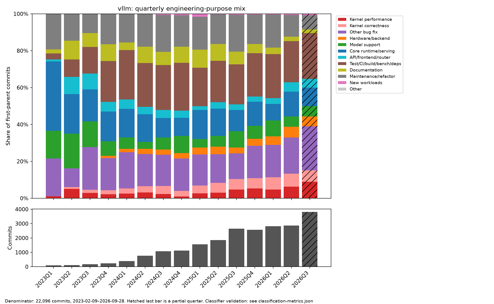
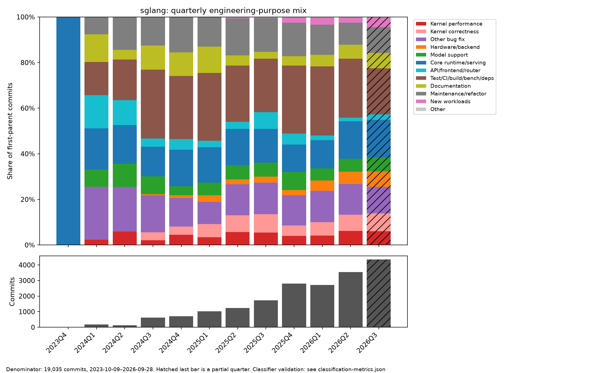
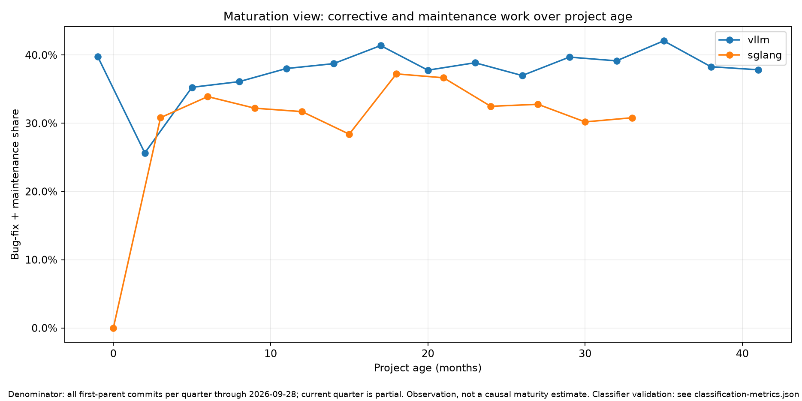
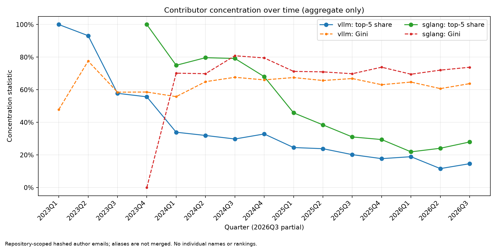
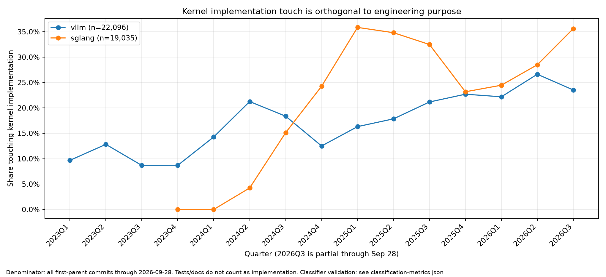
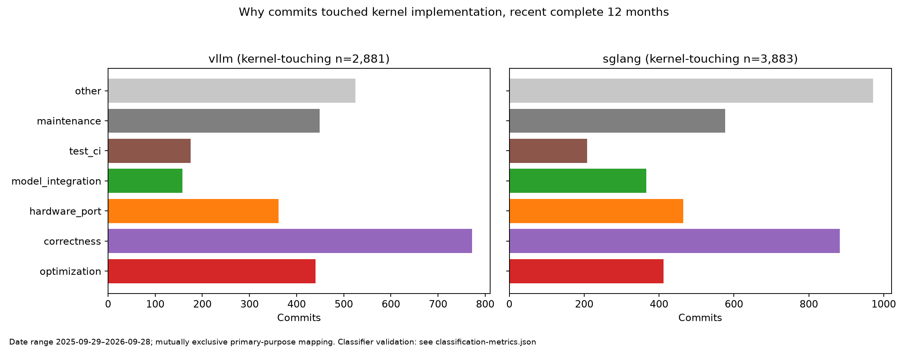
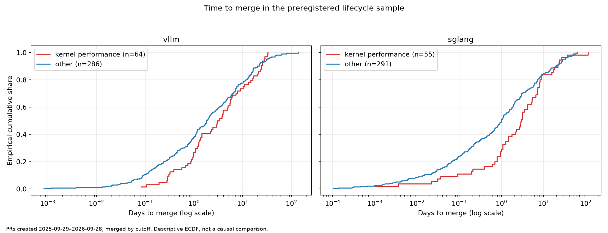
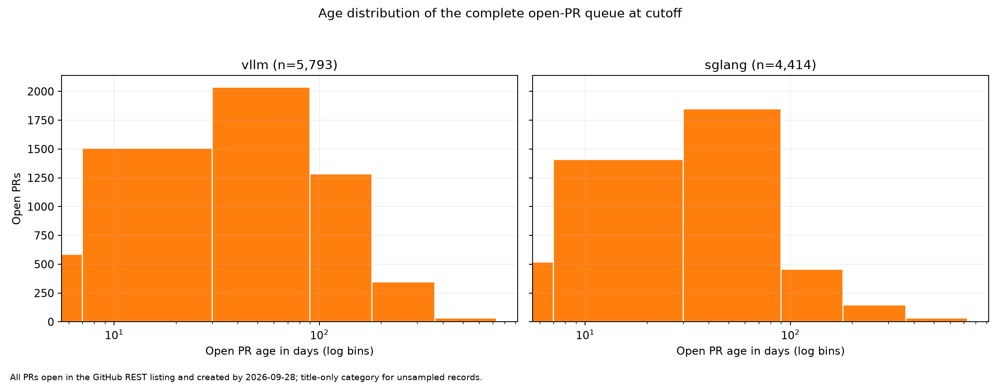
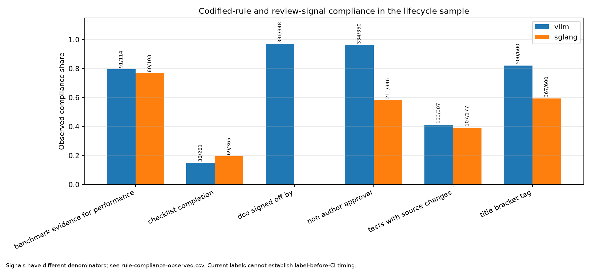

# How vLLM and SGLang evolve

**Preliminary empirical report — cutoff 2026-09-28.** This study describes two
open-source inference engines. It does not estimate causal effects, and its
classifier and PR text extractors have the limitations in
[`METHODS.md`](METHODS.md).

## Executive summary

1. **Kernel-performance work is a minority of merged work:** **6.6%** of recent vLLM commits and **5.2%** of recent SGLang commits were classified kernel-performance. <!-- claim:headline:vllm-kernel_performance_share:pct1 --> <!-- claim:headline:sglang-kernel_performance_share:pct1 -->
2. **Performance PRs merged more slowly:** the post-stratified median was **3.0 days** versus **1.8 days** for other vLLM PRs, and **3.0 days** versus **0.7 days** in SGLang. <!-- claim:pr:vllm:kernel_performance:median_hours_to_merge:days1 --> <!-- claim:pr:vllm:other:median_hours_to_merge:days1 --> <!-- claim:pr:sglang:kernel_performance:median_hours_to_merge:days1 --> <!-- claim:pr:sglang:other:median_hours_to_merge:days1 -->
3. **Discovered work is visibly queued:** title classification found **589** performance PRs among vLLM's open queue and **345** among SGLang's. <!-- claim:pr:vllm:open_queue_kernel_performance:open_queue_performance_count:int --> <!-- claim:pr:sglang:open_queue_kernel_performance:open_queue_performance_count:int -->
4. **Contribution is concentrated without being attributable to one person:** the five largest repository-scoped contributor identities account for **13.6%** of recent vLLM commits and **22.2%** of SGLang commits. <!-- claim:headline:vllm-contributor-top5_share:pct1 --> <!-- claim:headline:sglang-contributor-top5_share:pct1 -->
5. **Codified checks are followed unevenly:** **97.0%** of matched vLLM squash commits contained a DCO trailer, while only **14.9%** of sampled vLLM PR bodies with checklists completed every item. <!-- claim:rule:vllm:dco_signed_off_by:compliance_rate:pct1 --> <!-- claim:rule:vllm:checklist_completion:compliance_rate:pct1 -->

## Research questions

The study asks where engineering effort goes as vLLM and SGLang evolve; how
kernel implementation work fits into that effort; how contributor
concentration changes; how performance PRs move through review, merge, and the
open queue; and which acceptance rules are codified, mechanically enforced, or
left to reviewer judgment. The paper-to-production census remains a later
study.

## Repositories and data

| Repository | Frozen HEAD | Cutoff-filtered first-parent commits | Full-history dates | Recent headline window |
|---|---|---:|---|---|
| vLLM | `7230dfea501b232ce92d057f1c5ee9cb009c4cb4` | 22,096 | 2023-02-09–2026-09-28 | 2025-09-29–2026-09-28 |
| SGLang | `79cafec013d0a01c782d7a4bc902ef32a8941ba8` | 19,035 | 2023-10-09–2026-09-28 | 2025-09-29–2026-09-28 |

The full-history unit is a first-parent commit. Both projects normally squash a
PR and retain its number in the commit subject, making this a useful merged-PR
proxy but not a complete PR census. For lifecycle work, the collector cached
25,573 vLLM and 26,004 SGLang PRs created in the recent window, enumerated the
complete open queue, and fetched reviews/comments for a deterministic,
state-and-purpose-stratified sample of 600 PRs per repository. Lifecycle and
evidence shares are post-stratified to the recent-PR population.

The current quarter ends two days after the cutoff. Every quarterly figure
marks 2026Q3 as partial rather than comparing it silently with complete
quarters.

## Taxonomy and validation

The primary-purpose taxonomy separates kernel performance, kernel correctness,
other bug fixes, hardware/backend enablement, model support, core
runtime/serving, API/frontend/router, test/CI/build/benchmark/dependencies,
documentation, maintenance/refactor, new workloads, and other. Kernel
implementation touch, kernel-tests-only touch, hardware evidence, optimization
claim, and correctness claim are orthogonal fields.

Versions 1–3 failed validation and were preserved. Version 4 was evaluated on a
fourth fresh, blinded, 220-record-per-repository sample. Its macro F1 was 0.677
for vLLM and 0.668 for SGLang, below the preregistered 0.80 threshold.
Kernel-performance precision did pass its separate 0.90 threshold (0.955 and
1.000; recall 0.875 and 0.778). Accordingly, this report promotes only
kernel-performance-specific classified findings; the fine-grained purpose
tables and kernel-reason breakdown remain diagnostic and must not be used as
talk results. The per-class metrics
and confusion matrices are in
[`classification-metrics.json`](results/classification-metrics.json),
[`confusion-matrix-vllm.png`](results/figures/confusion-matrix-vllm.png), and
[`confusion-matrix-sglang.png`](results/figures/confusion-matrix-sglang.png).

Reference coding was one LLM-assisted manual pass from subjects and changed
paths. It was not independent human double-coding, so the report does not claim
inter-rater agreement. The prompt, model-availability caveat, and raw labels are
preserved in
[`validation-labeling-prompt.md`](studies/data-notes/validation-labeling-prompt.md).

## How the systems evolve

### Recent allocation of merged work

The requested fine-grained allocation table is intentionally **withheld as a
validated result**. The generated diagnostic estimates are available in
[`headline-numbers.csv`](results/headline-numbers.csv) and the quarterly CSVs,
but macro F1 did not satisfy the release gate. The one purpose category that
passed its category-specific gate is:

| Validated purpose | vLLM | SGLang | Recent-window denominator |
|---|---:|---:|---:|
| Kernel performance | 6.6% | 5.2% | 12,124 / 13,458 commits |

Kernel performance is important but is not the modal purpose in either engine.
Counts and shares tell different stories because both projects grew rapidly:
the absolute number of kernel-performance commits can rise while its share is
flat or falling. The stacked plots therefore place absolute quarterly volume
below normalized purpose shares.

*Observation:* purpose share of all cutoff-filtered vLLM first-parent commits by
quarter, with commit volume below; 2026Q3 is partial. *Interpretation:* category
displacement should be read together with rapid volume growth.

*Observation:* the same denominator and colors for SGLang; 2026Q3 is partial.
*Interpretation:* visually similar shares can represent very different absolute
amounts of work.

### Maturation and subsystem emergence

Kernel-performance share increased by 2.5 percentage points in vLLM and 1.5
points in SGLang between the first and last four complete-quarter cohorts. The
apparent bug-fix-plus-maintenance changes (up 5.4 points in vLLM and 0.5 in
SGLang) are retained as diagnostics only because those fine classes failed
validation.

*Observation:* bug-fix plus maintenance share per quarter, aligned by months
since each project's first commit. *Interpretation:* this is a descriptive
maturation view, not evidence that age caused the change.

Title signals in [`subsystem-emergence.csv`](results/subsystem-emergence.csv)
show when diffusion/image/video, router/gateway, prefill-decode disaggregation,
multimodal, and RL/training vocabulary first appears and how its quarterly share
changes. These title matches are transparent indicators, not claims that a
subsystem began on one exact commit. The most visible addition is SGLang
diffusion/image/video work: its first title match is in 2025Q4, and it reaches
569 title-matched commits (13.1%) in partial 2026Q3. Prefill/decode
disaggregation vocabulary first appears in 2025Q1 in both projects.

### Contributor concentration

In the recent window, the top-five share is 13.6% for vLLM and 22.2% for
SGLang; Gini coefficients are 0.720 and 0.798. It takes 80 repository-scoped
contributor identities to account for half of vLLM's commits, versus 25 for
SGLang. Category-specific concentration is generated but is not promoted
because the fine purpose categories missed validation.

*Observation:* quarterly top-five share and Gini coefficient over repository-
scoped hashed author emails. *Interpretation:* concentration indicates reliance
on a small contributor set, not individual productivity; aliases are not
identity-resolved and no contributor is named or ranked.

## Where kernel work fits

The raw path instrument marks 23.8% of recent vLLM commits and 28.9% of recent
SGLang commits as touching kernel implementation. These are **diagnostic, not
headline estimates**: validation precision/recall was 0.885/0.708 for vLLM and
0.667/0.618 for SGLang. The SGLang path rules in particular conflate some
dispatch/backend integration with implementation, so the raw fraction likely
overstates implementation touch.

*Observation:* fraction of all first-parent commits touching production kernel
implementation. Tests, docs, examples, CI, and benchmarks do not count solely
because a path contains `kernel`.

*Observation:* mutually exclusive primary purposes among recent-window
kernel-touching commits. *Interpretation:* a kernel path does not imply that the
change discovered a new optimization; fixes, hardware work, model integration,
and maintenance are delivery-pipeline work.

The maturation comparison in
[`headline-numbers.csv`](results/headline-numbers.csv) reports the difference
between the first and last four complete quarters. Within the separately validated kernel-performance purpose, work grew rather
than shrank: +2.5 percentage points in vLLM and +1.5 in SGLang between the first
and last four complete-quarter cohorts. The diagnostic kernel-touch reason
table assigns only 15.3% of vLLM and 10.6% of SGLang touches to optimization,
but that decomposition inherits the failed fine-category validation and should
be treated as a hypothesis for human recoding.

## PR delivery and review

The lifecycle sample deliberately oversamples pipeline-relevant purposes and
non-merged states; post-stratification recovers category/state population
shares. Time-to-merge comparisons condition on merging by the cutoff and remain
descriptive.

| Repository | Purpose | Sampled PRs | Median first human response | Median merge time | Post-stratified abandoned/stale share |
|---|---|---:|---:|---:|---:|
| vLLM | Kernel performance | 114 | 15.1 h | 3.0 d | 33.2% |
| vLLM | Other | 329 | 12.4 h | 1.8 d | 35.5% |
| SGLang | Kernel performance | 103 | 34.2 h | 3.0 d | 36.7% |
| SGLang | Other | 342 | 22.5 h | 0.7 d | 28.6% |

Performance PRs merged more slowly than the aggregate comparison group in both
repositories. Their post-stratified abandonment/staleness share was also
slightly lower than other work in vLLM but higher in SGLang. These differences do not establish that performance work
itself caused delay: size, author experience, hardware requirements, and change
complexity are plausible confounders.

*Observation:* empirical CDF for sampled PRs that merged by the cutoff, split
between kernel-performance and other purposes. *Interpretation:* right-censored
open PRs are not treated as merged; this is not a causal survival model.

### Evidence and reviewer concerns

Post-stratified performance-PR text signals differ by evidence type. vLLM
performance PRs mention microbenchmarks in 14.6%, end-to-end metrics in 75.8%,
accuracy evaluation in 31.3%, numerical tests in 30.4%, and multiple hardware
targets in 20.8%. SGLang's corresponding shares are 28.1%, 73.3%, 29.5%,
35.9%, and 47.9%. Because “end-to-end” includes throughput/latency language,
these are evidence-language lower bounds rather than audited benchmark quality.

For performance PRs, benchmark-method concerns appear in 71.5% of vLLM and
88.6% of SGLang records; correctness concerns in 50.0% and 87.6%; integration
in 55.0% and 65.8%; and maintainability in 28.8% and 52.7%. This is direct
evidence that review spans Establish and Sustain, not only speed.

The text extractors find words and reported measurements; absence is not proof
that no private or offline evaluation occurred. Reviewer concerns repeatedly
included correctness, benchmark method, integration, maintainability, tests,
and additional hardware. Those repeated public requests are the study's
candidate “insider knowledge” when they go beyond the written contribution
guides. In the performance sample, benchmark methodology, correctness,
integration, hardware coverage, and maintainability recur in review text.
Benchmark evidence is broadly codified, but the accepted baseline, workload
shape, hardware matrix, and complexity budget remain judgment calls.

### Open optimization queue

At the cutoff, vLLM had 5,793 open PRs and SGLang had 4,414. Conservative
title classification identified 589 (10.2%) and 345 (7.8%) kernel-performance
PRs, respectively. Changed paths were not fetched for every open PR, so these
are lower-bound queue counts.

*Observation:* every PR still open in the REST listing and created by the
cutoff, including PRs older than the lifecycle window. *Interpretation:*
title-only queue classification is a conservative lower bound because changed
paths were not fetched for every open PR.

Reliable category-specific revert rates could not be produced from public
titles and links: a revert PR often does not identify the original PR in a
machine-resolvable way. The dataset retains revert/rollback text signals, but
this report does not relabel them as a validated “reverted more often” result.

## Codified rules, gatekeeping, and undocumented expectations

The frozen rule audit found 41 documented or configured rules. vLLM
mechanically checks leading title tags, reacts to DCO status, authorizes CI
commands by role/trust, and expects at least one committer approval plus
CODEOWNERS review where applicable. SGLang gates baseline GPU CI with `run-ci`,
extra CI with `run-ci-extra`, controls slash commands through a permission file,
dispatches dedicated H100/B200 and multi-GPU jobs for kernel paths, and normally
requires applicable CODEOWNER approval before a write-role contributor merges.
Both projects document role-gated exceptions.

Kernel ownership is path-specific rather than one global team. vLLM's
`/vllm/kernels/` row has two configured owners, with separate groups for
Helion, kernel tests, attention, MoE, quantization, ROCm, and third-party paths.
SGLang's broad Python kernel path has six owners, overridden by more-specific
groups; it also documents a Kernel Merge-Oncall role. These are configuration
counts, not rankings or availability measurements.

| Observable rule or signal | vLLM | SGLang | Interpretation |
|---|---:|---:|---|
| Leading bracket tag | 82.1% | 59.4% | Automatic rule only in vLLM; SGLang is descriptive |
| Complete every present checklist item | 14.9% | 19.5% | Denominator is PR bodies with checklist items |
| Benchmark evidence on performance PR | 79.5% | 76.7% | Body plus non-bot review/comment text |
| Test/benchmark path with matched source change | 41.3% | 39.3% | Does not include external tests |
| Non-author approval on merged PR | 96.2% | 58.3% | Does not prove CODEOWNERS status |
| `Signed-off-by` on matched squash commit | 97.0% | N/A | SGLang has no audited repository-wide DCO rule |

*Observation:* signals use different denominators and are post-stratified where
sampled; raw numerators/denominators are printed above bars. A leading tag is a
format signal, not semantic-title validity. Ordinary approval does not prove
CODEOWNERS approval, and current labels cannot recover whether a required label
preceded expensive CI.

The largest gap between codification and judgment is not “no rules.” It is that
terms such as *sufficient tests*, *relevant hardware*, *significant speedup*,
and *maintainable complexity* still require reviewer judgment.

## Implications for Discover / Establish / Sustain

**Discover.** Kernel-performance changes are a minority of merged engineering
work, even though their absolute volume is substantial. Candidate generation is
one part of the system's optimization activity, not its full workload.

**Establish.** Kernel correctness, tests, benchmark method, numerical evidence,
hardware coverage, and review appear as distinct categories and repeated review
concerns. The performance-PR evidence mix shows that an optimization claim must
be turned into a credible system result.

**Sustain.** Hardware/backend enablement, integration, refactoring, dependency
work, docs, contributor concentration, and long-lived open queues are visible
parts of keeping optimizations usable. The results are consistent with an
Optimization Gap, but they do not prove a single bottleneck or causal mechanism.

## Threats to validity

The main threats are repository selection; squash-history omissions; a
single-purpose label for multi-purpose changes; evolving path layouts; one
LLM-assisted reference coder; residual classifier error; title-only
classification for the complete open queue; a stratified rather than complete
review-timeline dataset; text-pattern evidence extraction; private or external
review/CI; unresolved contributor aliases; right censoring; and confounding in
category comparisons. Git does not expose live branch protection, team
membership, or external Buildkite configuration. Full details and exact rerun
commands are in [`METHODS.md`](METHODS.md).

## Slide-ready findings

1. **“Performance is 6.6%, not the whole system.”** Pair the validated vLLM kernel-performance share with the full purpose figure, clearly marked diagnostic.
2. **“A performance PR takes 3.0 days to merge.”** Compare with 1.8 days for other vLLM PRs and 0.7 days in SGLang.
3. **“934 performance PRs are open.”** The conservative title-only lower bound is 589 vLLM plus 345 SGLang PRs.
4. **“Review asks for the pipeline.”** Benchmark method appears in 71.5%/88.6% and integration in 55.0%/65.8% of performance-PR text.
5. **“Rules are code plus judgment.”** Contrast 97.0% observable vLLM DCO trailers with 14.9% complete PR-body checklists.

## Next studies

The most important follow-up is independent human double-coding of a new sample
and semantic review of performance-evidence extraction. A 24-month,
manually-linked revert cohort could answer whether performance work is reverted
more often. Reviewer-role and CODEOWNERS approval should be reconstructed only
where public team/approval data makes that observable. Targeted comparisons
with llama.cpp and FlashInfer can test portability and kernel-library
differences without expanding the rigorous core prematurely.

The optional paper-to-production study remains unrun. Its first bounded step is
the MLSys 2025 census and L0–L5 deployment-evidence ladder described in
[`studies/04-paper-to-production.md`](studies/04-paper-to-production.md); any
result should be labeled a pilot and kept separate from the validated repository
study.
